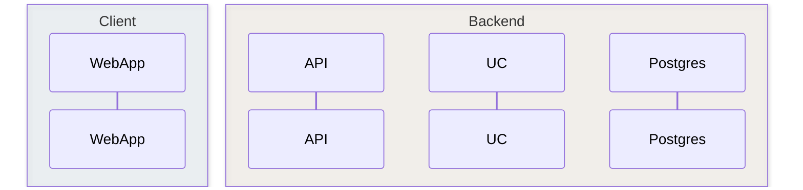

# Fullstack Sequence Diagrams

Specialty skill for **sequence diagrams** in fullstack projects. Sequence diagrams show **who talks to whom, in what order, with what payload** — not static topology (use architecture/flowchart) nor entity states (use state diagram).

## Quick decision

| User wants… | Use |
|-------------|-----|
| Order of calls across Browser → API → DB → queue | **Sequence** (this skill) |
| Services, datastores, integrations without time | Architecture flowchart |
| Estados de uma entidade (RASCUNHO → ABERTA) | State diagram |
| Tabelas e FKs | ER diagram |

## Workflow (always follow in order)

```
1. DISCOVER  → read code/docs; never invent endpoints or actors
2. SCOPE     → one outcome per diagram; cap ~12–15 messages
3. MODEL     → participants left→right by layer; label every arrow
4. LAYOUT    → enable text wrap (§Wrap); scan overlap risks; shorten only if still crowded (see §Layout)
5. RENDER    → pick output channel (see §Output channels)
6. VALIDATE  → run checklist before delivering (incl. layout §Step 6)
```

### Step 1 — Discover (mandatory)

Before writing Mermaid, gather **real** names from:

- Controllers, use cases, hooks (`useLogin`, `ConfirmAttendanceUseCase`)
- OpenAPI paths and HTTP methods
- `foundationDocs/analysis/fluxos_por_perfil.md` for project patterns
- Security flows: JWT, refresh, FGAC capabilities, rate limits

If context is thin, ask **at most 2** focused questions:
- "Qual o ator que inicia e qual o resultado de sucesso?"
- "Inclui caminho de erro (401, 409) ou só happy path?"

**Never hallucinate** services, queues, or rel names. Flag gaps explicitly.

### Step 2 — Scope

| Rule | Rationale |
|------|-----------|
| **1 diagram = 1 outcome** | Happy path OR error path OR one async phase |
| **≤ 7 participants** | Split by layer cluster if more |
| **≤ 15 messages** | Split by phase: "Auth", "Mutation", "Notification" |
| **Name with intent** | `F2.3 — Login com refresh token (happy path)` |

### Step 3 — Model (2026 fullstack conventions)

#### Participant order (left → right)

```
Human/Device → Client (SPA/Mobile) → Edge (nginx) → API/BFF → Use Case → Persistence → External
```

#### Naming

| Layer | Pattern | Example |
|-------|---------|---------|
| Human | **`participant`** (never `actor` in docs) | `participant Egresso`, `participant Aluno` |
| Frontend | App name | `WebApp`, `MobileApp` |
| API | Module + role | `AuthController`, `RequestAPI` |
| Application | Use case | `LoginUseCase`, `DeliberateRequestUC` |
| Data | Store name | `Postgres`, `Redis`, `MinIO` |
| Async | Worker name | `OutboxDispatcher`, `FCMAdapter` |

Use **PascalCase IDs** readable without aliases. In Mermaid: `participant UC as Use Case` — alias works in GitHub/docs; FigJam renderer may strip aliases (use readable IDs).

#### Message labels (the diagram's value)

**HTTP (sync):**
```
WebApp->>API: POST /api/v1/auth/login {email, password}
API-->>WebApp: 200 {accessToken, refreshToken, _links}
```

**Domain / persistence:**
```
UC->>Postgres: BEGIN; UPDATE request SET estado='DELIBERADA'
UC->>Postgres: INSERT outbox_event(type='solicitacoes.deliberated')
UC->>Postgres: COMMIT
```

**Async / fire-and-forget:** use `->>` solid for request, `-)` or `-->>` dotted for async return.

**HATEOAS:** show `_links` rel in response label when UI depends on FGAC:
```
API-->>WebApp: 200 {_links: [deliberate, request-adjustment]}
```

#### Structural blocks (full Mermaid — docs/markdown)

Use when renderer supports them (GitHub, VS Code, `foundationDocs`):



- `autonumber` — step reference in reviews
- `box` — visual layer grouping
- `par` / `and` / `end` — parallel push + email (outbox pattern)
- `loop` — polling/dispatcher (e.g. every 5s)
- `alt` / `else` — branches (prefer **separate diagram** if >2 branches)
- `activate` / `deactivate` — focus on one lifeline during nested calls
- `Note over A,B: TX boundary` — transaction or security notes

For **FigJam `generate_diagram`**: `loop`, `alt`, `Note`, `autonumber`, `activate` are **silently dropped**. Generate base messages only; extend with `use_figma` for notes/numbers/phases. See [reference.md](reference.md) §FigJam limits.

#### Text wrap — evitar corte nas bordas do frame (mandatory)

Mermaid **não quebra linha por padrão** — labels longos podem ser **clipados** nas bordas do SVG no preview Cursor.

**⚠️ Não use `%%{init:...}%%`** — Syntax Error no preview Cursor.

**⚠️ Não use `<br/>` em labels de mensagem** — no preview Cursor o texto multilinha é desenhado **em cima** da seta horizontal (overlap) e, na primeira mensagem, **sobre** os boxes dos participantes. Detalhe em **Notas** markdown.

**Estratégia SO2 (preview Cursor + GitHub):**

| Prioridade | Técnica | Quando |
|:----------:|---------|--------|
| 1 | **Label single-line ≤ ~58 chars** | Sempre — uma linha por seta |
| 2 | **Abreviar** | Payload JSON/RFC 7807 → `200 {…}` ou shorthand |
| 3 | **Self-call espaçador** | 1ª seta é `WebApp->>API` sem mensagem humana antes → prepend `WebApp->>WebApp: monta contexto da tela` |
| 4 | **Notas** markdown | JWT, SQL completo, HATEOAS detalhado |

```
✓ WebApp->>SearchController: GET /search?q=João&limit=5 (Bearer)
✓ SearchController-->>WebApp: 200 {…}
✓ WebApp->>WebApp: monta contexto da tela   ← antes da 1ª chamada HTTP “seca”
✗ GET /search?q=João<br/>(Bearer; JwtFilter)  ← overlap seta + actors
✗ %%{init: { "sequence": { "wrap": true } } }%%
```

#### Layout & readability — avoid overlapping elements (mandatory)

Mermaid renders labels **on** the arrow path; `Note`, quebras manuais excessivas, `activate` and self-calls on the same lifeline frequently cause **arrow tips over text** and **text over text**. Run this pass **after** modeling, **before** delivering.

| Overlap risk | Symptom | Fix |
|--------------|---------|-----|
| **Label clipado nas bordas do frame** | Texto some à esquerda/direita do SVG | Abreviar; detalhe em **Notas** — **não** `<br/>` |
| **`<br/>` em label de mensagem** | Texto sobrepõe seta e boxes dos actors | Single-line ≤58 chars; remover `<br/>` |
| **`actor` + first message from human** | Nome (ex.: "Egresso") **sobrepõe** label da 1ª seta | **`participant`** em vez de `actor` — nome fica **acima** da lifeline; seta abaixo |
| `Note over X` adjacent to message involving `X` | Arrowhead lands on note box | **Remove `Note`** — put detail in markdown **Notas** below the diagram |
| `Note` + `activate` on same lifeline | Activation bar crosses note/label | Use **either** `activate` **or** `Note`, not both; prefer neither in docs |
| Consecutive `A->>A` self-calls (≥2) | Labels pile on one column | **Merge** into one step: `verify JWT + check capability → denied` |
| Long JSON / Problem Details in arrow | Label wider than span between participants | Show `403 Problem Details (access_denied)` — full body in **Notas** |
| `Note over A,B` between `A->>B` and `B-->>A` | Return arrow crosses note | Move note to **Notas** or prefix the message: `[JWT ok] GET /path` |
| `box` + 6+ participants + `autonumber` | Crowded lifelines | Drop `box` **or** reduce participants **or** split diagram |
| UI render text in last message | Long trailing label overlaps actor | Abreviar — UI detail in **Notas** |

**Human participant rule (critical):**

```
✓ participant Egresso          ← nome no topo da lifeline; 1ª seta abaixo
✗ actor Egresso                ← nome na altura da 1ª seta → sobreposição
✗ actor Egresso + Egresso->>WebApp: ... como 1ª mensagem
```

- Em `foundationDocs/sequenceDiagrams/` e HUs: **sempre `participant`** para atores humanos (Aluno, Egresso, Professor, Secretaria).
- `actor` só em rascunhos FigJam/chat se inevitável — aí **prepend** `WebApp->>WebApp: mount /rota` antes da 1ª mensagem humana.

**Label rules (strict):**

```
✓ WebApp->>API: GET /alumni/me (Bearer, alumni.view_own ✓)
✓ WebApp->>WebApp: monta contexto da tela
✗ GET /path<br/>(Bearer)  ← overlap com seta e actors
✗ %%{init: { "sequence": { "wrap": true } } }%%
✗ WebApp->>API: GET /alumni/me\nAuthorization: Bearer ...
✗ Note over API: JwtFilter verifica JWT...
```

- **Labels:** single-line ≤ ~58 chars; **zero** `<br/>` em mensagens.
- **Auth / FGAC / TX:** inline prefix on the **next business message**, not a separate `Note`.
- **Business rules** (ex.: "sem INSERT certificate"): markdown **Notas**, never `Note over UC`.
- **`<br/>` manual:** proibido em labels de mensagem (overlap no Cursor).
- **Preview mentally:** label clipa na borda? → abreviar; 1ª seta WebApp→API sem preâmbulo? → self-call espaçador.

Full patterns and before/after: [reference.md](reference.md) §Layout & anti-overlap.

#### Security & resilience (include when relevant)

- Where JWT is validated (`JwtFilter` before controller)
- Rate limit rejection (`429` before use case)
- Idempotency key on retries
- `SELECT FOR UPDATE SKIP LOCKED` on outbox poll
- RFC 7807 Problem Details on errors (`401`, `403`, `409`, `422`)

### Step 4 — Output channels

| Channel | When | Action |
|---------|------|--------|
| **Mermaid in markdown** (default) | Docs, PRs, `foundationDocs`, chat | Fenced ` ```mermaid ` block + 2–3 line narrative |
| **Canvas** | User needs scrollable multi-diagram review, phases table, legend | Read `canvas` skill; one `.canvas.tsx` with embedded Mermaid or phased sections |
| **FigJam** | Editable/shareable board | Load `figma-generate-diagram` → `references/sequence.md`; hybrid `use_figma` for notes |

**Default deliverable structure:**

```markdown
## [Flow ID] — [Title]

**Escopo:** happy path | error 401 | async notification phase
**Atores:** …
**Pré-condições:** …

```mermaid
sequenceDiagram
  ...
```

**Notas:**
- Passo 4: transação atômica (request + outbox)
- Diagrama relacionado: [link ou nome do próximo]
```

### Step 6 — Validation checklist

Before delivering:

- [ ] Every message has a label (no naked arrows)
- [ ] Participants declared explicitly (3+ actors)
- [ ] Left→right follows layer order
- [ ] Forward calls `->>`, returns `-->>`
- [ ] HTTP labels include method + path + status when applicable
- [ ] TX boundaries explicit for writes (BEGIN/COMMIT or single labeled block)
- [ ] No invented endpoints — sourced from code/spec
- [ ] ≤15 messages or split into phased diagrams
- [ ] Error paths in **separate** diagram if non-trivial
- [ ] Title + scope paragraph accompany the diagram
- [ ] Terminology matches project (Use Case, not "service layer" generically)

**Layout (no clipping / no overlapping elements):**

- [ ] **Sem `%%{init}%%`** e **sem `<br/>`** em labels de mensagem
- [ ] Labels single-line ≤ ~58 chars (abreviar ou **Notas**)
- [ ] 1ª seta `WebApp->>API` “seca” precedida de `WebApp->>WebApp: monta contexto da tela` se não houver ação humana antes
- [ ] **Humanos como `participant`** — zero `actor` em `sequenceDiagrams/`
- [ ] No `Note over` blocks in foundationDocs diagrams — detail in markdown **Notas**
- [ ] No `\n` in message labels
- [ ] No `Note` + `activate` on the same lifeline in the same stretch
- [ ] At most **one** self-call (`A->>A`) per diagram; merged label if multiple checks
- [ ] No JSON/Problem Details body inline — status + type shorthand only
- [ ] Mentally scanned: labels não clipados nas bordas; sem colisão seta↔texto adjacente

## Fullstack pattern catalog

Route to [reference.md](reference.md) for copy-paste templates:

| Pattern | Section |
|---------|---------|
| Login + JWT + refresh | reference §P1 |
| TanStack Query fetch + cache | reference §P2 |
| HATEOAS action (useActions) | reference §P3 |
| Command + outbox + dispatcher | reference §P4 |
| File upload (presigned MinIO) | reference §P5 |
| Mobile QR attendance confirm | reference §P6 |
| BFF aggregation | reference §P7 |

## Anti-patterns

| Avoid | Do instead |
|-------|------------|
| One diagram with 8 alt/else branches | 2–4 focused diagrams |
| `Service1`, `Service2` | Real module/use-case names |
| `call API` | `POST /api/v1/requests` |
| Mixing state machine in sequence | Separate state diagram |
| 20+ participants | Layer boxes + split by phase |
| Sequence for static deployment | C4/container diagram |
| `actor` + 1ª mensagem do humano | `participant` (nome acima da seta) |
| `Note over` + message on same participant | Inline prefix on arrow or **Notas** below |
| Diagrama com `%%{init}%%` ou `<br/>` em mensagem | Syntax Error / overlap — single-line + abreviar |
| 2+ self-calls on one lifeline | One merged self-call step |

## Project integration (SecretariaOnline2)

- Align numbering with `fluxos_por_perfil.md` (F1.x, F2.x, §10 event-driven)
- Reuse outbox loop pattern from §10.1 as canonical async template
- Presença v4.1: show `attendanceMode`, janelas, `event.manage` / `event.host` checks
- Solicitações: generic workflow engine — label `RequestType` + transition, not 19 duplicate flows

## Additional resources

- Templates: [reference.md](reference.md)
- Project examples: [examples.md](examples.md)
- FigJam sequence limits: `figma-generate-diagram/references/sequence.md`
