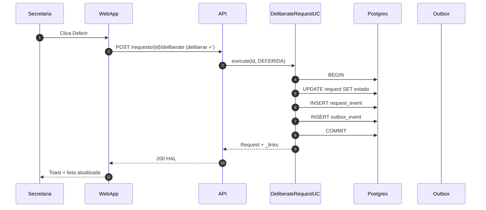
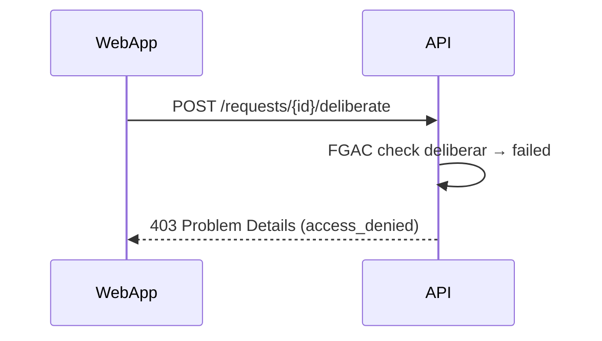

# Examples — SecretariaOnline2

## Example A — Notificação ponta-a-ponta (from fluxos §10.1)

Already canonical in repo. When extending, keep:
- `autonumber`
- `par` for push + email
- `loop` on dispatcher
- Real table names: `outbox_event`, `communication_delivery`

## Example B — Deliberação de solicitação (suggested)

**F3.x — Deliberar solicitação (happy path)**



**F3.x — Deliberar (403 sem capability)**

Separate diagram — only through auth check:



UI não exibe botão se `useActions` não encontrar rel `deliberate` (ver **Notas** na HU).

## Example C — Naming a doc section

```markdown
### F2.1 Login com JWT (happy path)

Ver também: F2.1b Refresh token | F2.1c Rate limit 429

```mermaid
...
```
```
