# Sequence Diagram Reference — Fullstack 2026

## Text wrap (obrigatório — evita clipping e overlap)

**Preview Cursor:** não use `%%{init}%%` (Syntax Error) nem ` ` em mensagens (overlap com setas e actors).

| Prioridade | Técnica | Exemplo |
|:----------:|---------|---------|
| 1 | Labels **completos** (wrap no live editor) | `repassa (secretariaId, cursoIds[], dashboard.view_secretary ✓)` |
| 2 | Abreviar só JSON volumoso | `200 {…}` + detalhe em Notas |
| 3 | Self-call espaçador | `WebApp->>WebApp: monta contexto da tela` |
| 4 | Notas markdown | SQL completo, RFC 7807 |

Nunca `\n`. Nunca ` ` em labels. Nunca `%%{init}%%` inline. **Nunca** truncar com `…` no meio da palavra (ex.: `secre…`).

## Diagramas SO2 (`sequenceDiagrams/`)

Config global: [`mermaid-live-config.json`](../mermaid-live-config.json) → aba **Config** do [mermaid.live](https://mermaid.live). Cada diagrama = **um** bloco abaixo (sem `%%{init}%%` inline).

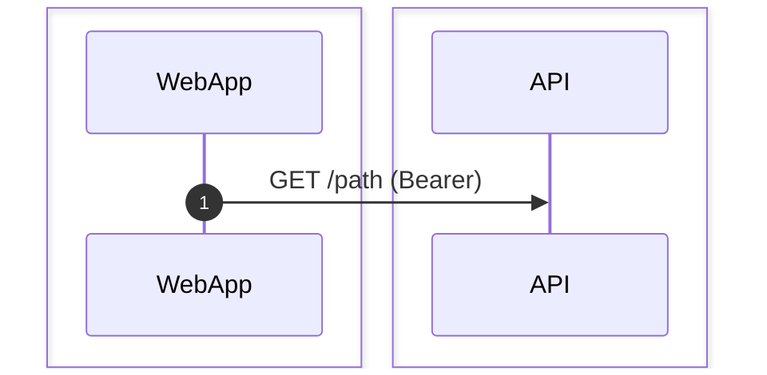

| Regra | Valor |
|-------|--------|
| Box Cliente | `box #e8f4fc Cliente` |
| Box Servidor | `box #fff8ee Servidor` |
| Labels | completos nas setas; sem padding invisível nos `.md` |
| Export PNG | `mermaid-live-config.json` + `mermaid-export.css`; padding lateral simétrico só no `.mmd` de export (`\u00a0`×6) |

## Mermaid skeleton (referência)

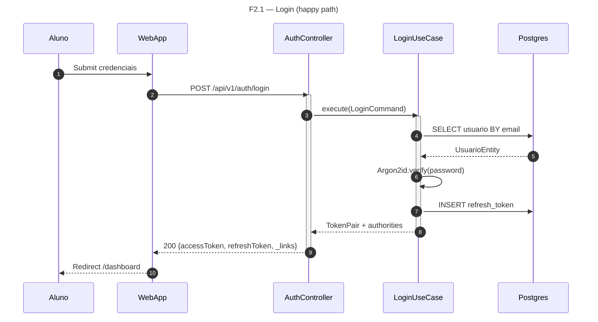

## FigJam limits (`generate_diagram`)

**Supported well:** `participant`, `->>`, `-->>`, `title`

**Silently dropped:** `Note`, `loop`, `alt`, `par`, `activate`, `autonumber`, `box`, `rect`

**Hybrid workflow:** scaffold with `generate_diagram` → add stickies, phase rects, step numbers via `use_figma`.

## Layout & anti-overlap

Mermaid sequence diagrams have **no manual positioning**. Overlap and clipping are prevented by **init wrap + what you write**, not by tweaking coordinates.

### Causes → fixes (quick reference)

| Cause | Fix |
|-------|-----|
| **Label clipado nas bordas do SVG** | Abreviar single-line — **não** ` ` |
| **` ` em mensagem** | Remover — overlap seta/actors no Cursor |
| **`actor` com 1ª seta saindo do humano** | Trocar por **`participant Nome`** — label fica no box acima da lifeline |
| `Note over X` before/after arrow involving `X` | Delete `Note`; use **Notas** markdown below diagram |
| `\n` in label | Auto-wrap; ou ` ` semântico (nunca `\n`) |
| Auto-wrap quebra no meio de path/status | ` ` manual em fronteira semântica (≤1 por label) |
| JWT/FGAC as separate note | Prefix on request: `GET /path (JWT ok, capability ✓)` |
| Two `SF->>SF` in a row | `SF->>SF: verify JWT + check authority → denied` |
| Full RFC 7807 in arrow | `403 Problem Details (access_denied)` |
| `activate` + long label + `Note` | Drop `activate`/`Note` in doc diagrams |
| Dense `box` groups | Omit `box` or reduce to ≤5 participants |

### Human actors — `participant` vs `actor`

Mermaid renders `actor` labels **below** the stick figure, on the **same row** as the first outgoing arrow → nome sobrepõe o texto da seta (ex.: "Egresso" sobre "Navega para...").

| Declaração | Posição do nome | 1ª seta `Humano->>WebApp` | Uso |
|------------|-----------------|---------------------------|-----|
| `participant Egresso` | Box **acima** da lifeline | Label da seta **abaixo** do box | **Padrão SO2** (docs, sequenceDiagrams) |
| `actor Egresso` | Abaixo do ícone, na altura da seta | **Sobreposição** | Evitar |

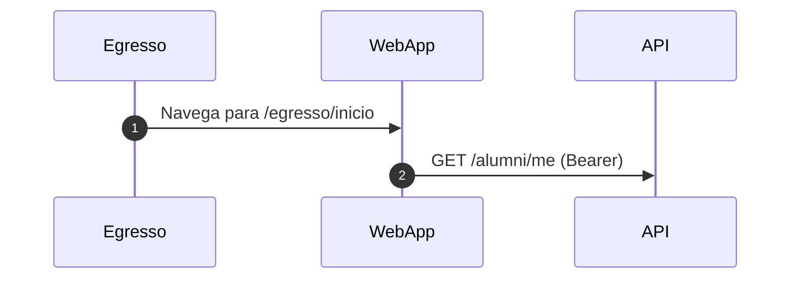

**Fallback** (só se `actor` for obrigatório no renderer): prepend mensagem no cliente **antes** da 1ª mensagem humana:

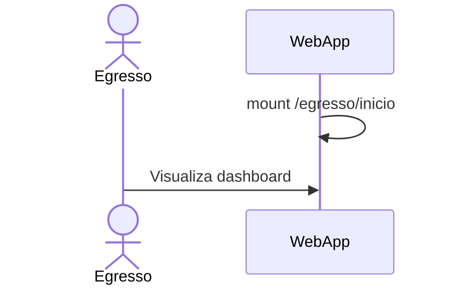

### Before / after (F2.1 pattern)

**Ruim — `actor` + 1ª seta do humano (nome sobrepõe label):**

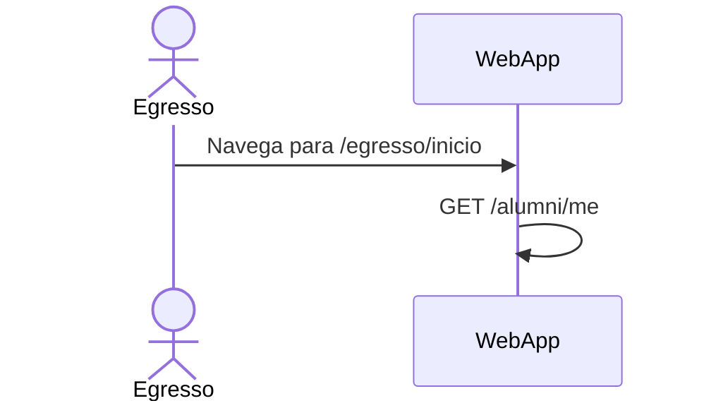

**Ruim — `Note` + `\n` na mesma região:**

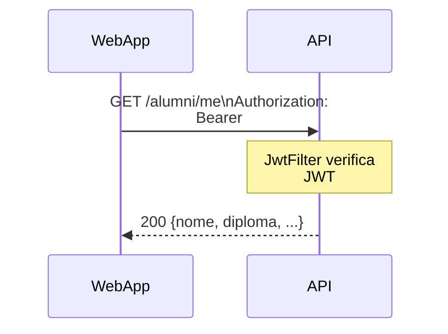

**Bom — legível (wrap + label inline):**

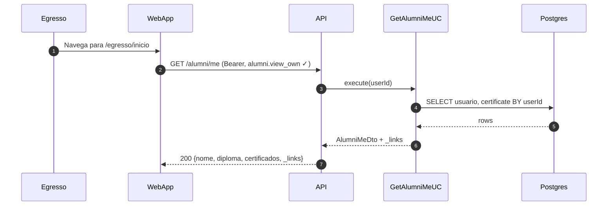

Detail de `JwtFilter`, HATEOAS e queries separadas → seção **Notas** fora do bloco Mermaid.

### Label length budget

Com ` ` em labels longos, o limite é por **linha visual**, não pelo total do label.

| Part | Max chars **por linha** (guideline) | Example |
|------|-------------------------------------|---------|
| HTTP request | ~50 | `POST /certificates/{id}/reissue (Bearer)` |
| HTTP response | ~45 | `200 {downloadUrl, verifyUrl, expiresAt}` |
| SQL | ~50 | `SELECT certificate BY id AND userId` |
| Self-call | ~45 | `verify JWT + check request.open → denied` |
| UI action | ~40 | `Renderiza dashboard read-only` |

Se uma linha ainda clipar: outro ` ` **não** — abrevie ou mova para **Notas**.

### When to use `Note` (rare)

| Context | Use `Note`? |
|---------|-------------|
| `foundationDocs/sequenceDiagrams/` | **No** — always **Notas** markdown |
| Chat / PR quick draft | Sparingly, never adjacent to arrow on same lifeline |
| FigJam `generate_diagram` | **Dropped anyway** — use stickies via `use_figma` |

## Layer `box` colors (suggested)

| Box | Participants | Mermaid tint |
|-----|--------------|--------------|
| Client | WebApp, MobileApp | `rgba(230,245,255,0.3)` |
| API | Controllers, BFF | `rgba(255,245,230,0.3)` |
| Domain | Use Cases | `rgba(240,255,240,0.3)` |
| Infra | Postgres, MinIO, Redis | `rgba(245,240,255,0.3)` |
| External | FCM, Mailgun, SIGA | `rgba(255,240,240,0.3)` |

## Pattern templates

### P1 — Login + JWT + refresh

Split in two diagrams if both paths needed:
1. `Login happy path` (above skeleton)
2. `Refresh token rotation`

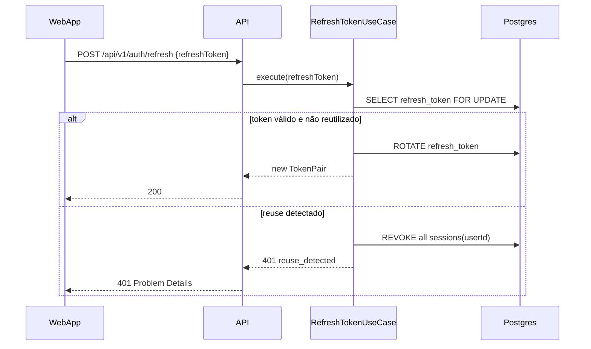

### P2 — TanStack Query (read)

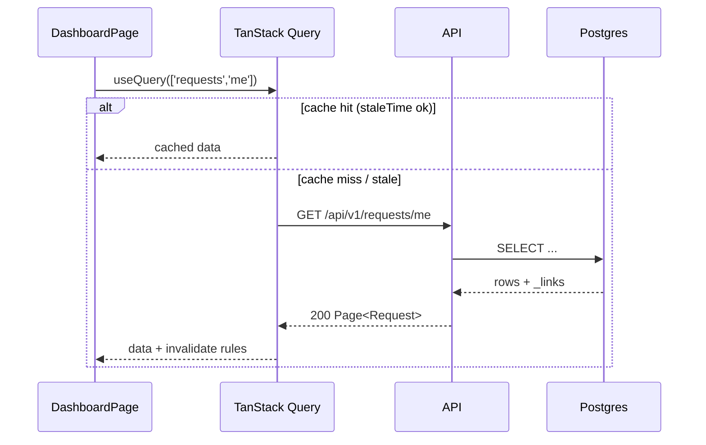

### P3 — HATEOAS / useActions

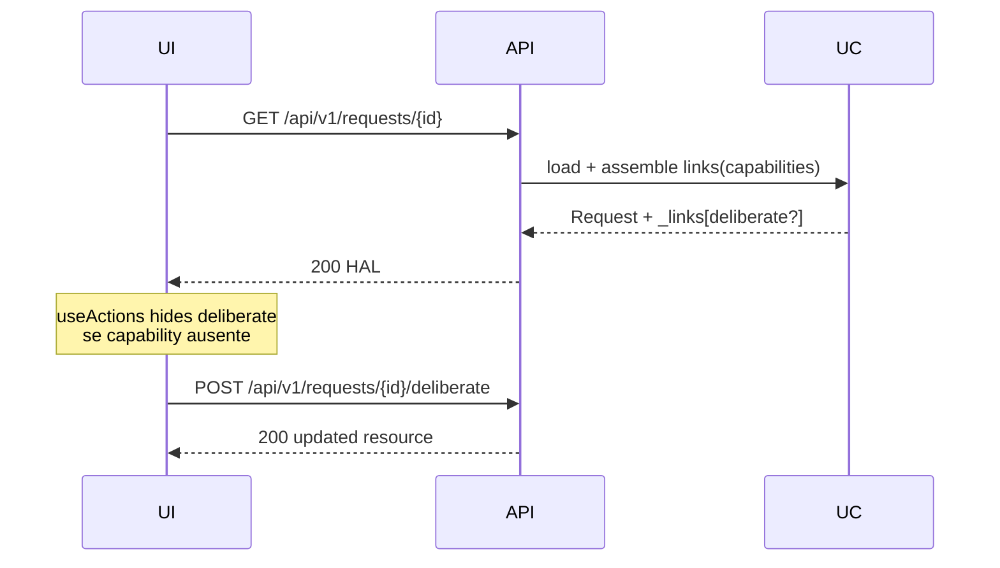

### P4 — Command + Outbox (canonical SO2)

Match `fluxos_por_perfil.md` §10.1:

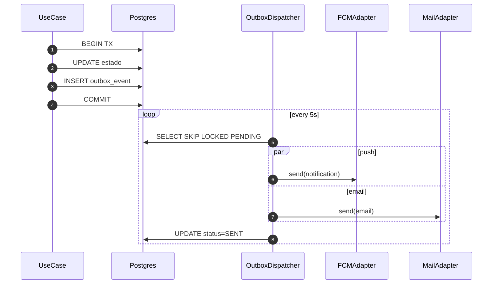

### P5 — Presigned upload (MinIO)

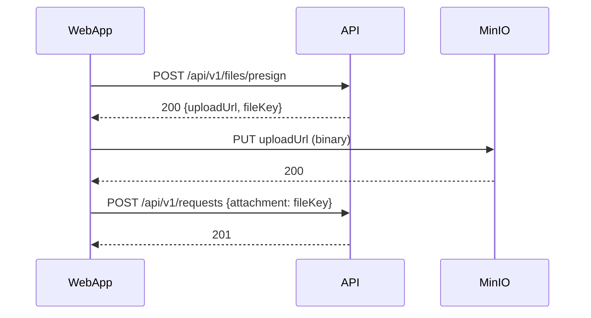

### P6 — Presença QR confirm (v4.1)

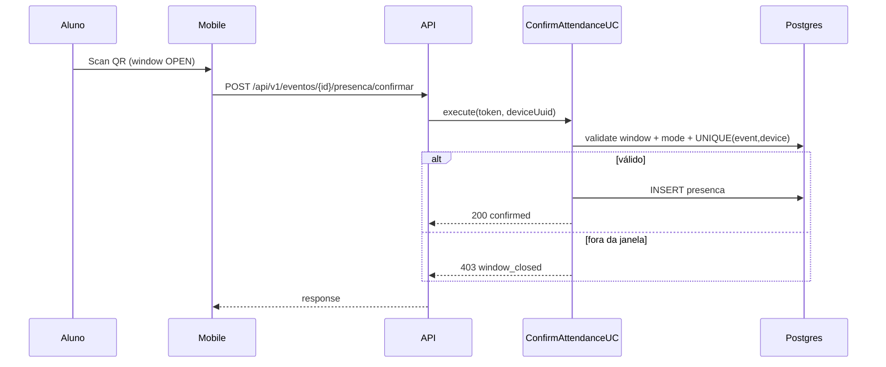

### P7 — BFF aggregation

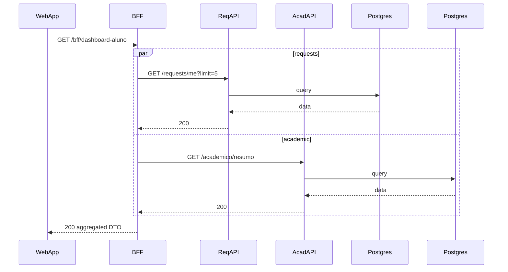

## Splitting guide

| Complexity signal | Split strategy |
|-------------------|----------------|
| Auth + business mutation | Diagram A: auth; Diagram B: command |
| Happy + 3 error types | Diagram A: 200; B: 401; C: 403; D: 409 |
| Sync write + async notify | Diagram A: TX; Diagram B: outbox dispatch |
| Mobile + Web same API | One API diagram; optional thin client wrappers |

## Message label cheat sheet

| Type | Format |
|------|--------|
| REST | `METHOD /path` → `STATUS {key fields}` |
| Query | `SELECT entity BY field` → `row \| null` |
| Command | `UPDATE table SET ...` |
| Event | `INSERT outbox_event(type='domain.event')` |
| Cache | `GET key` → `HIT \| MISS` |
| Security | `verify JWT` → `claims \| 401` |
