```mermaid
erDiagram
    %% IAM (Identidade e Acesso + sessão)
    USUARIO ||--o{ USUARIO_ROLE : possui
    USUARIO ||--o{ REFRESH_TOKEN : sessao
    USUARIO }o--|| CURSO : vinculado
    ROLE ||--o{ USUARIO_ROLE : atribuido
    ROLE ||--o{ ROLE_AUTHORITY : concede
    AUTHORITY ||--o{ ROLE_AUTHORITY : compoe

    %% Acadêmico
    CURSO ||--o{ DISCIPLINA : oferece
    CURSO }o--o| USUARIO : coordenado_por
    PERIODO_LETIVO ||--o{ CALENDARIO_ACADEMICO : define

    %% Solicitações (sem DELIBERATION, FORM_SCHEMA, WORKFLOW_DEFINITION — I2, I3)
    REQUEST_TYPE ||--o{ REQUEST : classifica
    REQUEST_TYPE ||--o{ CALENDARIO_ACADEMICO : vigencia
    USUARIO ||--o{ REQUEST : abre
    CURSO ||--o{ REQUEST : escopo
    REQUEST ||--o{ REQUEST_EVENT : historico
    REQUEST ||--o{ REQUEST_LINE_ITEM : itens
    REQUEST ||--o{ REQUEST_ATTACHMENT : anexos
    REQUEST_EVENT }o--|| USUARIO : ator
    REQUEST_LINE_ITEM }o--o| DISCIPLINA : referencia
    REQUEST_ATTACHMENT }o--|| USUARIO : enviado_por

    %% Formativas
    CURSO ||--o{ FORMATIVE_ACTIVITY : valida_para
    USUARIO ||--o{ FORMATIVE_ENTRY : submete
    FORMATIVE_ACTIVITY ||--o{ FORMATIVE_ENTRY : classifica
    USUARIO ||--o{ FORMATIVE_ENTRY : revisa

    %% Estágio
    USUARIO ||--o{ INTERNSHIP : aluno
    USUARIO ||--o{ INTERNSHIP : orientador
    USUARIO ||--o{ INTERNSHIP : coe
    INTERNSHIP ||--o{ INTERNSHIP_DOCUMENT : documentos

    %% TCC
    CURSO ||--o{ TCC : pertence
    TCC ||--o{ TCC_MEMBER : equipe
    TCC ||--o{ TCC_EXAMINER : banca
    USUARIO ||--o{ TCC_MEMBER : membro
    USUARIO ||--o{ TCC_EXAMINER : examinador

    %% Comunicação e Outbox (I9: delivery → usuario, não notification_preference)
    USUARIO ||--o{ COMMUNICATION : publica
    CURSO ||--o{ COMMUNICATION : alvo
    COMMUNICATION ||--o{ COMMUNICATION_DELIVERY : envios
    COMMUNICATION_DELIVERY }o--|| USUARIO : destinatario
    USUARIO ||--|| NOTIFICATION_PREFERENCE : preferencias

    %% Presença v4.1 (I1, I4: ATTENDANCE_SESSION; device_uuid é atributo, não entidade)
    CURSO ||--o{ EVENT_ATTENDANCE : evento
    USUARIO ||--o{ EVENT_ATTENDANCE : organiza
    EVENT_ATTENDANCE ||--o{ ATTENDANCE_SESSION : sessoes
    USUARIO ||--o{ ATTENDANCE_SESSION : aluno

    %% Certificados
    USUARIO ||--o{ CERTIFICATE : beneficiario
    EVENT_ATTENDANCE ||--o| CERTIFICATE : origem_evento
    FORMATIVE_ENTRY ||--o| CERTIFICATE : origem_formativa

    %% Auditoria
    USUARIO ||--o{ AUDIT_LOG : ator

    %% Técnico / transversal (sem FK fixa no conceitual)
    JTI_BLACKLIST
    OUTBOX_EVENT
```

# FIGURA 2 – Modelo conceitual do banco de dados transacional — SecretariaOnline2

**FONTE:** Os autores (2026).

**Base:** `foundationDocs/DB/00-inventario-e-decisoes.md` (Etapa 0) · decisões I1–I11 aplicadas.

**Convenção:** entidades em `UPPER_SNAKE_CASE` (nome físico da tabela); apenas relacionamentos — sem atributos (Chen / TCC §0.4).

**Renderizar:** copiar o bloco abaixo em [mermaid.live](https://mermaid.live) ou abrir `modelo-conceitual.mmd`.

---

---

## Legenda de decisões aplicadas

| Decisão | Efeito no diagrama |
|---------|-------------------|
| I1 / I4 / I10 | `ATTENDANCE_SESSION` (não `ATTENDANCE_CHECKIN`); `device_uuid` omitido como entidade |
| I2 | Sem `DELIBERATION` — deliberação via `REQUEST_EVENT` |
| I3 | Sem `FORM_SCHEMA` / `WORKFLOW_DEFINITION` — embutidos em `REQUEST_TYPE` |
| I5 | `REFRESH_TOKEN` ligado a `USUARIO` |
| I6 | `JTI_BLACKLIST` isolado (PK natural `jti`; sem `password_reset_token`) |
| I9 | `COMMUNICATION_DELIVERY` → `USUARIO`; `NOTIFICATION_PREFERENCE` 1:1 com `USUARIO` |

**Entidades:** 31 (29 domínio + `REFRESH_TOKEN`, `JTI_BLACKLIST`, `OUTBOX_EVENT`). `JTI_BLACKLIST` e `OUTBOX_EVENT` aparecem sem relacionamento — PK natural / referência polimórfica (`aggregate_id`); detalhados no modelo lógico.
