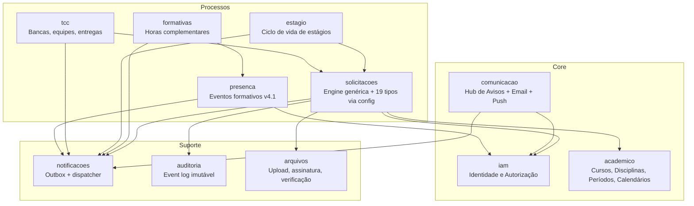
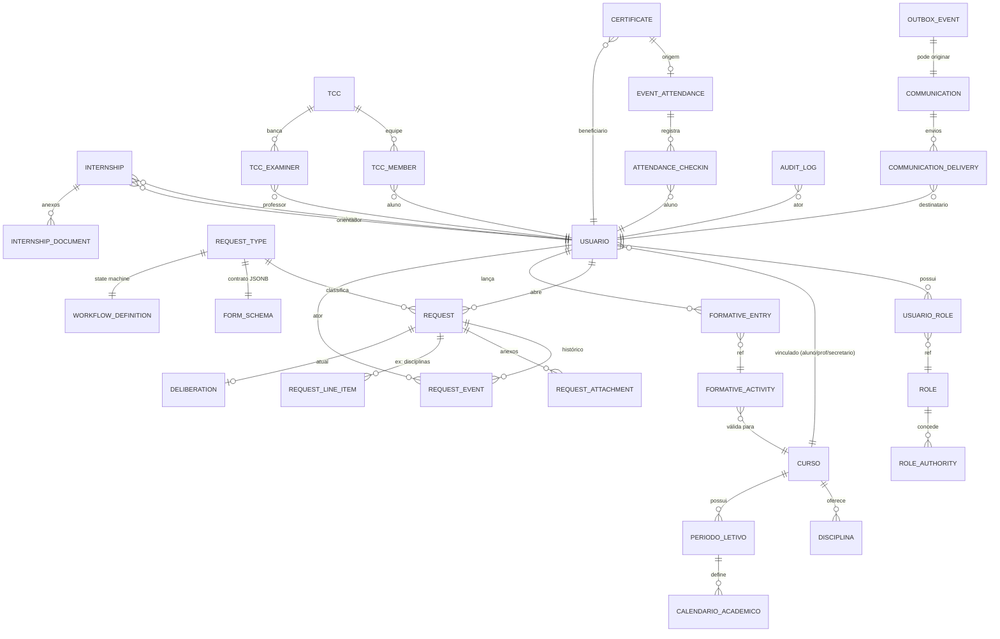
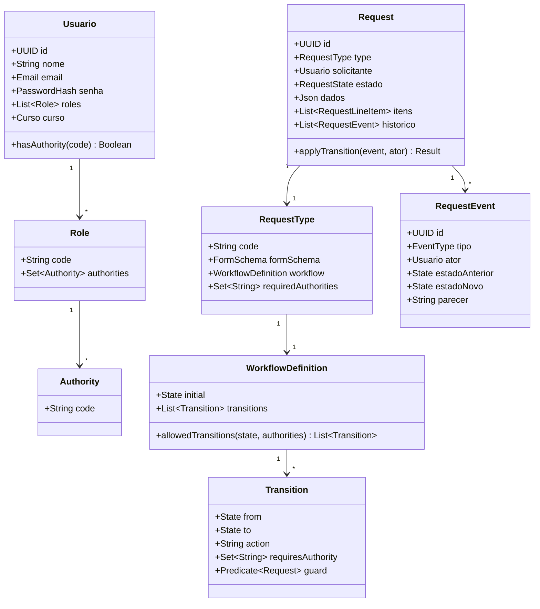
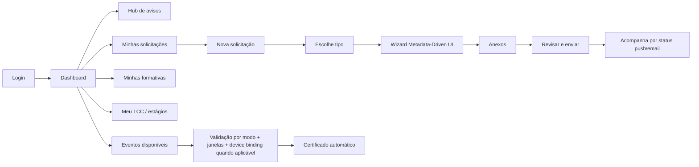
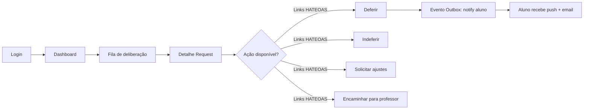
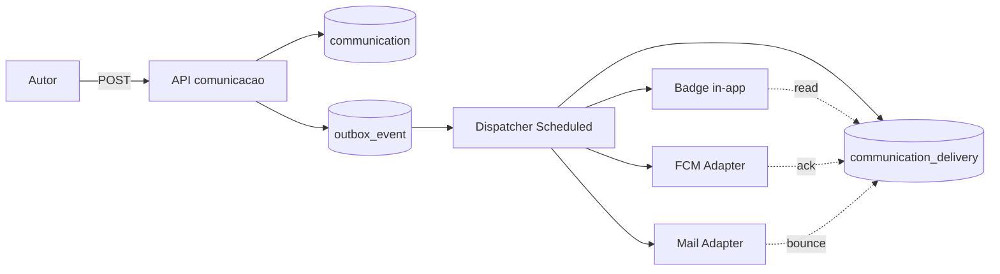
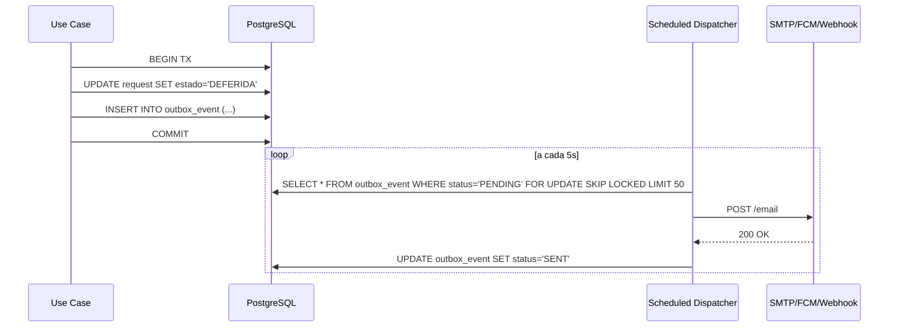
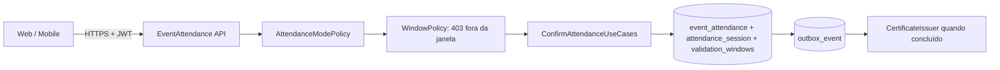
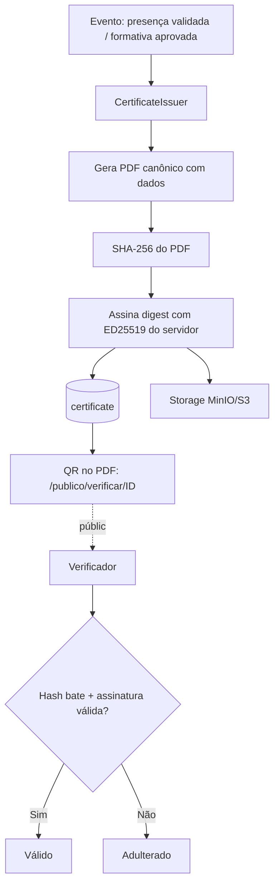
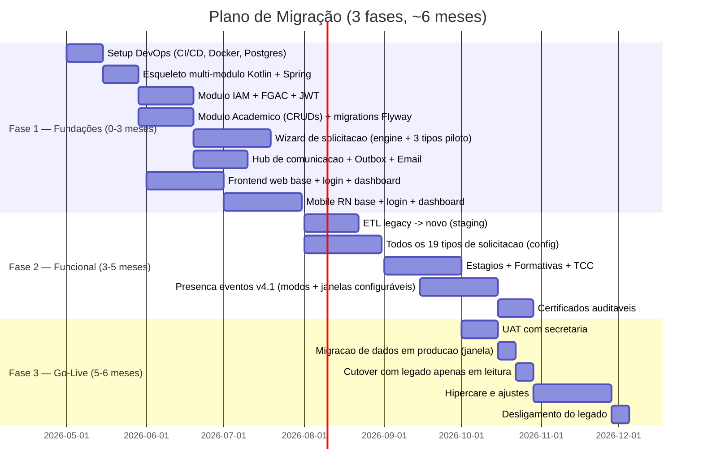

# Análise Arquitetural End-to-End — SecretariaOnline2

**Autor:** Staff Fullstack Architect (análise TCC)
**Data:** 21/04/2026  
**Versão do documento (presença em eventos):** 4.1 — *Presença configurável em eventos formativos* (modos QR/PIN, janelas definidas pelo docente, agenda, estados visíveis, `event.manage` ampliado).
**Escopo:** Modernização do sistema legado *Secretaria Online* (Java EE/JSP/PostgreSQL) para a nova **SecretariaOnline2** (Kotlin + Spring Boot + React + React Native + PostgreSQL).
**Contexto:** TCC — UFPR SEPT

> Esta análise foi construída a partir de leitura direta do código-fonte (670 arquivos, 330 servlets, 53 DAOs, 64 models, 158 JSPs) e dos documentos de referência em `analise/` (`levantamento_requisitos.txt`, `diagrama_conceitual.txt`, `fluxo_de_telas.txt`, `telas.txt`, `tree_prompts.txt`, `arquivos_requisitos.csv`), respeitando as diretrizes em `a_new_app_design/sugestoes_de_design.txt`.

---

## Índice

1. [Resumo Executivo](#1-resumo-executivo)
2. [Raio-X do Legacy](#2-raio-x-do-legacy-evidências-concretas)
3. [Blueprint da SecretariaOnline2](#3-blueprint-da-secretariaonline2)
4. [Stack Tecnológica Recomendada](#4-stack-tecnológica-recomendada)
5. [Modelo de Dados Proposto](#5-modelo-de-dados-proposto)
6. [Fluxos de Usuário e Mapa de Telas](#6-fluxos-de-usuário-e-mapa-de-telas)
7. [Comunicação Unificada (Hub + Email)](#7-comunicação-unificada-hub--email)
8. [Análise API Gateway (Node/Fastify vs alternativas)](#8-análise-api-gateway-nodefastify-vs-alternativas)
9. [Análise de Mensageria Assíncrona (RabbitMQ ou não)](#9-análise-de-mensageria-assíncrona-rabbitmq-ou-não)
10. [Presença em eventos formativos (v4.1 — modos e janelas configuráveis)](#10-presença-em-eventos-formativos-v41--modos-e-janelas-configuráveis)
11. [Solução Anti-Fraude Certificados](#11-solução-anti-fraude-certificados-automação-ponta-a-ponta)
12. [Plano de Migração do Legacy](#12-plano-de-migração-do-legacy-para-secretariaonline2)
13. [Roadmap Priorizado](#13-roadmap-priorizado-90-dias--6-meses--12-meses)
14. [Matriz de Decisão Arquitetural (ADRs)](#14-matriz-de-decisão-arquitetural-adrs-resumidas)
15. [Backlog Inicial de Implementação](#15-backlog-inicial-de-implementação-épicos-e-histórias)
16. [Riscos, Custos e Mitigações](#16-riscos-custos-e-mitigações)
17. [Checklist de Boas Práticas DRY, Clean Architecture e Qualidade](#17-checklist-de-boas-práticas-dry-clean-architecture-e-qualidade)

---

## 1. Resumo Executivo

### Visão geral

O legado *Secretaria Online* é um sistema acadêmico monolítico Java EE (Servlet 3.1 + JSP + JDBC puro + PostgreSQL) rodando em GlassFish, com **670 arquivos-fonte**, **158 telas JSP**, **330 servlets**, **53 DAOs**, **54 requisitos funcionais** e **19 tipos de solicitações acadêmicas**. É uma aplicação madura em termos de cobertura funcional, porém **ruim em praticamente todos os atributos de qualidade modernos**: segurança (MD5, tokens int32, credenciais hardcoded), manutenibilidade (código duplicado em massa — 19×3 = 57 telas quase idênticas), observabilidade (logs ad hoc), operação (zero DevOps), DX (Ant/NetBeans, acoplamento a um único desenvolvedor pelo nome "JAIME WOJCIECHOWSKI") e UX (Bootstrap 2, AJAX via `eval()`, zero feedback ao aluno).

### Principais achados

| # | Achado | Impacto | Prioridade |
|---|---|---|---|
| 1 | **MD5 para senhas** (RNF05, `Usuario.criptografaSenha`) — colisão conhecida, sem salt | Crítico de segurança | Alta |
| 2 | **Credenciais de banco hardcoded** no `MainDao.java` (`postgres/root`, `postgres/jcarbon@ufpr$jaime`) | Crítico de segurança | Alta |
| 3 | **Token de deep-link = `Random.nextInt()` (32 bits)** → força bruta viável | Crítico de segurança | Alta |
| 4 | **Zero pool de conexões** (`DriverManager.getConnection()` a cada DAO) | Performance e escalabilidade | Alta |
| 5 | **Datas persistidas como VARCHAR** (`"dd/MM/yyyy"`) — impossível fazer range SQL confiável | Correção e performance | Alta |
| 6 | **Nome "JAIME WOJCIECHOWSKI" hardcoded em 219 classes** como super-admin | Bus factor = 1, risco operacional | Alta |
| 7 | **19 solicitações = 57 telas + 57 servlets** quase idênticas (DRY = 0) | Manutenibilidade | Alta |
| 8 | **10 perfis fixos** em matriz de autorização espalhada em todos os controllers | Acoplamento e evolução | Alta |
| 9 | **AJAX retorna JS executado via `eval()`** | Segurança e manutenção | Alta |
| 10 | **Zero feedback proativo ao aluno** sobre andamento (nem push nem email transacional confiável) | UX e valor percebido | Média |
| 11 | **Sem versionamento de schema** (DDL não está no repositório) | Operação | Média |
| 12 | **Sem testes automatizados** | Qualidade | Média |
| 13 | **Arquivos armazenados em `C:\Users\ziip\...`** hardcoded | Portabilidade zero | Alta |
| 14 | **SMTP em porta 25 sem TLS** (`smtp2.ufpr.br`) | Segurança | Média |

### Direção recomendada

1. **Manter monólito modular Kotlin + Spring Boot** (já definido) organizado por **bounded contexts** (Identidade, Acadêmico, Solicitações, Formativas, Estágio, TCC, Comunicação, Presença).
2. **Substituir** os 19 sub-fluxos por **uma única máquina de estados genérica** (`Request` + `RequestType` + `FormSchema` JSONB + `WorkflowEngine`). Isso elimina ~75% dos 670 arquivos do legado.
3. **Autorização por capabilities (FGAC)** + **HATEOAS** — UI "cega" a perfis, guiada pelo `_links` e `_actions` da API.
4. **Adiar API Gateway Node/Fastify e RabbitMQ**. Ambos são overengineering para um TCC. Adotar `@Async` + `@Scheduled` + padrão **Outbox** (tabela `outbox_event`) como substituto leve. **Gatilhos objetivos** de reavaliação documentados abaixo.
5. **Mobile-first**: notificações push (Firebase Cloud Messaging) + email (SendGrid/Mailgun/SMTP via Spring Mail) com política de fallback.
6. **Presença em eventos/palestras (v4.1)**: o docente configura **`attendanceMode`** (`QR_SINGLE`, `QR_DUAL`, `SECRET_SINGLE`, `SECRET_DUAL`) e **janelas de validação** (ex.: dia inteiro ou duas sub-janelas no início/fim). O evento segue **agenda** (`scheduledStart` / `scheduledEnd`) com estados **Agendado / Em andamento / Concluído**. **`event.manage`** habilita CRUD para **professores, secretaria e admin**; **`event.host`** opera o dia do evento. **Device binding** (`deviceUuid`) permanece recomendado nos modos que usam confirmação por aparelho. **Sem** geofence obrigatória, *trust score* ou gestão de aula regular no app (SIGA / UFPR Virtual).
7. **Certificados auditáveis por nascimento**: hash SHA-256 + QR verificável + trilha de auditoria → **elimina upload manual posterior**.
8. **Migração Big Bang acadêmico-limpa**: o legado é tão enrolado que a tentativa de "convívio" no banco custaria mais que reimplementar. Migrar dados em modo ETL para o schema novo, desligar o legado.

---

## 2. Raio-X do Legacy (evidências concretas)

### 2.1 Pontos fortes

- **Cobertura funcional ampla**: 54 requisitos funcionais implementados cobrem o fluxo burocrático real do SEPT/UFPR. O conhecimento de domínio está sedimentado.
- **PreparedStatement consistente**: os DAOs usam `PreparedStatement`, mitigando SQL Injection (RNF06).
- **Separação conceitual MVC**: `controller/` (servlets), `model/` (POJOs com algumas regras), `dao/` (JDBC) está razoável como organização de pastas.
- **Regras centralizadas em `model/Api.java`**: todas as constantes de tipos e situações estão em um único arquivo, o que facilita mapear o domínio.
- **Deep-links por email funcionais**: o fluxo do professor via email está bem pensado do ponto de vista de UX (se fosse seguro).

### 2.2 Pontos fracos e riscos (com evidência)

#### 2.2.1 Segurança — Criticidade **ALTA**

```680:688:src/java/model/Usuario.java
public String criptografaSenha(String senhaAberta) throws NoSuchAlgorithmException
{
    String senhaCriptografada = "";

    MessageDigest messageDigest = MessageDigest.getInstance("MD5");
    messageDigest.update(senhaAberta.getBytes(Charset.forName("UTF-8")),0,senhaAberta.length());
    senhaCriptografada = new BigInteger(1,messageDigest.digest()).toString(16);
    return senhaCriptografada;
}
```

- MD5, sem salt, sem work-factor. Qualquer vazamento de `usuario.senha` é equivalente a vazamento de senhas em claro via *rainbow table*.
- Senha inicial de aluno = CPF (linha 907 do mesmo arquivo). Senha padrão administrativa = `"123"`.

```22:50:src/java/dao/MainDao.java
public class MainDao {
     protected Connection con = null;
     protected String ADDRESS = "localhost";
     protected String PORTA = "5433";
     protected String DATABASE_NAME = "JCARBON2";

     public MainDao()
     {
           try {
            Class.forName("org.postgresql.Driver");
            if (Api.ambiente.equals("des")) {
                this.con = DriverManager
                   .getConnection(
                    "jdbc:postgresql://localhost:5432/salasept",
                "postgres", "root");
            } else {
                this.con = DriverManager
                   .getConnection(
                    "jdbc:postgresql://localhost:5432/salasept",
                "postgres", "jcarbon@ufpr$jaime");
            }
```

- **Credenciais de banco em claro no código versionado**, incluindo a senha de produção (`jcarbon@ufpr$jaime`).
- **Nenhum pool de conexões** — a cada instância de DAO é aberto um novo `Connection` e fechado ao fim do método (às vezes esquecido). Sob carga, isso sozinho derruba o sistema.
- Variáveis `ADDRESS`, `PORTA`, `DATABASE_NAME` declaradas mas **não usadas** (a URL está hardcoded). Código morto.

#### 2.2.2 Duplicação e baixa DRY — Criticidade **ALTA**

Evidência no `fluxo_de_telas.txt` e `telas.txt`:

| Pattern | Arquivos | Observação |
|---|---|---|
| `novaSol<Tipo>.jsp` | 19 | Uma tela por tipo de solicitação |
| `consultarSol<Tipo>.jsp` | 19 | Uma tela por tipo |
| `deliberarSol<Tipo>*.jsp` | 19–29 | Até 2 variantes (Secretario/Professor) por tipo |
| `createSol<Tipo>.java` | 19 servlets | Lógica quase idêntica |
| `deliberarSol<Tipo>(Professor/Secretario)Salvar.java` | 26 servlets | Cópia-cola |
| `deliberarSol<Tipo>EntradaEmail.java` | 14 servlets | Todos fazem a mesma validação de `HashAcesso` |

Total: **~65 telas** e **~90 servlets** que representam apenas **variações de um mesmo caso de uso** ("abrir solicitação / consultar / deliberar"). Isso é ~50% do projeto.

#### 2.2.3 Acoplamento a uma pessoa — Criticidade **ALTA** (risco operacional)

Evidência: busca por `"JAIME WOJCIECHOWSKI"` retorna **219 ocorrências em 219 arquivos** (controllers de backup, importações, admin especial, etc.). O sistema confia no `Usuario.nome` como mecanismo de autorização de super-admin:

```java
if (usuario.getNome().contains("JAIME WOJCIECHOWSKI")) { /* permite ação privilegiada */ }
```

Se esta pessoa mudar de nome, deixar a UFPR ou for copiada para outro usuário, todo o sistema de administração especial quebra simultaneamente. Isso é o oposto de RBAC/FGAC.

#### 2.2.4 Arquitetura de dados — Criticidade **ALTA**

Do `diagrama_conceitual.txt` (seção "OBSERVAÇÕES"):

> 1. Datas e horas são amplamente armazenadas como VARCHAR / TEXT (formato "dd/MM/yyyy" ou "dd/MM/yyyy HH:mm:ss"), não como DATE/TIMESTAMP.
>
> 5. A ortografia "iddisdciplina" (com "dc") aparece em alguns DAOs (solsegcham, soladto, solaprovto, disciplinasolicitacao).

- Impossível fazer query de range de datas confiável (ordem lexicográfica falha em formato `dd/MM/yyyy`).
- DDL não versionado → estado real do banco é um mistério.
- Campos filhos de `solicitacao` (são ~15 tabelas `sol<tipo>`) espelham o padrão "tabela por subtipo" — difícil de estender, difícil de consultar de forma uniforme.
- O banco é compartilhado (`salasept`) com outros sistemas (módulo `piloto`, `tipoaviao`), criando acoplamento indesejado.

#### 2.2.5 UI/UX — Criticidade **MÉDIA**

- Bootstrap 2 (descontinuado desde 2013), jQuery, DataTables, AJAX com resposta `eval()`.
- Zero notificação push / email transacional estruturado. O aluno só sabe o status ao **logar** e buscar a solicitação.
- Fluxo de "nova solicitação" exige 3 a 5 páginas em muitos casos (cadastros de aluno, disciplinas, efetivar…).
- Não há mobile: a tela é "responsiva via Bootstrap 2", o que hoje equivale a hostil em celular.

#### 2.2.6 Observabilidade e Operação — Criticidade **MÉDIA**

- Tabela `erro` armazena exceções (RF49). Não há métricas (Prometheus/Micrometer), tracing (OpenTelemetry) ou agregação (ELK/Loki). Logs via `Logger.getLogger(...)` em cada classe.
- Deploy via Ant + GlassFish manual. Zero CI/CD.
- Arquivos estão em **pasta no SO** com caminho hardcoded (`C:\Users\ziip\...`), sem backup estruturado.

#### 2.2.7 Riscos atuais prioritizados

| Risco | Probabilidade | Impacto | Prioridade |
|---|---|---|---|
| Vazamento de base de senhas (MD5 reversível) | Média | Alto | 1 |
| Perda de conhecimento de JAIME (bus factor) | Alta | Alto | 2 |
| Queda sob carga (sem pool) | Alta | Alto | 3 |
| Corrupção de dados (datas texto) | Média | Alto | 4 |
| Divergência código ↔ banco (sem DDL) | Alta | Médio | 5 |
| Roubo de sessão / CSRF (sem CSRF token) | Média | Alto | 6 |
| Spoofing de deep-link (tokens 32 bits) | Baixa | Alto | 7 |

---

## 3. Blueprint da SecretariaOnline2

### 3.1 Princípios arquiteturais (não negociáveis)

1. **Monólito Modular** com bounded contexts independentes que compartilham processo mas não modelo.
2. **DRY agressivo**: não duplicar lógica que só muda por tipo. Regras variam por configuração (JSONB, schema de formulário, state machine), não por código.
3. **Clean Architecture por módulo**: *domain* (puro Kotlin), *application* (use cases), *infrastructure* (JPA, HTTP, mensageria), *api* (controllers REST).
4. **FGAC (Fine-Grained Access Control)** + **HATEOAS**: a UI não conhece perfis — apenas verifica links/ações no response.
5. **API-First** com OpenAPI (Swagger), contratos estáveis antes de implementação.
6. **Stateless** (JWT + refresh token), com *short-lived access token* (15 min) e *refresh token rotativo*.
7. **Zero credencial em código**: Spring Cloud Config / Vault / env vars (via Spring Profiles).
8. **Banco com schema versionado** (Flyway ou Liquibase).
9. **Observabilidade de primeira classe**: Micrometer + Prometheus + Grafana + OpenTelemetry + Loki.
10. **Workflow Engine explícito**: uma única máquina de estados dirige todas as solicitações.

### 3.2 Bounded Contexts (módulos)



### 3.3 Camadas dentro de cada módulo

```
modules/
  solicitacoes/
    api/            ← controllers REST (thin), DTOs, assemblers HATEOAS
    application/    ← use cases (RequestOpenUseCase, RequestDeliberateUseCase)
    domain/         ← Request, RequestType, Workflow, RequestState (puro Kotlin)
    infrastructure/ ← JPA entities, repositories, Flyway migrations, event publishers
    config/         ← Spring @Configuration específico do módulo
```

**Regras de ouro**:
- Módulo **só expõe** sua `api/*` e interfaces públicas da `application/*`.
- Módulo **nunca depende** de `infrastructure/` de outro módulo.
- Comunicação entre módulos = **eventos de domínio** ou **interface pública** (porta/adapter).
- `domain/` não tem import de Spring, JPA ou HTTP.

### 3.4 Contratos entre módulos (ports & adapters)

Exemplo — `solicitacoes` precisa enviar notificação:

```kotlin
// solicitacoes/application/ports/out/NotificationPort.kt
interface NotificationPort {
    fun notifyRequestDeliberated(event: RequestDeliberatedEvent)
}

// notificacoes/infrastructure/adapters/NotificationAdapter.kt  (implementa o port)
@Component
class NotificationAdapter(private val outbox: OutboxRepository) : NotificationPort {
    override fun notifyRequestDeliberated(event: RequestDeliberatedEvent) {
        outbox.enqueue(event)
    }
}
```

Isso mantém `solicitacoes` testável sem subir `notificacoes`, e permite trocar a implementação (Outbox → RabbitMQ → Kafka) sem tocar na regra de negócio.

### 3.5 Estrutura de pastas (sugerida)

```
secretariaonline2/
  backend/
    app/                    ← Spring Boot entrypoint
    modules/
      iam/
      academico/
      comunicacao/
      solicitacoes/
      formativas/
      estagio/
      tcc/
      presenca/
      notificacoes/
      auditoria/
      arquivos/
    shared/                 ← kernel compartilhado (Result, Page, IDs, erros)
    build.gradle.kts
  frontend-web/             ← React + Vite + TanStack Query + shadcn/ui
  mobile/                   ← React Native + Expo + NativeWind
  ops/
    docker-compose.yml
    k8s/                    ← manifests (se for para futuro)
    grafana/
    prometheus/
```

---

## 4. Stack Tecnológica Recomendada

### 4.1 Backend

| Camada | Tecnologia | Justificativa | Trade-off |
|---|---|---|---|
| Linguagem | **Kotlin 2.x** | Null-safety, data classes, coroutines, 100% interop com Java | Curva para time Java puro |
| Framework | **Spring Boot 3.x** (Jakarta EE 10) | Maturidade, ecosistema, Spring Security, HATEOAS, Data JPA | Pesado; fat jar grande |
| Persistência | **Spring Data JPA + Hibernate 6** | Produtividade + controle via JPQL/Criteria; JSONB via `hibernate-types` | Cuidar de N+1 |
| Migrations | **Flyway** | SQL-first, versionado | Liquibase é mais flexível |
| Validação | **Jakarta Validation** + Konform | Declarativa em DTO; Konform no domain | Duas libs |
| Segurança | **Spring Security 6** + JWT (jjwt) | Stateless, industry standard | Configuração verbosa |
| HATEOAS | **Spring HATEOAS** | Contratos com `_links` / `_templates` | Aumenta payload |
| Documentação | **SpringDoc OpenAPI 2.x** | `/swagger-ui` automático | — |
| Observabilidade | **Micrometer + Prometheus + Grafana + OTEL (tracing) + Loki** | Stack open source de fato | Infra adicional |
| Testes | **JUnit 5 + Kotest + MockK + Testcontainers** | Integração real com Postgres | — |
| Build | **Gradle Kotlin DSL** | Type-safe, multi-module | Learning curve |

### 4.2 Frontend Web

| Item | Tecnologia | Justificativa |
|---|---|---|
| Framework | **React 18 + Vite** | Start-up rápido, padrão de mercado |
| Linguagem | **TypeScript 5** | Safety em contrato com API |
| Roteamento | **React Router 6** (ou TanStack Router) | Rotas aninhadas |
| Data | **TanStack Query** | Cache, invalidation, retries |
| Forms | **React Hook Form + Zod** | Validação em contrato OpenAPI |
| UI | **shadcn/ui + Tailwind CSS** | Componentes acessíveis, sem lock-in |
| HATEOAS runtime | Helper `useActions(resource)` que expõe apenas os botões cujos `_links` chegam do backend | Elimina lógica de perfil no cliente |
| Testes | **Vitest + Testing Library + Playwright** | Unit + E2E |

### 4.3 Mobile

| Item | Tecnologia | Justificativa |
|---|---|---|
| Framework | **React Native + Expo SDK 50+** | OTA updates, mesmo time React |
| UI | **NativeWind (Tailwind RN)** | Consistência com web |
| Navegação | **Expo Router** | File-based |
| Push | **Firebase Cloud Messaging** via `expo-notifications` | Grátis, confiável |
| Presença | **expo-barcode-scanner** (opcional, modos `QR_*`); **sem** exigência de **expo-location** / BLE para o núcleo v4.1 | QR via web ou WebView; GPS/BLE reservados a **outros** módulos |
| Background | **expo-background-fetch** / **expo-task-manager** | Jobs agendados (heartbeat) |

### 4.4 Infraestrutura

| Item | Tecnologia | Fase |
|---|---|---|
| Banco | **PostgreSQL 16** (JSONB + extensões `pgcrypto`, `uuid-ossp`) | Desde o dia 1 |
| Cache | **Redis 7** | Fase 2 (opcional, quando houver gargalo) |
| Fila | `schedule` + `outbox` → **RabbitMQ 3.13** | Adiado (ver seção 9) |
| Mail | **Mailgun** ou **SendGrid** + fallback SMTP UFPR | Fase 1 |
| Storage | **MinIO** (self-hosted) ou **S3** | Fase 1 |
| Deploy | **Docker Compose** (TCC) → **Kubernetes** (evolução) | — |
| CI/CD | **GitHub Actions** | Desde o dia 1 |
| Secrets | `.env` → **HashiCorp Vault** (evolução) | — |

### 4.5 Segurança (camadas)

1. **Autenticação**: JWT access (15 min) + refresh rotativo (7 dias) com *refresh token reuse detection*.
2. **Autorização**: FGAC via `authorities` do Spring Security (granulares, ex.: `request.deliberate`, `request.reopen`).
3. **Senha**: **Argon2id** (work factor mínimo recomendado pelo OWASP) com salt único por usuário.
4. **Deep-link seguro**: JWT de uso único (JTI em blacklist após consumo) com TTL curto (24h) + binding a `subject` e `resourceId`.
5. **CSRF**: token por sessão em SPA (Double Submit Cookie) ou *SameSite=Lax* + CORS restrito.
6. **Rate limiting**: Bucket4j ou Resilience4j — login, reset de senha, deliberação.
7. **Headers**: `Strict-Transport-Security`, `Content-Security-Policy`, `X-Frame-Options`, `X-Content-Type-Options`, `Referrer-Policy`.
8. **Auditoria**: todo comando que muda estado emite `AuditEvent` imutável para a tabela `audit_log`.

### 4.6 Tabela de alternativas (e por que foram descartadas)

| Área | Escolha | Alternativas consideradas | Motivo da escolha |
|---|---|---|---|
| Backend | Kotlin + Spring Boot | Quarkus, Micronaut, Ktor puro | Já definido + maturidade + mercado |
| Arquitetura | Monólito modular | Microsserviços, DDD-lite | Custo operacional em TCC |
| Auth | JWT stateless | Session server-side | Mobile + multi-client |
| Senha | Argon2id | bcrypt, scrypt, PBKDF2 | Vencedor PHC; OWASP recomenda |
| Mensageria | Outbox + @Async + @Scheduled | RabbitMQ, Kafka, Redis Pub/Sub | Ver seção 9 |
| Gateway | Nenhum (por enquanto) | Kong, Node/Fastify, nginx+lua | Ver seção 8 |

---

## 5. Modelo de Dados Proposto

### 5.1 Princípios do novo modelo

1. **Tudo em UUID v7** (time-sortable) — evita lock de sequence, facilita merge de bases.
2. **Datas em `timestamp with time zone`** (`TIMESTAMPTZ`) — nada mais de VARCHAR de data.
3. **JSONB** onde o schema varia por tipo (formulário dinâmico). O resto é relacional.
4. **Auditoria unificada**: `audit_log` + triggers de `updated_at` em todas as tabelas mutáveis.
5. **Soft delete por convenção** em entidades críticas (`deleted_at`) — permite `is_deletable_by_law()`.
6. **Constraints explícitas**: `CHECK`, `FK ON DELETE`, `UNIQUE`, `NOT NULL`.
7. **Índices em FKs e em colunas de filtro de UI** (curso, situação, data).
8. **Separação de histórico** via table-per-event (`request_event`) em vez de campos `deferido/indeferido` espalhados.

### 5.2 Diagrama de entidades principais (Mermaid ER)



### 5.3 Esboço de esquema relacional (DDL conceitual)

```sql
-- =========================
-- IAM (Identidade & Acesso)
-- =========================
CREATE TABLE usuario (
    id               UUID PRIMARY KEY DEFAULT uuid_generate_v7(),
    nome             VARCHAR(200) NOT NULL,
    cpf              VARCHAR(11) UNIQUE,
    email            CITEXT UNIQUE NOT NULL,
    email_ufpr       CITEXT UNIQUE,
    grr              VARCHAR(20) UNIQUE,
    senha_hash       VARCHAR(200) NOT NULL,         -- Argon2id
    senha_alterada   BOOLEAN NOT NULL DEFAULT false,
    telefone         VARCHAR(30),
    id_curso         UUID REFERENCES curso(id),
    metadata         JSONB NOT NULL DEFAULT '{}',   -- diploma, social etc.
    ativo            BOOLEAN NOT NULL DEFAULT true,
    created_at       TIMESTAMPTZ NOT NULL DEFAULT NOW(),
    updated_at       TIMESTAMPTZ NOT NULL DEFAULT NOW(),
    deleted_at       TIMESTAMPTZ
);
CREATE INDEX idx_usuario_curso    ON usuario(id_curso) WHERE deleted_at IS NULL;
CREATE INDEX idx_usuario_nome_trgm ON usuario USING GIN (nome gin_trgm_ops);

CREATE TABLE role (
    id          UUID PRIMARY KEY DEFAULT uuid_generate_v7(),
    code        VARCHAR(50) UNIQUE NOT NULL,       -- ALUNO, PROFESSOR...
    description VARCHAR(200) NOT NULL
);

CREATE TABLE authority (
    id          UUID PRIMARY KEY DEFAULT uuid_generate_v7(),
    code        VARCHAR(100) UNIQUE NOT NULL,      -- request.deliberate
    description VARCHAR(200) NOT NULL
);

CREATE TABLE role_authority (
    id_role      UUID NOT NULL REFERENCES role(id),
    id_authority UUID NOT NULL REFERENCES authority(id),
    PRIMARY KEY(id_role, id_authority)
);

CREATE TABLE usuario_role (
    id_usuario UUID NOT NULL REFERENCES usuario(id) ON DELETE CASCADE,
    id_role    UUID NOT NULL REFERENCES role(id)    ON DELETE CASCADE,
    escopo     JSONB NOT NULL DEFAULT '{}',        -- ex: {"idCurso": "..."}
    PRIMARY KEY (id_usuario, id_role)
);

-- =========================
-- ACADEMICO
-- =========================
CREATE TABLE curso (
    id                UUID PRIMARY KEY DEFAULT uuid_generate_v7(),
    nome              VARCHAR(200) NOT NULL,
    sigla             VARCHAR(20) UNIQUE NOT NULL,
    codigo_sie        VARCHAR(20),
    id_coordenador    UUID REFERENCES usuario(id),
    tipo_calendario   SMALLINT NOT NULL,           -- 15 ou 18 semanas
    horas_formativas_req INTEGER NOT NULL DEFAULT 0,
    ativo             BOOLEAN NOT NULL DEFAULT true,
    created_at        TIMESTAMPTZ DEFAULT NOW()
);

CREATE TABLE disciplina (
    id            UUID PRIMARY KEY DEFAULT uuid_generate_v7(),
    codigo        VARCHAR(30) NOT NULL,
    nome          VARCHAR(200) NOT NULL,
    id_curso      UUID NOT NULL REFERENCES curso(id),
    periodo       SMALLINT,
    carga_horaria INTEGER,
    ativa         BOOLEAN NOT NULL DEFAULT true,
    UNIQUE(id_curso, codigo)
);

CREATE TABLE periodo_letivo (
    id         UUID PRIMARY KEY DEFAULT uuid_generate_v7(),
    ano        SMALLINT NOT NULL,
    semestre   SMALLINT NOT NULL CHECK (semestre IN (1,2)),
    data_ini   DATE NOT NULL,
    data_fim   DATE NOT NULL,
    UNIQUE(ano, semestre)
);

CREATE TABLE calendario_academico (
    id                 UUID PRIMARY KEY DEFAULT uuid_generate_v7(),
    id_periodo         UUID NOT NULL REFERENCES periodo_letivo(id),
    id_request_type    UUID NOT NULL REFERENCES request_type(id),
    dt_ini             DATE NOT NULL,
    dt_fim             DATE NOT NULL,
    observacao         TEXT,
    CHECK (dt_fim >= dt_ini)
);

-- =========================
-- SOLICITAÇÕES (engine genérica)
-- =========================
CREATE TABLE request_type (
    id              UUID PRIMARY KEY DEFAULT uuid_generate_v7(),
    code            VARCHAR(50) UNIQUE NOT NULL,      -- ADIANTAMENTO, APROVEITAMENTO...
    descricao       VARCHAR(200) NOT NULL,
    prazo_dias      INTEGER NOT NULL DEFAULT 15,
    interna         BOOLEAN NOT NULL DEFAULT false,
    form_schema     JSONB NOT NULL,                   -- JSON Schema do formulário
    workflow_json   JSONB NOT NULL,                   -- definição da state machine
    required_auth   JSONB NOT NULL DEFAULT '[]',      -- quem pode deliberar
    ativo           BOOLEAN NOT NULL DEFAULT true
);

CREATE TABLE request (
    id                 UUID PRIMARY KEY DEFAULT uuid_generate_v7(),
    numero_anual       INTEGER NOT NULL,
    ano                SMALLINT NOT NULL,
    id_solicitante     UUID NOT NULL REFERENCES usuario(id),
    id_request_type    UUID NOT NULL REFERENCES request_type(id),
    id_curso           UUID NOT NULL REFERENCES curso(id),
    estado             VARCHAR(50) NOT NULL,          -- controlado pelo workflow
    dados              JSONB NOT NULL DEFAULT '{}',   -- payload do formulário
    created_at         TIMESTAMPTZ NOT NULL DEFAULT NOW(),
    updated_at         TIMESTAMPTZ NOT NULL DEFAULT NOW(),
    concluded_at       TIMESTAMPTZ,
    prazo_em           TIMESTAMPTZ NOT NULL,
    UNIQUE (ano, numero_anual)
);
CREATE INDEX idx_request_estado ON request(estado);
CREATE INDEX idx_request_curso_estado ON request(id_curso, estado);
CREATE INDEX idx_request_prazo ON request(prazo_em) WHERE concluded_at IS NULL;

CREATE TABLE request_event (
    id              UUID PRIMARY KEY DEFAULT uuid_generate_v7(),
    id_request      UUID NOT NULL REFERENCES request(id) ON DELETE CASCADE,
    id_ator         UUID REFERENCES usuario(id),
    tipo            VARCHAR(50) NOT NULL,             -- OPENED, ASSIGNED, DEFERRED, DENIED, REOPENED...
    estado_anterior VARCHAR(50),
    estado_novo     VARCHAR(50),
    parecer         TEXT,
    metadata        JSONB NOT NULL DEFAULT '{}',
    at              TIMESTAMPTZ NOT NULL DEFAULT NOW()
);
CREATE INDEX idx_request_event_req ON request_event(id_request, at DESC);

CREATE TABLE request_line_item (
    id             UUID PRIMARY KEY DEFAULT uuid_generate_v7(),
    id_request     UUID NOT NULL REFERENCES request(id) ON DELETE CASCADE,
    id_disciplina  UUID REFERENCES disciplina(id),
    operacao       VARCHAR(20),                       -- INCLUSAO / EXCLUSAO / APROVEITAMENTO
    turma          VARCHAR(10),
    estado         VARCHAR(30) NOT NULL DEFAULT 'PENDENTE',
    parecer        TEXT,
    metadata       JSONB NOT NULL DEFAULT '{}'
);

CREATE TABLE request_attachment (
    id              UUID PRIMARY KEY DEFAULT uuid_generate_v7(),
    id_request      UUID NOT NULL REFERENCES request(id) ON DELETE CASCADE,
    categoria       VARCHAR(50) NOT NULL,             -- EMENTA, HISTORICO, CONTRATO...
    nome_original   VARCHAR(255) NOT NULL,
    storage_key     VARCHAR(500) NOT NULL,            -- chave no MinIO/S3
    mime_type       VARCHAR(100) NOT NULL,
    tamanho_bytes   BIGINT NOT NULL,
    sha256          CHAR(64) NOT NULL,
    uploaded_by     UUID NOT NULL REFERENCES usuario(id),
    uploaded_at     TIMESTAMPTZ NOT NULL DEFAULT NOW()
);

-- =========================
-- FORMATIVAS
-- =========================
CREATE TABLE formative_activity (
    id                    UUID PRIMARY KEY DEFAULT uuid_generate_v7(),
    id_curso              UUID NOT NULL REFERENCES curso(id),
    descricao             VARCHAR(300) NOT NULL,
    qtd_horas_max         INTEGER NOT NULL,
    doc_comprobatorio     VARCHAR(300),
    ativa                 BOOLEAN NOT NULL DEFAULT true
);

CREATE TABLE formative_entry (
    id                    UUID PRIMARY KEY DEFAULT uuid_generate_v7(),
    id_aluno              UUID NOT NULL REFERENCES usuario(id),
    id_activity           UUID NOT NULL REFERENCES formative_activity(id),
    horas_declaradas      INTEGER NOT NULL,
    horas_validadas       INTEGER,
    estado                VARCHAR(30) NOT NULL DEFAULT 'SUBMETIDA',
    parecer               TEXT,
    id_storage_key        UUID,                       -- comprovante
    created_at            TIMESTAMPTZ DEFAULT NOW(),
    reviewed_at           TIMESTAMPTZ,
    reviewed_by           UUID REFERENCES usuario(id)
);

-- =========================
-- ESTÁGIO
-- =========================
CREATE TABLE internship (
    id                    UUID PRIMARY KEY DEFAULT uuid_generate_v7(),
    id_aluno              UUID NOT NULL REFERENCES usuario(id),
    id_orientador         UUID NOT NULL REFERENCES usuario(id),
    id_coe                UUID REFERENCES usuario(id),
    empresa_nome          VARCHAR(200) NOT NULL,
    supervisor_nome       VARCHAR(200),
    supervisor_email      CITEXT,
    supervisor_tel        VARCHAR(30),
    data_ini              DATE NOT NULL,
    data_fim_prevista     DATE,
    data_fim              DATE,
    ch_semanal            INTEGER,
    valor_bolsa_cents     INTEGER,
    obrigatorio           BOOLEAN NOT NULL,
    num_contrato          VARCHAR(50),
    num_processo_sei      VARCHAR(50),
    estado                VARCHAR(30) NOT NULL,
    created_at            TIMESTAMPTZ DEFAULT NOW()
);

CREATE TABLE internship_document (
    id               UUID PRIMARY KEY DEFAULT uuid_generate_v7(),
    id_internship    UUID NOT NULL REFERENCES internship(id) ON DELETE CASCADE,
    categoria        VARCHAR(50) NOT NULL,            -- CONTRATO, TERMO_ADITIVO...
    storage_key      VARCHAR(500) NOT NULL,
    sha256           CHAR(64) NOT NULL,
    emitido_em       DATE
);

-- =========================
-- TCC
-- =========================
CREATE TABLE tcc (
    id             UUID PRIMARY KEY DEFAULT uuid_generate_v7(),
    id_curso       UUID NOT NULL REFERENCES curso(id),
    tema           VARCHAR(300) NOT NULL,
    data_defesa    TIMESTAMPTZ,
    id_sala        UUID,
    link_artigo    VARCHAR(500),
    storage_key    VARCHAR(500),
    estado         VARCHAR(30) NOT NULL
);

CREATE TABLE tcc_member (
    id_tcc     UUID NOT NULL REFERENCES tcc(id) ON DELETE CASCADE,
    id_aluno   UUID NOT NULL REFERENCES usuario(id),
    PRIMARY KEY (id_tcc, id_aluno)
);

CREATE TABLE tcc_examiner (
    id_tcc          UUID NOT NULL REFERENCES tcc(id) ON DELETE CASCADE,
    id_professor    UUID NOT NULL REFERENCES usuario(id),
    orientador      BOOLEAN NOT NULL,
    PRIMARY KEY (id_tcc, id_professor)
);

-- =========================
-- COMUNICAÇÃO (Hub + Email)
-- =========================
CREATE TABLE communication (
    id              UUID PRIMARY KEY DEFAULT uuid_generate_v7(),
    tipo            VARCHAR(30) NOT NULL,     -- NOTICIA, AVISO, COMUNICADO_PROF, OPORTUNIDADE
    prioridade      SMALLINT NOT NULL,        -- 1=baixa .. 4=crítica
    titulo          VARCHAR(200) NOT NULL,
    corpo_md        TEXT NOT NULL,
    id_curso_alvo   UUID REFERENCES curso(id),-- NULL = todos
    audiencia       JSONB NOT NULL DEFAULT '{}', -- roles, filtros
    publicado_em    TIMESTAMPTZ NOT NULL DEFAULT NOW(),
    expira_em       TIMESTAMPTZ,
    id_autor        UUID NOT NULL REFERENCES usuario(id)
);

CREATE TABLE communication_delivery (
    id              UUID PRIMARY KEY DEFAULT uuid_generate_v7(),
    id_comm         UUID NOT NULL REFERENCES communication(id) ON DELETE CASCADE,
    id_destinatario UUID NOT NULL REFERENCES usuario(id),
    canal           VARCHAR(20) NOT NULL,     -- PUSH, EMAIL, INAPP
    estado          VARCHAR(20) NOT NULL,     -- PENDENTE, ENVIADO, FALHOU, LIDO
    tentativas      SMALLINT NOT NULL DEFAULT 0,
    last_error      TEXT,
    sent_at         TIMESTAMPTZ,
    read_at         TIMESTAMPTZ
);

CREATE TABLE notification_preference (
    id_usuario  UUID PRIMARY KEY REFERENCES usuario(id) ON DELETE CASCADE,
    email_on    JSONB NOT NULL DEFAULT '{"critical":true,"high":true}',
    push_on     JSONB NOT NULL DEFAULT '{"critical":true,"high":true,"medium":true}',
    dnd_from    TIME,
    dnd_to      TIME
);

-- =========================
-- OUTBOX (pattern)
-- =========================
CREATE TABLE outbox_event (
    id              UUID PRIMARY KEY DEFAULT uuid_generate_v7(),
    aggregate_type  VARCHAR(50) NOT NULL,
    aggregate_id    UUID NOT NULL,
    event_type      VARCHAR(100) NOT NULL,
    payload         JSONB NOT NULL,
    status          VARCHAR(20) NOT NULL DEFAULT 'PENDING', -- PENDING, SENT, FAILED, DEAD
    tentativas      SMALLINT NOT NULL DEFAULT 0,
    next_attempt_at TIMESTAMPTZ NOT NULL DEFAULT NOW(),
    created_at      TIMESTAMPTZ NOT NULL DEFAULT NOW(),
    processed_at    TIMESTAMPTZ
);
CREATE INDEX idx_outbox_pending ON outbox_event(next_attempt_at) WHERE status = 'PENDING';

-- =========================
-- PRESENÇA / EVENTOS (v4.1 — modos configuráveis, janelas, agenda, device binding opcional)
-- Sem geofence obrigatória, trust score ou provas por GPS/Wi-Fi/BLE neste módulo.
-- =========================
CREATE TABLE event_attendance (
    id                    UUID PRIMARY KEY DEFAULT uuid_generate_v7(),
    titulo                VARCHAR(200) NOT NULL,
    id_curso              UUID REFERENCES curso(id),
    organizador           UUID NOT NULL REFERENCES usuario(id),
    ini_em                TIMESTAMPTZ NOT NULL,
    fim_em                TIMESTAMPTZ NOT NULL,
    ch_creditadas         NUMERIC(5,2) NOT NULL,
    attendance_mode       VARCHAR(30) NOT NULL, -- QR_SINGLE, QR_DUAL, SECRET_SINGLE, SECRET_DUAL
    validation_windows    JSONB,                -- definição das janelas (início/fim absolutos ou relativos)
    estado                VARCHAR(30) NOT NULL DEFAULT 'AGENDADO', -- AGENDADO, EM_ANDAMENTO, CONCLUIDO
    pin_entrada_hash      VARCHAR(128),
    pin_saida_hash        VARCHAR(128),
    janela_entrada_ini    TIMESTAMPTZ,
    janela_entrada_fim    TIMESTAMPTZ,
    janela_saida_ini      TIMESTAMPTZ,
    janela_saida_fim      TIMESTAMPTZ
);

CREATE TABLE attendance_session (
    id                   UUID PRIMARY KEY DEFAULT uuid_generate_v7(),
    id_evento            UUID NOT NULL REFERENCES event_attendance(id) ON DELETE CASCADE,
    id_aluno             UUID NOT NULL REFERENCES usuario(id),
    device_uuid          UUID NOT NULL,
    entrada_em           TIMESTAMPTZ,
    saida_em             TIMESTAMPTZ,
    estado               VARCHAR(40) NOT NULL,
    -- estados típicos: AGUARDANDO_ENTRADA, ENTRADA_OK, DESCLASSIFICADO_FASE1,
    -- AGUARDANDO_SAIDA, PRESENCA_COMPLETA_EFETIVADA
    created_at           TIMESTAMPTZ NOT NULL DEFAULT NOW(),
    UNIQUE (id_evento, id_aluno),
    UNIQUE (id_evento, device_uuid)
);

-- =========================
-- CERTIFICADOS (anti-fraude por nascimento)
-- =========================
CREATE TABLE certificate (
    id              UUID PRIMARY KEY DEFAULT uuid_generate_v7(),
    id_beneficiario UUID NOT NULL REFERENCES usuario(id),
    id_evento       UUID REFERENCES event_attendance(id),
    id_formativa    UUID REFERENCES formative_entry(id),
    titulo          VARCHAR(200) NOT NULL,
    ch_horas        NUMERIC(5,2) NOT NULL,
    emitido_em      TIMESTAMPTZ NOT NULL DEFAULT NOW(),
    emitente_nome   VARCHAR(200) NOT NULL,
    hash_sha256     CHAR(64) NOT NULL,            -- hash do PDF/canonical
    signature_alg   VARCHAR(30) NOT NULL,         -- ED25519, SHA256_RSA_PSS, ICP
    signature_b64   TEXT NOT NULL,
    verifier_url    VARCHAR(300) NOT NULL,
    storage_key     VARCHAR(500) NOT NULL
);
CREATE UNIQUE INDEX idx_cert_hash ON certificate(hash_sha256);

-- =========================
-- AUDITORIA
-- =========================
CREATE TABLE audit_log (
    id           UUID PRIMARY KEY DEFAULT uuid_generate_v7(),
    at           TIMESTAMPTZ NOT NULL DEFAULT NOW(),
    id_ator      UUID REFERENCES usuario(id),
    acao         VARCHAR(100) NOT NULL,
    alvo_tipo    VARCHAR(50) NOT NULL,
    alvo_id      UUID,
    ip           INET,
    user_agent   TEXT,
    payload      JSONB,
    resultado    VARCHAR(20) NOT NULL    -- OK | DENIED | ERROR
);
CREATE INDEX idx_audit_ator_at ON audit_log(id_ator, at DESC);
CREATE INDEX idx_audit_alvo     ON audit_log(alvo_tipo, alvo_id);
```

### 5.4 Diagrama de classes (domínio — Kotlin)



### 5.5 Estratégia de migração de dados (legacy → novo)

| Origem (legacy) | Destino (novo) | Regra |
|---|---|---|
| `usuario` | `usuario` | Rehash senha no próximo login (marca `senha_alterada=false` se MD5 legado → força troca) |
| `tipousuariosecretariaonline` | `role` + `usuario_role` | Mapeia 1 para 1; a matriz de autoridades é semeada em `V001__seed_authorities.sql` |
| `solicitacao` + 15 tabelas filhas | `request` + `request_line_item` + `request_event` | Um único ETL lê `sol<Tipo>` e serializa campos específicos em `request.dados` (JSONB) + gera eventos históricos |
| `disciplinasolicitacao` | `request_line_item` | 1:1 |
| `calendario` | `calendario_academico` | converte `varchar` dd/MM/yyyy → `DATE` |
| `estagio` | `internship` + `internship_document` | separa arquivos em documentos |
| `formativaaluno` | `formative_entry` | — |
| `formativa` | `formative_activity` | — |
| `tcc`, `tccequipe`, `tccbanca` | `tcc` + `tcc_member` + `tcc_examiner` | — |
| `atendimento`, `mensagem` | `communication` (tipo AVISO) | modelagem nova |
| `hashacesso` | **descartado** | substituído por JWT de uso único |
| `erro` | `audit_log` (resultado=ERROR) | ou manter tabela separada `error_log` |
| `tarefa` | ferramenta externa (Jira/Linear/Issues) | **fora do produto** |
| `piloto`, `tipoaviao` | **descartado** | resíduo de outro sistema |

---

## 6. Fluxos de Usuário e Mapa de Telas

### 6.1 Perfis e capabilities (FGAC)

| Perfil | Capabilities típicas |
|---|---|
| `ALUNO` | `request.open`, `request.view_own`, `attachment.upload_own`, `formative.submit`, `communication.read`, `attendance.check_in` |
| `PROFESSOR` | `request.deliberate`, `formative.review` *(somente se membro CAAF)*, `tcc.supervise`, **`event.manage`**, `event.host`, `communication.publish_class` |
| `SECRETARIO` | `request.deliberate`, `request.internal_open`, `user.manage_students`, `course.manage`, `diploma.register`, `communication.publish`, **`event.manage`**, `event.host` |
| `COORDENADOR` | todas de `SECRETARIO` + `course.config`, `calendar.manage` |
| `COA/FET/CAAF/COE` | capabilities específicas (`formative.review`, `internship.review`) concedidas por `usuario_role` |
| `SUPER_ADMIN` | `system.admin` (nunca mais por nome de pessoa) |

### 6.2 Novo mapa de telas (drástica redução de 158 → ~35)

| # | Tela Web/Mobile | Substitui (legacy) |
|---|---|---|
| 1 | `/login` | T01 |
| 2 | `/recuperar-senha` | T02 |
| 3 | `/nova-senha?token=` | T03, T04 |
| 4 | `/inicio` (Dashboard) | T08, T09 |
| 5 | `/perfil` | T05, T119 |
| 6 | `/comunicacao` (Hub) | novo |
| 7 | `/solicitacoes` (lista unificada) | T17, T18, T19, T20, T22…T85 parte |
| 8 | `/solicitacoes/nova` (wizard genérico) | T15, T16 + 19 novaSol* |
| 9 | `/solicitacoes/:id` (detalhe) | 19 consultarSol* |
| 10 | `/solicitacoes/:id/deliberar` (modal/página) | 26 deliberarSol*(Secretario/Professor) |
| 11 | `/formativas` | T96, T102, T93…T106 |
| 12 | `/formativas/nova` | — |
| 13 | `/formativas/:id` | — |
| 14 | `/estagios` | T88, T89, T91 |
| 15 | `/estagios/:id` | T86, T87 |
| 16 | `/tccs` | T107 |
| 17 | `/tccs/:id` | T108, T109, T110, T111 |
| 18 | `/eventos` + `/eventos/:id/presenca` (PIN + HATEOAS; web e mobile) | novo |
| 19 | `/professor/eventos` (+ `:id`, `:id/operacao`) + `/secretaria/eventos` (paridade CRUD/operación v4.1) | novo |
| 20 | `/certificados` | novo |
| 21 | `/secretaria/alunos` (CRUD) | T120–T123 |
| 22 | `/secretaria/disciplinas` | T127–T129 |
| 23 | `/secretaria/cursos` | T125, T126 |
| 24 | `/secretaria/calendarios` | T136–T138 |
| 25 | `/secretaria/egressos` | T124 |
| 26 | `/secretaria/estatisticas` | T148 |
| 27 | `/secretaria/importacoes` | T130–T132 |
| 28 | `/secretaria/atendimentos` | T134, T135 |
| 29 | `/admin/usuarios` | T117, T118 |
| 30 | `/admin/autoridades` | novo (config do FGAC) |
| 31 | `/admin/audit-log` | T153–T156 |
| 32 | `/publico/verificar-certificado/:hash` | novo |
| 33 | `/publico/verificar-protocolo/:id` | T144, T145 |

**Ganho**: ~75% de redução de telas. O *wizard genérico* de solicitação (item 8) é o coração do DRY: ele consome `form_schema` do `request_type` e renderiza campos dinamicamente.

### 6.3 Fluxo por perfil — Aluno (novo)



### 6.4 Fluxo por perfil — Secretaria



### 6.5 Redução de passos (legacy vs novo) — solicitação típica

| Etapa | Legacy | Novo |
|---|---|---|
| Escolher tipo | Tela `novaSolicitacao.jsp` → POST cria linha `Em Cadastramento` | Radio/wizard; linha só é criada ao salvar rascunho |
| Preencher formulário | Tela específica por tipo (19 variações) | Wizard dinâmico com JSON Schema |
| Anexar arquivos | 1 upload por formulário, sem validação cliente | Drag-and-drop, lista de anexos, validação de tipo/tamanho/hash |
| Revisar | ❌ não existe | Step "Revisar" com resumo |
| Confirmar | POST efetivar | Um clique; recibo com número de protocolo |
| Acompanhar | Logar, buscar, abrir detalhe | Dashboard + push/email em cada transição |

**Resultado**: de 5–7 cliques em páginas com reload para **1 wizard em 3 passos** (formulário, anexos, revisar).

### 6.6 Pontos de usabilidade (checkpoints)

- [ ] Cada tela de detalhe mostra **timeline de eventos** (histórico imutável).
- [ ] Cada ação disponível depende de `_links` da resposta (o botão só existe se houver link).
- [ ] Deep-link (`/solicitacoes/:id/deliberar?token=...`) aceita token JWT de uso único mas **exige autenticação depois** para interações que mudam estado — o token apenas abre a tela.
- [ ] Protocolo gerável em PDF tem QR verificável público em `/publico/verificar-protocolo/:id`.
- [ ] Mobile suporta upload de imagem via câmera + offline-first para rascunhos.

---

## 7. Comunicação Unificada (Hub + Email)

### 7.1 Visão geral

Hoje o legado tem apenas `atendimento` e `mensagem`. O novo Hub consolida 4 tipos:

| Tipo | Origem | Destino |
|---|---|---|
| **Notícia** | Secretaria / Coordenação | Público do curso |
| **Aviso institucional** | Secretaria / DIRETORIA | Todos do curso/centro |
| **Comunicado de professor** | Professor | Alunos da turma |
| **Oportunidade** | Parceiros / COE | Alunos elegíveis |

### 7.2 Arquitetura de entrega



### 7.3 Regras de disparo (política por prioridade)

| Prioridade | Canal primário | Secundário | Fallback |
|---|---|---|---|
| **Crítica (4)** | Push + Email imediato | In-app | SMS (opcional, fora do escopo) |
| **Alta (3)** | Push | Email (agregado diário) | In-app |
| **Média (2)** | In-app | Push (se online) | Email (agregado semanal) |
| **Baixa (1)** | In-app | — | — |

**Agregação** (digest): alunos que preferem "1 email por dia" recebem todos os avisos do dia em um único email.

**Do Not Disturb**: `notification_preference.dnd_from/dnd_to` — não dispara push entre 22h e 7h.

### 7.4 Governança de mensagens

- **Autor publica → entra em `communication` com `status = RASCUNHO`** até ser aprovado (opcional por tipo).
- Cada publicação gera **1 outbox_event** agregado; o dispatcher fan-out para deliveries por destinatário.
- **Templates versionados** em `communication_template` (Markdown + placeholders): `REQUEST_DELIBERATED`, `EVENT_REMINDER`, `INTERNSHIP_APPROVED`.
- **Trilha auditável**: cada delivery registra `sent_at`, `read_at`, `tentativas`, `last_error`.
- **SLA de entrega**: dispatcher tenta 5 vezes com backoff exponencial; após isso vai para DLQ (na prática uma linha `status=DEAD` no `outbox_event`).

### 7.5 Solução de email confiável

- **Provedor primário**: Mailgun ou SendGrid (free tier suficiente para TCC, Gmail-friendly).
- **Fallback**: SMTP UFPR (`smtp2.ufpr.br`) autenticado e com STARTTLS (corrigir o legado que usa porta 25 em claro).
- **SPF + DKIM + DMARC** configurados — eleva entregabilidade e credibilidade.
- **Bounce & complaint handling** via webhooks do provedor → marca usuário com `email_valido=false`.
- Assinatura visual padronizada via template.
- **Link de cancelamento de notificação** (opcional por tipo) para conformidade com boas práticas.

### 7.6 O que migrar do legacy

- `mensagem` → Hub como tipo `AVISO`.
- `atendimento` → não é comunicação, é interação 1:1 secretaria ↔ aluno. Vai virar um tipo de `Request` ou uma thread separada em `support_thread` (fora do MVP).

---

## 8. Análise API Gateway (Node/Fastify vs alternativas)

### 8.1 Recomendação objetiva

**NÃO adotar API Gateway Node/Fastify no MVP da SecretariaOnline2.**

### 8.2 Justificativa

O API Gateway é uma peça valiosa em arquiteturas de microsserviços quando você tem:
- **Múltiplos serviços** independentes (aqui: 1 monolito modular);
- **Necessidade de BFF** (Backend-for-Frontend) com agregação de chamadas entre serviços (aqui: não existe);
- **Rate limiting e autenticação de borda** em frente a muitos backends heterogêneos (aqui: 1 JVM com Spring Security);
- **Observabilidade em edge** (aqui: Spring Actuator + Micrometer entrega isso por módulo).

**Adicionar Node/Fastify agora implica**:
- +1 linguagem (JS/TS) a manter com testes, CI e deploy.
- +1 camada de erros e latência (~10–30 ms adicionais).
- Duplicar lógica de auth (JWT validado no gateway e no backend).
- Curva para o time: a equipe é pequena (TCC), pulverizar stack é um tiro no pé.
- Sem ganho real: para 1 backend monolito, nginx + Spring resolvem.

### 8.3 Alternativas superiores para cada responsabilidade alegada

| Responsabilidade | Solução no MVP |
|---|---|
| **Roteamento** | `nginx` reverse proxy (ou Ingress K8s) |
| **TLS/HTTPS** | `nginx` + Let's Encrypt / ACME |
| **Rate limiting** | Spring Security + Bucket4j (granular por endpoint) |
| **Auth edge** | JWT validado uma vez no Spring Security filter chain |
| **CORS** | Config Spring (mais confiável que JS intermediário) |
| **Observabilidade** | Micrometer + Prometheus + Tempo/Jaeger |
| **BFF (agregação)** | Endpoints dedicados em Spring Controllers (`/bff/dashboard/aluno`) |
| **Versionamento de API** | Path (`/v1`, `/v2`) + OpenAPI |

### 8.4 Quando passaria a fazer sentido

Reavaliar **API Gateway** quando qualquer uma destas ocorrer:
- A SecretariaOnline2 for decomposta em ≥ 3 serviços que compartilham clientes.
- Houver abertura pública da API para integrações externas (UFPR, empresas).
- Tráfego ultrapassar o ponto em que 1 nginx não dá mais conta (dezenas de milhares de req/s — improvável para secretaria).
- Surgir necessidade forte de **plugins em edge** (transformações, canary releases, A/B edge).

Nesse cenário futuro, a primeira escolha seria **Kong** (OSS, LuaJIT) ou **Traefik** antes de um Fastify caseiro — os dois resolvem 80% dos casos sem precisar escrever código.

### 8.5 Resumo comparativo

| Critério | Node/Fastify | Kong | Traefik | nginx + Spring | **Recomendado MVP** |
|---|---|---|---|---|---|
| Tempo de setup | Médio (código) | Médio (plugins) | Baixo | Muito baixo | ✅ **nginx + Spring** |
| Curva | Média | Alta | Baixa | Muito baixa | ✅ |
| Performance | Alta | Muito alta | Muito alta | Muito alta | ✅ |
| Alinhamento stack | ❌ (JS) | ✅ | ✅ | ✅ | ✅ |
| Complexidade operacional | Média | Alta | Média | Baixa | ✅ |
| Adequação TCC | Baixa | Baixa | Média | Alta | ✅ |

---

## 9. Análise de Mensageria Assíncrona (RabbitMQ ou não)

### 9.1 Recomendação objetiva

**NÃO adotar RabbitMQ no MVP**. Usar padrão **Outbox + `@Scheduled` dispatcher + `@Async`** (descrito na seção 7.2).

### 9.2 Critérios de decisão

| Critério | Resultado no contexto TCC | Precisa de broker? |
|---|---|---|
| Volume de eventos | Poucos eventos por minuto (deliberações, publicações) | ❌ |
| Picos | Picos previsíveis (período de matrícula) mas não imprevisíveis | ❌ |
| Latência tolerável | Notificação aceita segundos–minutos | ❌ |
| Desacoplamento | Módulos do monolito já desacoplados por ports | ❌ |
| Confiabilidade de entrega | Precisa **at-least-once** para email/push | ✅ (mas Outbox resolve) |
| Complexidade operacional | Time pequeno, TCC | ❌ |
| Integrações externas | Nenhuma assíncrona no MVP | ❌ |

**Veredito**: RabbitMQ introduz 1 componente operacional (cluster, DLQ, management UI, backups) sem trazer ganho técnico proporcional.

### 9.3 Alternativa recomendada: **Outbox + Dispatcher + Retry**



**Propriedades**:
- **At-least-once**: entrega garantida pelo retry; consumidores devem ser idempotentes (chave `event_id`).
- **Consistência**: update de estado e enfileiramento no mesmo TX ACID do Postgres — zero "fantasma".
- **Sem broker**: uma tabela + um `@Scheduled` + `FOR UPDATE SKIP LOCKED` (Postgres ≥ 9.5) escalam para milhares de eventos/min.
- **Observabilidade nativa**: dashboards Grafana em cima da tabela.

### 9.4 Gatilhos objetivos para migrar para RabbitMQ no futuro

Adotar um broker de verdade quando **qualquer uma** destas for verdadeira:

| Gatilho | Indicador |
|---|---|
| Volume | > 500 mensagens/segundo sustentadas |
| Fan-out | Mais de 3 consumidores diferentes por evento |
| Integrações externas assíncronas | ≥ 2 sistemas consumindo eventos (SIGA, DTI, provedores de certificado) |
| Contratos entre serviços | Decomposição em ≥ 3 serviços |
| Necessidade de priorização de filas | Filas críticas vs batch |

### 9.5 Se/quando for adotar RabbitMQ, o desenho correto

- **Exchange por contexto** (`secretaria.solicitacoes`, `secretaria.comunicacao`, `secretaria.presenca`).
- **Routing key** com formato `<boundedContext>.<aggregate>.<event>` (`solicitacoes.request.deliberated`).
- **Queues por consumidor** (evita "um consumidor domina a fila").
- **DLQ por fila** (`foo.dlq`) com TTL + re-queue manual após correção.
- **Idempotência**: o producer envia `message_id = outbox_event.id`; consumer mantém tabela `processed_event` com a chave única.
- **Outbox continua existindo**: `publisher` do Outbox vira o cliente RabbitMQ. A tabela dá atomicidade; o broker dá fan-out e escala.
- **Observabilidade**: métricas Prometheus (`rabbitmq_exporter`), alertas de fila crescendo, tracing de `correlation_id` ponta a ponta.
- **Operação**: 3 nós no cluster, mirroring ou quorum queues, backup de definições.

### 9.6 Plano incremental (se disparar um gatilho)

1. **Manter Outbox**. Adicionar um `OutboxPublisher` que, em vez de chamar o adapter diretamente, publica no RabbitMQ.
2. Consumidores lêem do RabbitMQ e chamam o mesmo adapter. Sem reescrever lógica de negócio.
3. Gradualmente migrar jobs "ruidosos" (envio de email em lote, re-render de PDF, integração SIGA) para o broker, deixando jobs de baixo volume em Outbox.

---

## 10. Presença em eventos formativos (v4.1 — modos e janelas configuráveis)

> **Escopo**: presença apenas em **eventos/palestras** cadastrados na plataforma que geram **horas formativas**. **Fora do escopo**: gestão de **aulas regulares**, **chamadas diárias de disciplina**, **diário de classe**, **notas** ou cronograma docente — estes permanecem no **SIGA** e no **UFPR Virtual**.

### 10.1 Problema e princípios

Comprovar participação com **flexibilidade institucional** (modo de confirmação e janelas escolhidos pelo docente), **sem** *trust score* nem geofence obrigatória, e com **lógica temporal e tokens no servidor**. Estados de produto visíveis: **Agendado**, **Em andamento**, **Concluído**. O valor **`ch_creditadas`** pode **divergir** da duração civil do evento.

### 10.2 Modos (`attendanceMode`)

| Modo | Aluno / sistema |
|---|---|
| `QR_SINGLE` / `QR_DUAL` | Confirmação via token/QR sob janelas ativas; fluxo web preferencial. |
| `SECRET_SINGLE` / `SECRET_DUAL` | PIN ou senha (uma ou duas fases) + `deviceUuid` quando política exigir binding. |

Fora das janelas: **403**; UI cega. `_links` HATEOAS guiam ações (`confirmar-entrada`, `confirmar-saida`, `obter-qr-entrada`, …) — ver `endpoints_canonicos_presenca_eventos_v4.md`.

### 10.3 Permissões

- **`event.manage`**: CRUD e listagens de gestão; concedida a **professores**, **secretaria** e **admin** (matriz §6.1). Sem a capability, **entradas de menu somem**.
- **`event.host`**: operação ao vivo do evento (abrir fases, exibir material).
- **Edição/remoção**: apenas **organizador** (ou exceção institucional documentada); terceiros com `event.manage` **somente leem**.

### 10.4 Device binding (quando aplicável)

- Recomenda-se manter `UNIQUE (id_evento, device_uuid)` em `attendance_session` para modos que confirmam via aplicativo com `deviceUuid`.

### 10.5 Ameaças × mitigação (v4.1)

| Ameaça | Mitigação backend |
|---|---|
| Multi-contas no mesmo aparelho | `UNIQUE (id_evento, device_uuid)` quando binding ativo |
| Payload fora do horário | Checagem de intervalo server-side → **403** |
| Replay de token QR | TTL curto + uso único ou assinatura server-side do payload |

### 10.6 Arquitetura lógica do módulo



### 10.7 Observabilidade e privacidade

- Métricas: `presenca.confirm.duration`, `403.window_violation`, taxa de conclusão por modo.
- **Sem** GPS obrigatório ou *trust score* para este módulo.

---

## 11. Solução Anti-Fraude Certificados (automação ponta a ponta)

### 11.1 Problema

Hoje o aluno emite certificado em outro lugar → PDF → upload → secretaria confere manualmente → risco de fraude (Photoshop, metadata forjada) e trabalho braçal enorme.

### 11.2 Objetivo

Certificado **nasce auditado** — emitido pelo próprio sistema a partir de evento interno (presença validada, horas formativas). Upload manual posterior **é eliminado**.

### 11.3 Comparativo de abordagens

| Abordagem | Segurança | Custo | Juridicamente forte | Complexidade | MVP? |
|---|---|---|---|---|---|
| PDF + metadata (legado) | Zero | Zero | Não | Zero | ❌ |
| **Hash SHA-256 + QR verificável** | Alta (integridade) | Zero | Sim (trilha auditável) | Baixa | ✅ **MVP** |
| ED25519 + QR | Muito alta (autenticidade) | Zero | Sim | Média | ✅ Fase 2 |
| ICP-Brasil (A1/A3) | Máxima (jurídica) | Anual R$ 200–500 / certificado | Reconhecida por lei | Alta | 🕒 Evolução |
| Blockchain público | Resistente a adulteração | Baixo (testnet) / Médio (mainnet) | Não reconhecido de direito | Muito alta | ❌ (overkill TCC) |

### 11.4 Arquitetura recomendada (MVP)



### 11.5 Fluxo-alvo

1. **Evento gera ciência do certificado**: `attendance_session` com estado **Presença completa efetivada** (e evento `ENCERRADO`) ou `formative_entry` aprovada → dispara `CertificateIssuerUseCase`.
2. **Geração determinística**: template Markdown → HTML → PDF (usando wkhtmltopdf/Gotenberg/Playwright headless). Nome, CPF, título, horas, data, emitente, ID UUID.
3. **Canonicalização**: metadados fixos; PDF/A para preservação.
4. **Hashing**: `SHA-256` sobre os bytes do PDF.
5. **Assinatura**: chave privada `ED25519` do servidor assina o hash (armazenada em Vault/KMS no futuro; env var no MVP).
6. **QR embutido no PDF**: URL `https://secretaria.ufpr.br/publico/verificar/CERT_ID` — o verificador mostra hash esperado + recálculo.
7. **Chave pública publicada**: `/.well-known/jwks.json` — qualquer um verifica offline.
8. **Integração com SIGA/histórico**: quando a secretaria lançar as horas, já importa a referência `certificate_id` → elimina re-digitação.

### 11.6 Elimina upload manual posterior?

**Sim**, porque:
- O certificado só existe como registro `certificate` após o fluxo ser completado dentro do sistema.
- Não existe `"meu certificado externo.pdf"` no fluxo. Qualquer certificado de outra instituição vira **solicitação de aproveitamento** (tipo de request já coberto), com trilha própria.
- O aluno recebe o PDF assinado por email/push + no app; a secretaria vê o mesmo registro. **Nenhum dos dois sobe arquivo adicional**.

### 11.7 Considerações jurídicas

- **Lei 14.063/2020** (Lei das Assinaturas Eletrônicas) reconhece 3 tipos: simples, avançada e qualificada.
- Nosso esquema é **assinatura eletrônica avançada** (usa criptografia assimétrica + trilha, mas sem certificado ICP-Brasil). Para fins internos/acadêmicos da UFPR é suficiente.
- **Caminho para assinatura qualificada** (quando houver orçamento): substituir `ED25519` por par ICP-Brasil do centro/departamento via PKI UFPR. Mantém API — troca apenas o provider de assinatura.

### 11.8 Integração presença ↔ secretaria

- O certificado referencia `event_attendance.id` (com `attendance_session` em **Presença completa efetivada**) ou `formative_entry.id` — trilha imutável.
- Secretaria nunca recebe PDF para conferir: recebe **comando** "registrar horas do certificado X" via UI, e o sistema puxa os dados já auditados.
- Processo que antes levava minutos por solicitação vira **uma ação de lote** (aprovação massiva de uma lista já validada).

---

## 12. Plano de Migração do Legacy para SecretariaOnline2

### 12.1 Estratégia: **Big Bang controlado com convívio apenas para leitura**

Não há ganho real em rodar os dois sistemas lado a lado com escrita dupla — o acoplamento do legado é tão forte e a redução de superfície é tão grande que um *cutover* com ETL produz melhor resultado em menos tempo.

### 12.2 Fases



### 12.3 Dependências críticas

- **Disponibilidade de DBA** (1 semana) para extrair schema real do legado antes do ETL (o DDL não está versionado).
- **Acesso autenticado** às contas `smtp2.ufpr.br` e servidor de produção para cutover.
- **Backups do legado** verificados antes do cutover.
- **Política de retenção** acordada com secretaria (anos mantidos online vs arquivados).

### 12.4 Estratégia de convívio e rollback

- Durante a **janela de cutover** (7 dias), legado fica em **somente leitura** (URLs espelhadas em `/legado/*`).
- Se algo catastrófico for detectado em até 72h, faz-se **rollback ao legado** com re-apontamento de DNS. A janela curta limita o delta de dados perdidos.
- **Monitoramento**: erros 5xx no novo sistema comparados a métricas-base do legado; se > 2× em qualquer hora da primeira semana, disparar alerta.

### 12.5 ETL — formato sugerido

- **Dump CSV + UUIDv7 generator**: roda `pg_dump` do `salasept`, aplica transformações em um job Spring Batch (ou Python 3.11 + pandas) que lê CSVs, gera UUIDs, persiste no novo schema.
- **Migração de arquivos**: varre `C:\Users\ziip\...` e sobe para MinIO/S3 com `storage_key = UUID`. Atualiza `request_attachment.storage_key` no destino.
- **Reconciliação**: contagem de linhas por tabela + somas de `id` para checksum.

### 12.6 Comunicação com usuários

- 30 dias antes: aviso via email "novo sistema chegando".
- 7 dias antes: tutorial em vídeo curto (3 min por perfil).
- Go-live: link direto no legado → novo.
- Hipercare: canal dedicado por 4 semanas.

---

## 13. Roadmap Priorizado (90 dias / 6 meses / 12 meses)

### 13.1 Próximos 90 dias (Quick wins + MVP1)

| Prioridade | Entrega | Resultado |
|---|---|---|
| P0 | Setup do monorepo + CI/CD + Postgres dockerizado + Flyway | Base reprodutível |
| P0 | Módulo IAM (JWT, FGAC, Argon2) | Segurança de dia 1 |
| P0 | Wizard genérico de solicitação + 3 tipos (Adiantamento, Aproveitamento, Trancamento) | DRY na prática |
| P0 | Hub de avisos + Outbox + Email + Push (Alunos) | UX imediata do aluno |
| P1 | Frontend Web (Login, Dashboard, Nova Solicitação, Minhas Solicitações) | Primeira tela end-to-end |
| P1 | Mobile RN (Login, Dashboard, Nova Solicitação) | Demonstração mobile |
| P1 | Observabilidade básica (Prometheus + Grafana) | SLO visível |

### 13.2 3 a 6 meses (Completude funcional)

- Todos os 19 tipos de solicitação configurados (JSON Schema + workflow).
- Módulos Estágio, Formativas, TCC, Atendimentos.
- ETL do legado finalizado e validado em staging.
- Anti-fraude presença **v4.1** (modos QR/PIN, janelas configuráveis, device binding quando aplicável, **sem** *trust score* obrigatório).
- Certificados auditáveis (hash + ED25519 + verificador público).
- Testes automatizados cobrindo ≥ 70% do domínio.
- Documentação OpenAPI publicada.
- **Go-live** no final da janela.

### 13.3 6 a 12 meses (Evolução e Hardening)

- Analytics e BI para coordenação (relatórios de tempo médio de deliberação, gargalos).
- Integração com **SIGA UFPR** (APIs quando disponíveis) para sincronizar matrícula.
- BLE opcional para **outros** recursos (fora do módulo de presença v4.1).
- Assinatura digital com ICP-Brasil (certificado institucional).
- Cluster Postgres + replicação read-only para estatísticas.
- Evoluir para Kubernetes se perfil de tráfego justificar.
- Reavaliar gatilhos de RabbitMQ e API Gateway.
- Migração PWA do frontend para offline-first (rascunhos persistidos localmente).
- Auditoria LGPD + política de retenção formal.

---

## 14. Matriz de Decisão Arquitetural (ADRs resumidas)

| ADR | Decisão | Alternativas | Critério decisivo | Impacto |
|---|---|---|---|---|
| ADR-001 | **Monólito modular** em Kotlin + Spring Boot | Microsserviços, Ktor puro | Time pequeno, TCC, complexidade operacional | Baseline de organização |
| ADR-002 | **FGAC via Authorities** + **HATEOAS** | RBAC com 10 perfis fixos; tudo no frontend | Elimina matriz de perfis legada; UI cega | Redução drástica de código de autorização |
| ADR-003 | **Workflow Engine** + RequestType configurável | 19 telas por tipo (legado) | DRY; onboarding de novo tipo = JSON | –75% de telas |
| ADR-004 | **Argon2id** para senhas | bcrypt, MD5 (legado) | OWASP recomenda; TCC valida escolha moderna | Criptografia correta |
| ADR-005 | **JWT stateless** + refresh rotativo | Sessão HTTP (legado) | Mobile + múltiplos clients | Autenticação unificada |
| ADR-006 | **Outbox + Scheduled** em vez de RabbitMQ | RabbitMQ, Kafka, Redis Streams | Volume baixo; operação simples | Zero broker |
| ADR-007 | **Sem API Gateway** (nginx suficiente) | Node/Fastify, Kong, Traefik | 1 backend, 1 time; evitar overhead | Stack enxuta |
| ADR-008 | **PostgreSQL 16 com JSONB** para form schema | Mongo para solicitações | Mantém ACID; flexibilidade onde importa | 1 banco |
| ADR-009 | **Flyway** para migrations | Liquibase | SQL-first + simplicidade | Schema versionado |
| ADR-010 | **UUIDv7** como PK | bigserial, UUIDv4 | Time-sortable; evita enumeração | IDs modernos |
| ADR-011 | **MinIO** (self-host) para arquivos | Filesystem (legado), S3 | Custo zero em TCC; API S3-compatível | Armazenamento confiável |
| ADR-012 | **ED25519** para assinatura de certificado | RSA-2048, ICP-Brasil | Performático; adequado para MVP | Anti-fraude de origem |
| ADR-013 | **Firebase Cloud Messaging** para push | APNs+FCM manuais | SDK Expo integrado; free tier | Push multiplataforma |
| ADR-014 | **Spring HATEOAS** + `_links`/`_templates` | REST comum com endpoints | Frontend não precisa regras de negócio | UX orientada a capacidades |
| ADR-015 | **Cutover Big Bang com dados em ETL** | Strangler Fig, dual-write | Custo de convívio > custo de ETL | Migração rápida |
| ADR-016 | **Presença v4.1**: modos configuráveis + janelas + `event.manage` ampliado + device binding quando aplicável | QR+GPS+score; TOTP na tela | Flexível para docente; sem hardware obrigatório | Presença v4.1 |
| ADR-017 | **Janelas temporais estritas no servidor** (403 fora delas) | Confiança só no cliente | Integridade temporal auditável | UX previsível + API simples |

Cada ADR pode (e deve) ser arquivada em `docs/adr/00X-titulo.md` no repositório. Recomendo o formato [MADR](https://adr.github.io/madr/).

---

## 15. Backlog Inicial de Implementação (épicos e histórias)

### 15.1 Épico 1 — Fundações

- **[F1-001]** Como time, quero um monorepo Git com pipelines de CI rodando lint/test em cada PR.
- **[F1-002]** Como dev, quero um `docker-compose up` que sobe Postgres + MinIO + Mailpit + backend + frontend.
- **[F1-003]** Como dev, quero Flyway configurado com a migration V1 contendo o schema base.
- **[F1-004]** Como time, quero Spring Boot rodando com Spring Security + JWT + SpringDoc + Actuator.
- **[F1-005]** Como dev, quero Vitest + Playwright configurados no frontend-web.
- **[F1-006]** Como dev, quero Expo + NativeWind funcionando no mobile.

### 15.2 Épico 2 — IAM e FGAC

- **[F2-001]** Como usuário, quero entrar com email/GRR e senha Argon2.
- **[F2-002]** Como sistema, quero emitir access + refresh JWT no login.
- **[F2-003]** Como usuário, quero recuperar senha via link curto (JWT 1 uso, 24h).
- **[F2-004]** Como admin, quero gerir `roles` e `authorities` via `/admin/autoridades`.
- **[F2-005]** Como backend, quero `@PreAuthorize("hasAuthority('request.deliberate')")` em endpoints.

### 15.3 Épico 3 — Workflow Engine de Solicitações

- **[F3-001]** Como coordenador, quero registrar um `RequestType` com seu `form_schema` e `workflow_json`.
- **[F3-002]** Como aluno, quero abrir solicitação escolhendo tipo, preenchendo wizard dinâmico e anexando arquivos.
- **[F3-003]** Como secretária, quero ver minha fila de deliberação por estado e curso, com SLA/atraso destacado.
- **[F3-004]** Como deliberador, quero aplicar transições permitidas a partir dos `_links` retornados pela API.
- **[F3-005]** Como sistema, quero registrar cada transição em `request_event` imutável.
- **[F3-006]** Como aluno, quero gerar protocolo PDF com QR verificável.

### 15.4 Épico 4 — Hub de Comunicação

- **[F4-001]** Como secretário, quero publicar um aviso com prioridade e audiência.
- **[F4-002]** Como aluno, quero ver meu feed e marcar avisos como lidos.
- **[F4-003]** Como aluno, quero receber push/email conforme minhas preferências.
- **[F4-004]** Como sistema, quero dispatcher escalonado com retry + DLQ soft.

### 15.5 Épico 5 — Formativas, Estágio, TCC

- **[F5-001]** Como aluno, quero submeter atividade formativa com comprovante.
- **[F5-002]** Como CAAF, quero aprovar/rejeitar atividades com parecer.
- **[F5-003]** Como COE/professor, quero gerenciar estágios do curso.
- **[F5-004]** Como aluno, quero entregar meu TCC com upload e banca definida.

### 15.6 Épico 6 — Presença e Certificados

- **[F6-001]** Como docente com `event.manage`, quero **cadastrar e editar** eventos (modo, janelas, `ch_creditadas`, agenda) e **ver** eventos de colegas em modo leitura.
- **[F6-002]** Como aluno, quero **confirmar presença** dentro das janelas ativas, por **PIN/senha ou QR**, com **device binding** quando a política exigir.
- **[F6-003]** Como sistema, quero gravar **Presença completa efetivada** e emitir certificado automaticamente quando o evento conclui (§11).
- **[F6-004]** Como público, quero verificar certificado em URL `/publico/verificar/:id`.

### 15.7 Épico 7 — Migração

- **[F7-001]** Como time, quero ETL que lê dump do legado e popula o novo schema.
- **[F7-002]** Como time, quero reconciliação automática (contagens, sums, diffs).
- **[F7-003]** Como time, quero script de migração de arquivos para MinIO.

### 15.8 Épico 8 — Observabilidade e Operação

- **[F8-001]** Como SRE, quero dashboards Grafana de latência/erros por módulo.
- **[F8-002]** Como SRE, quero alertas (fila de Outbox crescendo, erros 5xx).
- **[F8-003]** Como auditor, quero consultar `audit_log` por `ator` e `alvo`.

---

## 16. Riscos, Custos e Mitigações

### 16.1 Riscos técnicos

| # | Risco | Prob. | Impacto | Mitigação |
|---|---|---|---|---|
| R-T01 | Schema real do legado divergir dos DAOs | Alta | Alto | Primeira semana: `pg_dump --schema-only`; diff com `diagrama_conceitual.txt`; ajustes no ETL |
| R-T02 | Senhas MD5 impossíveis de migrar | Alta | Médio | Force `senha_alterada=false` → login exige troca; campanha de comunicação prévia |
| R-T03 | Performance do wizard dinâmico em mobile | Baixa | Médio | JSON Schema pequeno; virtualização de lista; PoC de carga |
| R-T04 | Entregabilidade de email (spam) | Média | Médio | SPF + DKIM + DMARC; provedor transacional; warming |
| R-T05 | Push não chegar (iOS mais restritivo) | Média | Médio | Fallback para email; in-app badge obrigatório |
| R-T06 | Upload de arquivos grandes (PDF ≥ 10 MB) | Baixa | Baixo | Limitar por tipo; direct-upload para MinIO via URL pré-assinada |
| R-T07 | Violações massivas de PIN (tentativas fora da janela) | Média | Baixo | Rate-limit por `aluno`+`evento`; métrica `403.window_violation`; alerta Grafana |
| R-T08 | JSONB em requests tornar queries lentas | Baixa | Médio | Índices parciais GIN; evitar filtros profundos sem índice |

### 16.2 Riscos operacionais

| # | Risco | Prob. | Impacto | Mitigação |
|---|---|---|---|---|
| R-O01 | Resistência da secretaria à mudança | Alta | Alto | Envolver desde o dia 1; UAT; treinamento; manter legado em leitura |
| R-O02 | Janela de cutover quebrar algum processo de fim de semestre | Média | Alto | Agendar fora de picos (matrícula, colação); plano de rollback |
| R-O03 | Dependência do superadmin "JAIME" | Alta | Alto | Migrar para role `SUPER_ADMIN` + revogação por qualquer admin |
| R-O04 | Falta de DBA para extrair schema | Média | Alto | Antecipar solicitação; alternativa: `pg_dump --schema-only` por SSH |
| R-O05 | Perda de dados em migração | Baixa | Crítico | Dry-run em staging; reconciliação; backup do legado antes do cutover |

### 16.3 Riscos de projeto (TCC)

| # | Risco | Prob. | Impacto | Mitigação |
|---|---|---|---|---|
| R-P01 | Escopo explode (todos os 54 RFs no MVP) | Alta | Alto | Definir MVP claro = IAM + Solicitações + Hub + Mobile; resto em fases |
| R-P02 | Time inexperiente em Kotlin/React Native | Média | Médio | Spikes técnicos de 1 semana; pair programming; Copilot |
| R-P03 | Atraso em dependências externas (UFPR) | Alta | Baixo (MVP) | MVP não depende de integração SIGA; apenas ETL offline |
| R-P04 | Apresentação falhar por bug em produção | Baixa | Alto | Freeze de código 2 semanas antes; demo em ambiente controlado |

### 16.4 Custos estimados (ordem de grandeza)

| Item | Custo (BRL) |
|---|---|
| Infraestrutura TCC (VM 4vCPU 8GB + Postgres + Storage 50GB) | R$ 100/mês (cloud econômica) |
| Mailgun free tier | R$ 0/mês (até 5k emails) |
| Domínio + TLS | R$ 50/ano |
| Attestação de app (Play Integrity / DeviceCheck, se adotada em outros fluxos) | R$ 0 |
| Licença ICP-Brasil (Fase 3 opcional) | R$ 200–500/ano |
| **Total TCC (12 meses)** | **~R$ 1.250** |

---

## 17. Checklist de Boas Práticas DRY, Clean Architecture e Qualidade

### 17.1 DRY (Don't Repeat Yourself)

- [ ] Não existe mais de 1 classe por caso de uso. Variações são configuração.
- [ ] Campos de formulário vêm de `FormSchema` JSONB, não de 19 JSPs diferentes.
- [ ] Regras de transição vivem no `WorkflowDefinition`, não em servlets.
- [ ] Mapeadores DTO ↔ domínio são gerados (MapStruct) ou helpers reutilizáveis.
- [ ] Validações comuns (CPF, email, GRR) são value-objects no `shared/`.
- [ ] Componentes de UI são reutilizados (um `DynamicForm` renderiza 19 tipos).
- [ ] Templates de email/push seguem 1 template-engine central com placeholders.

### 17.2 Clean Architecture

- [ ] `domain/` é puro Kotlin — zero `@Entity`, `@RestController`, `@Component`.
- [ ] `application/` define `ports/in` (use cases) e `ports/out` (interfaces).
- [ ] `infrastructure/` implementa os ports. Nenhum outro módulo importa dele.
- [ ] Dependências apontam sempre **para dentro** (infra → app → domain).
- [ ] Cada módulo tem seu próprio `build.gradle.kts` e só expõe a API pública.
- [ ] Sem dependências circulares (validado por ArchUnit nos testes).

### 17.3 Qualidade

- [ ] Cobertura de testes de domínio ≥ 85%, de aplicação ≥ 70%, total ≥ 75%.
- [ ] Todos os endpoints têm teste de integração com Testcontainers.
- [ ] Lint/format automáticos no pre-commit (ktlint, detekt, eslint, prettier).
- [ ] PRs obrigatoriamente passam em CI verde antes de merge.
- [ ] Nenhum segredo em código (detectado por gitleaks no CI).
- [ ] Cada nova migration é revisada e irreversível controladamente (roll-forward).
- [ ] Logs estruturados em JSON (key=value), com `trace_id` e `user_id`.
- [ ] Toda resposta de erro segue RFC 7807 (Problem Details).

### 17.4 Segurança

- [ ] Senhas com Argon2id (memory ≥ 47MB, iterations ≥ 1, parallelism = 1).
- [ ] JWT assinado com RS256 (chave rotacionável).
- [ ] Rate limit em login (5 tentativas / 15 min por IP+user).
- [ ] `HttpOnly`, `Secure`, `SameSite=Lax` em cookies de refresh.
- [ ] CSP restritivo (nonce para inline scripts).
- [ ] Sem `eval()` em qualquer lugar (hoje o legado usa!).
- [ ] Vars de ambiente (nunca hardcoded, nem em `application.yml` de prod).
- [ ] Dependências escaneadas (Dependabot + Snyk/OWASP Dep-Check).

### 17.5 DevEx

- [ ] `README.md` com 5 comandos para subir tudo localmente.
- [ ] Swagger acessível em `/swagger-ui` em todos os ambientes não prod.
- [ ] Branch main protegida; convenção de commit (Conventional Commits).
- [ ] PR template com checklist (testes? migration? docs? impacto?).
- [ ] ADRs mantidos em `docs/adr/` versionados com o código.
- [ ] Changelog gerado automaticamente (Release Please ou semantic-release).

### 17.6 Observabilidade e Operação

- [ ] `/actuator/health`, `/actuator/info`, `/actuator/metrics` expostos (autenticados).
- [ ] Dashboards Grafana para: taxa de 5xx por rota, latência p99, Outbox pendente, fila de deliberação.
- [ ] Alertas para: Outbox > 1000 `PENDING`, erros > 1% em 5min, latência p99 > 2s.
- [ ] Backup diário automatizado do Postgres com retenção de 14 dias.
- [ ] Teste de restore mensal.
- [ ] Runbook de incidentes (ex.: email falhando → verificar provider + DNS + bounce rate).

---

## Conclusão

A SecretariaOnline2 tem **uma rara oportunidade de redução de complexidade**: o legado tem 670 arquivos porque repete o mesmo caso de uso 19 vezes. Com **1 engine de workflow + 1 wizard dinâmico + FGAC**, o novo sistema faz o mesmo com aproximadamente **25% do código**, ganhando:

- segurança moderna (Argon2, JWT);
- UX real (mobile, push, protocolo verificável);
- mantenibilidade (Clean Architecture, ADRs, testes);
- operabilidade (Observabilidade nativa);
- extensibilidade (novo tipo de solicitação = 1 JSON, não 10 arquivos).

As decisões de **não adotar agora** API Gateway Node e RabbitMQ estão documentadas com gatilhos objetivos — isso é engenharia: sabe-se **quando** trazê-los de volta, e **por que** não estão agora. O trade-off favorece enxugar o escopo para que o TCC **entregue algo funcional, seguro e bonito**, em vez de engordá-lo com componentes sem uso imediato.

A proposta é ambiciosa, porém **realista para 6 meses com 1 a 3 desenvolvedores** se seguirmos o roadmap em Fases (12) e a disciplina DRY/Clean descrita no Checklist (17). Este documento serve de **contrato técnico do TCC** e de **base para discussão com orientador e banca**.

---

**Próximo passo sugerido**: validar este documento em reunião com o orientador, transformar cada épico da seção 15 em *issues* no repositório e iniciar a **Fase 1 — Fundações** com `F1-001` até `F1-006` na primeira sprint.
