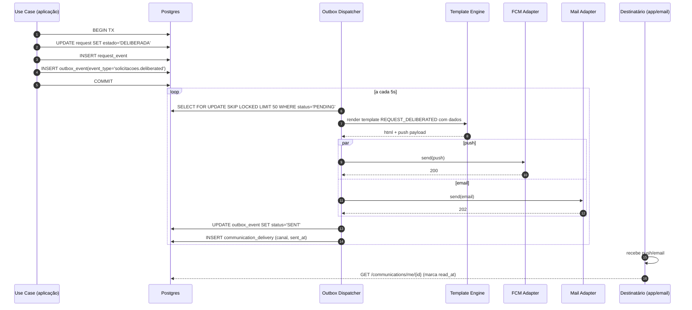
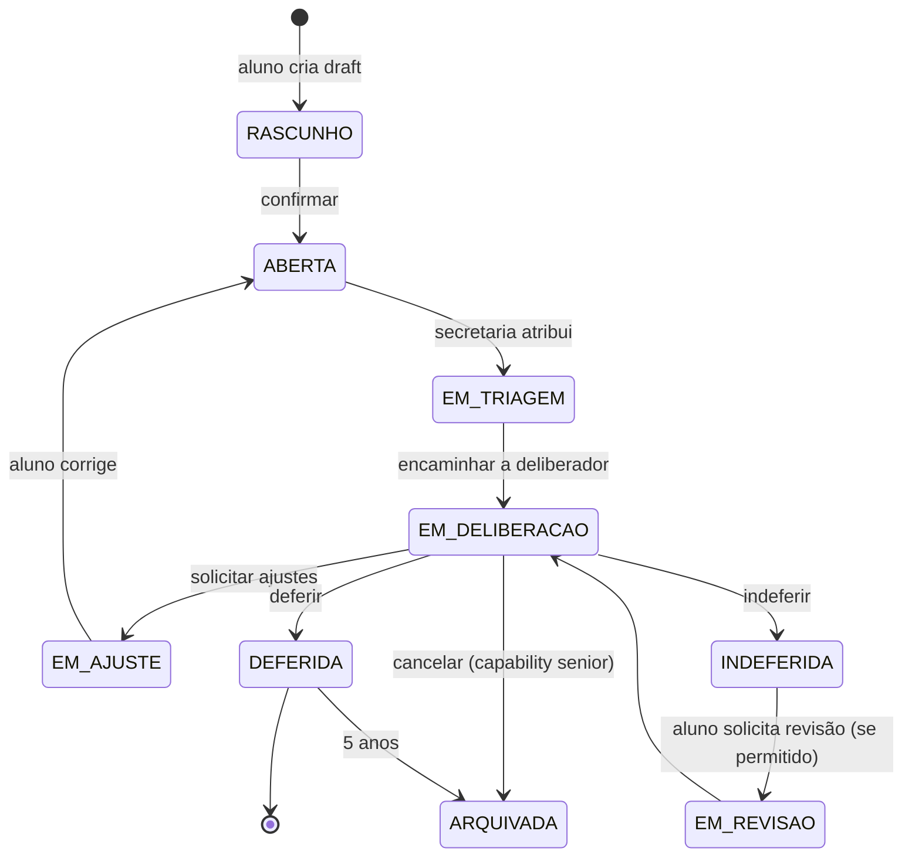
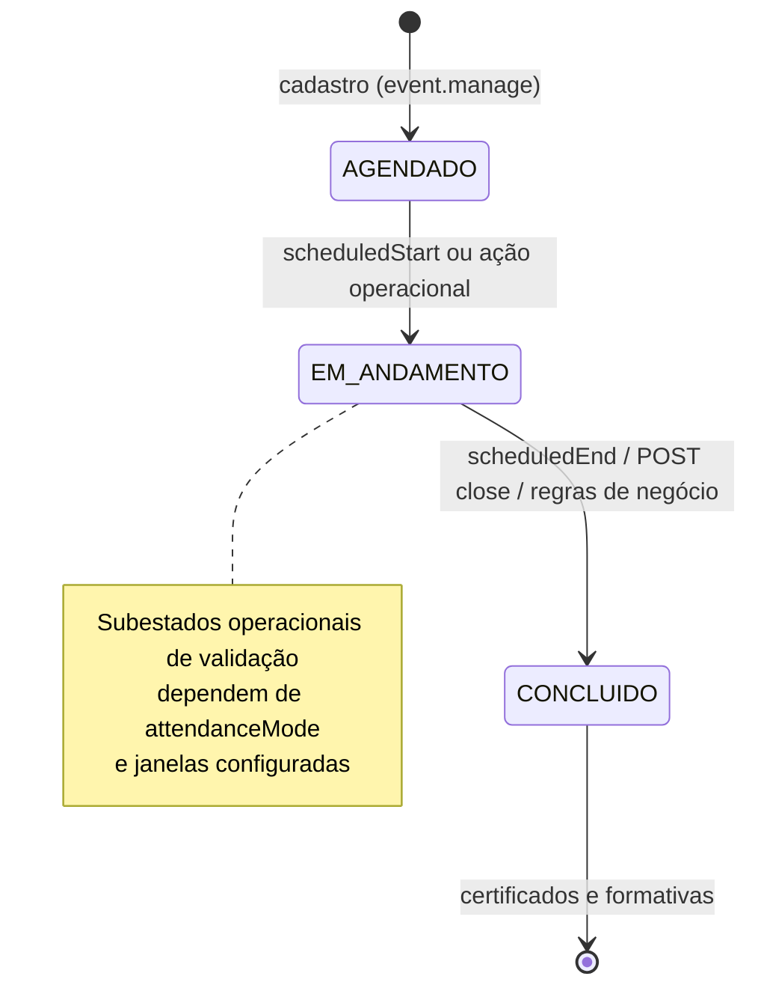
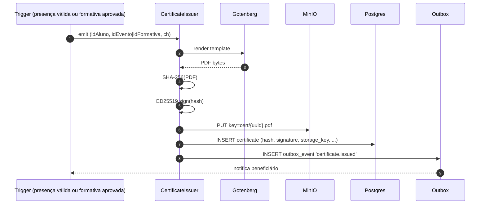
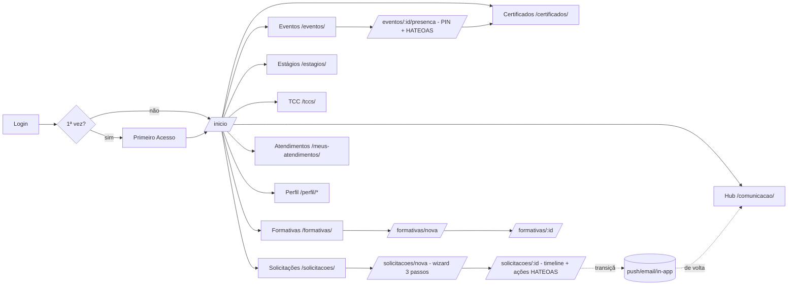
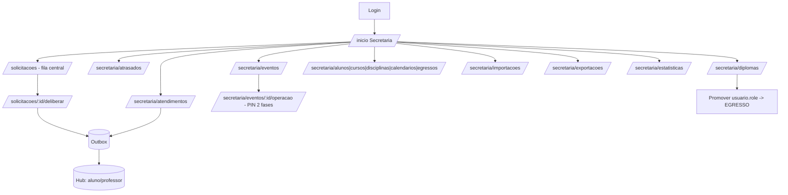

# Fluxos por Perfil — SecretariaOnline2 (v4.1 — presença configurável em eventos)

> Documento companheiro de `telas.md`.
> Enquanto aquele descreve **o que cada tela é**, este descreve **como o usuário a percorre, quais eventos disparam, quais módulos backend respondem e quais SLAs/políticas se aplicam**. A **v4.1** do submódulo de presença permite **modos** (QR único/duplo, PIN ou senha único/duplo), **janelas de validação configuráveis** pelo docente e **estados de evento** alinhados à agenda (**Agendado / Em andamento / Concluído**). Permanecem **fora de escopo**: chamada de aula regular, diário de classe, geofence, *trust score* e BLE para este módulo — competência dos sistemas institucionais (SIGA / UFPR Virtual).

---

## 0. Como ler este documento

- **Fluxo principal**: jornada nominal/feliz (passo a passo).
- **Sub-fluxos**: variações ou jornadas alternativas dentro de cada perfil.
- **Trigger**: o que inicia o fluxo (ação do usuário, evento async, scheduler).
- **Capability requerida**: a `authority` que o backend exige.
- **Eventos emitidos**: nomes do `outbox_event.event_type` ou `request_event.tipo`.
- **Notificações**: canais ativados pelo Hub (push/email/in-app), seguindo a política de prioridade da §7.3.
- **SLA** (quando aplicável): tempo máximo previsto.
- **Auditoria**: o que vai para `audit_log`.

A seção 12 deste arquivo tem **diagramas Mermaid** consolidados por fluxo.

---

## 1. F0 — Público / Não Autenticado

### F0.1 Login

- **Trigger**: visitante acessa qualquer URL sem JWT válido → middleware redireciona para `/login`.
- **Fluxo principal**:
  1. Usuário digita identificador (email/GRR) e senha.
  2. Cliente envia `POST /auth/login`.
  3. Backend rate-limita por IP+identificador (Bucket4j, 5 tentativas/min).
  4. Verifica usuário ativo, hash Argon2id correto, conta não bloqueada.
  5. Emite **access token** (JWT 15 min) + **refresh token** (7 dias, rotativo).
  6. Se `usuario.senha_alterada=false` → resposta inclui `mustChangePassword=true`.
  7. Cliente armazena tokens (web: cookie httpOnly + memória; mobile: Keychain/Keystore).
- **Eventos emitidos**: `iam.login_success` ou `iam.login_failed`.
- **Auditoria**: ator, IP, UA, resultado.
- **Sub-fluxos**:
  - **Bloqueio**: 10 falhas consecutivas → conta bloqueada por 15 min; aviso ao usuário sem detalhar.
  - **Reuso de refresh token**: se token rotativo for re-apresentado, todas as sessões do usuário são invalidadas (defesa contra roubo de cookie).
  - **Login com SSO institucional UFPR** (futuro): SAML/OIDC opcional via flag.

### F0.2 Recuperação de senha

- **Trigger**: clique em "Esqueci minha senha".
- **Fluxo principal**:
  1. Usuário informa email.
  2. Backend gera **JWT 1-uso** (`JTI` único, exp=24h, audience=`password-reset`, sub=usuario.id) e enfileira `outbox_event` `iam.password_reset_requested`.
  3. Dispatcher envia email pelo template `PASSWORD_RESET`.
  4. Usuário clica no link, cai em `/nova-senha?token=`.
  5. Backend valida JWT, força mínima da nova senha, ausência de reuso (compara hashes das últimas 3).
  6. Persiste novo Argon2id; **invalida** todas as sessões existentes; coloca `JTI` em blacklist.
- **Auditoria**: cada passo (request, email enviado, reset concluído).

### F0.3 Verificação pública de protocolo / certificado

- **Trigger**: leitura do QR estampado no PDF.
- **Fluxo principal**:
  1. Cliente acessa `/publico/verificar-protocolo/:id` ou `/publico/verificar-certificado/:hash`.
  2. Backend retorna metadados sanitizados (sem PII completa) + hash esperado.
  3. UI permite drag-and-drop do PDF; cliente recalcula SHA-256 e compara.
  4. Para certificado: UI também valida assinatura ED25519 com a chave pública de `/.well-known/jwks.json`.
- **Política**: rate-limit por IP (10 req/min). Tentativas de bruteforce em IDs viram alertas Grafana.

---

## 2. F1 — Aluno

Mapa mental:

- **Entrada**: Login → (1ª vez? `/primeiro-acesso`) → `/inicio`.
- **Pilares de atividade do aluno**: Solicitações, Formativas, Estágio, TCC, Eventos, Certificados, Comunicação, Atendimentos.
- **Cross-cutting**: Perfil, Notificações, Suporte.

### F1.1 Primeiro acesso (forçado)

- **Trigger**: login com `senha_alterada=false`.
- **Fluxo principal**:
  1. Usuário define senha forte.
  2. Aceita política de privacidade/LGPD (campo `aceite_lgpd_em` no `usuario.metadata`).
  3. Confirma email pessoal de contato (opcional).
  4. Backend marca `senha_alterada=true`, emite `iam.first_access_completed`.
  5. Redireciona para `/inicio`.
- **Política**: bloqueia qualquer outra navegação até concluir; na 2ª tentativa exige captcha.

### F1.2 Abrir uma solicitação

- **Trigger**: clique em "Nova solicitação" no `/inicio` ou `/solicitacoes`.
- **Fluxo principal**:
  1. `/solicitacoes/nova` (passo 1) — **escolha do tipo**: lista filtrada pelo curso do aluno e pela `request_type.required_auth` × authorities atuais. Ex.: aluno cursando 5º período não vê "Colação sem solenidade" se a regra `prerequisitos[]` não permitir.
  2. **Passo 2 — formulário dinâmico** (renderiza `form_schema` do RequestType com Zod): pode ter campos condicionais, máscaras, multi-itens (ex.: lista de disciplinas).
  3. **Anexos** dentro do passo 2: drag-and-drop, validação de tipo/tamanho/SHA-256 no cliente. Upload assíncrono para MinIO via URL pré-assinada.
  4. **Passo 3 — revisar**: resumo legível, links pré-visualizando os anexos, botão "Confirmar".
  5. Backend `POST /requests` cria `request` no estado `WORKFLOW.initial`, calcula `prazo_em = now + request_type.prazo_dias`, gera `numero_anual` atômico (`ano-NNNN`), enfileira `outbox_event` `solicitacoes.opened`.
  6. UI redireciona para `/solicitacoes/:id` mostrando recibo e botão "Gerar protocolo PDF".
- **Sub-fluxos**:
  - **Rascunho**: o passo 2 pode salvar localmente (PWA/AsyncStorage) ou no backend (`POST /requests/draft`). Estado backend = `RASCUNHO`. Aparece em `/solicitacoes` com badge "rascunho".
  - **Cancelar antes de confirmar**: rascunho descartado.
  - **Reabrir prazo**: caso o estado seja `EM_AJUSTE`, aluno volta ao wizard e atualiza dados/anexos.
- **Eventos**: `solicitacoes.opened`, `outbox_event.payload` contém `id_request`, `tipo`, `id_curso`.
- **Notificações**:
  - Aluno: in-app + push "Sua solicitação X foi aberta com nº A-NNNN".
  - Secretaria do curso: in-app + push "Nova solicitação X aguardando triagem".
- **SLA**: prazo conforme `request_type.prazo_dias` (default 15). Métrica `time_to_first_response` é trackada.
- **Auditoria**: criação, cada upload, transição.

### F1.3 Acompanhar solicitação

- **Trigger**: notificação push/email/in-app, ou navegação direta.
- **Fluxo principal**:
  1. `/solicitacoes/:id` carrega `GET /requests/{id}` (com `_links` HATEOAS).
  2. UI mostra timeline de `request_event` em ordem reversa (mais recente em cima).
  3. Botões disponíveis = links presentes na resposta. Ex.: estado `EM_AJUSTE` retorna link `editar`; `DELIBERADA` retorna link `gerar-protocolo`.
- **Sub-fluxos**:
  - **Solicitar revisão da decisão** (após indeferimento): se o `RequestType.workflow_json` permite, link `solicitar-revisao` aparece — abre nova `request_event` `REVIEW_REQUESTED`.
  - **Gerar protocolo PDF**: `POST /requests/{id}/protocol` gera PDF com QR para `/publico/verificar-protocolo/:id`.

### F1.4 Submeter atividade formativa

- **Trigger**: aluno em `/formativas/nova`.
- **Fluxo principal**:
  1. Escolhe `formative_activity` aplicável ao curso (filtrada).
  2. Declara horas, anexa comprovante.
  3. Backend cria `formative_entry` com estado `SUBMETIDA`.
  4. Outbox: `formativas.submitted` → notifica CAAF do curso.
- **Sub-fluxos pré-validados**: se a atividade veio de **evento interno presença validada**, o sistema cria `formative_entry` automaticamente quando `event_attendance.estado='ENCERRADO'` e oferece ao aluno apenas o aceite (1 clique). Esse caminho dispensa upload manual e elimina fraude (§11.5).

### F1.5 Acompanhar formativa

- Mesma mecânica de F1.3, mas em cima de `formative_entry`. Em estado `APROVADA` aparece link "Baixar certificado" (gerado e assinado em F1.6).

### F1.6 Receber certificado

- **Trigger** (background): aprovação de formativa OU encerramento de evento com presença validada.
- **Fluxo automático**:
  1. `CertificateIssuerUseCase` consome o evento.
  2. Gera PDF canônico (Gotenberg headless), calcula SHA-256, assina com ED25519, persiste em `certificate`.
  3. Outbox: `certificate.issued` → notifica beneficiário.
  4. Aluno vê badge no `/inicio` e item novo em `/certificados`.

### F1.7 Presença em evento (v4.1 — modos e janelas configuráveis)

- **Trigger**: aluno em `/eventos` (tabela + modal) ou card no `/inicio`; o backend expõe `_links` quando uma **janela de validação** está ativa para o `attendanceMode` do evento.
- **Fluxo principal**:
  1. O evento transita para **Em andamento** por **agenda** (`scheduledStart`/`scheduledEnd`) e/ou ação do organizador.
  2. Conforme o modo: **SECRET_*** — aluno informa PIN/senha + `deviceUuid` nas fases permitidas; **QR_*** — cliente web confirma via token (escaneamento ou `POST .../qr/validate` / payload em `entry`).
  3. Modos **duplos**: conclusão exige segunda fase dentro da respectiva janela; perda da primeira fase torna o aluno inelegível para a segunda.
  4. Ao concluir requisitos do modo + regras de encerramento, `attendance_session` atinge **Presença completa efetivada**; dispara certificado / formativa (F1.6 / §11).
- **Fora da janela**: **403**; UI cega.
- **Não logado em rota de evento**: notificação + login + retorno à mesma URL.
- **Device binding**: quando política ativa, `UNIQUE (id_evento, device_uuid)` permanece recomendado.
- **Removido como único desenho**: PIN + 10 minutos fixos como **única** política institucional (pode existir como *preset* de duração).

### F1.8 Atendimento (recebe / dá ciência)

- **Trigger**: secretaria registra atendimento (F5.13) → `outbox_event` `atendimentos.created` → push/email/in-app ao aluno.
- **Fluxo principal**:
  1. Aluno em `/meus-atendimentos` vê item com badge "Pendente ciência".
  2. Clica em "Estou ciente" → `POST /service-records/:id/acknowledge`.
  3. Estado vai para `CIENCIA_DADA`, registra `at`, evento `atendimentos.acknowledged`.

### F1.9 Recebimento de comunicação

- **Trigger**: secretaria/professor publica em `/comunicacao/publicar` ou `/admin/templates-comunicacao` automaticamente dispara via outbox.
- **Fluxo automático**:
  1. `Communication` criada → outbox `comunicacao.published`.
  2. Dispatcher cria `communication_delivery` por destinatário (fan-out).
  3. Cada delivery vira: in-app (badge), push (se prioridade ≥ MEDIUM e dentro do DND), email (digest se preferência diz `aggregated`, imediato se `CRITICAL`).
- **Aluno**: vê em `/comunicacao` com filtros e marca como lido.

### F1.10 Editar próprio perfil / preferências

- **`/perfil`**: dados pessoais (foto, telefone, email pessoal, nome social).
- **`/perfil/seguranca`**: trocar senha; lista sessões ativas (`refresh_token` por dispositivo) com botão "Encerrar".
- **`/perfil/notificacoes`**: matriz prioridade × canal + DND + digest.

---

## 3. F2 — Egresso

### F2.1 Acesso pós-graduação

- **Trigger**: secretaria executou F5.11 (registrar diploma) → `usuario.role` ganha `EGRESSO`, capabilities de aluno revogadas.
- **Fluxo principal**:
  1. Login normal.
  2. Redireciona para `/egresso/inicio` (read-only).
  3. Egresso pode: ver histórico, baixar certificados, atualizar email pessoal, opt-in/out de notificações.
- **Sub-fluxo — reemissão de certificado**: clica em "Reemitir PDF" → backend regenera o PDF (mesmo hash, mesma assinatura). Útil quando aluno perdeu o arquivo.

---

## 4. F3 — Professor

### F3.1 Login e dashboard

- Igual a F0.1.
- `/inicio` agrega via `GET /bff/dashboard/professor`: solicitações para deliberar, **atalhos de formativas só para membros CAAF**, estágios sob orientação/COE, TCCs em banca, comunicações para publicar, **eventos em que é organizador** (atalhos para F3.2).

### F3.2 Presença em eventos (professor — gestão v4.1)

- **Trigger**: docente com **`event.manage`** acessa `/professor/eventos` para CRUD + filtro **somente os meus**; com **`event.host`** (ou `event.manage`) opera `/professor/eventos/:id/operacao` no dia do evento.
- **Fluxo principal**:
  1. **Cadastro**: define `attendanceMode`, **janelas** (ex.: dia inteiro ou duas faixas), `chCreditadas`, agenda e público.
  2. **Operação**: conforme modo, aciona `POST .../windows/entry` e/ou `.../exit` quando necessário; exibe QR/PIN para os alunos; acompanha contagens.
  3. **Estados**: **Agendado** antes do início agendado; **Em andamento** entre início e fim; **Concluído** após `close` automático/manual.
  4. Encerramento → certificado / formativa conforme §11.
- **Não faz parte**: geolocalização obrigatória, *trust score*, aula regular.

### F3.3 `/solicitacoes?to=me`

- **Trigger**: professor acessa a fila de solicitações atribuídas ou deliberáveis.
- **Fluxo principal**:
  1. Lista filtrada por `canDeliberate=true` (ou equivalente).
  2. Ações em lote quando suportado.
- **Capability**: `request.deliberate`.

### F3.4 Deliberar solicitação (via deep-link de email)

- **Trigger**: secretaria encaminha solicitação ao professor (via fluxo de transição, automático conforme `request_type.workflow_json`) ou scheduler de notificação SLA.
- **Fluxo principal**:
  1. Backend gera JWT 1-uso (audience=`request-action`, sub=professor.id, claims={requestId}), TTL 7d, JTI único.
  2. Outbox: `solicitacoes.assigned_to_user` → email com template `REQUEST_NEEDS_ACTION` contendo URL `https://app/solicitacoes/{id}/deliberar?token=JWT`.
  3. Professor clica → backend valida JWT, abre tela com flag `viaDeepLink=true`.
  4. Se professor não estiver logado, abre tela em modo "leitura preview"; ao tentar agir, cliente força login (e mantém o `requestId` para continuar).
  5. Professor vê detalhes + ações (deferir, indeferir, solicitar ajustes, encaminhar) via `_links`.
  6. Cliente envia `POST /requests/{id}/transitions {action: 'DEFER', parecer: '...'}`.
  7. Backend valida que (a) authority confere com `Transition.requiresAuthority`, (b) `guard` do workflow é satisfeito, (c) JTI ainda válido.
  8. Aplica transição → grava `request_event` → outbox `solicitacoes.deliberated`.
- **Sub-fluxos**:
  - **Encaminhar para outro professor**: `action='FORWARD' targetUserId=...`. Sistema gera novo JWT 1-uso para o destinatário.
  - **Solicitar ajustes ao aluno**: estado vai para `EM_AJUSTE`; aluno recebe push.
  - **Reabrir** (apenas com capability extra): após `DELIBERADA`, recolocar em fila.
- **Auditoria**: cada transição em `audit_log` + `request_event`.

### F3.5 Revisar formativa (somente CAAF)

- **Trigger**: aluno submete F1.4 → outbox `formativas.submitted` → CAAF do curso recebe notificação.
- **Fluxo principal**:
  1. **Somente** professor com vínculo à CAAF abre `/formativas?to=me` (capability + escopo comissão).
  2. Lista filtrada por `canReview=true`; pode selecionar múltiplos para "Aprovar em lote" (se `formative_activity` é tipo `EVENTO_INTERNO_PRESENCA_VALIDADA`).
  3. Clica em um item → `/formativas/:id`.
  4. Aprovar → `POST /formative-entries/{id}/approve {horasValidadas}`. Backend marca `APROVADA`, dispara F1.6 (emissão de certificado).
  5. Rejeitar → `POST .../reject {parecer}`. Aluno recebe push para corrigir/contestar.

### F3.6 Acompanhar estágio (orientador / COE)

- **Trigger**: aluno faz upload de documento em F1.14 → outbox `estagios.document_uploaded`.
- **Fluxo principal**:
  1. Professor abre `/estagios?to=me`.
  2. Em `/estagios/:id` vê documentos + linha do tempo.
  3. Pode emitir parecer por documento (`POST /internships/{id}/documents/{docId}/review`).
  4. Pode arquivar estágio quando concluído (`POST /internships/{id}/close`).

### F3.7 Banca de TCC

- **Trigger**: aluno faz upload de TCC em F1.16 → outbox `tcc.submitted`.
- **Fluxo principal**:
  1. Professor abre `/tccs?to=me`.
  2. Avalia, dá nota, registra parecer.
  3. Backend gera certificado de conclusão (se aprovado e elegível) via F1.6.

### F3.8 Publicar comunicado

- `/comunicacao/publicar` → editor Markdown + preview + audiência. Submeter cria `Communication`. F1.9 entrega.

---

## 5. F4 — Comissões (CAAF, COE)

> Comissão = subset de professores com capabilities específicas (`formative.review` para CAAF, `internship.review` para COE) e escopo de curso/centro.

### F4.1 Atribuição interna (CAAF / COE)

- **Trigger**: solicitações ou submissões chegam ao "pool" da comissão.
- **Fluxo principal**:
  1. Membros da comissão acessam `/comissoes/caaf` (ou `/comissoes/coe`).
  2. Vêem fila do pool e podem fazer "self-assign" ou alocar a outro membro.
  3. Atribuição cria evento `solicitacoes.assigned_to_user` ou `formativas.assigned`.
  4. Daí em diante o fluxo individual é o de F3.

### F4.2 Análise em lote

- Para certos `RequestType` ou `formative_activity` configurados como "lote-friendly", a comissão pode aplicar a mesma decisão a múltiplos itens (`POST /commissions/.../batch-decide`). Ainda assim, cada item ganha sua própria entrada em `request_event`/`formative_entry.event_log`.

---

## 6. F5 — Secretaria

### F5.1 Triagem de solicitações

- **Trigger**: nova solicitação aberta (F1.2) ou alteração de estado.
- **Fluxo principal**:
  1. `/inicio` mostra contadores. Atalho "Filas pendentes".
  2. `/solicitacoes` com filtros padrão (curso vinculado, estado=ABERTA, ordenação por SLA).
  3. Para cada item, ações rápidas: atribuir, encaminhar, deliberar (se SECRETARY tem capability), exportar.
  4. Em massa: selecionar várias e aplicar a mesma ação.

### F5.2 Deliberar solicitação (sem deep-link)

- Mesmo backend de F3.3, sem JWT de email. Capability `request.deliberate` granular (alguns `RequestType` exigem `senior_secretary`).

### F5.3 Acompanhar SLA

- **Trigger**: `/secretaria/atrasados` ou banner no `/inicio`.
- **Fonte**: query `prazo_em < now AND concluded_at IS NULL`.
- **Política**: scheduler diário envia digest "Atrasos do dia" para o coordenador.

### F5.4 CRUD de aluno / curso / disciplina / calendário

- Telas F5.6, F5.7, F5.8, F5.9. Ações de mutação registram `audit_log`. Importação em lote em F5.5.

### F5.5 Importação em lote

- **Trigger**: `/secretaria/importacoes` → escolhe `kind` (alunos|disciplinas|usuarios|alocacao_professor).
- **Fluxo principal**:
  1. Baixa modelo CSV/XLSX.
  2. Sobe arquivo → `POST /imports/{kind}` (multipart).
  3. Backend persiste no `import_job` + `import_row` (cada linha) e roda validação.
  4. UI mostra **preview** com erros por linha.
  5. Operador confirma → backend processa **em transação por lote** (1k linhas).
  6. Outbox: `imports.completed` com sumário.
- **Auditoria**: cada `import_job` mantém checksum e relatório.

### F5.6 Registrar atendimento

- **Trigger**: secretaria recebe aluno presencialmente.
- **Fluxo**: F5.13 cria registro → F1.8 entrega ao aluno → ciência fecha o ciclo.

### F5.7 Diploma e colação

- **Trigger**: período de colação (registrado no calendário acadêmico).
- **Fluxo principal**:
  1. `/secretaria/diplomas` → escolhe curso e turma → lista de elegíveis (regra: TCC aprovado, todas as disciplinas concluídas, sem pendências).
  2. Marca presença na cerimônia, anota livro/folha/ata.
  3. Backend cria `graduation_record`, transiciona `usuario.role` → `EGRESSO`.
  4. Outbox: `egressos.graduated` → notifica novo egresso com instruções.

### F5.8 Organização de evento (presença v4.1)

- **Trigger**: secretaria (ou professor com `event.manage`) cria/edita evento; no dia, painel F5.15.
- **Fluxo principal**:
  1. `/secretaria/eventos` — mesmo CRUD e regras de leitura de terceiros que F3.2.
  2. **No dia**: `/secretaria/eventos/:id/operacao` — paridade com o professor; modos QR/PIN e janelas conforme cadastro.
  3. Encerramento → `POST /events/{id}/close` ou scheduler → `formative_entry` / certificado.
- **Removido como premissa única**: apenas PIN 10 min.

### F5.9 Exportações

- **Trigger**: `/secretaria/exportacoes`.
- **Fluxo**: `POST /exports/{kind}` → job assíncrono → notifica quando pronto → link expira em 7d.

---

## 7. F6 — Coordenação

> Coordenação **é** secretaria com capabilities adicionais. Não há tela exclusiva grande; só refinos.

### F6.1 Configurar curso

- `/coordenacao/cursos/:id/configurar` → ajusta horas formativas, calendário (15/18 semanas), regras de banca de TCC. Capability `course.config`.

### F6.2 Relatórios analíticos

- `/coordenacao/relatorios` consome `GET /reports/coordinator?...`. Métricas:
  - Tempo médio de deliberação por tipo de solicitação.
  - Taxa de indeferimento (alerta se > X%).
  - Carga por professor deliberador.
  - Volume de horas formativas validadas vs requisito.
  - Taxa de **conclusão da presença** (por modo configurável) em eventos internos.

### F6.3 Gerir comissões

- `/admin/perfis` (delegado) — coordenador pode adicionar/remover membros CAAF/COE com capability `commission.manage`.

---

## 8. F7 — Admin / Plataforma

### F7.1 Gestão de IAM

- **Roles** (`/admin/perfis`): cria role como agregador de authorities.
- **Authorities** (`/admin/autoridades`): cria capability granular (`request.deliberate.tcc`, `event.host`).
- **Atribuir role a usuário**: `/admin/usuarios/:id/roles` → matriz checkbox.

### F7.2 Catálogo de tipos de solicitação (Workflow Engine)

- **Trigger**: nova demanda institucional (ex.: "Solicitação de monitoria").
- **Fluxo**:
  1. Em `/admin/tipos-solicitacao`, admin cria `RequestType`.
  2. Edita JSON Schema com preview ao vivo (campo a campo).
  3. Edita workflow visualmente: estados, transições, capabilities exigidas, guards (DSL pequena: `aluno.semestre>=4`).
  4. Define prazo padrão e templates de comunicação por estado.
  5. Salva → versão atômica do RequestType. **Versionamento**: solicitações já abertas continuam usando a versão original; novas usam a corrente.
- **Auditoria**: cada criação/alteração registrada.

### F7.3 Templates de comunicação

- `/admin/templates-comunicacao` — CRUD com preview de variáveis. Salvo numa versão imutável; alterações criam revisões.

### F7.4 Observabilidade do Outbox

- `/admin/jobs` mostra:
  - `outbox_event` por status (PENDING, SENT, FAILED, DEAD).
  - Filtros por aggregate type.
  - Botão "Reentregar": recoloca DEAD em PENDING.
  - Painel de scheduled jobs (frequência, último run, próximo).
- **SLA do dispatcher**: latência média < 5s para PENDING → SENT em fila vazia.

### F7.5 Audit log

- `/admin/audit-log` para investigação. Pesquisa por ator, alvo, intervalo. Mostra payload diff.

### F7.6 Reset de senha administrativo

- `POST /users/{id}/password-reset` gera link por email; admin **não** vê senha. Substitui o anti-padrão `reiniciarSenhaPara123` do legado.

---

## 9. F8 — Cross-cutting

### F8.1 Busca global

- **Trigger**: `Ctrl+K` / `⌘K` ou clique em `/buscar`.
- **Fluxo**:
  1. Input dispara `GET /search?q=...` com debounce 200ms.
  2. Backend faz fan-out paralelo a `students`, `requests`, `events`, `users` (limite 5 cada) e devolve resultados tipados, **filtrados por escopo**.
  3. UI agrupa por tipo. Enter abre o item selecionado.

### F8.2 Suporte / FAQ

- Aluno e professor podem abrir ticket via `/suporte`. Cria `support_thread` (fora do MVP — registra como `RequestType=SUPORTE_TECNICO` se quiser DRY total).

---

## 10. Fluxos transversais (event-driven)

### 10.1 Fluxo de notificação ponta-a-ponta



### 10.2 Ciclo de vida de uma solicitação (workflow genérico)



> Cada `RequestType.workflow_json` é uma instância concreta (subset/superset deste). O motor é o mesmo.

### 10.3 Ciclo de vida de um evento de presença (v4.1)



### 10.4 Ciclo de vida de um certificado



---

## 11. Políticas e SLAs por fluxo

| Fluxo | SLA alvo (P95) | Métrica chave | Alerta |
|---|---|---|---|
| Login | < 800ms | `auth.login.duration` | > 2s ou taxa erro > 2%/min |
| Abrir solicitação | < 1.5s para POST | `request.open.duration` | erros 5xx |
| Notificação push | < 30s da transição | `outbox.dispatch_lag` | > 5min |
| Email digest | até 09:00 do dia | `digest.delivery_time` | atraso > 30min |
| Check-in presença (modos configuráveis) | < 2s round-trip | `presenca.confirm.duration` | taxa 403 fora da janela > limiar configurado |
| Emissão de certificado | < 60s do trigger | `cert.issue.duration` | falhas em ED25519 |
| Outbox dispatcher | drenagem completa < 1min | `outbox.queue_depth` | > 200 PENDING |
| Deliberação SLA cliente | conforme `request_type.prazo_dias` | `request.time_to_decision` | percentil > 1.5× prazo |

---

## 12. Diagramas consolidados por perfil

### 12.1 Aluno



### 12.2 Professor

```mermaid
flowchart LR
    L[Login] --> H[/inicio Professor/]
    EM[(Email com deep-link)] -->|JWT 1-uso| DL[/solicitacoes/:id/deliberar?token=/]
    H --> EV[/professor/eventos - gestão e operação v4.1/]
    H --> Q1[/solicitacoes?to=me/]
    H --> Q2[/formativas?to=me (CAAF)/]
    H --> Q3[/estagios?to=me (orient./COE)/]
    H --> Q4[/tccs?to=me/]
    H --> Q5[/comunicacao/publicar/]
    Q1 --> DL
    DL --> A1{Ação}
    A1 -->|Deferir| OUT[(Outbox event)]
    A1 -->|Indeferir| OUT
    A1 -->|Solicitar ajustes| OUT
    A1 -->|Encaminhar| FW[Gera novo JWT 1-uso]
    OUT --> NTF[(notifica solicitante)]
    Q2 --> RV[/formativas/:id/]
    RV --> APRV[Aprovar/Rejeitar]
    APRV --> OUT
```

### 12.3 Secretaria



### 12.4 Admin / Plataforma

```mermaid
flowchart TB
    L[Login] --> H[/inicio Admin/]
    H --> A1[/admin/usuarios/]
    H --> A2[/admin/perfis (Roles)/]
    H --> A3[/admin/autoridades (Authorities)/]
    H --> A4[/admin/tipos-solicitacao - Workflow Engine/]
    H --> A5[/admin/templates-comunicacao/]
    H --> A6[/admin/jobs - Outbox/Scheduler/]
    H --> A7[/admin/audit-log/]
    A4 -.usado por.-> R[Wizard de solicitação f1.2]
    A5 -.usado por.-> N[Outbox dispatcher]
    A2 -.referencia.-> A3
    A1 -.atribui.-> A2
```

---

## 13. Reaproveitamento de fluxos (DRY runtime)

| Fluxo | Quem usa | Como o DRY se manifesta |
|---|---|---|
| Wizard `/solicitacoes/nova` | Aluno (próprio) + Secretaria (interna, com `request.internal_open`) | Mesma rota, capability adiciona campo "Em nome de" |
| `/solicitacoes/:id` | Solicitante, deliberador, comissão | Mesma view; `_links` HATEOAS muda os botões |
| `/solicitacoes/:id/deliberar` | Professor, secretaria, coordenador | Mesma view; transições disponíveis = `RequestType.workflow_json × authorities` |
| `/inicio` | Todos | Mesma rota; BFF retorna payload contextual |
| Hub `/comunicacao` | Todos | Filtros mudam por capability |
| `/buscar` | Todos | Mesma rota; backend filtra por escopo |
| Verificadores públicos | Externos | Não exigem login |

---

## 14. Diferenças com o legado (sumário operacional)

| Aspecto | Legado | SecretariaOnline2 | Impacto |
|---|---|---|---|
| Senha | MD5 sem salt | Argon2id + complexidade + reuso | Segurança 1000× |
| Sessão | HttpSession 30min | JWT 15min + refresh rotativo 7d | Mobile + multi-device |
| Deep-link email | int32 random | JWT JTI 1-uso + audience | Anti-fraude |
| Notificação | Email síncrono em thread | Hub + Outbox + push/email/in-app | Confiabilidade |
| Solicitação | 65 telas estáticas | 1 wizard genérico + JSON Schema | DRY ADR-003 |
| Workflow | Switches espalhados | `WorkflowDefinition` em DB | Configurável |
| Autorização | `if (perfil == X)` espalhado | FGAC + HATEOAS | UI cega |
| Auditoria | esparsa | `audit_log` + `request_event` imutáveis | Compliance |
| Anti-fraude presença | inexistente | **Modos configuráveis + janelas + device binding (v4.1)** | Capítulo 10 |
| Certificado | upload manual | nascido auditado (SHA-256+ED25519) | Capítulo 11 |
| Backup/erros | telas no produto | jobs + Grafana + audit log | Operacional |
| Tarefas internas | módulo no produto | opt-in ou Linear | Foco no negócio |

---

## 15. Pontos abertos para validação

Antes de implementar, vale validar com a secretaria/coordenação:

1. **Granularidade da deliberação por disciplina** (ex.: cancelamento múltiplo): manter como `request_line_item` decidido individualmente? Sim, já modelado.
2. **Limite de tamanho/tempo do rascunho**: 30 dias razoável? (cleanup job).
3. **Política de DND** padrão para uma universidade pública (22h–7h ok?).
4. **Quem pode publicar oportunidades** (`OPORTUNIDADE` no Hub) — capability `communication.publish_opportunity` para parceiros externos cadastrados?
5. **Duração das janelas de validação** — fixar presets institucionais ou total flexibilidade por evento (`event.policy` / `validationWindows[]`).
6. **Tarefas internas**: secretaria quer manter no app ou aceitar Linear?
7. **Atendimentos antigos** (RF42) merecem migração ou só leitura?
8. **Egresso pode logar com email pessoal** (perde acesso ao email institucional)? Sim — recomendado migrar email para campo `email_pessoal` no momento do diploma.

Cada ponto vira (ou não) ADR.
