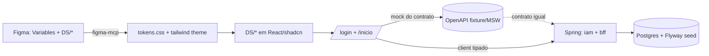

# MVP — Walking Skeleton do Aluno (apresentação em 15 dias)

**Autor:** análise de escopo de MVP (TCC SecretariaOnline2)
**Data:** 01/06/2026
**Documentos-base:** `analise_arquitetural_secretariaonline2.md`, `telas.md`, `fluxos_por_perfil.md`, `jpaInterfaces_PostgresEntities.md`, `endpoints_canonicos_presenca_eventos_v4.md`, `prompts/PROMPT_figma_make_dashboard_aluno*.md`
**Protótipo de referência:** [https://amount-utter-53877806.figma.site/](https://amount-utter-53877806.figma.site/) (gerado a partir dos dois prompts de dashboard do aluno)

---

## 1. Resumo executivo

Em 15 dias **não** se entrega o ão ~46 rotas, 29 tabelas, 8 bouproduto inteiro (snded contexts). O que se entrega — e impressiona uma banca — é um **walking skeleton**: uma **fatia vertical fina e funcional** que atravessa **todas as camadas reais** do produto (Design System no Figma → tokens no Cursor → React → API REST → Postgres) usando **a arquitetura definitiva**, e não um protótipo descartável.

A fatia escolhida é a **jornada autenticada do Aluno** terminando na tela `/inicio` (Dashboard do Aluno):

> `**/login` → (`/primeiro-acesso` quando aplicável) → `/inicio` com dados reais vindos de `GET /bff/dashboard/aluno`.**

Essa fatia foi escolhida porque, sendo pequena, ela **obriga** a montar e validar as decisões mais estruturais do TCC (modular monolith, Clean Architecture, FGAC, JWT/Argon2, HATEOAS, BFF, Flyway, pipeline de Design System). Tudo o que vier depois (Solicitações, Formativas, Eventos, etc.) **reusa** essa fundação sem refatorá-la.

**Princípio diretor:** *"o MVP é estreito em escopo, mas profundo em arquitetura"*. Largura vem depois; profundidade não pode ser retrofitada.

---

## 2. Por que esta fatia (e não outra)


| Critério                                 | Por que `/login → /inicio` do aluno vence                                                                                    |
| ---------------------------------------- | ---------------------------------------------------------------------------------------------------------------------------- |
| **Demonstrável**                         | Tela bonita, com dados reais, já prototipada e com prompts prontos — efeito visual imediato na banca.                        |
| **Atravessa o stack inteiro**            | Exige Figma DS → tokens → React → contrato OpenAPI → Spring → Postgres. Nenhuma camada fica "de mentira".                    |
| **Exercita o núcleo de segurança**       | Login real com **Argon2id + JWT access/refresh** (ADR-004, ADR-005) — o achado nº1 do legado (MD5) já nasce corrigido.       |
| **Valida o FGAC/HATEOAS cedo**           | O BFF do dashboard já devolve `_links`/capabilities; o front já aprende a ser "cego a perfis" (ADR-002, ADR-014).            |
| **Estabelece o padrão de módulo**        | `iam` + `academico` + um agregador `bff` nascem na estrutura Clean definitiva; os demais módulos copiam o template.          |
| **Baixo risco em 15 dias**               | Pouca regra de negócio (sem workflow engine, sem outbox real, sem upload). O esforço vai para a fundação, não para features. |
| **Casa com o processo frontend→backend** | O usuário quer começar pelo Figma; o dashboard é justamente a tela com Design System mais rico já desenhado.                 |


Alternativas descartadas para o MVP:

- *Wizard de solicitação* (ADR-003): é o coração do DRY, mas exige Workflow Engine + JSON Schema + anexos. Profundo demais para 15 dias.
- *Presença em eventos v4.1*: muitos estados/janelas/modos; alto risco.
- *Telas de secretaria/admin*: pouco apelo visual e muita regra.

---

## 3. Escopo do MVP (IN / OUT)

### 3.1 Dentro do MVP (IN)

**Backend**

- Esqueleto **monólito modular** Kotlin + Spring Boot 3 (Gradle Kotlin DSL, multi-módulo) — estrutura de pastas **definitiva**.
- Módulo `iam`: `POST /auth/login`, `POST /auth/refresh`, `POST /auth/first-access`, `GET /me`. Argon2id + JWT access (15 min) + refresh rotativo. FGAC via `authorities` no token.
- Módulo `academico`: entidades mínimas `curso` (leitura) para compor o dashboard.
- Agregador **BFF**: `GET /bff/dashboard/aluno` devolvendo o payload exato que a tela `/inicio` consome (KPIs, pendências, eventos, últimas solicitações, prazos, último parecer, atalhos) + `_links` HATEOAS.
- **PostgreSQL 16 + Flyway** com a migration `V1` contendo o subconjunto de tabelas do MVP (modelo final, sem gambiarra).
- **Seed** de dados (1 aluno demo + curso + dados de dashboard) via migration `V2` ou data loader.
- **Swagger/OpenAPI** (`springdoc`) publicado.
- Tratamento de erro padronizado **RFC 7807 (Problem Details)** desde já.

**Frontend Web**

- React 18 + Vite + TypeScript + Tailwind + shadcn/ui.
- **Pipeline de Design System** vindo do Figma (tokens → tema Tailwind/CSS vars) — ver §7.
- Componentes `DS/`* do mapa estrutural (Button, Card, Badge, KpiCard, NavItem, AlertBanner, etc.).
- `AppLayout` (Sidebar 256 + Topbar 64), rotas `/login`, `/primeiro-acesso`, `/inicio`.
- **TanStack Query** consumindo o BFF; **React Hook Form + Zod** no login; estados **loading (skeleton) / empty / erro parcial** (já previstos no protótipo).
- Helper `useActions(resource)` lendo `_links` (semente do padrão HATEOAS).

**DevEx / Operação**

- `docker-compose` subindo Postgres (+ Mailpit opcional) e o backend.
- `README` com 5 comandos para subir tudo.
- CI mínima (GitHub Actions): lint + build + test do backend e do front.

### 3.2 Fora do MVP (OUT) — explicitamente adiado

- Mobile (React Native/Expo) — a estrutura prevê, mas não se implementa agora.
- Workflow Engine + wizard de solicitação, anexos/MinIO.
- Formativas, Estágio, TCC, Presença/Eventos, Certificados (telas e regras).
- Hub de comunicação real, Outbox dispatcher, push/email (FCM/Mailgun).
- ETL do legado, observabilidade completa (Prometheus/Grafana/OTEL), RabbitMQ, API Gateway.
- Telas de Secretaria/Coordenação/Admin.

> O dashboard mostra cards de Solicitações/Eventos/Formativas como **dados read-only** vindos do BFF (mockados no seed), **sem** navegação funcional para os fluxos completos. Isso é honesto e suficiente para a demo.

---

## 4. Requisitos atendidos (rastreabilidade)


| Origem na documentação                           | Item entregue no MVP                                                    |
| ------------------------------------------------ | ----------------------------------------------------------------------- |
| `telas.md` F0.1 `/login`                         | Login real (Argon2id, sem JSESSIONID)                                   |
| `telas.md` F1.2 `/primeiro-acesso`               | Troca de senha forçada + aceite LGPD                                    |
| `telas.md` F1.1 `/inicio` + prompts de dashboard | Dashboard do aluno com dados reais                                      |
| `fluxos_por_perfil.md` F0.1 / F1.1               | Fluxo de autenticação + first access                                    |
| ADR-001 (monólito modular)                       | Estrutura multi-módulo Clean                                            |
| ADR-002 / ADR-014 (FGAC + HATEOAS)               | Authorities no JWT + `_links` no BFF                                    |
| ADR-004 / ADR-005 (Argon2 + JWT)                 | Implementados no `iam`                                                  |
| ADR-009 / ADR-010 (Flyway + UUIDv7)              | Migrations versionadas + PKs UUID                                       |
| Backlog F1-001..006, F2-001/002                  | Fundações + IAM login/JWT                                               |
| `jpaInterfaces_PostgresEntities.md`              | Subconjunto de repositórios/entidades nascendo com a nomenclatura final |


---

## 5. Arquitetura e estrutura de pastas (definitiva — "zero refatoração")

A regra para não refatorar depois é **fixar agora as fronteiras** (módulos + camadas) e os **contratos** (OpenAPI + tokens DS), mesmo que só 2–3 módulos existam. Adicionar `solicitacoes/`, `formativas/`, etc. depois é **criar pasta**, não **mover código**.

```
secretariaonline2/
  backend/
    app/                         ← Spring Boot entrypoint + composição de módulos
    shared/                      ← kernel: Result, Page, IDs (UUIDv7), erros RFC7807, ValueObjects (Email, GRR, CPF)
    modules/
      iam/
        api/                     ← AuthController, MeController, DTOs, assemblers HATEOAS
        application/             ← LoginUseCase, RefreshTokenUseCase, FirstAccessUseCase, ports/out
        domain/                  ← Usuario, Role, Authority, PasswordHash (puro Kotlin)
        infrastructure/          ← *Entity JPA, *JpaRepository, Argon2/JWT adapters, Flyway
      academico/
        api/ application/ domain/ infrastructure/   ← Curso (leitura no MVP)
      bff/
        api/                     ← DashboardAlunoController (agrega iam + academico + dados de dashboard)
        application/             ← DashboardAlunoQuery
    build.gradle.kts
    settings.gradle.kts
  frontend-web/
    src/
      app/                       ← rotas (router), providers (QueryClient, Auth)
      shared/
        ui/                      ← componentes DS/* (Button, Card, Badge, KpiCard, NavItem...)
        tokens/                  ← tokens.css / tailwind theme gerados do Figma
        api/                     ← client http, tipos OpenAPI, useActions(HATEOAS)
        auth/                    ← guard de rota, store de tokens
      features/
        auth/                    ← /login, /primeiro-acesso
        dashboard/               ← /inicio (consome /bff/dashboard/aluno)
    index.html  vite.config.ts  tailwind.config.ts
  ops/
    docker-compose.yml
  README.md
```

**Invariantes arquiteturais já valendo no MVP** (validadas idealmente com ArchUnit):

- `domain/` sem import de Spring/JPA/HTTP.
- `infrastructure/` de um módulo nunca é importada por outro módulo.
- Comunicação entre módulos só por **interface pública da `application`** ou eventos de domínio.
- Front: `features/*` consome `shared/*`; nunca o contrário.

---

## 6. Modelo de dados do MVP (subconjunto do schema final)

Migration `V1__mvp_baseline.sql` cria **apenas** o necessário, mas **idêntico** ao desenho final (seção 5.3 da análise) — nada será reescrito depois:

- `usuario` (com `senha_hash` Argon2id, `senha_alterada`, `metadata` JSONB para `aceite_lgpd_em`)
- `role`, `authority`, `role_authority`, `usuario_role` (FGAC completo)
- `curso` (mínimo para o dashboard: nome, sigla, `horas_formativas_req`)
- *(opcional)* `audit_log` para registrar login/first-access desde o dia 1

Extensões: `pgcrypto`, `uuid-ossp` (ou função `uuid_generate_v7`), `citext`.

Migration `V2__seed_demo.sql`: 1 curso (TADS), authorities do aluno (`dashboard.view_own`, `request.view_own`, etc.), role `ALUNO`, 1 usuário aluno demo (`senha_alterada=false` para exercitar o primeiro acesso), e dados que alimentam os cards do dashboard (KPIs/pendências/eventos podem ser servidos como dados semeados em tabelas reais quando existirem, ou compostos no BFF a partir de um pequeno conjunto seed — ver §8).

> As tabelas de Solicitações/Formativas/Eventos **não** entram na V1. O dashboard exibe esses números via BFF a partir de dados seed mínimos; quando os módulos chegarem, o BFF passa a lê-los das tabelas reais **sem mudar o contrato** com o front.

---

## 7. Processo Frontend → Backend com Figma + figma-mcp

Este é o coração do fluxo de trabalho pedido: **Design System no Figma → import via figma-mcp → telas no Cursor usando tokens do Figma → depois o backend**.

### 7.1 Etapa A — Design System no Figma (fonte da verdade visual)

1. Criar no Figma uma página de **Foundations** com **Variables** (não cores soltas):
  - **Color**: `brand/primary`, `brand/accent`, `neutral/0..900`, `success`, `warning`, `danger`, `info`, `surface`, `border`, `text/`*.
  - **Spacing**: escala 8px (`space/xs=4 … space/2xl=40`) — exatamente a do `PROMPT_figma_make_dashboard_aluno_estrutura.md` §2.
  - **Radius**, **Typography** (papéis `Heading/H1..H3`, `Body`, `Caption`), **Shadow**.
2. Construir a biblioteca `DS/`* (Button, Card, Badge, KpiCard, NavItem, AlertBanner, PendenciaItem, EventoRow, DataTable/Compact, TimelineItem, QuickTile, Avatar, Input/Search, Skeleton) **vinculada às Variables** (sem valores hardcoded).
3. Montar os frames do dashboard (`01 — Desktop /inicio`, `03 — Mobile`, estados skeleton/empty/erro) reusando os componentes — usar o protótipo já existente como referência visual.

### 7.2 Etapa B — Importar tokens para o Cursor (figma-mcp)

1. Via **figma-mcp** (skill `figma-use`), ler as **Variables**/estilos do arquivo e exportá-las para `frontend-web/src/shared/tokens/`:
  - `tokens.css` com **CSS custom properties** (`--color-brand-primary`, `--space-md`, `--radius-md`, ...).
  - Mapear no `tailwind.config.ts` (cores, spacing, radius, fontSize) para que classes Tailwind e shadcn consumam **as mesmas** variáveis.
2. Configurar o **tema do shadcn/ui** apontando para os tokens (light primeiro; dark fica preparado).
3. *(Opcional, recomendável)* **Figma Code Connect** (skill `figma-code-connect`): mapear cada `DS/`* do Figma ao componente React correspondente, criando rastreabilidade design↔código.

> Regra de ouro: **nenhum hex/medida hardcoded** no front. Tudo vem de token. Trocar a identidade visual = editar Variables no Figma e regenerar tokens.

### 7.3 Etapa C — Telas no Cursor a partir dos tokens

1. Implementar os componentes `DS/`* em `shared/ui/` consumindo os tokens (Auto Layout do Figma → flex/grid do Tailwind).
2. Montar `AppLayout` + `/inicio` seguindo o mapa estrutural do prompt (medidas, grids 2:1, KpiRow 4 col, etc.).
3. Nesta fase o front consome um **mock do contrato** (`/bff/dashboard/aluno`) — MSW ou fixture — para destravar a UI antes do backend.

### 7.4 Etapa D — Backend e ligação (frontend → backend)

1. Definir o **contrato OpenAPI** de `/auth/`*, `/me` e `/bff/dashboard/aluno` (o mesmo shape do mock).
2. Implementar `iam` + `academico` + `bff` no Spring; Flyway sobe o schema; seed popula o aluno demo.
3. Trocar o mock pelo client real (tipos gerados do OpenAPI). Login → token → dashboard com dados reais.




---

## 8. Contratos de API do MVP (resumo)

Definir em OpenAPI antes de codar. Shapes essenciais:

- `POST /auth/login` → `{ accessToken, refreshToken, mustChangePassword }`
- `POST /auth/refresh` → rotação de refresh + novo access
- `POST /auth/first-access` `{ novaSenha, aceiteLgpd }` → marca `senha_alterada=true`
- `GET /me` → dados do usuário + `authorities` + `_links`
- `GET /bff/dashboard/aluno` → payload da tela `/inicio`:

```jsonc
{
  "saudacao": { "nome": "Ana Silva", "curso": "TADS", "periodoLetivo": "2026/1" },
  "kpis": {
    "horasFormativas": { "atual": 72, "requerido": 120 },
    "solicitacoesEmAndamento": 3,
    "eventosHoje": 2,
    "certificados": 1
  },
  "alertas": [ { "tipo": "warning", "titulo": "Solicitação 2026-0042 aguarda seu ajuste", "_links": { "acao": "/solicitacoes/..." } } ],
  "pendencias": [ /* até 3 */ ],
  "eventos": [ /* até 3, com estado e situação de presença */ ],
  "ultimasSolicitacoes": [ /* até 5: numero, tipo, estado, prazo, sla */ ],
  "prazos": [ /* até 3 */ ],
  "ultimoParecer": { "estado": "Aprovada", "titulo": "...", "excerpt": "..." },
  "_links": { "self": "/bff/dashboard/aluno", "novaSolicitacao": "/solicitacoes/nova" }
}
```

O front renderiza botões/ações **somente** quando o `_link` correspondente existe — assim a UI já nasce "cega a perfil" (HATEOAS), pronta para Professor/Secretaria reusarem o mesmo BFF com payload contextual no futuro.

---

## 9. Cronograma sugerido (15 dias)

Assumindo 1–2 pessoas. Os blocos de Figma/Front e Backend podem correr em paralelo graças ao **contrato como mock**.


| Dia | Frente        | Entrega                                                                                 |
| --- | ------------- | --------------------------------------------------------------------------------------- |
| 1   | Fundações     | Monorepo, `docker-compose` (Postgres), esqueleto Gradle multi-módulo, README            |
| 2   | Figma         | Variables (cores/spacing/tipografia/radius) + base `DS/`* no Figma                      |
| 3   | Figma + Front | figma-mcp: exportar tokens → `tokens.css` + `tailwind.config`; tema shadcn              |
| 4   | Front         | Implementar `DS/*` (Button, Card, Badge, KpiCard, NavItem, AlertBanner...)              |
| 5   | Front         | `AppLayout` (Sidebar+Topbar) + rota `/login` (RHF+Zod) com mock                         |
| 6   | Front         | `/inicio` montado com mock do BFF (KpiRow, MainGrid 2:1, todos os cards)                |
| 7   | Front         | Estados skeleton/empty/erro parcial + responsivo mobile básico                          |
| 8   | Backend       | Migration `V1` (usuario/role/authority/curso) + `V2` seed; entidades JPA                |
| 9   | Backend       | `iam`: Argon2id + `POST /auth/login` + JWT access/refresh                               |
| 10  | Backend       | `/auth/first-access`, `GET /me`, Problem Details, Swagger                               |
| 11  | Backend       | `bff`: `GET /bff/dashboard/aluno` com `_links` + dados seed                             |
| 12  | Integração    | Trocar mock pelo client real; login → token → dashboard real                            |
| 13  | Integração    | Guard de rota, refresh automático, fluxo `/primeiro-acesso` ponta a ponta               |
| 14  | Qualidade     | CI (lint+build+test), 1 teste de domínio (Argon2/JWT) + 1 e2e do login, ajustes visuais |
| 15  | Demo          | Polimento, dados de demo, roteiro de apresentação, gravação de fallback                 |


Folga proposital nos dias 13–14 para absorver imprevistos.

---

## 10. Critérios de aceitação (Definition of Done do MVP)

- `docker-compose up` sobe Postgres + backend; `npm run dev` sobe o front.
- Login com aluno demo retorna JWT; senha verificada com **Argon2id** (não MD5).
- Primeiro acesso força troca de senha + aceite LGPD e destrava `/inicio`.
- `/inicio` exibe **dados reais** do `GET /bff/dashboard/aluno` (não hardcoded no front).
- Todos os blocos do prompt presentes: KpiRow(4), Pendências(3), Eventos(3, 1 CTA), Solicitações(tabela 5×3), Prazos(3), Último parecer, Atalhos(2×3).
- Estados **skeleton**, **empty** e **erro parcial** funcionam.
- **Zero** cor/medida hardcoded no front — tudo via tokens do Figma.
- Botões/ações aparecem conforme `_links` (padrão HATEOAS).
- Swagger acessível; erros em formato RFC 7807.
- CI verde (lint + build + test) no PR.

**Roteiro de demo (5 min):** mostrar Figma (Variables + DS) → mostrar tokens no código → login → primeiro acesso → dashboard com dados reais → abrir Swagger → derrubar 1 endpoint e mostrar o estado de "erro parcial" → mostrar a estrutura de módulos explicando como o próximo módulo encaixa.

---

## 11. O que garante "zero refatoração" depois

1. **Fronteiras certas desde já**: módulos + Clean Architecture; novos contextos = nova pasta, não reorganização.
2. **Contratos estáveis**: OpenAPI + `_links` HATEOAS; o front não muda quando o BFF passa a ler tabelas reais.
3. **Segurança definitiva no dia 1**: Argon2id + JWT + FGAC por authorities (nada de retrofit de segurança).
4. **Schema final, parcial**: as tabelas do MVP são exatamente as do desenho final; só adicionamos novas migrations.
5. **Design System tokenizado**: trocar visual/marca = editar Variables no Figma; o código não muda de forma.
6. **IDs e datas corretos**: UUIDv7 + TIMESTAMPTZ desde a V1 (os dois maiores erros do legado já evitados).

---

## 12. Riscos e mitigação


| Risco                                                          | Mitigação                                                                                                    |
| -------------------------------------------------------------- | ------------------------------------------------------------------------------------------------------------ |
| Pipeline figma-mcp → tokens consumir mais tempo que o previsto | Começar pela exportação manual de um JSON de tokens; automatizar depois. Manter mock para destravar o front. |
| Backend atrasar e travar o front                               | Contrato como mock (MSW) permite o front ficar pronto sem o backend.                                         |
| Escopo "vazar" para wizard/eventos                             | Congelar IN/OUT da §3; qualquer extra vira backlog pós-TCC.                                                  |
| Argon2/JWT consumir tempo de config                            | Usar Spring Security 6 + `spring-security-crypto` (Argon2) e `jjwt`; seguir ADR-004/005.                     |
| Demo falhar ao vivo                                            | Seed determinístico + gravação de fallback no dia 15.                                                        |


---

## 13. Próximos passos imediatos

1. Validar IN/OUT da §3 com o orientador.
2. Criar o arquivo Figma de Foundations + `DS/`* (Etapa A).
3. Subir o monorepo com a estrutura da §5 e o `docker-compose`.
4. Escrever o OpenAPI dos 5 endpoints da §8 (vira mock e contrato).
5. Executar o cronograma da §9.

> Depois do MVP, o caminho natural é o **wizard genérico de solicitação** (ADR-003) — a próxima fatia vertical que prova o DRY e reusa toda a fundação criada aqui.

