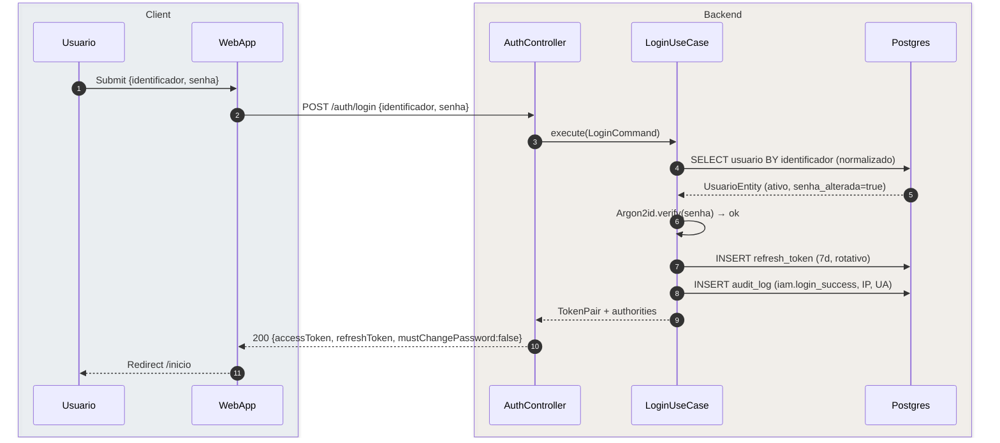
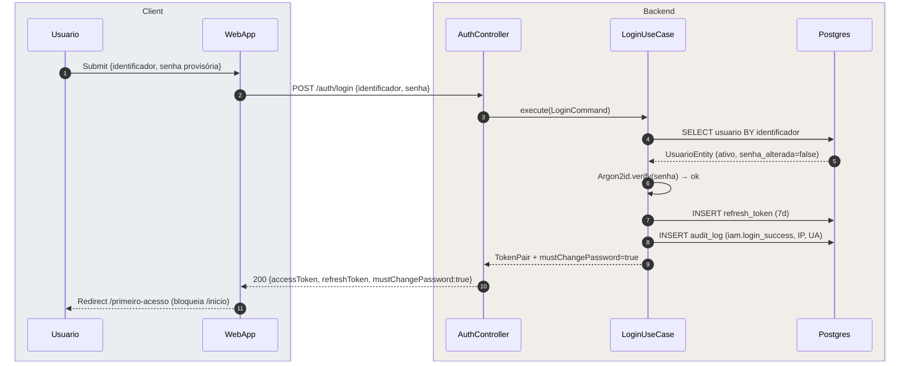
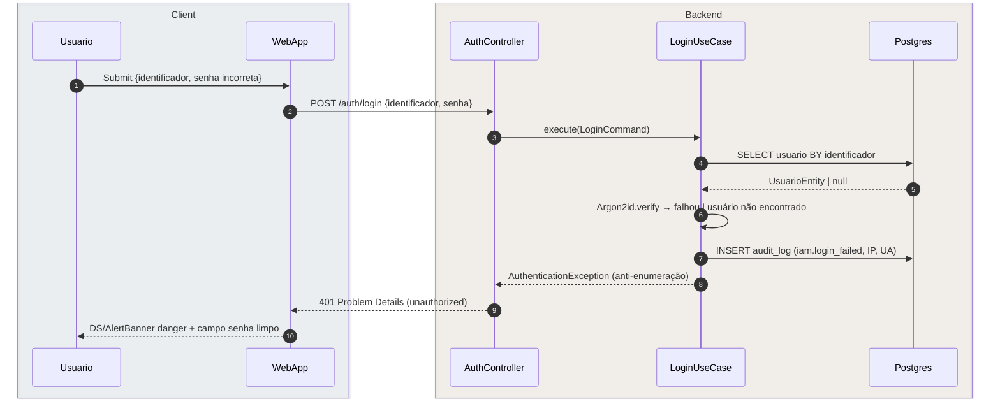
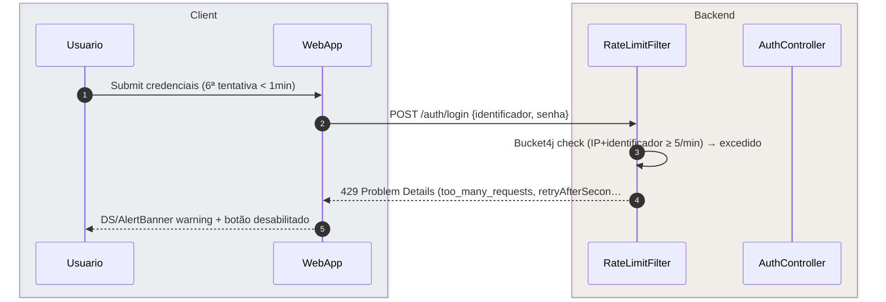
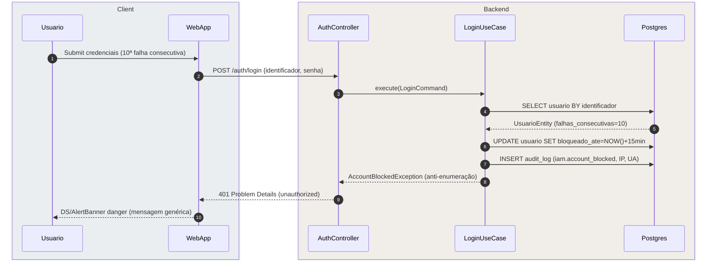
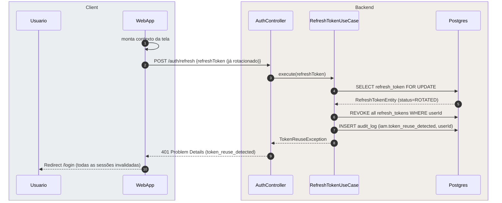

# US-F0-001 — Autenticação de Usuário (Login)

| HU | Tela | Capability | API primária | Fonte |
|----|------|------------|--------------|-------|
| US-F0-001 | F0.1 — `/login` | pública (sem JWT) | `POST /auth/login` | `HUs/F0 — Público/US-F0-001-LOGIN.md` · `fluxos_por_perfil.md` §1 F0.1 |

---

## Matriz de cobertura

| ID diagrama | Origem (CA / RN / sub-fluxo) | Tipo | Status |
|-------------|------------------------------|------|--------|
| F0.1-a | CA-01 · RN-F0.1-01..05 · RN-F0.1-11 · F0.1 fluxo principal | SEQUENCIA | gerado |
| F0.1-b | CA-02 · RN-F0.1-04 | SEQUENCIA | gerado |
| F0.1-c | CA-03 · RN-F0.1-08 · RN-F0.1-11 | ERRO | gerado |
| F0.1-d | CA-04 · RN-F0.1-06 · RN-F0.1-09 | ERRO | gerado |
| F0.1-e | CA-05 · RN-F0.1-07 · RN-F0.1-11 | ERRO | gerado |
| F0.1-f | RN-F0.1-10 · sub-fluxo "Reuso de refresh token" (F0.1) | SEQUENCIA | gerado |
| — | CA-06 (validação de campos vazios) | NAO_APLICAVEL | — |
| — | CA-07 (links de navegação estáticos) | NAO_APLICAVEL | — |
| — | CA-08 (acessibilidade — tab order, aria-live) | NAO_APLICAVEL | — |
| — | CA-09 (responsividade mobile — layout 375px) | NAO_APLICAVEL | — |
| — | RN-F0.1-12 (CSRF Double Submit Cookie — HTTP transport) | NAO_APLICAVEL | — |

---

## Referências DRY

Nenhuma. US-F0-001 não delega fluxo a outra HU.

Relacionado downstream: `/primeiro-acesso` após `mustChangePassword=true` é coberto em **US-F1-002**.

---

## Fora de sequência

| Item | Motivo |
|------|--------|
| CA-06 — Validação de campos vazios | Lógica exclusivamente frontend (React Hook Form + Zod); nenhuma chamada HTTP é feita — não há troca de mensagens para diagramar. |
| CA-07 — Links "Esqueci minha senha", "Contato", "Verificar protocolo" | Navegação React Router client-side; sem interação com backend. |
| CA-08 — Acessibilidade (tab order, aria-live, contraste) | Requisito de implementação de UI (WCAG 2.1 AA); sem fluxo de dados entre camadas. |
| CA-09 — Responsividade mobile (largura 375px, safe area) | Requisito de layout CSS/NativeWind; sem troca de mensagens entre sistemas. |
| RN-F0.1-12 — CSRF Double Submit Cookie | Política de transporte HTTP; o mecanismo é transparente ao fluxo de negócio e já está descrito na análise arquitetural §8. |

---

## F0.1-a — Login happy path

**Escopo:** happy path  
**Atores:** Usuário (qualquer perfil), WebApp, AuthController, LoginUseCase, Postgres  
**Pré-condições:** conta ativa, `senha_alterada = true`, menos de 5 tentativas no último minuto

**Notas:**
- Passo 1: `identificador` aceita e-mail `@ufpr.br`, e-mail pessoal ou GRR numérico — normalizado antes do SELECT (RN-F0.1-01).
- Passo 6: Argon2id substitui o MD5 legado; auto-call representa verificação local no UseCase, sem round-trip à DB (RN-F0.1-02).
- Passo 10: WebApp armazena `accessToken` em memória e `refreshToken` em cookie `httpOnly + SameSite=Lax`; mobile: Keychain/Keystore (RN-F0.1-03).

**Lacunas:** nenhuma.

---

## F0.1-b — Login → primeiro acesso (mustChangePassword)

**Escopo:** happy path — variação com `senha_alterada = false`  
**Atores:** Usuário, WebApp, AuthController, LoginUseCase, Postgres  
**Pré-condições:** conta ativa, `senha_alterada = false` (primeiro acesso ou reset administrativo)

**Notas:**
- Passo 10: WebApp bloqueia toda navegação para rotas protegidas enquanto `mustChangePassword=true` não for resolvido (RN-F0.1-04).
- O token emitido é válido — permite autenticar o formulário em `/primeiro-acesso`; só `/inicio` e demais rotas são bloqueadas.
- Fluxo de `/primeiro-acesso` coberto em **US-F1-002**.

**Lacunas:** nenhuma.

---

## F0.1-c — Login 401 — credenciais inválidas (anti-enumeração)

**Escopo:** erro 401  
**Atores:** Usuário, WebApp, AuthController, LoginUseCase, Postgres  
**Pré-condições:** identificador inexistente **ou** senha incorreta (< 10 falhas consecutivas, < 5 tentativas/min)

**Notas:**
- Passo 6: tanto "senha errada" quanto "usuário não encontrado" resultam na mesma exceção e mesma resposta HTTP — nenhum detalhe distinguível ao cliente (RN-F0.1-08).
- Passo 9: corpo RFC 7807 — `type: .../errors/unauthorized`, `detail: "Credenciais inválidas. Verifique seus dados e tente novamente."`.
- Campo `identificador` mantido preenchido; campo `senha` é limpo pelo WebApp.

**Lacunas:** nenhuma.

---

## F0.1-d — Login 429 — rate limit atingido

**Escopo:** erro 429  
**Atores:** Usuário, WebApp, RateLimitFilter, AuthController  
**Pré-condições:** mesmo IP + identificador realizou ≥ 5 tentativas em < 1 minuto

**Notas:**
- Passo 3: `RateLimitFilter` é um `OncePerRequestFilter` executado antes do `AuthController`; o `LoginUseCase` nunca é invocado (RN-F0.1-06).
- Passo 4: corpo RFC 7807 inclui `retryAfterSeconds` para o frontend exibir countdown (RN-F0.1-09).
- Bucket4j usa `sliding window` por combinação IP + identificador; IPs diferentes para o mesmo identificador têm contadores independentes.

**Lacunas:** nenhuma.

---

## F0.1-e — Login 401 — conta bloqueada

**Escopo:** erro 401 — bloqueio temporário por tentativas excessivas  
**Atores:** Usuário, WebApp, AuthController, LoginUseCase, Postgres  
**Pré-condições:** identificador acumulou 10 falhas consecutivas de autenticação

**Notas:**
- Passo 9: a resposta HTTP é **idêntica** à de credenciais inválidas (CA-03) — sem revelar ao cliente que a conta está bloqueada (RN-F0.1-08).
- Passo 7: `iam.account_blocked` é o evento interno; o campo `bloqueado_ate` é verificado no início do fluxo nas tentativas seguintes (desbloqueio automático após 15 min).
- Este fluxo pressupõe que o rate limit (5/min) **não** bloqueou antes — os 10 erros acumularam em múltiplas janelas de tempo (> 2 min total).

**Lacunas:** nenhuma.

---

## F0.1-f — Refresh token — reuso detectado (revogação de sessões)

**Escopo:** erro 401 — defesa contra roubo de token  
**Atores:** WebApp, AuthController, RefreshTokenUseCase, Postgres  
**Pré-condições:** cliente apresenta um refresh token já rotacionado (expirado por rotação)

**Notas:**
- Passo 3: `SELECT FOR UPDATE` evita race condition em caso de apresentação simultânea do token reutilizado por dois agentes (RN-F0.1-10).
- Passo 5: revogação de **todas** as sessões ativas do usuário — não apenas a sessão corrente — é a defesa contra roubo de cookie (sub-fluxo F0.1).
- O fluxo normal de rotação de refresh token (token válido → emite novo par) é o caminho inverso a este e não requer diagrama separado — o comportamento está implícito no happy path (passo 7 de F0.1-a).

**Lacunas:** nenhuma.
