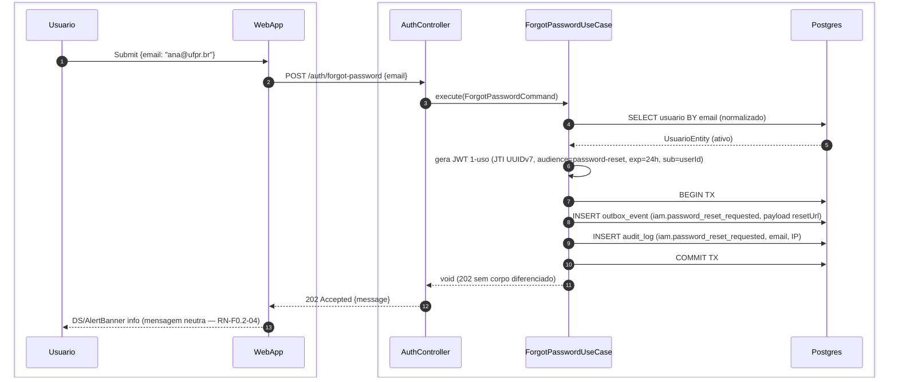
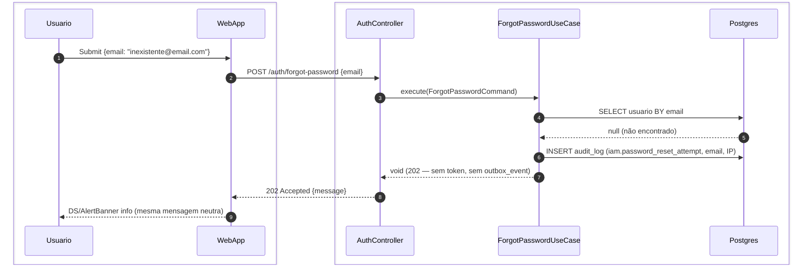
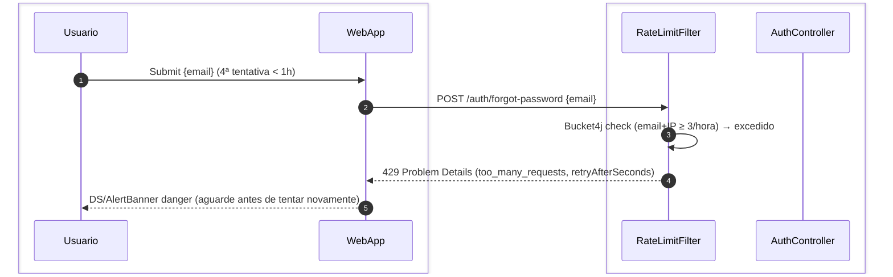

# US-F0-002 — Solicitar Link de Recuperação de Senha

| HU | Tela | Capability | API primária | Fonte |
|----|------|------------|--------------|-------|
| US-F0-002 | F0.2 — `/recuperar-senha` | pública (sem JWT) | `POST /auth/forgot-password` | `HUs/F0 — Público/US-F0-002-RECUPERAR-SENHA.md` · `fluxos_por_perfil.md` §1 F0.2 |

---

## Matriz de cobertura

| ID diagrama | Origem (CA / RN / sub-fluxo) | Tipo | Status |
|-------------|------------------------------|------|--------|
| F0.2-a | CA-01 · RN-F0.2-01..03 · RN-F0.2-07 · F0.2 fluxo principal | SEQUENCIA | gerado |
| F0.2-b | CA-02 · RN-F0.2-01 · RN-F0.2-07 | SEQUENCIA | gerado |
| F0.2-c | RN-F0.2-08 | ERRO | gerado |
| — | RN-F0.2-03 (dispatch outbox assíncrono) | DRY | link → `transversal/10.1-outbox-notificacao.md` |
| — | CA-03 (validação de formato de e-mail) | NAO_APLICAVEL | — |
| — | CA-04 (estado loading do botão) | NAO_APLICAVEL | — |
| — | CA-05 (erro de rede / timeout) | NAO_APLICAVEL | — |
| — | CA-06 (botão Voltar → /login) | NAO_APLICAVEL | — |
| — | RN-F0.2-04 (texto da mensagem neutra) | NAO_APLICAVEL | — |
| — | RN-F0.2-05 (validação frontend RFC 5322) | NAO_APLICAVEL | — |
| — | RN-F0.2-06 (formulário substituído por banner) | NAO_APLICAVEL | — |

---

## Referências DRY

| Item | Referência |
|------|------------|
| Dispatch assíncrono do `outbox_event` (passo 8 de F0.2-a) | [`transversal/10.1-outbox-notificacao.md`](../transversal/10.1-outbox-notificacao.md) — template `PASSWORD_RESET` enviado pelo `OutboxDispatcher` via `MailAdapter` |
| Fluxo de uso do token recebido por e-mail | **US-F0-003** — Definir nova senha via token |

---

## Fora de sequência

| Item | Motivo |
|------|--------|
| CA-03 — Validação de formato de e-mail | Lógica exclusivamente frontend (Zod/regex RFC 5322); nenhuma chamada HTTP é disparada. |
| CA-04 — Estado loading do botão | Comportamento de UI durante fetch (React Hook Form `isSubmitting`); sem troca de mensagens entre camadas. |
| CA-05 — Erro de rede / timeout | O backend não participa — a requisição não chega ou não retorna. Tratamento de erro é client-side (`onError` do TanStack Mutation); não há fluxo de sequência entre sistemas. |
| CA-06 — Botão Voltar para /login | Navegação React Router client-side; sem interação backend. |
| RN-F0.2-04 — Texto neutro da mensagem | Requisito de UX copywriting; não gera fluxo entre camadas. |
| RN-F0.2-05 — Validação frontend | Idêntico ao CA-03 — frontend-only. |
| RN-F0.2-06 — Formulário substituído por banner | Estado de UI controlado pelo componente após 202; sem round-trip. |

---

## F0.2-a — Solicitar reset (e-mail cadastrado) — happy path

**Escopo:** happy path — e-mail existe na base de dados  
**Atores:** Usuário, WebApp, AuthController, ForgotPasswordUseCase, Postgres  
**Pré-condições:** e-mail com formato válido (validado no frontend), conta ativa, < 3 tentativas na última hora

**Notas:**
- Passo 6: o JWT é gerado em memória (não persiste na DB antes do uso); a blacklist de JTI é populada apenas no consumo do token — coberto em **US-F0-003** (RN-F0.2-02).
- Passos 7–10: TX atômica garante que o outbox_event só existe se o audit_log foi escrito (e vice-versa); nenhum e-mail é enviado sincronamente (RN-F0.2-03).
- Dispatch assíncrono do `outbox_event` (template `PASSWORD_RESET` via `MailAdapter`): **DRY** → [`transversal/10.1-outbox-notificacao.md`](../transversal/10.1-outbox-notificacao.md).
- Passo 13: a resposta visual é **idêntica** à do CA-02 — nem o frontend nem o usuário conseguem distinguir se o e-mail existia (RN-F0.2-01).

**Lacunas:** nenhuma.

---

## F0.2-b — Solicitar reset (e-mail não cadastrado) — anti-enumeração

**Escopo:** sequência — e-mail informado não existe na base de dados  
**Atores:** Usuário, WebApp, AuthController, ForgotPasswordUseCase, Postgres  
**Pré-condições:** e-mail com formato válido, não cadastrado no sistema

**Notas:**
- Passo 7: nenhum JWT é gerado e nenhum `outbox_event` é inserido — zero e-mails serão disparados (CA-02).
- O audit_log registra a tentativa mesmo com e-mail inexistente, com campo `email` ofuscado em logs (RN-F0.2-07).
- A resposta HTTP `202` e o texto do banner são **bit-a-bit idênticos** ao F0.2-a — defesa anti-enumeração de contas (RN-F0.2-01).

**Lacunas:** nenhuma.

---

## F0.2-c — Solicitar reset — 429 rate limit

**Escopo:** erro 429 — proteção contra spam de e-mails de recuperação  
**Atores:** Usuário, WebApp, RateLimitFilter  
**Pré-condições:** mesmo e-mail + IP realizou ≥ 3 solicitações na última hora

**Notas:**
- Passo 3: `RateLimitFilter` executa antes do `AuthController`; o `ForgotPasswordUseCase` nunca é invocado (RN-F0.2-08).
- Janela de 1 hora é mais restritiva que o login (1 min) — objetivo é mitigar spam de e-mails, não ataques de força bruta de credencial.
- Resposta RFC 7807 inclui `retryAfterSeconds` para o frontend calcular quando liberar o botão novamente.

**Lacunas:** nenhuma.
