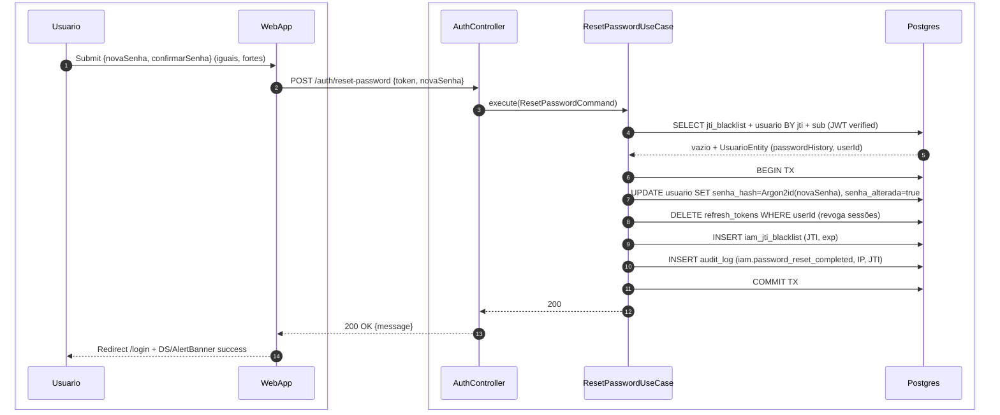
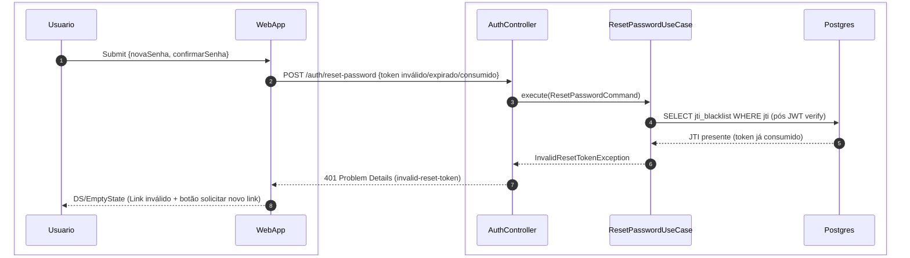
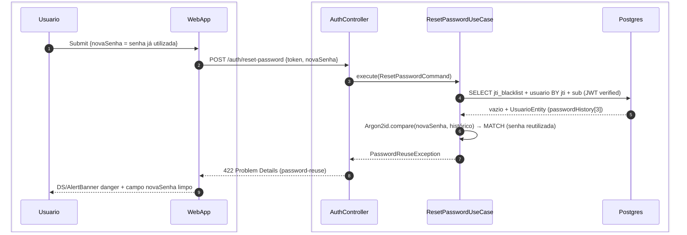

# US-F0-003 — Definir Nova Senha via Token

| HU | Tela | Capability | API primária | Fonte |
|----|------|------------|--------------|-------|
| US-F0-003 | F0.3 — `/nova-senha?token=` | pública (sem JWT de sessão) | `POST /auth/reset-password` | `HUs/F0 — Público/US-F0-003-NOVA-SENHA.md` · `fluxos_por_perfil.md` §1 F0.2 (passos 4–6) |

---

## Matriz de cobertura

| ID diagrama | Origem (CA / RN) | Tipo | Status |
|-------------|------------------|------|--------|
| F0.3-a | CA-05 · RN-F0.3-01..03 · RN-F0.3-08..11 | SEQUENCIA | gerado |
| F0.3-b | CA-06 · CA-07 · RN-F0.3-01 · RN-F0.3-02 | ERRO | gerado |
| F0.3-c | CA-04 · RN-F0.3-06 | ERRO | gerado |
| — | CA-01 (renderizar formulário — JWT decode client-side, sem chamada backend) | NAO_APLICAVEL | — |
| — | CA-02 (medidor de força em tempo real — UI local) | NAO_APLICAVEL | — |
| — | CA-03 (confirmação de senha — validação frontend antes do POST) | NAO_APLICAVEL | — |
| — | RN-F0.3-07 (igualdade de campos — frontend) | NAO_APLICAVEL | — |

---

## Referências DRY

| Item | Referência |
|------|------------|
| Upstream — geração do JWT 1-uso | **US-F0-002** (F0.2-a) — `ForgotPasswordUseCase` gera o token e enfileira o e-mail |

---

## Fora de sequência

| Item | Motivo |
|------|--------|
| CA-01 — Renderizar formulário no mount | O frontend decodifica o JWT (sem verificar assinatura) para checar `exp` e `audience` client-side; nenhuma chamada HTTP é feita neste passo. A validação completa ocorre no `POST /auth/reset-password`. |
| CA-02 — Medidor de força (DS/Progress) | Atualização de UI em tempo real via Zod/regex no browser; sem round-trip à API. |
| CA-03 — Confirmação de senha (`confirmarSenha !== novaSenha`) | Validação React Hook Form antes do submit; nenhuma chamada HTTP é disparada. |
| RN-F0.3-07 — Igualdade dos campos | Idêntico a CA-03 — frontend-only. |

> **Lacuna de especificação (CA-06):** A HU descreve que o formulário "NÃO é exibido" para token inválido, o que implica validação no mount via backend. O contrato de API (§5 da HU) documenta apenas `POST /auth/reset-password`. Se for necessário rejeitar antes do preenchimento, adicionar `GET /auth/validate-reset-token` ao OpenAPI antes da implementação. O diagrama F0.3-b modela a validação acontecendo no submit (POST), com WebApp substituindo o formulário por `DS/EmptyState` ao receber 401.

---

## F0.3-a — Redefinição bem-sucedida (happy path)

**Escopo:** happy path — token válido, senha nova forte, sem reuso  
**Atores:** Usuário, WebApp, AuthController, ResetPasswordUseCase, Postgres  
**Pré-condições:** token JWT não expirado, JTI não consumido, nova senha ≥ 12 chars com complexidade, diferente das últimas 3

**Notas:**
- Passo 4: JWT verification (assinatura HMAC/RSA, `audience="password-reset"`, `exp`) ocorre em memória no UseCase antes de qualquer acesso à DB; o SELECT combina a leitura do blacklist e do usuário (RN-F0.3-01).
- Passo 4 (check histórico): após receber `passwordHistory`, UC verifica internamente se `Argon2id.verify(novaSenha, histHash)` retorna falso para cada uma das 3 últimas — computação em memória, sem round-trip adicional (RN-F0.3-06).
- Passo 7: `Argon2id.hash(novaSenha)` é calculado **antes** do BEGIN TX (CPU-bound); o hash resultante é inserido no UPDATE (RN-F0.3-02).
- Passos 7–11: transação atômica — se qualquer INSERT falhar, o hash não é persistido e o JTI não é colocado em blacklist (idempotência garantida pela unicidade do JTI).
- Passo 8: invalidação de todas as sessões ativas (refresh tokens) — o usuário precisa fazer novo login em todos os dispositivos (RN-F0.3-08).
- Passo 9: JTI inserido em `iam_jti_blacklist` torna re-uso impossível (RN-F0.3-03).

**Lacunas:** nenhuma.

---

## F0.3-b — 401 token inválido, expirado ou já consumido

**Escopo:** erro 401 — cobre CA-06 (token inválido/expirado) e CA-07 (JTI já na blacklist)  
**Atores:** Usuário, WebApp, AuthController, ResetPasswordUseCase, Postgres  
**Pré-condições:** token JWT tem assinatura inválida, expirou, ou JTI já foi consumido em reset anterior

**Notas:**
- Passo 4: a `DB-->>UC` retorna JTI presente para CA-07 (token reutilizado). Para CA-06 (assinatura inválida ou `exp` expirado), a JWT verify falha **em memória antes** do SELECT — o fluxo para no passo 3 sem chegar ao DB; o resultado é o mesmo `InvalidResetTokenException` e o mesmo 401 (RN-F0.3-01 / RN-F0.3-02).
- Resposta 401 não distingue se o token "nunca foi válido", "expirou" ou "já foi usado" — anti-enumeração (CA-07: "mensagem NÃO revela se o token foi 'já usado' ou apenas 'inválido'").
- Passo 8: WebApp substitui o formulário pelo `DS/EmptyState` com botão "Solicitar novo link" → `/recuperar-senha` (F0.2).

**Lacunas:** ver nota de lacuna de especificação no cabeçalho — se validação pre-mount for necessária, mapear `GET /auth/validate-reset-token` no OpenAPI.

---

## F0.3-c — 422 senha reutilizada

**Escopo:** erro 422 — nova senha é igual a uma das 3 últimas  
**Atores:** Usuário, WebApp, AuthController, ResetPasswordUseCase, Postgres  
**Pré-condições:** token JWT válido (assinatura, audience, exp ok; JTI não consumido)

**Notas:**
- Passo 6: `Argon2id.compare` itera as últimas 3 entradas de `passwordHistory`; basta um MATCH para lançar `PasswordReuseException` (RN-F0.3-06).
- A validação de histórico é estritamente **backend** — o frontend não tem acesso aos hashes anteriores.
- Passo 9: campo "Nova senha" é limpo pelo WebApp; corpo RFC 7807 inclui `detail: "Esta senha já foi utilizada recentemente."` (RN-F0.3-05 + CA-04).
- O JTI **não** é inserido em blacklist neste fluxo — o token permanece válido para nova tentativa com senha diferente.

**Lacunas:** nenhuma.
