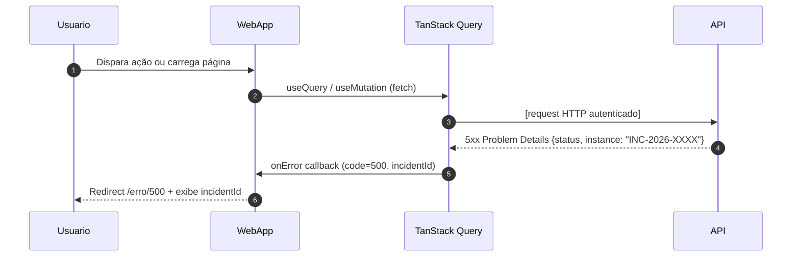
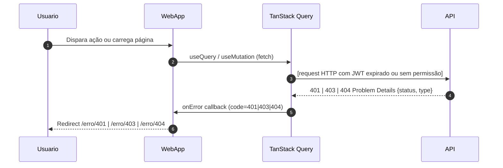

# US-F0-005 — Exibir Página de Erro Amigável

| HU | Tela | Capability | API primária | Fonte |
|----|------|------------|--------------|-------|
| US-F0-005 | F0.5 — `/erro/:codigo` | pública / autenticada | **nenhuma** — renderização baseada em código HTTP capturado pelo interceptor | `HUs/F0 — Público/US-F0-005-ERRO.md` |

---

## Matriz de cobertura

| ID diagrama | Origem (CA / RN) | Tipo | Status |
|-------------|------------------|------|--------|
| F0.5-a | CA-04 · CA-05 · RN-F0.5-09 | SEQUENCIA | gerado |
| F0.5-b | CA-02 · CA-03 (API 4xx) · RN-F0.5-09 (variante 4xx) | SEQUENCIA | gerado |
| — | CA-01 (auth guard sem JWT — sem chamada HTTP) | NAO_APLICAVEL | — |
| — | CA-03 (React Router catch-all rota desconhecida) | NAO_APLICAVEL | — |
| — | CA-06 (sem stack trace / dados técnicos) | NAO_APLICAVEL | — |
| — | CA-07 (acessibilidade — alt text, leitura sequencial) | NAO_APLICAVEL | — |
| — | RN-F0.5-01..04 (mapeamento código → ícone / mensagem / paleta) | NAO_APLICAVEL | — |
| — | RN-F0.5-06..07 (mapeamento botões por código) | NAO_APLICAVEL | — |
| — | RN-F0.5-08 (roteador captura rota desconhecida → /erro/404) | NAO_APLICAVEL | — |

---

## Referências DRY

Nenhuma. Os padrões de interceptor documentados aqui são transversais — cada feature individual documenta apenas a resposta de erro específica (ex.: F0.1-c para 401 login, F0.1-e para bloqueio). Os diagramas F0.5-a/b cobrem o **mecanismo genérico de captura e redirecionamento** compartilhado por todas as features.

---

## Fora de sequência

| Item | Motivo |
|------|--------|
| CA-01 — Auth guard sem JWT | O React Router guard verifica o JWT em memória (sem chamada HTTP) antes de renderizar qualquer rota protegida; se ausente, redireciona client-side para `/erro/401` sem round-trip ao backend. Não há troca de mensagens entre sistemas. |
| CA-03 (router catch-all) | React Router captura rotas inexistentes com `<Route path="*">` e redireciona para `/erro/404` inteiramente no frontend. Sem HTTP. |
| CA-06 — Sem stack trace | Requisito de segurança de configuração (Spring Boot `server.error.include-stacktrace=never`); não é um fluxo entre camadas. |
| CA-07 — Acessibilidade | Alt text e sequência de leitura — requisito de UI sem troca de mensagens. |
| RN-F0.5-01..04 | Mapeamento código → ícone, mensagem e paleta — configuração de componente React (objeto de constantes no frontend). |
| RN-F0.5-06..07 | Lógica de botões contextuais baseada em `isAuthenticated` — estado local do frontend. |
| RN-F0.5-08 | Idêntico ao CA-03 (router) — NAO_APLICAVEL. |

---

## F0.5-a — TanStack Query interceptor: API 5xx → /erro/500 com incidentId

**Escopo:** sequência — interceptor global captura resposta 5xx e extrai `incidentId` do corpo RFC 7807  
**Atores:** Usuário, WebApp, TanStack Query, API (qualquer endpoint)  
**Pré-condições:** usuário autenticado; qualquer chamada `useQuery` ou `useMutation` ativa

**Notas:**
- Passo 4: corpo RFC 7807 — o campo `instance` carrega o `incidentId` no formato `INC-YYYY-XXXX` gerado pelo backend em cada erro 5xx (RN-F0.5-05 / CA-05).
- Passo 5: o interceptor global do TanStack Query (`QueryClient.defaultOptions.queries.onError`) extrai `instance` antes de lançar para o componente; o `incidentId` é passado via `navigate('/erro/500', { state: { incidentId } })` (RN-F0.5-09).
- O `incidentId` é exibido na tela `/erro/500` como texto copiável — permite acionar o suporte sem expor stack trace (CA-06).
- Este diagrama é **transversal** — aplica-se a todos os módulos (solicitações, formativas, presença, etc.) quando o backend retorna 5xx.

**Lacunas:** nenhuma.

---

## F0.5-b — TanStack Query interceptor: API 4xx → /erro/:codigo

**Escopo:** sequência — interceptor global captura respostas 401 (sessão expirada), 403 e 404 vindas da API  
**Atores:** Usuário, WebApp, TanStack Query, API (qualquer endpoint)  
**Pré-condições:** usuário autenticado com JWT presente; o token pode estar expirado (401) ou o recurso pode ser inacessível (403/404)

**Notas:**
- Passo 4 — **401 (sessão expirada):** JWT expirou durante a sessão; o backend rejeita o request. Diferente do CA-01 (sem JWT), onde o guard frontend bloqueia antes de fazer qualquer request (NAO_APLICAVEL acima). Ver F0.1-f (refresh token) — o interceptor tenta refresh antes de redirecionar para /erro/401 (fluxo de renovação implícito).
- Passo 4 — **403:** usuário autenticado sem capability para o recurso (FGAC); o backend retorna 403 com `type: .../access_denied`. O interceptor captura e redireciona para `/erro/403` (CA-02 / RN-F0.5-07).
- Passo 4 — **404:** recurso não encontrado via chamada de API (ex.: `/requests/:id` com ID inexistente). Diferente do CA-03 router (NAO_APLICAVEL), que captura rotas inexistentes no frontend (CA-03 / RN-F0.5-07).
- Os botões de ação da tela `/erro/:codigo` (RN-F0.5-06..07) são determinados pelo código HTTP recebido — lógica de componente React sem round-trip.

**Lacunas:** o fluxo de tentativa de refresh antes do redirect 401 está implícito (ver F0.1-f); se esse comportamento for formalizado em US-F1-002 ou em um hook dedicado (`useAuthRefresh`), este diagrama deve ser expandido ou referenciado.
