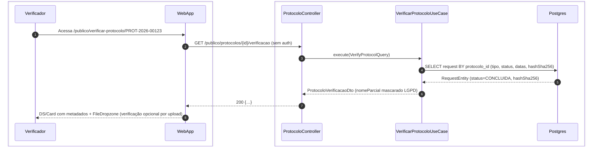
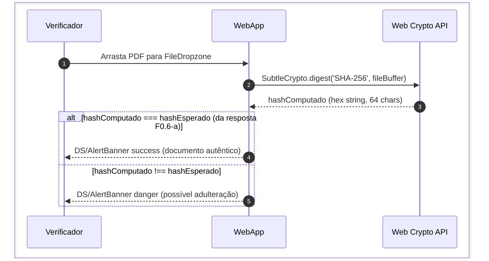
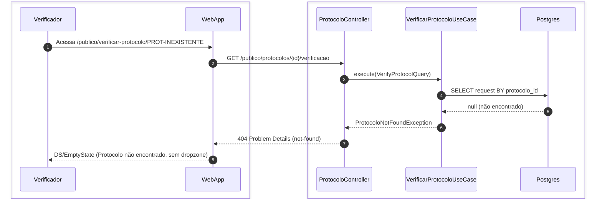
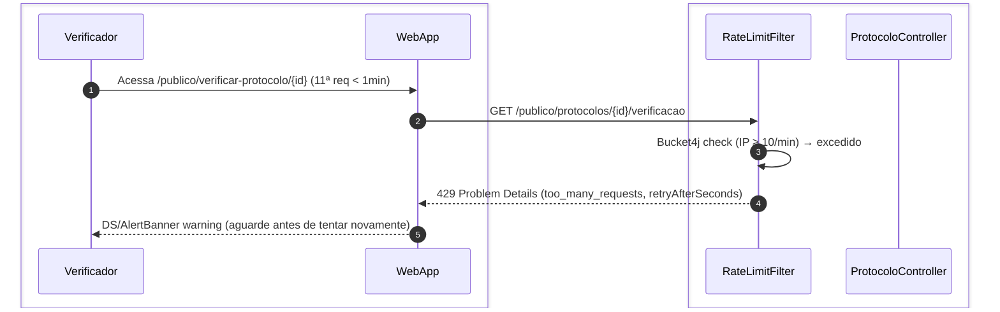

# US-F0-006 — Verificar Autenticidade de Protocolo PDF

| HU | Tela | Capability | API primária | Fonte |
|----|------|------------|--------------|-------|
| US-F0-006 | F0.6 — `/publico/verificar-protocolo/:id` | pública (sem JWT) | `GET /publico/protocolos/{id}/verificacao` | `HUs/F0 — Público/US-F0-006-VERIFICAR-PROTOCOLO.md` · `fluxos_por_perfil.md` §1 F0.3 |

---

## Matriz de cobertura

| ID diagrama | Origem (CA / RN) | Tipo | Status |
|-------------|------------------|------|--------|
| F0.6-a | CA-01 · RN-F0.6-01 · RN-F0.6-02 · RN-F0.6-09 | SEQUENCIA | gerado |
| F0.6-b | CA-02 · CA-03 · RN-F0.6-04 · RN-F0.6-05 · RN-F0.6-06 | SEQUENCIA | gerado |
| F0.6-c | CA-04 | ERRO | gerado |
| F0.6-d | CA-06 · RN-F0.6-07 | ERRO | gerado |
| — | CA-05 (loading skeleton — TanStack Query `isLoading`) | NAO_APLICAVEL | — |
| — | CA-07 (acessibilidade dropzone — aria-live, tab order) | NAO_APLICAVEL | — |
| — | RN-F0.6-03 (hash truncado visualmente — UI display) | NAO_APLICAVEL | — |
| — | RN-F0.6-08 (Grafana alert por bruteforce — ops/monitoring) | NAO_APLICAVEL | — |

---

## Referências DRY

| Item | Referência |
|------|------------|
| Padrão de verificação por hash + assinatura ED25519 (certificados) | **US-F0-007** (VERIFICAR-CERTIFICADO) — mesma tela base, adiciona `/.well-known/jwks.json` |

---

## Fora de sequência

| Item | Motivo |
|------|--------|
| CA-05 — Loading skeleton | Estado de UI controlado pelo TanStack Query (`isLoading=true`); sem mensagem entre sistemas. |
| CA-07 — Acessibilidade | `aria-live="assertive"` e botão alternativo na dropzone — requisito de componente React, sem chamada HTTP. |
| RN-F0.6-03 — Hash truncado | Apresentação visual (CSS `text-overflow`) de um valor já recebido no CA-01; não gera fluxo adicional. |
| RN-F0.6-08 — Alerta Grafana | Métrica Prometheus com threshold configurável — responsabilidade de DevOps/SRE, sem impacto no fluxo de usuário. |

---

## F0.6-a — Verificar protocolo (protocolo encontrado)

**Escopo:** happy path — GET retorna metadados sanitizados  
**Atores:** Verificador, WebApp, ProtocoloController, VerificarProtocoloUseCase, Postgres  
**Pré-condições:** endpoint público, sem JWT; ID de protocolo válido e existente; < 10 req/min do IP

**Notas:**
- Passo 2: endpoint totalmente público — nenhum filtro JWT é aplicado; `RateLimitFilter` verifica apenas IP (RN-F0.6-01).
- Passo 6: `solicitanteNomeParcial` é mascarado no UseCase (ex.: `"A** S****"`) antes de sair da camada de aplicação — nunca expõe nome completo ou GRR (RN-F0.6-02 / LGPD).
- Passo 6: o campo `hashSha256` (64 chars) é retornado completo na resposta JSON; o truncamento visual (RN-F0.6-03) ocorre no componente React.
- O endpoint não expõe a qual usuário pertence o protocolo — confirma apenas existência e metadados do documento (RN-F0.6-09).

**Lacunas:** nenhuma.

---

## F0.6-b — Verificação de integridade por upload (SHA-256 local)

**Escopo:** sequência client-side — hash calculado no browser sem envio ao servidor  
**Atores:** Verificador, WebApp (FileDropzone + Web Crypto API)  
**Pré-condições:** CA-01 já executado; `hashSha256` esperado em memória no componente React

**Notas:**
- Passo 2: `fileBuffer` é lido via `FileReader.readAsArrayBuffer(file)` no browser; o arquivo **nunca sai do dispositivo do verificador** (RN-F0.6-04 / RN-F0.6-06).
- Passo 3: `SubtleCrypto.digest` é assíncrono (Promise); o componente exibe `DS/Skeleton` transitório durante o cálculo (CA-05, NAO_APLICAVEL como sequência separada).
- `alt` branch `else`: o banner `danger` instrui o verificador a não confiar no documento e a contatar a secretaria (CA-03).
- Zero mensagens HTTP neste diagrama — a privacidade é preservada estruturalmente: o servidor só fornece o hash esperado (F0.6-a), nunca processa o PDF enviado (RN-F0.6-05 / RN-F0.6-06).

**Lacunas:** nenhuma.

---

## F0.6-c — Protocolo não encontrado (404)

**Escopo:** erro 404 — ID informado não corresponde a nenhum protocolo registrado  
**Atores:** Verificador, WebApp, ProtocoloController, VerificarProtocoloUseCase, Postgres  
**Pré-condições:** endpoint público, < 10 req/min; ID não existe na base

**Notas:**
- Passo 7: resposta RFC 7807 — `type: .../errors/not-found`, `detail: "Nenhum protocolo registrado com este identificador."`.
- Zona de upload (FileDropzone) **não é renderizada** para 404 — não há hash esperado com o qual comparar (CA-04).

**Lacunas:** nenhuma.

---

## F0.6-d — Rate limit atingido (429)

**Escopo:** erro 429 — proteção contra enumeração de IDs de protocolo  
**Atores:** Verificador, WebApp, RateLimitFilter  
**Pré-condições:** mesmo IP realizou ≥ 10 requisições ao endpoint em < 1 minuto

**Notas:**
- Passo 3: `RateLimitFilter` rejeita antes do `ProtocoloController`; o `VerificarProtocoloUseCase` nunca é invocado (RN-F0.6-07).
- Tentativas que excedam o threshold configurável (ex.: 100 req/5min) geram métrica no Prometheus → alerta no Grafana para suspeita de bruteforce (RN-F0.6-08 — configuração de ops, fora do fluxo de usuário).

**Lacunas:** nenhuma.
