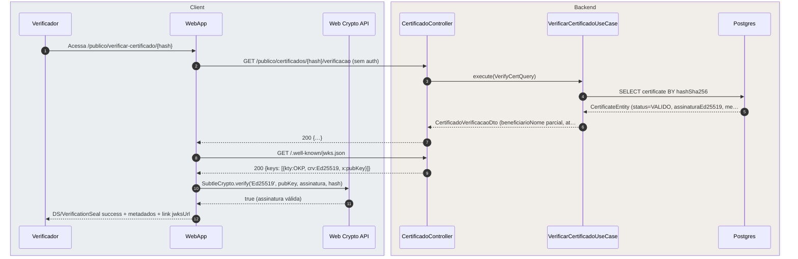
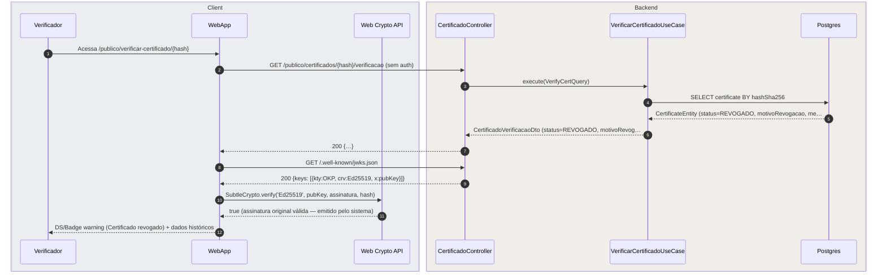
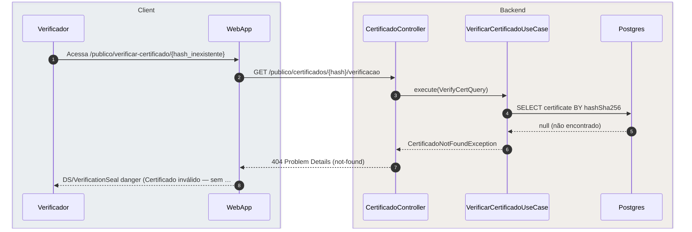
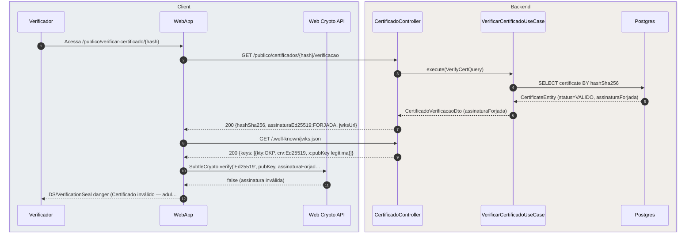

# US-F0-007 — Verificar Autenticidade de Certificado Digital

| HU | Tela | Capability | API primária | Fonte |
|----|------|------------|--------------|-------|
| US-F0-007 | F0.7 — `/publico/verificar-certificado/:hash` | pública (sem JWT) | `GET /publico/certificados/{hash}/verificacao` · `GET /.well-known/jwks.json` | `HUs/F0 — Público/US-F0-007-VERIFICAR-CERTIFICADO.md` · `fluxos_por_perfil.md` §1 F0.3 · `analise_arquitetural` §11 |

---

## Matriz de cobertura

| ID diagrama | Origem (CA / RN) | Tipo | Status |
|-------------|------------------|------|--------|
| F0.7-a | CA-01 · RN-F0.7-01..07 · RN-F0.7-08..09 · RN-F0.7-11 | SEQUENCIA | gerado |
| F0.7-b | CA-03 · RN-F0.7-07 (status=REVOGADO) | SEQUENCIA | gerado |
| F0.7-c | CA-02 (hash não encontrado) | ERRO | gerado |
| F0.7-d | CA-02 (assinatura ED25519 inválida — client-side) | ERRO | gerado |
| — | CA-04 (SHA-256 upload opcional) | DRY | link → [`F0/US-F0-006-VERIFICAR-PROTOCOLO.md` — F0.6-b](US-F0-006-VERIFICAR-PROTOCOLO.md#f06-b) |
| — | CA-07 · RN-F0.7-10 (rate limit 429) | DRY | link → [`F0/US-F0-006-VERIFICAR-PROTOCOLO.md` — F0.6-d](US-F0-006-VERIFICAR-PROTOCOLO.md#f06-d) |
| — | CA-05 (link "Ver chave pública" abre nova aba) | NAO_APLICAVEL | — |
| — | CA-06 (loading skeleton) | NAO_APLICAVEL | — |
| — | CA-08 (acessibilidade — aria-live, tab order) | NAO_APLICAVEL | — |

---

## Referências DRY

| Item | Referência |
|------|------------|
| **Emissão** do certificado (render PDF + SHA-256 + ED25519.sign + MinIO + TX) | [`transversal/10.4-certificado-emissao.md`](../transversal/10.4-certificado-emissao.md) — diagrama 10.4a |
| SHA-256 local por upload (CA-04) — **mesmo padrão** de F0.6 | [`F0/US-F0-006-VERIFICAR-PROTOCOLO.md`](US-F0-006-VERIFICAR-PROTOCOLO.md) — diagrama F0.6-b |
| Rate limit 10 req/min por IP (CA-07) — **mesmo padrão** de F0.6 | [`F0/US-F0-006-VERIFICAR-PROTOCOLO.md`](US-F0-006-VERIFICAR-PROTOCOLO.md) — diagrama F0.6-d |

---

## Fora de sequência

| Item | Motivo |
|------|--------|
| CA-04 — Upload SHA-256 opcional | Padrão idêntico ao F0.6-b (`SubtleCrypto.digest` → `alt` confere/não confere); duplicar o Mermaid apenas mudaria o nome da tela. Ver link DRY acima. |
| CA-05 — Link "Ver chave pública" | Abre `/.well-known/jwks.json` em nova aba (`window.open`); zero chamada HTTP adicional ao backend a partir desta ação do usuário. |
| CA-06 — Loading skeleton | Estado de UI (TanStack `isLoading=true`); sem mensagens entre sistemas. |
| CA-07 — Rate limit | Idêntico ao F0.6-d (Bucket4j 10/min, mesmo `RateLimitFilter`); ver DRY acima. |
| CA-08 — Acessibilidade | `aria-live="assertive"` para status do certificado; requisito de componente React, sem troca de mensagens. |

---

## F0.7-a — Certificado válido (happy path: GET + JWKS + ED25519.verify)

**Escopo:** happy path — hash encontrado, assinatura ED25519 válida, status=VALIDO  
**Atores:** Verificador, WebApp, Web Crypto API, CertificadoController, VerificarCertificadoUseCase, Postgres  
**Pré-condições:** endpoint público, sem JWT; hash SHA-256 válido e existente na base; < 10 req/min do IP

**Notas:**
- Passo 2: endpoint público, sem JWT; `RateLimitFilter` aplica Bucket4j 10 req/min por IP (RN-F0.7-10) — o filtro fica antes do `CertificadoController`.
- Passo 6: `beneficiarioNome` pode ser completo ou mascarado conforme configuração do tipo de certificado (RN-F0.7-08). GRR e e-mail nunca são retornados (RN-F0.7-11).
- Passo 8: WebApp extrai `jwksUrl` do payload do passo 7 e faz um GET separado; a chave pública pode ser cacheada pelo browser via `Cache-Control` (RN-F0.7-06).
- Passos 10–11: `SubtleCrypto.verify` executa inteiramente no browser — zero bytes do PDF ou da assinatura voltam ao servidor (RN-F0.7-05).
- O certificado foi gerado pela emissão documentada em [`transversal/10.4-certificado-emissao.md`](../transversal/10.4-certificado-emissao.md) (10.4a).

**Lacunas:** nenhuma.

---

## F0.7-b — Certificado revogado (status=REVOGADO)

**Escopo:** sequência — hash encontrado, assinatura original válida, mas status=REVOGADO  
**Atores:** Verificador, WebApp, Web Crypto API, CertificadoController, VerificarCertificadoUseCase, Postgres  
**Pré-condições:** certificado foi emitido e posteriormente revogado pelo sistema (ex.: atividade cancelada)

**Notas:**
- Passo 5: `status=REVOGADO` é definido no backend quando a atividade/evento é cancelado administrativamente após a emissão do certificado (RN-F0.7-07).
- Passos 8–11: a assinatura ED25519 **ainda é verificada** mesmo para REVOGADO — confirma que o certificado foi genuinamente emitido pelo sistema antes da revogação (não é um documento forjado).
- Passo 12: diferente do INVÁLIDO (F0.7-d), o REVOGADO exibe dados históricos básicos para identificação — quem foi o beneficiário, qual atividade, data de emissão (CA-03).

**Lacunas:** nenhuma.

---

## F0.7-c — 404 hash não encontrado

**Escopo:** erro 404 — hash SHA-256 não corresponde a nenhum certificado registrado  
**Atores:** Verificador, WebApp, CertificadoController, VerificarCertificadoUseCase, Postgres  
**Pré-condições:** hash inexistente na base de dados (certificado nunca emitido ou hash adulterado)

**Notas:**
- Passo 8: nenhum dado do beneficiário é exibido — não há certificado para identificar; apenas o selo de inválido e a mensagem genérica de CA-02 (RN-F0.7-09).
- Nenhuma chamada ao `/.well-known/jwks.json` é feita — sem payload de assinatura para verificar.

**Lacunas:** nenhuma.

---

## F0.7-d — Assinatura ED25519 inválida (tampering client-side)

**Escopo:** erro — hash encontrado no backend (200), mas `SubtleCrypto.verify` retorna `false`  
**Atores:** Verificador, WebApp, Web Crypto API, CertificadoController, VerificarCertificadoUseCase, Postgres  
**Pré-condições:** hash existe na base; assinatura no payload é forjada ou o response foi interceptado (MITM)

**Notas:**
- Este diagrama é o argumento de segurança central: o backend pode retornar `200`, mas a **chave pública em `/.well-known/jwks.json`** é a fonte da verdade independente — qualquer assinatura não gerada pela chave privada do servidor falha no `SubtleCrypto.verify` (RN-F0.7-05 / RN-F0.7-06).
- Cenários reais que levam ao `false`: (1) DB comprometido com assinatura substituída; (2) MITM no response da API modificando `assinaturaEd25519`; (3) PDF forjado cujo hash coincide por colisão (SHA-256 — improvável) mas assinatura é inválida.
- Passo 12: nenhum dado do beneficiário é exibido (CA-02: "NÃO exibe dados do beneficiário").
- A separação entre F0.7-c (404 — hash não encontrado) e F0.7-d (200 + verify fail) documenta explicitamente que a validação tem **duas camadas independentes**: disponibilidade no DB e integridade criptográfica.

**Lacunas:** nenhuma.
