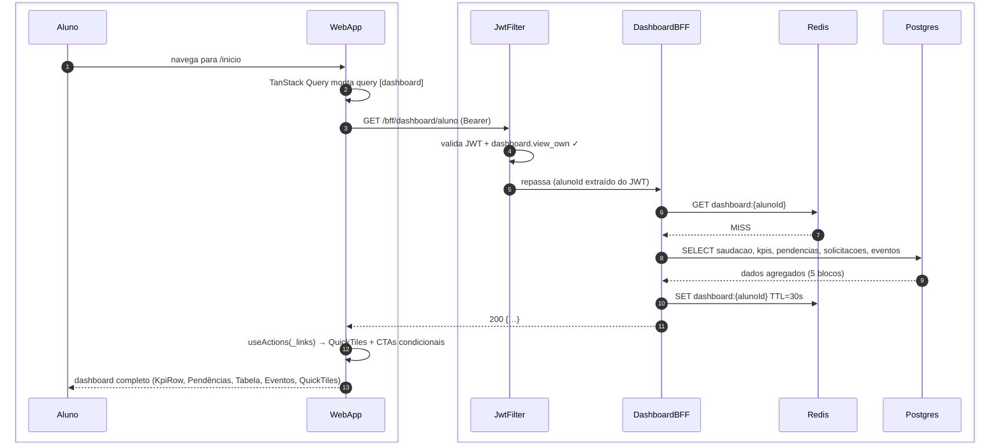
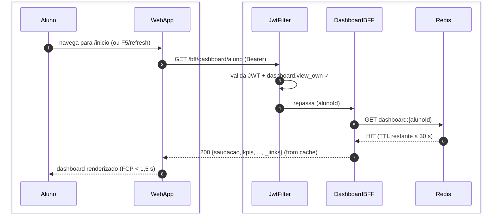
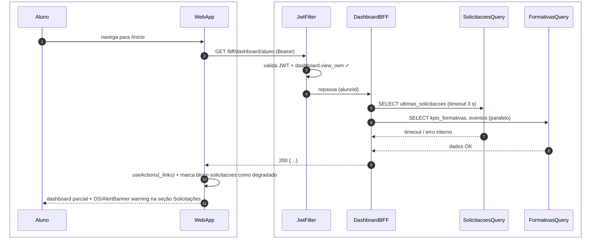
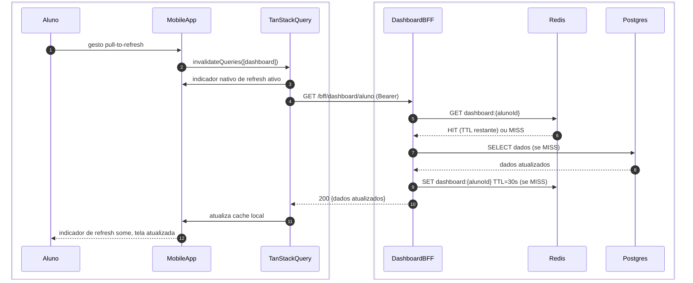

# US-F1-001 — Dashboard do Aluno (Visão Unificada)

| HU | Tela | Capability | API primária | Fonte |
|----|------|------------|--------------|-------|
| US-F1-001 | F1.1 — `/inicio` | `dashboard.view_own` | `GET /bff/dashboard/aluno` | `HUs/F1 — Aluno/US-F1-001-DASHBOARD.md` · `fluxos_por_perfil.md` §2 F1 |

---

## Matriz de cobertura

| ID diagrama | Origem (CA / RN / sub-fluxo) | Tipo | Status |
|-------------|------------------------------|------|--------|
| F1.1-D01 | CA-01 · RN-F1.1-01 · RN-F1.1-10 (cache MISS) — carregamento inicial | SEQUENCIA | gerado |
| F1.1-D02 | RN-F1.1-10 (cache HIT) — retorno em < 1,5 s | SEQUENCIA | gerado |
| F1.1-D03 | CA-05 · RN-F1.1-01 — degradação graciosa (módulo indisponível) | SEQUENCIA | gerado |
| F1.1-D04 | CA-07 · RN-F1.1-11 — pull-to-refresh mobile | SEQUENCIA | gerado |
| — | CA-02 (KpiCard horas formativas) | DRY | → F1.1-D01 (resposta BFF inclui `kpis.horasFormativas`) |
| — | CA-03 (pendências com CTA HATEOAS) | DRY | → F1.1-D01 (resposta BFF inclui `pendencias[].\_links`) |
| — | RN-F1.1-02 (cálculo `horas_validadas / horas_requeridas`) | DRY | → F1.1-D01 (calculado no BFF antes de retornar) |
| — | RN-F1.1-03 (máx. 3 pendências, `_links` CTA) | DRY | → F1.1-D01 |
| — | RN-F1.1-05 (3 próximos eventos, badge "Janela aberta") | DRY | → F1.1-D01 |
| — | RN-F1.1-06 (último parecer) | DRY | → F1.1-D01 |
| — | RN-F1.1-07 (`_links.novaSolicitacao`) | DRY | → F1.1-D01 |
| — | RN-F1.1-08 (`_links.hub` unreadCount) | DRY | → F1.1-D01 |
| — | RN-F1.1-09 (QuickTiles de `_links`) | DRY | → F1.1-D01 |
| — | CA-04 (SLA breach — célula em `status/danger`) | NAO_APLICAVEL | — |
| — | CA-06 (estado vazio — DS/EmptyState por seção) | NAO_APLICAVEL | — |
| — | CA-08 (responsividade — 375/768/1280px) | NAO_APLICAVEL | — |
| — | RN-F1.1-04 (badge SLA vermelho) | NAO_APLICAVEL | — |

---

## Referências DRY

| Padrão | Arquivo canônico |
|--------|-----------------|
| JWT validation + `dashboard.view_own` FGAC | `F0/US-F0-001-LOGIN.md` F0.1-a (JwtFilter) |
| Outbox dispatcher (notificação de certificado/formativa) | `transversal/10.1-outbox-notificacao.md` |
| Emissão de certificado (trigger background) | `transversal/10.4-certificado-emissao.md` |

---

## Fora de sequência

| Item | Motivo |
|------|--------|
| CA-04 — SLA breach (célula vermelha) | Lógica exclusivamente frontend: `prazo_em < Date.now()` comparado no cliente após receber a resposta; nenhuma chamada HTTP adicional. |
| CA-06 — Estado vazio (DS/EmptyState) | Mesmo fluxo de CA-01; diferença é só o conteúdo do JSON retornado (arrays vazios). Sem variação de participantes ou mensagens. |
| CA-08 — Responsividade (375/768/1280px) | Requisito de layout CSS/NativeWind; sem troca de mensagens entre camadas. |
| RN-F1.1-04 — Badge SLA | Computação client-side derivada de `prazo_em` já presente na resposta do BFF. |

---

## F1.1-D01 — Carregamento inicial do dashboard (happy path — cache MISS)

**Escopo:** happy path — primeiro acesso ou cache Redis expirado  
**Atores:** Aluno, WebApp, JwtFilter, DashboardBFF, Redis, Postgres  
**Pré-condições:** aluno autenticado (`mustChangePassword = false`), access token válido com `dashboard.view_own`

**Notas:**
- Passo 8: o BFF executa as 5 queries de forma paralela (`async/await Promise.all` ou coroutines); falha isolada em um bloco ativa degradação graciosa (ver F1.1-D03).
- Passo 11: `useActions(_links)` filtra botões disponíveis; botão "Nova solicitação" só aparece se `_links.novaSolicitacao` estiver presente — aluno sem `solicitacao.create` não recebe o link.
- Passo 12: skeleton (`DS/Skeleton`) exibido entre os passos 2–11; substituído bloco a bloco conforme dados chegam.

**Lacunas:** nenhuma.

---

## F1.1-D02 — Carregamento do dashboard (cache HIT — FCP < 1,5 s)

**Escopo:** retorno em cache Redis dentro da janela de 30 s (RN-F1.1-10)  
**Atores:** Aluno, WebApp, JwtFilter, DashboardBFF, Redis  
**Pré-condições:** cache Redis populado há menos de 30 s para o `alunoId`

**Notas:**
- O cache Redis não é invalidado por pull-to-refresh do mobile (ver F1.1-D04); o TanStack Query do cliente invalida somente seu cache local. Dados servidos pelo BFF permanecem frescos até o TTL expirar.
- Dados cobertos pelo cache: `kpis`, `pendencias`, `ultimasSolicitacoes`, `proximosEventos`. O cache **não** cobre dados tempo-real como `janelaAberta` de eventos — esses são buscados diretamente quando o aluno abre a tela do evento.

**Lacunas:** nenhuma.

---

## F1.1-D03 — Degradação graciosa (módulo de solicitações indisponível)

**Escopo:** erro parcial de módulo — CA-05, RN-F1.1-01  
**Atores:** Aluno, WebApp, JwtFilter, DashboardBFF, SolicitacoesQuery, FormativasQuery  
**Pré-condições:** módulo de solicitações lança timeout ou 503; demais módulos respondem normalmente

**Notas:**
- Passo 9: o BFF retorna `HTTP 200` mesmo com módulo parcialmente degradado; o frontend interpreta `solicitacoes: null` como sinal para exibir o `DS/AlertBanner`. Módulos que responderam normalmente são renderizados sem degradação.
- Passo 10: `DS/AlertBanner` exibe "Não foi possível carregar as solicitações no momento." — conforme CA-05. O aluno conserva acesso a todas as demais seções.
- O BFF usa `try/catch` por módulo dentro do agregador; a falha de um bloco não cancela os demais.

**Lacunas:** nenhuma.

---

## F1.1-D04 — Pull-to-refresh no mobile (CA-07, RN-F1.1-11)

**Escopo:** pull-to-refresh reinvalida cache TanStack Query e rebusca dados  
**Atores:** Aluno, MobileApp, TanStackQuery, DashboardBFF, Redis, Postgres  
**Pré-condições:** aluno autenticado no app mobile, dashboard já carregado

**Notas:**
- Passos 6–9: se o cache Redis ainda estiver válido (TTL > 0), o BFF serve do cache sem ir ao Postgres — o pull-to-refresh do mobile invalida apenas o cache TanStack Query (client-side), não o Redis (server-side). Dados são garantidamente frescos dentro da janela de 30 s.
- Passo 3: indicador nativo (`RefreshControl` no React Native) aparece imediatamente ao gesto; some ao completar o passo 11.
- Para forçar invalidação do Redis também (ex.: aluno quer ver solicitação recém-aberta), o futuro endpoint pode aceitar `Cache-Control: no-cache` header — não previsto no MVP.

**Lacunas:** nenhuma.
