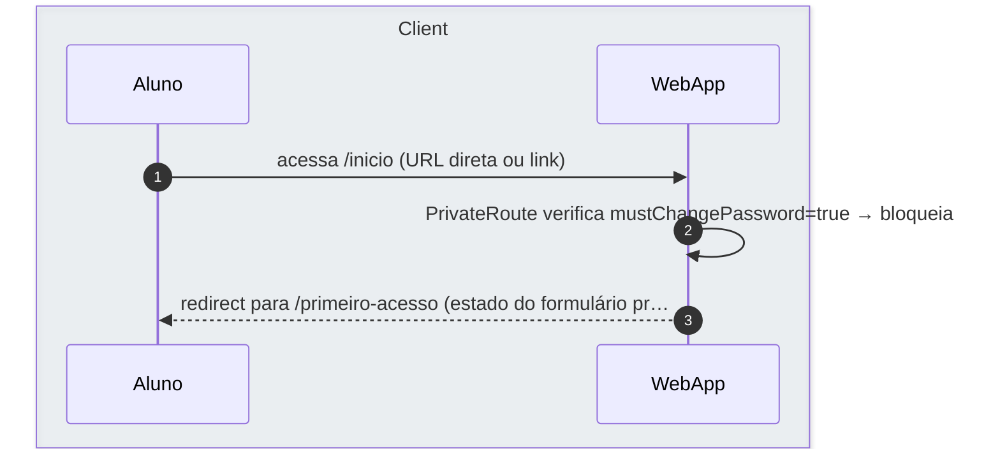

# US-F1-002 — Primeiro Acesso: Definir Senha e Aceitar LGPD

| HU | Tela | Capability | API primária | Fonte |
|----|------|------------|--------------|-------|
| US-F1-002 | F1.2 — `/primeiro-acesso` | `auth.first_access` | `POST /auth/first-access` | `HUs/F1 — Aluno/US-F1-002-PRIMEIRO-ACESSO.md` · `fluxos_por_perfil.md` §2 F1.1 |

---

## Matriz de cobertura

| ID diagrama | Origem (CA / RN / sub-fluxo) | Tipo | Status |
|-------------|------------------------------|------|--------|
| F1.2-D01 | CA-04 · RN-F1.2-07 · RN-F1.2-09 — conclusão bem-sucedida | SEQUENCIA | gerado |
| F1.2-D02 | CA-05 · RN-F1.2-01 — bloqueio de navegação (mustChangePassword guard) | SEQUENCIA | gerado |
| F1.2-D03 | RN-F1.2-05 — 422 senha igual à senha temporária | ERRO | gerado |
| — | RN-F1.2-03 (requisitos de senha — validação Argon2 no backend) | DRY | → `F0/US-F0-003-NOVA-SENHA.md` F0.3-a (mesma lógica de força/hash) |
| — | RN-F1.2-07 (registra aceite_lgpd_em + ip + ua) | DRY | → F1.2-D01 passo 8 (UPDATE+COMMIT) |
| — | RN-F1.2-09 (marca senha_alterada=true) | DRY | → F1.2-D01 passo 8 |
| — | CA-01 (tela exibida — renderização após redirect) | NAO_APLICAVEL | — |
| — | CA-02 (botão habilitado — estado de formulário frontend) | NAO_APLICAVEL | — |
| — | CA-03 (medidor de força — validação client-side em tempo real) | NAO_APLICAVEL | — |
| — | CA-06 (acessibilidade — tab order, aria-live) | NAO_APLICAVEL | — |
| — | RN-F1.2-02 (sidebar sem links — layout UI) | NAO_APLICAVEL | — |
| — | RN-F1.2-04 (confirmação de senha — campos idênticos, frontend only) | NAO_APLICAVEL | — |
| — | RN-F1.2-06 (checkbox obrigatório — estado de formulário) | NAO_APLICAVEL | — |
| — | RN-F1.2-08 (aceite irrevogável — política UX) | NAO_APLICAVEL | — |
| — | RN-F1.2-10 (CAPTCHA na 2ª tentativa — integração opcional sem endpoint definido) | NAO_APLICAVEL | — |

---

## Referências DRY

| Padrão | Arquivo canônico |
|--------|-----------------|
| Requisitos de força de senha + hash Argon2id (backend) | `F0/US-F0-003-NOVA-SENHA.md` F0.3-a (passos 4–7) |
| JWT validation + capability check (JwtFilter) | `F0/US-F0-001-LOGIN.md` F0.1-a (passos 3–5) |
| Outbox dispatcher (notificações geradas por eventos iam.*) | `transversal/10.1-outbox-notificacao.md` |

---

## Fora de sequência

| Item | Motivo |
|------|--------|
| CA-01 — Tela exibida corretamente | Renderização pura após redirect; nenhuma chamada HTTP adicional — o frontend usa `mustChangePassword` já presente na resposta do login (US-F0-001 CA-02). |
| CA-02 — Botão habilitado somente com requisitos cumpridos | Estado de formulário gerenciado exclusivamente pelo React Hook Form + Zod no cliente; sem troca de mensagens com backend. |
| CA-03 — Validação de senha em tempo real | Medidor de força (DS/Progress) e checklist de requisitos são computados client-side; nenhuma chamada HTTP ocorre durante a digitação. |
| CA-06 — Acessibilidade (tab order, aria-live) | Requisito de implementação de UI (WCAG 2.1 AA); sem fluxo de dados entre camadas. |
| RN-F1.2-02 — Sidebar sem links durante o bloqueio | Decisão de layout/CSS: sidebar renderiza condicionalmente com base em `mustChangePassword`; sem chamada backend. |
| RN-F1.2-04 — Confirmação de senha idêntica | Validação Zod client-side antes do POST; nenhuma mensagem é enviada ao backend se os campos divergem. |
| RN-F1.2-06 — Checkbox LGPD obrigatório | Estado de formulário frontend; o botão permanece `disabled` no DOM — sem chamada HTTP. |
| RN-F1.2-08 — Aceite irrevogável | Política UX/produto; o gerenciamento posterior de consentimento está fora do escopo do MVP. |
| RN-F1.2-10 — CAPTCHA na 2ª tentativa | Integração opcional com biblioteca de terceiros (hCaptcha/reCAPTCHA); sem endpoint backend dedicado especificado na HU. Será endereçado quando o endpoint `POST /auth/first-access` definir o campo `captchaToken`. |

---

## F1.2-D01 — Conclusão bem-sucedida do primeiro acesso (happy path)

**Escopo:** happy path — aluno define senha forte, aceita LGPD, backend persiste e redireciona  
**Atores:** Aluno, WebApp, JwtFilter, FirstAccessController, FirstAccessUseCase, Postgres  
**Pré-condições:** aluno autenticado com `mustChangePassword = true`; senha forte não reutilizada; checkbox LGPD marcado

```mermaid
sequenceDiagram
    autonumber
    box rgba(230,245,255,0.3) Client
        participant Aluno
        participant WebApp
    end
    box rgba(255,245,230,0.3) Backend
        participant JwtFilter
        participant FirstAccessController
        participant FirstAccessUseCase
        participant Postgres
    end

    Aluno->>WebApp: clica "Continuar" (senha forte + LGPD marcado ✓)
    WebApp->>JwtFilter: POST /auth/first-access {novaSenha, aceiteTermos:true} …
    JwtFilter->>JwtFilter: valida JWT + auth.first_access ✓
    JwtFilter->>FirstAccessController: repassa (usuarioId, novaSenha, aceiteTermos, ip, ua)
    FirstAccessController->>FirstAccessUseCase: execute(cmd)
    FirstAccessUseCase->>Postgres: BEGIN; SELECT senha_hash_temp FROM usuario WHERE id=usu…
    Postgres-->>FirstAccessUseCase: usuario {senha_hash_temp, senha_alterada=false}
    FirstAccessUseCase->>Postgres: UPDATE usuario SET senha_hash=Argon2id(novaSenha), senh…
    FirstAccessUseCase->>Postgres: INSERT audit_log(iam.first_access_completed, usuarioId,…
    FirstAccessController-->>WebApp: 200 OK {message: "Primeiro acesso concluído"}
    WebApp->>WebApp: limpa mustChangePassword na store + habilita sidebar
    WebApp-->>Aluno: redireciona para /inicio
```

**Notas:**
- Passo 7: a verificação `novaSenha ≠ senha_hash_temp` ocorre em memória no UseCase (Argon2id.verify) logo após receber a linha do Postgres — sem nova roundtrip. Se a verificação falhar, dispara F1.2-D03.
- Passo 9: `INSERT audit_log` + `COMMIT` são atômicos com o `UPDATE` do passo 8 (mesma transação). Se o sistema tiver outbox de boas-vindas configurado, um `INSERT outbox_event(iam.first_access_completed)` entra neste mesmo `COMMIT`; dispatch via `transversal/10.1-outbox-notificacao.md`.
- Passo 11: `mustChangePassword` é limpo do estado local (React Context / Zustand); a sidebar passa a renderizar todos os links normalmente. Nenhum novo JWT é emitido — o guard é verificado via estado derivado da store, não de claim JWT.

**Lacunas:** nenhuma.

---

## F1.2-D02 — Bloqueio de navegação (mustChangePassword guard)

**Escopo:** CA-05 · RN-F1.2-01 — tentativa de acessar rota protegida com `mustChangePassword = true`  
**Atores:** Aluno, WebApp  
**Pré-condições:** aluno autenticado; `mustChangePassword = true` na store do cliente; não concluiu o fluxo



**Notas:**
- Passo 2: o guard é implementado como componente `<RequireFirstAccess>` (React Router v6) que lê o flag `mustChangePassword` do contexto de autenticação — nenhuma chamada HTTP ocorre. O bloqueio é imediato, client-side.
- Chamadas diretas à API (ex.: `GET /bff/dashboard/aluno`) com um JWT de usuário com `senha_alterada=false` podem ser protegidas adicionalmente no backend por um filtro Spring Security que verifica a coluna `senha_alterada` — a implementação desse filtro está no escopo do módulo IAM mas não requer diagrama separado (sem bifurcação de mensagens aqui).
- A sidebar permanece sem links enquanto `mustChangePassword = true` (RN-F1.2-02), reforçando visualmente o bloqueio.

**Lacunas:** nenhuma.

---

## F1.2-D03 — 422 — Senha igual à senha temporária (RN-F1.2-05)

**Escopo:** erro — nova senha é idêntica à senha temporária emitida pelo sistema  
**Atores:** Aluno, WebApp, JwtFilter, FirstAccessController, FirstAccessUseCase, Postgres  
**Pré-condições:** aluno autenticado com `mustChangePassword = true`; fornece a própria senha temporária como nova senha

```mermaid
sequenceDiagram
    autonumber
    box rgba(230,245,255,0.3) Client
        participant Aluno
        participant WebApp
    end
    box rgba(255,245,230,0.3) Backend
        participant JwtFilter
        participant FirstAccessController
        participant FirstAccessUseCase
        participant Postgres
    end

    Aluno->>WebApp: clica "Continuar" (novaSenha = senhaTemporaria)
    WebApp->>JwtFilter: POST /auth/first-access {novaSenha, aceiteTermos:true} …
    JwtFilter->>JwtFilter: valida JWT + auth.first_access ✓
    JwtFilter->>FirstAccessController: repassa (usuarioId, novaSenha, aceiteTermos)
    FirstAccessController->>FirstAccessUseCase: execute(cmd)
    FirstAccessUseCase->>Postgres: BEGIN; SELECT senha_hash_temp FROM usuario WHERE id=usu…
    Postgres-->>FirstAccessUseCase: usuario {senha_hash_temp}
    FirstAccessUseCase->>Postgres: ROLLBACK (Argon2id.verify → novaSenha == senhaTemporaria)
    FirstAccessController-->>WebApp: 422 Problem Details (type: senha_reutilizada)
    WebApp-->>Aluno: DS/Input error "A nova senha não pode ser igual à senha…
```

**Notas:**
- Passo 8: o UseCase executa `Argon2id.verify(novaSenha, senha_hash_temp)` em memória após o SELECT — se retornar `true` (senhas iguais), lança `SenhaReutilizadaException`, a transação faz ROLLBACK e o controller retorna 422.
- Passo 9: resposta segue RFC 7807 Problem Details: `status=422`, `type="urn:secretaria:error:senha_reutilizada"`, `detail="A nova senha não pode ser igual à senha temporária gerada pelo sistema."`. O `detail` não revela o hash ou a senha.
- O frontend não expõe o motivo da rejeição além da mensagem acima — não há dica de qual era a senha temporária.

**Lacunas:** nenhuma.
