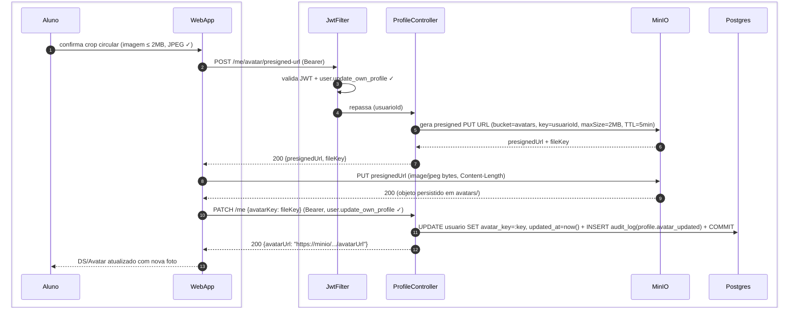

# US-F1-003 — Gerenciar Perfil, Segurança e Notificações

| HU | Telas | Capability | API primária | Fonte |
|----|-------|------------|--------------|-------|
| US-F1-003 | F1.3 `/perfil` · F1.4 `/perfil/seguranca` · F1.5 `/perfil/notificacoes` | `user.update_own_profile` | `GET /me` · `PATCH /me` · `PATCH /me/password` · `GET /me/sessions` · `DELETE /me/sessions/:id` · `PATCH /me/notifications` | `HUs/F1 — Aluno/US-F1-003-PERFIL.md` · `fluxos_por_perfil.md` §2 F1.10 |

---

## Matriz de cobertura

| ID diagrama | Origem (CA / RN / sub-fluxo) | Tipo | Status |
|-------------|------------------------------|------|--------|
| F1.3-D01 | CA-01 · RN-F1.3-01 — editar dados pessoais (PATCH /me) | SEQUENCIA | gerado |
| F1.3-D02 | CA-02 · RN-F1.3-02 — upload de foto via MinIO presigned URL | SEQUENCIA | gerado |
| F1.4-D03 | CA-03 (happy) · RN-F1.4-05 — trocar senha + invalidar outras sessões | SEQUENCIA | gerado |
| F1.4-D04 | CA-03 (erro 401) · RN-F1.4-01 — senha atual incorreta | ERRO | gerado |
| F1.4-D05 | CA-04 · RN-F1.4-03 · RN-F1.4-04 — listar sessões + encerrar via HATEOAS | SEQUENCIA | gerado |
| F1.5-D06 | CA-05 · RN-F1.5-01 · RN-F1.5-03 · RN-F1.5-04 — salvar preferências de notificação | SEQUENCIA | gerado |
| — | RN-F1.4-02 (requisitos de força + hash Argon2id da nova senha) | DRY | → `F0/US-F0-003-NOVA-SENHA.md` F0.3-a (mesma validação backend) |
| — | RN-F1.3-01 (campos somente leitura — GRR, email institucional) | NAO_APLICAVEL | — |
| — | RN-F1.3-03 (dirty state — estado de formulário frontend) | NAO_APLICAVEL | — |
| — | RN-F1.5-02 (switches CRITICAL bloqueados — UI disabled) | NAO_APLICAVEL | — |

---

## Referências DRY

| Padrão | Arquivo canônico |
|--------|-----------------|
| Força de senha + Argon2id hash (backend) | `F0/US-F0-003-NOVA-SENHA.md` F0.3-a |
| JWT validation + capability check (JwtFilter) | `F0/US-F0-001-LOGIN.md` F0.1-a |
| Upload presigned URL (MinIO P5) | padrão P5 do `SKILL.md` reference.md §P5 |

---

## Fora de sequência

| Item | Motivo |
|------|--------|
| RN-F1.3-01 — campos somente leitura (GRR, email institucional) | Campos retornados no GET /me mas renderizados como `readOnly` no formulário; sem chamada HTTP adicional — comportamento de layout puro. |
| RN-F1.3-03 — dirty state (botão Salvar habilitado após alteração) | Estado de formulário gerenciado exclusivamente pelo React Hook Form; sem troca de mensagens com backend. |
| RN-F1.5-02 — switches CRITICAL bloqueados | O frontend renderiza switches `disabled` para prioridade CRITICAL com base no campo `editable: false` retornado pelo GET /me/notifications; sem chamada adicional. |

---

## F1.3-D01 — Editar dados pessoais (PATCH /me)

**Escopo:** happy path — aluno atualiza dado pessoal (ex.: telefone) e salva  
**Atores:** Aluno, WebApp, JwtFilter, ProfileController, UpdateProfileUseCase, Postgres  
**Pré-condições:** aluno em `/perfil` com formulário populado via GET /me; algum campo alterado (dirty state ativo)

```mermaid
sequenceDiagram
    autonumber
    box #e8f4fc Cliente
        participant Aluno
        participant WebApp
    end
    box #fff8ee Servidor
        participant JwtFilter
        participant ProfileController
        participant UpdateProfileUseCase
        participant Postgres
    end

    Aluno->>WebApp: clica "Salvar" (campo telefone alterado, dirty state ✓)
    WebApp->>JwtFilter: PATCH /me {telefone: "..."} (Bearer; RHF validado)
    JwtFilter->>JwtFilter: valida JWT + user.update_own_profile ✓
    JwtFilter->>ProfileController: repassa (usuarioId, patch)
    ProfileController->>UpdateProfileUseCase: execute(usuarioId, patch)
    UpdateProfileUseCase->>Postgres: BEGIN; UPDATE usuario SET telefone=:v, updated_at=now()
    UpdateProfileUseCase->>Postgres: INSERT audit_log(profile.updated, usuarioId) + COMMIT
    ProfileController-->>WebApp: 200 OK {dados atualizados}
    WebApp->>WebApp: reseta dirty state (botão Salvar volta a disabled)
    WebApp-->>Aluno: DS/Toast success "Perfil atualizado com sucesso."
```

**Notas:**
- Passo 6: somente os campos enviados no `PATCH` são atualizados (merge parcial); campos omitidos permanecem intactos. Campos somente-leitura (GRR, email institucional) são ignorados mesmo que presentes no body (UseCase filtra via allowlist).
- Passo 8: a resposta inclui o estado completo atualizado do `usuario` para o frontend sincronizar o formulário sem recarregar a página.
- Botão "Cancelar" (RN-F1.3-03): descarta as alterações locais sem chamar a API — não há diagrama dedicado.

**Lacunas:** nenhuma.

---

## F1.3-D02 — Upload de foto de perfil (MinIO presigned URL)

**Escopo:** happy path — aluno seleciona imagem, obtém URL pré-assinada e envia diretamente para MinIO  
**Atores:** Aluno, WebApp, JwtFilter, ProfileController, MinIO, Postgres  
**Pré-condições:** imagem ≤ 2 MB, formato JPEG/PNG/WebP; crop circular confirmado no modal



**Notas:**
- Passo 8: o upload vai **direto do browser para o MinIO** — o backend nunca recebe os bytes da imagem, evitando gargalo de banda e simplificando o handling de multipart.
- Passo 10: a segunda chamada ao `ProfileController` não passa pelo `JwtFilter` explicitamente no diagrama para evitar segundo `activate` no mesmo participante; na implementação, o Bearer token é enviado e validado normalmente pelo filtro Spring Security.
- Se a imagem exceder 2 MB, o frontend rejeita antes do passo 1 (validação client-side via File API) — nenhuma chamada HTTP é feita. Se o MinIO rejeitar por content-type inválido, o PUT retorna 403 e o frontend exibe `DS/AlertBanner warning`.

**Lacunas:** nenhuma.

---

## F1.4-D03 — Trocar senha + invalidar outras sessões (happy path)

**Escopo:** happy path — CA-03 · RN-F1.4-05 — senha atual correta, nova senha forte, outras sessões invalidadas  
**Atores:** Aluno, WebApp, JwtFilter, ChangePasswordUseCase, Postgres  
**Pré-condições:** aluno em `/perfil/seguranca`; senha atual conhecida; nova senha forte e diferente

```mermaid
sequenceDiagram
    autonumber
    box #e8f4fc Cliente
        participant Aluno
        participant WebApp
    end
    box #fff8ee Servidor
        participant JwtFilter
        participant ChangePasswordUseCase
        participant Postgres
    end

    Aluno->>WebApp: clica "Salvar senha" (senhaAtual + novaSenha forte + confirmaSenha ✓)
    WebApp->>JwtFilter: PATCH /me/password {senhaAtual, novaSenha} (Bearer; RHF validado)
    JwtFilter->>JwtFilter: valida JWT + user.update_own_profile ✓
    JwtFilter->>ChangePasswordUseCase: repassa (usuarioId, senhaAtual, novaSenha, currentSessionId, ip, ua)
    ChangePasswordUseCase->>Postgres: BEGIN; SELECT senha_hash FROM usuario WHERE id=usuarioId
    Postgres-->>ChangePasswordUseCase: {senha_hash}
    ChangePasswordUseCase->>Postgres: UPDATE senha_hash=Argon2id(novaSenha), updated_at=now()
    ChangePasswordUseCase->>Postgres: DELETE refresh_token WHERE usuario_id=:id AND id != currentSessionId
    ChangePasswordUseCase->>Postgres: INSERT audit_log(password.changed, usuarioId) + COMMIT
    ChangePasswordUseCase-->>WebApp: 200 OK {message}
    WebApp-->>Aluno: DS/AlertBanner success "Senha alterada. Outras sessões encerradas."
```

**Notas:**
- Passo 6: após receber `senha_hash`, o UseCase executa `Argon2id.verify(senhaAtual, senha_hash)` em memória. Se falhar → ROLLBACK + dispara F1.4-D04. Se confirmar → continua para o passo 7.
- Passo 8: invalida todos os `refresh_token` exceto `currentSessionId` — o aluno permanece logado na sessão atual. Tokens de acesso já emitidos expiram naturalmente em até 15 min.
- Requisitos de força da nova senha (RN-F1.4-02): mesma lógica do `ResetPasswordUseCase` — DRY → `F0/US-F0-003-NOVA-SENHA.md` F0.3-a.

**Lacunas:** nenhuma.

---

## F1.4-D04 — 401 — Senha atual incorreta

**Escopo:** erro — CA-03 branch negativo · RN-F1.4-01 — Argon2id.verify falha  
**Atores:** Aluno, WebApp, JwtFilter, ChangePasswordUseCase, Postgres  
**Pré-condições:** aluno preenche senha atual errada; nova senha pode ser forte ou não

```mermaid
sequenceDiagram
    autonumber
    box #e8f4fc Cliente
        participant Aluno
        participant WebApp
    end
    box #fff8ee Servidor
        participant JwtFilter
        participant ChangePasswordUseCase
        participant Postgres
    end

    Aluno->>WebApp: clica "Salvar senha" (senhaAtual incorreta)
    WebApp->>JwtFilter: PATCH /me/password {senhaAtual, novaSenha} (Bearer)
    JwtFilter->>JwtFilter: valida JWT + user.update_own_profile ✓
    JwtFilter->>ChangePasswordUseCase: repassa (usuarioId, senhaAtual, novaSenha)
    ChangePasswordUseCase->>Postgres: BEGIN; SELECT senha_hash FROM usuario WHERE id=usuarioId
    Postgres-->>ChangePasswordUseCase: {senha_hash}
    ChangePasswordUseCase->>Postgres: ROLLBACK (Argon2id.verify → false)
    ChangePasswordUseCase-->>WebApp: 401 Problem Details (type: senha_atual_incorreta)
    WebApp-->>Aluno: DS/Input error inline "Senha atual incorreta."
```

**Notas:**
- Passo 8: resposta segue RFC 7807 — `status=401`, `type="urn:secretaria:error:senha_atual_incorreta"`. O backend não revela o hash nem fornece dica sobre a senha correta.
- Tentativas repetidas são limitadas pela mesma política de rate-limit do login (Bucket4j, 5 req/min por IP+usuarioId) — proteção contra brute force na troca de senha.

**Lacunas:** nenhuma.

---

## F1.4-D05 — Listar sessões ativas + encerrar sessão de outro dispositivo (HATEOAS)

**Escopo:** CA-04 · RN-F1.4-03 · RN-F1.4-04 — load das sessões + DELETE via `_links.encerrar`  
**Atores:** Aluno, WebApp, JwtFilter, SessionsController, Postgres  
**Pré-condições:** aluno em `/perfil/seguranca`; há ao menos uma sessão em outro dispositivo

```mermaid
sequenceDiagram
    autonumber
    box #e8f4fc Cliente
        participant Aluno
        participant WebApp
    end
    box #fff8ee Servidor
        participant JwtFilter
        participant SessionsController
        participant Postgres
    end

    Aluno->>WebApp: acessa /perfil/seguranca (aba Sessões)
    WebApp->>JwtFilter: GET /me/sessions (Bearer)
    JwtFilter->>JwtFilter: valida JWT + user.update_own_profile ✓
    JwtFilter->>SessionsController: repassa (usuarioId, currentSessionId)
    SessionsController->>Postgres: SELECT refresh_token WHERE usuario_id=:id ORDER BY last_used_at DESC
    Postgres-->>SessionsController: [{sessionId, device, ip, lastUsed}]
    SessionsController-->>WebApp: 200 [{sessions + _links.encerrar exceto sessão atual}]
    Aluno->>WebApp: clica "Encerrar" para "iPhone — Safari" (via _links.encerrar href)
    WebApp->>JwtFilter: DELETE /me/sessions/{sessionId} (Bearer)
    JwtFilter->>SessionsController: user.update_own_profile ✓ → repassa (usuarioId, sessionId)
    SessionsController->>Postgres: BEGIN; DELETE refresh_token WHERE id=:sessionId AND usuario_id=:id
    SessionsController->>Postgres: INSERT audit_log(session.revoked, sessionId, usuarioId, ip) + COMMIT
    SessionsController-->>WebApp: 200 OK
    WebApp-->>Aluno: sessão removida da DS/DataTable em tempo real
```

**Notas:**
- Passo 7: a sessão atual **não** recebe `_links.encerrar` (RN-F1.4-04) — o controller compara `session.id == currentSessionId` e omite o link. A UI, consequentemente, não exibe o botão "Encerrar" para a sessão atual.
- Passo 11: a cláusula `AND id != currentSessionId` no DELETE é um guard de segurança no backend — a sessão atual nunca é apagada mesmo se o `sessionId` for manipulado pelo cliente.
- Após encerramento, o `refresh_token` do dispositivo alvo fica inválido; o próximo refresh tentado por aquele dispositivo retorna 401, forçando novo login.

**Lacunas:** nenhuma.

---

## F1.5-D06 — Salvar preferências de notificação (PATCH /me/notifications)

**Escopo:** CA-05 · RN-F1.5-01 · RN-F1.5-03 · RN-F1.5-04 — aluno ajusta matriz de canais, DND e digest  
**Atores:** Aluno, WebApp, JwtFilter, NotifPrefsController, NotifPrefsUseCase, Postgres  
**Pré-condições:** aluno em `/perfil/notificacoes` com preferências carregadas; altera ao menos um switch não-CRITICAL

```mermaid
sequenceDiagram
    autonumber
    box #e8f4fc Cliente
        participant Aluno
        participant WebApp
    end
    box #fff8ee Servidor
        participant JwtFilter
        participant NotifPrefsController
        participant NotifPrefsUseCase
        participant Postgres
    end

    Aluno->>WebApp: desabilita push para MEDIUM + clica "Salvar preferências"
    WebApp->>JwtFilter: PATCH /me/notifications {prefs, dnd, digestMode} (Bearer; RHF validado)
    JwtFilter->>JwtFilter: valida JWT + user.update_own_profile ✓
    JwtFilter->>NotifPrefsController: repassa (usuarioId, payload)
    NotifPrefsController->>NotifPrefsUseCase: execute(usuarioId, prefs)
    NotifPrefsUseCase->>NotifPrefsUseCase: valida prefs CRITICAL não foram desabilitadas
    NotifPrefsUseCase->>Postgres: UPSERT notif_prefs SET prefs=:json, dnd=:json, digest_mode=:mode, updated_at=now()
    NotifPrefsUseCase->>Postgres: INSERT audit_log(notif_prefs.updated, usuarioId) + COMMIT
    NotifPrefsController-->>WebApp: 200 OK {prefs atualizadas}
    WebApp-->>Aluno: DS/Toast success "Preferências salvas."
```

**Notas:**
- Passo 6: o UseCase revalida que nenhuma preferência CRITICAL foi desabilitada (mesmo que o frontend já bloqueie os switches, o backend não confia no cliente). Se a validação falhar → 422 Problem Details. A lógica de DND (RN-F1.5-03) e digest (RN-F1.5-04) são colunas do mesmo registro UPSERT — sem fluxo adicional.
- O `notif_prefs` é uma tabela JSONB por usuário; o `OutboxDispatcher` lê essas preferências a cada entrega de notificação (ver `transversal/10.1-outbox-notificacao.md`). A mudança de preferências tem efeito imediato na próxima mensagem despachada.
- Carregamento inicial da matriz (GET /me/notifications): mesmo padrão JWT-guarded do F1.3-D01 — precondição implícita do diagrama; não duplicado.

**Lacunas:** nenhuma.
