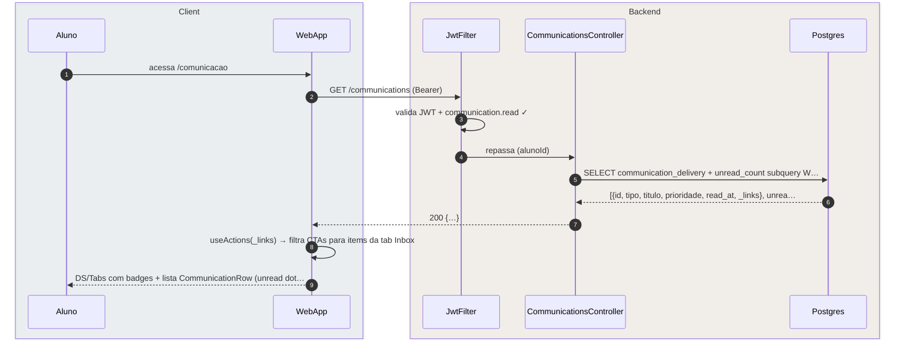
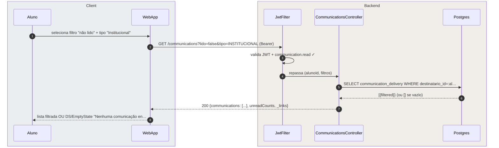

# US-F1-004 — Visualizar e Gerenciar Comunicações Recebidas

| HU | Tela | Capability | API primária | Fonte |
|----|------|------------|--------------|-------|
| US-F1-004 | F1.6 — `/comunicacao` | `communication.read` | `GET /communications` · `POST /communications/:id/read` | `HUs/F1 — Aluno/US-F1-004-COMUNICACAO.md` · `fluxos_por_perfil.md` §2 F1.9 |

---

## Matriz de cobertura

| ID diagrama | Origem (CA / RN / sub-fluxo) | Tipo | Status |
|-------------|------------------------------|------|--------|
| F1.6-D01 | CA-01 · RN-F1.6-01 — listagem GET /communications (tabs + badges de contagem) | SEQUENCIA | gerado |
| F1.6-D02 | CA-02 · RN-F1.6-03 — marcar como lido (POST /communications/:id/read via `_links`) | SEQUENCIA | gerado |
| F1.6-D03 | CA-04 · RN-F1.6-04 — filtros aplicados no backend (query params) | SEQUENCIA | gerado |
| — | CA-03 · RN-F1.6-02 (CTA Inbox → dar ciência de atendimento) | DRY | → `F1/US-F1-011-ATENDIMENTOS.md` (F1.8 ciência) |
| — | RN-F1.6-05 (entrega assíncrona via Outbox — publisher side) | DRY | → `transversal/10.1-outbox-notificacao.md` |
| — | RN-F1.6-06 (badge topbar polling 60 s) | DRY | → F1.6-D01 (TanStack Query `refetchInterval=60000` chama o mesmo GET) |
| — | CA-05 (tabs scrolláveis mobile — 375px, toque ≥ 44px) | NAO_APLICAVEL | — |

---

## Referências DRY

| Padrão | Arquivo canônico |
|--------|-----------------|
| JWT validation + capability check (JwtFilter) | `F0/US-F0-001-LOGIN.md` F0.1-a |
| Entrega assíncrona via Outbox (publisher side) | `transversal/10.1-outbox-notificacao.md` |
| CTA Inbox — dar ciência de atendimento | `F1/US-F1-011-ATENDIMENTOS.md` |

---

## Fora de sequência

| Item | Motivo |
|------|--------|
| CA-05 — Tabs scrolláveis mobile (375px) | Requisito de layout CSS/NativeWind; sem troca de mensagens entre camadas. Área de toque ≥ 44px é verificada via testes de UI (Testing Library). |

---

## F1.6-D01 — Listagem de comunicações (GET /communications)

**Escopo:** happy path — aluno acessa `/comunicacao`, recebe lista com tabs e badges de não lidos  
**Atores:** Aluno, WebApp, JwtFilter, CommunicationsController, Postgres  
**Pré-condições:** aluno autenticado com `communication.read`; há ao menos uma comunicação entregue



**Notas:**
- Passo 5: o backend resolve tabs e badges em uma única query (subquery `COUNT(*) WHERE read_at IS NULL GROUP BY tipo`); o frontend não filtra localmente (RN-F1.6-04).
- Passo 8: `useActions(_links)` mapeia `_links.marcar-lido` (presente apenas se `read_at IS NULL`) e CTAs de ação da Inbox — o aluno só vê o botão CTA se o link existir.
- Badge topbar (RN-F1.6-06): TanStack Query usa `refetchInterval: 60_000` nesta query — o contador se atualiza automaticamente a cada 60 s sem diagrama adicional.
- Skeleton (`DS/Skeleton`) exibido durante os passos 2–7; substituído pela lista ao receber 200.

**Lacunas:** nenhuma.

---

## F1.6-D02 — Marcar comunicação como lida (POST /communications/:id/read)

**Escopo:** CA-02 · RN-F1.6-03 — clique em comunicação não lida dispara marcação via `_links.marcar-lido`  
**Atores:** Aluno, WebApp, JwtFilter, CommunicationsController, Postgres  
**Pré-condições:** lista carregada (F1.6-D01); comunicação tem `read_at = null` e `_links.marcar-lido` presente

```mermaid
sequenceDiagram
    autonumber
    box rgba(230,245,255,0.3) Client
        participant Aluno
        participant WebApp
    end
    box rgba(255,245,230,0.3) Backend
        participant JwtFilter
        participant CommunicationsController
        participant Postgres
    end

    Aluno->>WebApp: clica na comunicação (unread dot visível)
    WebApp->>JwtFilter: POST /communications/{id}/read (Bearer; _links.marcar-l…
    JwtFilter->>JwtFilter: valida JWT + communication.read ✓
    JwtFilter->>CommunicationsController: repassa (alunoId, communicationId)
    CommunicationsController->>Postgres: UPDATE communication_delivery SET read_at=now() WHERE i…
    CommunicationsController-->>WebApp: 200 OK
    WebApp-->>Aluno: unread dot some + badge topbar decrementado
```

**Notas:**
- Passo 5: a cláusula `AND destinatario_id=:alunoId` garante que um aluno não possa marcar como lida uma mensagem de outro — proteção IDOR no lado do banco.
- Se `_links.marcar-lido` estiver **ausente** na resposta (ex.: mensagem já lida), o cliente **não dispara** o POST — a lógica de "marcar" é cega ao estado anterior; o servidor idempotentemente faz `UPDATE` sem erro mesmo se `read_at` já estiver preenchido.
- Atualização otimista (UX): o unread dot pode ser removido imediatamente no cliente (optimistic update do TanStack Query) antes da confirmação do backend; em caso de erro 4xx/5xx o cliente reverte.

**Lacunas:** nenhuma.

---

## F1.6-D03 — Filtros aplicados no backend (query params)

**Escopo:** CA-04 · RN-F1.6-04 — aluno combina filtros; o backend filtra via query params, não o frontend  
**Atores:** Aluno, WebApp, JwtFilter, CommunicationsController, Postgres  
**Pré-condições:** aluno em `/comunicacao` com lista já carregada; seleciona "Não lido" + "Institucional"



**Notas:**
- Passo 5: o backend aplica todos os filtros via `WHERE` composto — o frontend nunca filtra um array local. Isso garante paginação correta e performance com volume alto de mensagens (RN-F1.6-04).
- Múltiplos filtros combinados (tipo + lido + tab) são todos query params no mesmo GET — sem endpoint separado por filtro. A paginação (`?page=0&size=20`) é somada aos filtros na mesma chamada.
- DS/EmptyState é renderizado quando `communications: []` — sem chamada HTTP adicional.

**Lacunas:** nenhuma.
