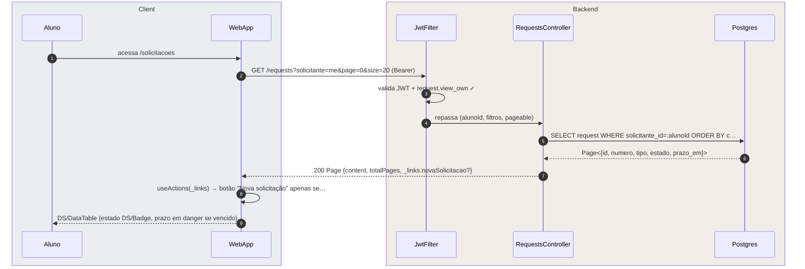
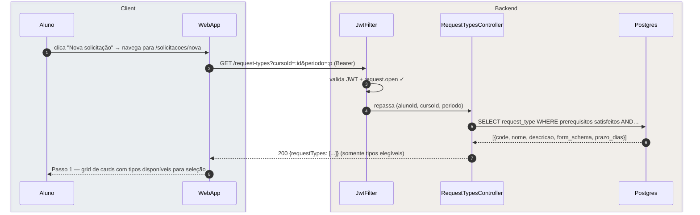
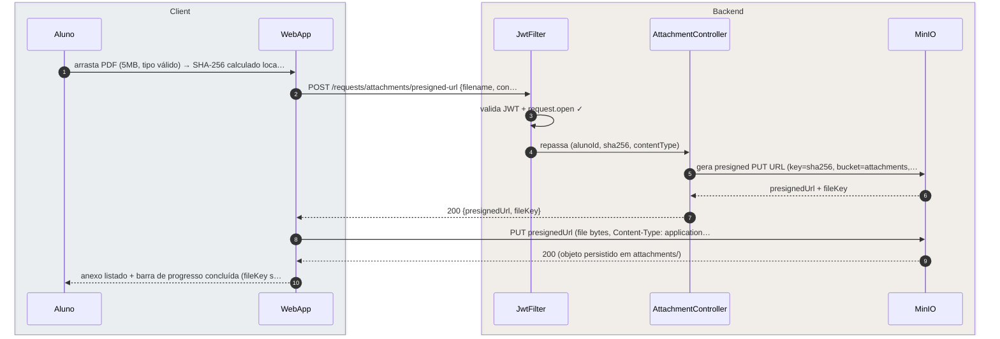
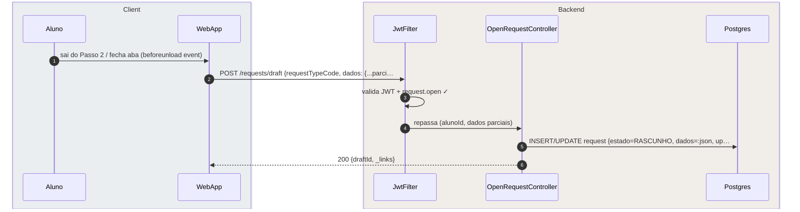
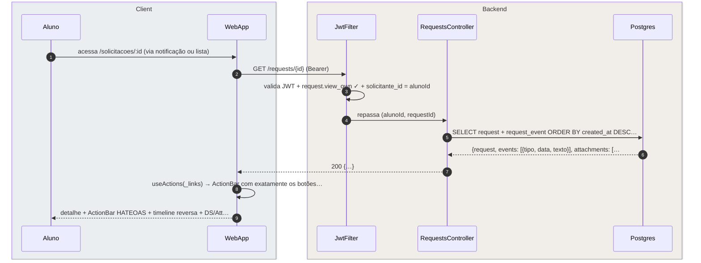
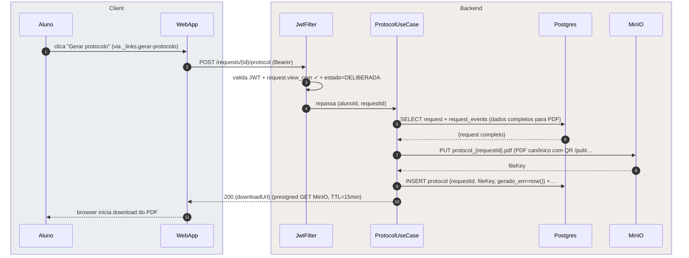
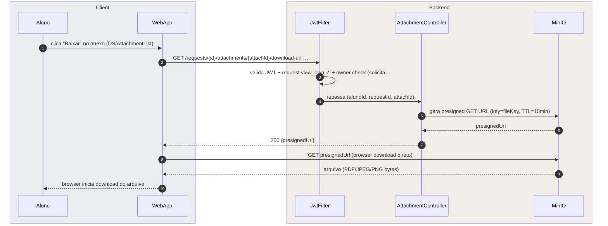

# US-F1-005 — Abrir, Listar e Acompanhar Solicitações

| HU | Telas | Capability | API primária | Fonte |
|----|-------|------------|--------------|-------|
| US-F1-005 | F1.7 `/solicitacoes` · F1.8 `/solicitacoes/nova` · F1.9 `/solicitacoes/:id` | `request.view_own` · `request.open` | `GET /requests?solicitante=me` · `GET /request-types` · `POST /requests` · `POST /requests/draft` · `GET /requests/{id}` · `POST /requests/{id}/protocol` | `HUs/F1 — Aluno/US-F1-005-SOLICITACOES.md` · `fluxos_por_perfil.md` §2 F1.2, F1.3 |

---

## Matriz de cobertura

| ID diagrama | Origem (CA / RN / sub-fluxo) | Tipo | Status |
|-------------|------------------------------|------|--------|
| F1.7-D01 | CA-01 · RN-F1.7-01 — listar solicitações paginadas com filtros | SEQUENCIA | gerado |
| F1.8-D02 | CA-02 · RN-F1.8-02 — Passo 1: GET /request-types elegíveis | SEQUENCIA | gerado |
| F1.8-D03 | CA-04 · RN-F1.8-04 — upload de anexo (SHA-256 + MinIO presigned PUT) | SEQUENCIA | gerado |
| F1.8-D04 | CA-05 · RN-F1.8-06 · RN-F1.8-07 — POST /requests (confirmar + workflow + outbox) | SEQUENCIA | gerado |
| F1.8-D05 | CA-06 · RN-F1.8-05 — POST /requests/draft (salvar rascunho no backend) | SEQUENCIA | gerado |
| F1.9-D06 | CA-07 · RN-F1.9-01 · RN-F1.9-04 — GET /requests/{id} (detalhe + timeline + _links) | SEQUENCIA | gerado |
| F1.9-D07 | RN-F1.9-03 — POST /requests/{id}/protocol (gerar protocolo PDF com QR) | SEQUENCIA | gerado |
| F1.9-D08 | RN-F1.9-05 — GET presigned download URL de anexo (MinIO, TTL=15 min) | SEQUENCIA | gerado |
| — | CA-03 / RN-F1.8-03 (renderização do form_schema + validação Zod — client-side) | NAO_APLICAVEL | — |
| — | RN-F1.7-02 (SLA danger — visual client-side) | NAO_APLICAVEL | — |
| — | RN-F1.7-03 (mobile cards + sheet/drawer — layout CSS) | NAO_APLICAVEL | — |
| — | RN-F1.8-01 (navegação dos 3 passos do wizard — client-side routing) | NAO_APLICAVEL | — |
| — | RN-F1.9-02 (editar → reabre wizard — client-side navigation) | NAO_APLICAVEL | — |
| — | RN-F1.7-01 (paginação + filtros backend) | DRY | → F1.7-D01 |
| — | RN-F1.8-02 (filtro de elegibilidade no backend) | DRY | → F1.8-D02 |
| — | RN-F1.8-04 (SHA-256 + MinIO presigned) | DRY | → F1.8-D03 |
| — | RN-F1.8-05 (rascunho local + backend) | DRY | → F1.8-D05 |
| — | RN-F1.8-06 (workflow inicial + prazo_em + numero_anual + outbox) | DRY | → F1.8-D04 |
| — | RN-F1.8-07 (notificação in-app + push após criação) | DRY | → `transversal/10.1-outbox-notificacao.md` |
| — | RN-F1.9-01 (_links exclusivos na ActionBar) | DRY | → F1.9-D06 |
| — | RN-F1.9-04 (timeline ordem reversa) | DRY | → F1.9-D06 |

---

## Referências DRY

| Padrão | Arquivo canônico |
|--------|-----------------|
| JWT validation + capability check (JwtFilter) | `F0/US-F0-001-LOGIN.md` F0.1-a |
| MinIO presigned URL upload (P5 — PUT) | `F1/US-F1-003-PERFIL.md` F1.3-D02 |
| Outbox dispatcher (notificação solicitacoes.opened) | `transversal/10.1-outbox-notificacao.md` |

---

## Fora de sequência

| Item | Motivo |
|------|--------|
| CA-03 / RN-F1.8-03 — Passo 2 renderiza form_schema com Zod | O `form_schema` já vem no payload do GET /request-types (D02). A renderização do `DS/DynamicForm` e a validação Zod são exclusivamente client-side; nenhuma chamada HTTP adicional durante a digitação. |
| RN-F1.7-02 — SLA danger (prazo em vermelho) | Computação client-side: `prazoEm < Date.now()` após receber a resposta do GET. Igual ao CA-04 de US-F1-001. |
| RN-F1.7-03 — Mobile: cards + sheet/drawer | Requisito de layout responsivo (CSS/NativeWind); sem variação de mensagens HTTP. |
| RN-F1.8-01 — Navegação entre os 3 passos do wizard | Estado do wizard gerenciado pelo cliente (React state machine / `DS/WizardStepper`); sem chamada HTTP entre passos. |
| RN-F1.9-02 — Editar reabre wizard Passo 2 | Client-side navigation: `_links.editar.href` → React Router push para `/solicitacoes/nova?edit=:id`; nenhuma chamada HTTP no redirect. |

---

## F1.7-D01 — Listar solicitações paginadas (GET /requests?solicitante=me)

**Escopo:** happy path — aluno acessa `/solicitacoes` e vê suas solicitações com filtros opcionais  
**Atores:** Aluno, WebApp, JwtFilter, RequestsController, Postgres  
**Pré-condições:** aluno autenticado com `request.view_own`



**Notas:**
- Passo 8: `_links.novaSolicitacao` aparece somente se o aluno tiver `request.open` — aluno sem essa authority não vê o botão, sem código condicional no frontend.
- Filtros adicionais (`estado`, `tipo`, `ano`, busca textual) são acrescentados como query params no mesmo GET (`?estado=EM_ANALISE&ano=2026`); o Postgres aplica a cláusula `WHERE` correspondente — sem filtragem client-side (RN-F1.7-01).
- Em mobile (RN-F1.7-03) a `DS/DataTable` é substituída por cards e o painel de filtros fica em Sheet/drawer — mesmo fluxo HTTP, sem variação de mensagens.

**Lacunas:** nenhuma.

---

## F1.8-D02 — Passo 1 do wizard: tipos de solicitação elegíveis (GET /request-types)

**Escopo:** Passo 1 — backend filtra tipos pelo curso, período e pré-requisitos do aluno  
**Atores:** Aluno, WebApp, JwtFilter, RequestTypesController, Postgres  
**Pré-condições:** aluno clicou "Nova solicitação" (via `_links.novaSolicitacao` do D01)



**Notas:**
- Passo 5: a query avalia `request_type.prerequisitos` (JSONB com regras de período mínimo, situação acadêmica, etc.) contra os dados do aluno — tipos não elegíveis são excluídos da query, não ocultados no frontend (RN-F1.8-02). O aluno nunca vê nem recebe os tipos não elegíveis.
- O `form_schema` retornado em cada tipo já vem nesta resposta para o Passo 2 poder renderizar o formulário sem nova chamada HTTP (cache local do TanStack Query).

**Lacunas:** nenhuma.

---

## F1.8-D03 — Upload de anexo no wizard (SHA-256 + MinIO presigned PUT)

**Escopo:** CA-04 · RN-F1.8-04 — aluno envia arquivo PDF ao MinIO diretamente via URL pré-assinada  
**Atores:** Aluno, WebApp, JwtFilter, AttachmentController, MinIO  
**Pré-condições:** aluno no Passo 2 do wizard; arquivo ≤ 10 MB, tipo PDF/JPEG/PNG



**Notas:**
- Passo 1: o SHA-256 é calculado no browser via `crypto.subtle.digest('SHA-256', buffer)` antes de qualquer upload — sem chamada HTTP. O backend recebe o hash para validar integridade pós-upload (comparação opcional via `MinIO.statObject`).
- O `fileKey` ficará na memória do wizard (Zustand / React state) e será enviado no array `attachmentKeys[]` do POST /requests (D04).
- Se o arquivo exceder 10 MB, a rejeição ocorre no passo 1 (File API no cliente) — sem chamada HTTP.

**Lacunas:** nenhuma.

---

## F1.8-D04 — Confirmar wizard: POST /requests (criar solicitação + workflow + outbox)

**Escopo:** CA-05 · RN-F1.8-06 · RN-F1.8-07 — Passo 3 confirmado; backend abre solicitação, calcula prazo, emite evento  
**Atores:** Aluno, WebApp, JwtFilter, OpenRequestController, OpenRequestUseCase, Postgres  
**Pré-condições:** Passos 1 e 2 completos; form_schema validado; anexos enviados ao MinIO

```mermaid
sequenceDiagram
    autonumber
    box rgba(230,245,255,0.3) Client
        participant Aluno
        participant WebApp
    end
    box rgba(255,245,230,0.3) Backend
        participant JwtFilter
        participant OpenRequestController
        participant OpenRequestUseCase
        participant Postgres
    end

    Aluno->>WebApp: clica "Confirmar" no Passo 3 (revisão ok)
    WebApp->>JwtFilter: POST /requests {requestTypeCode, dados: {...}, attachme…
    JwtFilter->>JwtFilter: valida JWT + request.open ✓
    JwtFilter->>OpenRequestController: repassa (alunoId, requestTypeCode, dados, attachmentKeys)
    OpenRequestController->>OpenRequestUseCase: execute(cmd)
    OpenRequestUseCase->>Postgres: BEGIN; SELECT request_type (form_schema, prazo_dias, wo…
    OpenRequestUseCase->>Postgres: INSERT request {estado=workflow.initial, dados=:json, p…
    OpenRequestUseCase->>Postgres: INSERT outbox_event(solicitacoes.opened, requestId, alu…
    OpenRequestController-->>WebApp: 201 Created {id, numero_anual, _links}
    WebApp-->>Aluno: redireciona para /solicitacoes/:id + DS/Toast "Solicita…
```

**Notas:**
- Passo 6: o UseCase re-valida `dados` contra o `form_schema` do RequestType no backend — não confia apenas na validação Zod do frontend (RN-F1.8-03). Campos ausentes ou com formato inválido retornam 422 Problem Details.
- Passo 7: `numero_anual` usa sequência PostgreSQL atômica (`YYYY-{nextval()}`) para garantir unicidade sem colisão em concorrência. O `prazo_em` é calculado como `NOW() + INTERVAL '<prazo_dias> days'`.
- Passo 8: o `outbox_event` é inserido na mesma transação — garante que a notificação (aluno + secretaria) só dispara após o commit. Dispatch via `transversal/10.1-outbox-notificacao.md`.

**Lacunas:** nenhuma.

---

## F1.8-D05 — Salvar rascunho no backend (POST /requests/draft)

**Escopo:** CA-06 · RN-F1.8-05 — aluno sai do wizard; dados parciais são persistidos no backend como `RASCUNHO`  
**Atores:** Aluno, WebApp, JwtFilter, OpenRequestController, Postgres  
**Pré-condições:** aluno está no Passo 2 com dados parciais; fecha aba ou navega para outra rota



**Notas:**
- O rascunho também é salvo localmente via PWA/AsyncStorage (conforme RN-F1.8-05) para recuperação offline; o backend é a fonte da verdade persistente.
- Ao retornar para `/solicitacoes/nova`, o frontend verifica localStorage/AsyncStorage: se encontrar `draftId`, exibe modal "Continuar rascunho ou começar novo?" — decisão exclusivamente client-side, sem nova chamada HTTP.
- O rascunho aparece em `/solicitacoes` (F1.7-D01) com badge "Rascunho" — `estado=RASCUNHO` retornado no GET /requests.

**Lacunas:** nenhuma.

---

## F1.9-D06 — Detalhe da solicitação com timeline e _links HATEOAS

**Escopo:** CA-07 · RN-F1.9-01 · RN-F1.9-04 — GET /requests/{id} retorna dados completos, timeline reversa e ações disponíveis  
**Atores:** Aluno, WebApp, JwtFilter, RequestsController, Postgres  
**Pré-condições:** aluno autenticado com `request.view_own`; solicitação existe e pertence ao aluno



**Notas:**
- Passo 3: `solicitante_id = alunoId` é verificado no próprio JwtFilter ou no controller antes de atingir o Postgres — proteção IDOR: aluno não consegue ver solicitações de outros.
- Passo 6: `request_event` retorna em `ORDER BY created_at DESC` — timeline em ordem reversa (RN-F1.9-04). O mais recente aparece no topo.
- Passo 8: a ActionBar é 100% derivada de `_links` (RN-F1.9-01). Estado `EM_AJUSTE` → `_links.editar`; estado `DELIBERADA` → `_links.gerar-protocolo`. A UI não tem `if (estado == 'EM_AJUSTE')` hardcoded.

**Lacunas:** nenhuma.

---

## F1.9-D07 — Gerar protocolo PDF com QR (POST /requests/{id}/protocol)

**Escopo:** RN-F1.9-03 — aluno clica "Gerar protocolo" (via `_links.gerar-protocolo`); backend gera PDF e retorna URL de download  
**Atores:** Aluno, WebApp, JwtFilter, ProtocolUseCase, Postgres, MinIO  
**Pré-condições:** solicitação no estado `DELIBERADA`; `_links.gerar-protocolo` presente em D06



**Notas:**
- Passo 7: o PDF é gerado internamente (template engine ou Gotenberg headless) e contém: número da solicitação, dados do formulário, timeline de decisão e QR-code apontando para `/publico/verificar-protocolo/:id`. A geração é síncrona nesta versão MVP (< 2s tipicamente); se ultrapassar 5s, converter para job assíncrono com polling.
- O QR no PDF aponta para a rota pública de verificação (US-F0-006) — sem autenticação necessária.
- `downloadUrl` é uma presigned GET URL do MinIO com TTL=15min; o browser inicia o download diretamente sem trafegar bytes pelo backend.

**Lacunas:** nenhuma.

---

## F1.9-D08 — Download de anexo via presigned GET URL (MinIO, TTL=15 min)

**Escopo:** RN-F1.9-05 — aluno baixa um anexo da solicitação sem trafegar bytes pelo backend  
**Atores:** Aluno, WebApp, JwtFilter, AttachmentController, MinIO  
**Pré-condições:** solicitação carregada (D06); anexo presente na `DS/AttachmentList`



**Notas:**
- TTL=15 min (RN-F1.9-05): curto o suficiente para dificultar compartilhamento indevido, longo o suficiente para o browser iniciar o download sem erro de expiração.
- Diferença vs D03 (upload): aqui é presigned **GET** (download) com TTL=15 min vs presigned **PUT** (upload) com TTL=5 min. O `fileKey` vem do `attachment.file_key` retornado em D06.
- O owner check do passo 3 garante que um aluno não possa gerar URL de download para anexo de solicitação alheia — proteção IDOR por `requestId` + `attachId`.

**Lacunas:** nenhuma.
