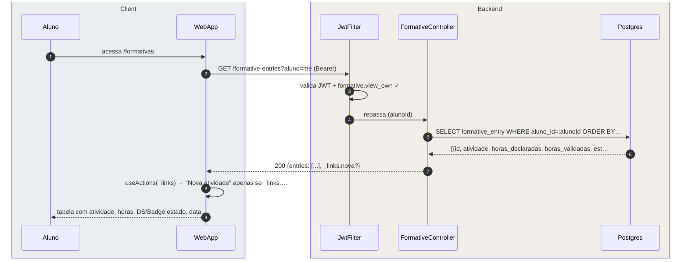
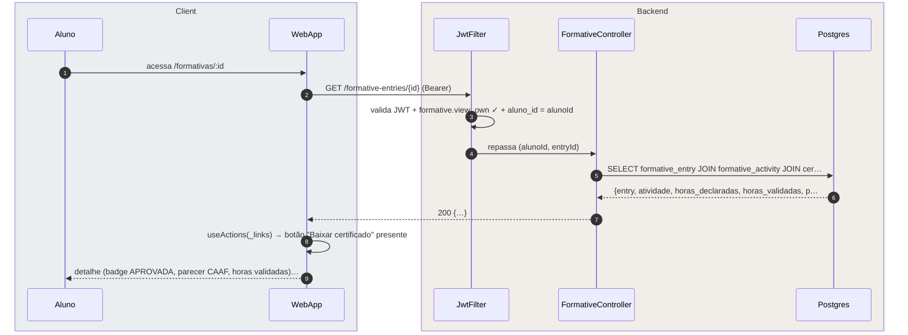

# US-F1-006 — Submeter e Acompanhar Atividades Formativas

| HU | Telas | Capability | API primária | Fonte |
|----|-------|------------|--------------|-------|
| US-F1-006 | F1.10 `/formativas` · F1.11 `/formativas/nova` · F1.12 `/formativas/:id` | `formative.view_own` · `formative.submit` | `GET /formative-entries?aluno=me` · `POST /formative-entries` · `POST /formative-entries/{id}/confirm` · `GET /formative-entries/{id}` | `HUs/F1 — Aluno/US-F1-006-FORMATIVAS.md` · `fluxos_por_perfil.md` §2 F1.4, F1.5 |

---

## Matriz de cobertura

| ID diagrama | Origem (CA / RN / sub-fluxo) | Tipo | Status |
|-------------|------------------------------|------|--------|
| F1.10-D01 | CA-01 · RN-F1.10-01 — listar formativas do aluno | SEQUENCIA | gerado |
| F1.11-D02 | CA-02 · RN-F1.11-01 · RN-F1.11-02 · RN-F1.11-03 — submeter formativa manualmente | SEQUENCIA | gerado |
| F1.11-D03 | CA-03 · RN-F1.11-04 — confirmar formativa pré-validada (evento interno) | SEQUENCIA | gerado |
| F1.12-D04 | CA-04 · RN-F1.12-01 · RN-F1.12-02 — detalhe com estado APROVADA e _links HATEOAS | SEQUENCIA | gerado |
| — | RN-F1.10-02 (KpiCard horas calculado no BFF do dashboard) | NAO_APLICAVEL | — |
| — | RN-F1.11-02 (upload comprovante via MinIO presigned PUT) | DRY | → `F1/US-F1-005-SOLICITACOES.md` F1.8-D03 (mesmo padrão P5) |
| — | RN-F1.11-03 (outbox formativas.submitted → notifica CAAF) | DRY | → F1.11-D02 passo 8 + `transversal/10.1-outbox-notificacao.md` (dispatch) |
| — | RN-F1.12-03 (resubmeter com novo comprovante) | DRY | → F1.11-D02 (mesmo fluxo POST /formative-entries; endpoint distinto `/resubmit`) |

---

## Referências DRY

| Padrão | Arquivo canônico |
|--------|-----------------|
| JWT validation + capability check (JwtFilter) | `F0/US-F0-001-LOGIN.md` F0.1-a |
| Upload comprovante MinIO presigned PUT + SHA-256 | `F1/US-F1-005-SOLICITACOES.md` F1.8-D03 |
| Outbox dispatcher (formativas.submitted) | `transversal/10.1-outbox-notificacao.md` |
| Download certificado (link baixar-certificado) | `F1/US-F1-010-CERTIFICADOS.md` |

---

## Fora de sequência

| Item | Motivo |
|------|--------|
| RN-F1.10-02 — KpiCard horas APROVADA no Dashboard | O cálculo `SUM(horas_validadas) WHERE estado='APROVADA'` é responsabilidade do BFF do dashboard (US-F1-001 F1.1-D01); não há chamada HTTP adicional em `/formativas` para isso. |

---

## F1.10-D01 — Listar formativas do aluno (GET /formative-entries)

**Escopo:** happy path — aluno acessa `/formativas` e vê todas suas entradas com filtros  
**Atores:** Aluno, WebApp, JwtFilter, FormativeController, Postgres  
**Pré-condições:** aluno autenticado com `formative.view_own`



**Notas:**
- Passo 8: `_links.nova` aparece somente se `formative.submit` estiver nas authorities do aluno — sem condicional hardcoded no frontend.
- Filtros por estado e tipo são query params no mesmo GET (`?estado=SUBMETIDA&tipo=CURSODOTACAO`); o Postgres aplica `WHERE` composto — sem filtragem client-side (analogia com RN-F1.7-01 de solicitações).
- Entradas no estado `PENDENTE_CONFIRMACAO` (pré-validadas por evento interno) aparecem na lista com badge "Aguardando confirmação" e CTA para F1.11-D03.

**Lacunas:** nenhuma.

---

## F1.11-D02 — Submeter formativa manualmente (POST /formative-entries)

**Escopo:** CA-02 · RN-F1.11-01 · RN-F1.11-03 — aluno seleciona atividade, declara horas, anexa comprovante e submete  
**Atores:** Aluno, WebApp, JwtFilter, FormativeController, SubmitFormativeUseCase, Postgres  
**Pré-condições:** comprovante já enviado ao MinIO (via F1.8-D03 — presigned PUT); `comprovanteKey` disponível

```mermaid
sequenceDiagram
    autonumber
    box rgba(230,245,255,0.3) Client
        participant Aluno
        participant WebApp
    end
    box rgba(255,245,230,0.3) Backend
        participant JwtFilter
        participant FormativeController
        participant SubmitFormativeUseCase
        participant Postgres
    end

    Aluno->>WebApp: seleciona atividade + informa 20h + comprovante enviado…
    WebApp->>JwtFilter: POST /formative-entries {atividadeId, horasDeclaradas: …
    JwtFilter->>JwtFilter: valida JWT + formative.submit ✓
    JwtFilter->>FormativeController: repassa (alunoId, atividadeId, horas, comprovanteKey)
    FormativeController->>SubmitFormativeUseCase: execute(cmd)
    SubmitFormativeUseCase->>Postgres: BEGIN; SELECT formative_activity WHERE id=:atividadeId …
    SubmitFormativeUseCase->>Postgres: INSERT formative_entry {estado=SUBMETIDA, horas_declara…
    SubmitFormativeUseCase->>Postgres: INSERT outbox_event(formativas.submitted, entryId, alun…
    FormativeController-->>WebApp: 201 Created {id, _links}
    WebApp-->>Aluno: redireciona /formativas/:id + DS/Toast "Atividade envia…
```

**Notas:**
- Passo 6: a query valida que `formative_activity` é elegível para o `cursoId` do aluno (RN-F1.11-01) — mesma lógica de filtro de elegibilidade do backend. Se a atividade não for aplicável, o UseCase retorna 422 Problem Details.
- Upload do comprovante (RN-F1.11-02): ocorre **antes** do passo 1, via presigned PUT ao MinIO — DRY → `F1/US-F1-005-SOLICITACOES.md` F1.8-D03. O `comprovanteKey` é passado aqui sem nova chamada de upload.
- Passo 8: `outbox_event` é inserido na mesma transação — a notificação à CAAF (`formativas.submitted`) só dispara após o COMMIT. Dispatch: `transversal/10.1-outbox-notificacao.md`.

**Lacunas:** nenhuma.

---

## F1.11-D03 — Confirmar formativa pré-validada por evento interno

**Escopo:** CA-03 · RN-F1.11-04 — aluno confirma (1 clique) atividade pré-preenchida pelo sistema após presença validada  
**Atores:** Aluno, WebApp, JwtFilter, FormativeController, ConfirmFormativeUseCase, Postgres  
**Pré-condições:** `formative_entry` no estado `PENDENTE_CONFIRMACAO` criada automaticamente ao encerrar evento; aluno recebeu notificação

```mermaid
sequenceDiagram
    autonumber
    box rgba(230,245,255,0.3) Client
        participant Aluno
        participant WebApp
    end
    box rgba(255,245,230,0.3) Backend
        participant JwtFilter
        participant FormativeController
        participant ConfirmFormativeUseCase
        participant Postgres
    end

    Aluno->>WebApp: acessa /formativas com entryId pré-criada (link da noti…
    WebApp->>JwtFilter: GET /formative-entries/{id} (Bearer)
    JwtFilter->>JwtFilter: valida JWT + formative.view_own ✓ + aluno_id = alunoId
    JwtFilter->>FormativeController: repassa (alunoId, entryId)
    FormativeController->>Postgres: SELECT formative_entry WHERE id=:id AND aluno_id=:aluno…
    FormativeController-->>WebApp: 200 {entry readonly, _links.confirmar}
    WebApp-->>Aluno: formulário readonly + DS/AlertBanner "Participação regi…
    Aluno->>WebApp: clica "Confirmar" (1 clique)
    WebApp->>FormativeController: POST /formative-entries/{id}/confirm (Bearer, JWT ✓)
    FormativeController->>ConfirmFormativeUseCase: execute(alunoId, entryId)
    ConfirmFormativeUseCase->>Postgres: BEGIN; UPDATE formative_entry SET estado=SUBMETIDA WHER…
    FormativeController-->>WebApp: 200 OK {id, estado: SUBMETIDA}
    WebApp-->>Aluno: redireciona /formativas/:id + DS/Toast "Atividade confi…
```

**Notas:**
- Passo 5: a cláusula `AND estado=PENDENTE_CONFIRMACAO` é um guard: se o aluno tentar confirmar uma entrada já `SUBMETIDA` ou em outro estado, o controller retorna 409 Conflict.
- Passo 9: a segunda chamada HTTP (`POST .../confirm`) passa pelo JwtFilter real na implementação; o diagrama omite o self-call para respeitar a regra de "no máximo 1 self-call por diagrama" — o Bearer token e `formative.submit` são validados normalmente.
- Nenhum upload de comprovante é necessário neste caminho (RN-F1.11-04) — a presença foi validada pelo sistema de eventos (US-F1-009), eliminando fraude por upload manual.

**Lacunas:** nenhuma.

---

## F1.12-D04 — Detalhe da formativa aprovada com _links HATEOAS

**Escopo:** CA-04 · RN-F1.12-01 · RN-F1.12-02 — GET /formative-entries/{id} retorna detalhe completo e link para certificado  
**Atores:** Aluno, WebApp, JwtFilter, FormativeController, Postgres  
**Pré-condições:** aluno autenticado com `formative.view_own`; entrada no estado `APROVADA`



**Notas:**
- Passo 7: `_links.baixar-certificado` aparece somente quando `estado=APROVADA` e o certificado já foi emitido (trigger background: `transversal/10.4-certificado-emissao.md`). Em estados intermediários o link está ausente e o botão não é renderizado (HATEOAS FGAC).
- Clique em "Baixar certificado" → navegação para `_links.baixar-certificado.href` → fluxo de download coberto em `F1/US-F1-010-CERTIFICADOS.md`.
- Estado `REJEITADA` + `_links.resubmeter` (RN-F1.12-03): quando presente, o frontend exibe botão "Resubmeter". O fluxo de resubmissão é DRY → F1.11-D02 (mesmo POST /formative-entries com endpoint `/resubmit`).

**Lacunas:** nenhuma.
