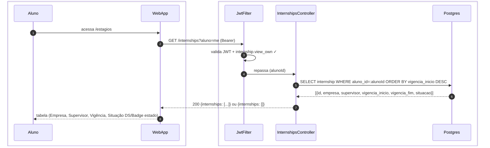
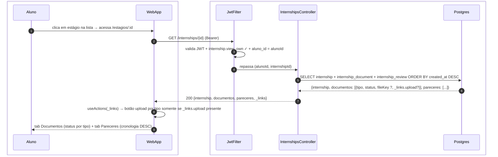

# US-F1-007 — Acompanhar Estágios e Enviar Documentos

| HU | Telas | Capability | API primária | Fonte |
|----|-------|------------|--------------|-------|
| US-F1-007 | F1.13 `/estagios` · F1.14 `/estagios/:id` | `internship.view_own` | `GET /internships?aluno=me` · `GET /internships/{id}` · `POST /internships/{id}/documents` | `HUs/F1 — Aluno/US-F1-007-ESTAGIO.md` · `fluxos_por_perfil.md` §4 F3.6 |

---

## Matriz de cobertura

| ID diagrama | Origem (CA / RN / sub-fluxo) | Tipo | Status |
|-------------|------------------------------|------|--------|
| F1.13-D01 | CA-01 · RN-F1.13-01 — listar estágios do aluno | SEQUENCIA | gerado |
| F1.14-D02 | RN-F1.14-01 · RN-F1.14-02 · RN-F1.14-04 · CA-03 — detalhe: tabs documentos + pareceres + _links | SEQUENCIA | gerado |
| F1.14-D03 | CA-02 · RN-F1.14-02 · RN-F1.14-03 — POST /internships/{id}/documents (upload + outbox) | SEQUENCIA | gerado |
| — | RN-F1.13-02 (aluno não abre estágio — registro feito pela secretaria em F5) | NAO_APLICAVEL | — |
| — | RN-F1.14-01 (tabs Documentos / Pareceres — layout UI) | NAO_APLICAVEL | — |
| — | Upload arquivo MinIO (presigned PUT antes do POST /documents) | DRY | → `F1/US-F1-005-SOLICITACOES.md` F1.8-D03 (mesmo padrão P5) |
| — | CA-03 (pareceres na tab) | DRY | → F1.14-D02 (pareceres retornados na mesma resposta GET /internships/{id}) |

---

## Referências DRY

| Padrão | Arquivo canônico |
|--------|-----------------|
| JWT validation + capability check (JwtFilter) | `F0/US-F0-001-LOGIN.md` F0.1-a |
| Upload de arquivo MinIO presigned PUT + SHA-256 | `F1/US-F1-005-SOLICITACOES.md` F1.8-D03 |
| Outbox dispatcher (estagios.document_uploaded → orientador/COE) | `transversal/10.1-outbox-notificacao.md` |

---

## Fora de sequência

| Item | Motivo |
|------|--------|
| RN-F1.13-02 — Aluno não abre estágio | O registro de estágio é feito pela secretaria (F5). Do ponto de vista do aluno, não há fluxo de criação — o estágio já existe quando ele acessa `/estagios`. Sem sequência de mensagens para diagramar. |
| RN-F1.14-01 — Tabs Documentos / Pareceres | Alternância entre tabs é client-side (React state / router hash); nenhuma chamada HTTP adicional — os dados de ambas as tabs chegam na mesma resposta do GET /internships/{id} (F1.14-D02). |

---

## F1.13-D01 — Listar estágios do aluno (GET /internships?aluno=me)

**Escopo:** CA-01 · RN-F1.13-01 — happy path — aluno vê tabela de estágios registrados pela secretaria  
**Atores:** Aluno, WebApp, JwtFilter, InternshipsController, Postgres  
**Pré-condições:** aluno autenticado com `internship.view_own`; ao menos um estágio registrado pela secretaria



**Notas:**
- Se `internships: []`, a UI exibe `DS/EmptyState` "Você não possui estágios registrados." — sem diagrama separado (mesmo fluxo HTTP, payload diferente).
- Filtros por situação (`?situacao=ATIVO`) são query params no mesmo GET — sem filtragem client-side.
- O aluno **não** possui botão "Novo estágio" nesta tela (RN-F1.13-02): a ausência de `_links.novo` na resposta garante isso via HATEOAS.

**Lacunas:** nenhuma.

---

## F1.14-D02 — Detalhe do estágio: documentos + pareceres + _links HATEOAS

**Escopo:** RN-F1.14-01 · RN-F1.14-02 · RN-F1.14-04 · CA-03 — GET /internships/{id} retorna dados de ambas as tabs em uma única resposta  
**Atores:** Aluno, WebApp, JwtFilter, InternshipsController, Postgres  
**Pré-condições:** aluno autenticado; estágio pertence ao aluno



**Notas:**
- Passo 5: uma única query (JOIN) retorna dados de ambas as tabs — tab switching é client-side sem nova chamada HTTP (RN-F1.14-01).
- Passo 7: `_links.upload` aparece por tipo de documento somente quando o documento ainda não foi entregue ou está pendente de reenvio (RN-F1.14-02). A UI não conhece a lógica de "quais documentos são obrigatórios" — depende exclusivamente dos links presentes.
- CA-03 (pareceres): `pareceres` vêm na mesma resposta, em `ORDER BY created_at DESC` — mais recente no topo (RN-F1.14-04). Sem diagrama separado.

**Lacunas:** nenhuma.

---

## F1.14-D03 — Enviar documento de estágio (POST /internships/{id}/documents)

**Escopo:** CA-02 · RN-F1.14-02 · RN-F1.14-03 — aluno envia PDF via MinIO presigned URL e notifica orientador/COE via Outbox  
**Atores:** Aluno, WebApp, JwtFilter, InternshipsController, UploadDocumentUseCase, Postgres  
**Pré-condições:** `_links.upload` presente para o tipo de documento (D02); arquivo enviado ao MinIO (DRY → F1.8-D03); `fileKey` disponível

```mermaid
sequenceDiagram
    autonumber
    box #e8f4fc Cliente
        participant Aluno
        participant WebApp
    end
    box #fff8ee Servidor
        participant JwtFilter
        participant InternshipsController
        participant UploadDocumentUseCase
        participant Postgres
    end

    Aluno->>WebApp: tab Documentos → upload PDF "Relatório Final" (fileKey do presigned PUT ✓)
    WebApp->>JwtFilter: POST /internships/{id}/documents {documentType: RELATORIO_FINAL, fileKey} (Bearer)
    JwtFilter->>JwtFilter: valida JWT + internship.view_own ✓
    JwtFilter->>InternshipsController: repassa (alunoId, internshipId, documentType, fileKey)
    InternshipsController->>UploadDocumentUseCase: execute(cmd)
    UploadDocumentUseCase->>Postgres: BEGIN; UPDATE internship_document SET fileKey=:key, status=AGUARDANDO_PARECER, updated_at=now()
    UploadDocumentUseCase->>Postgres: INSERT outbox_event(estagios.document_uploaded, internshipId, alunoId, documentType)
    InternshipsController-->>WebApp: 200 OK {documentType, status: AGUARDANDO_PARECER}
    WebApp-->>Aluno: status do documento atualizado "Enviado — aguardando parecer do orientador."
```

**Notas:**
- Passo 1: upload do PDF ao MinIO ocorre **antes** desta chamada (presigned PUT — DRY → `F1/US-F1-005-SOLICITACOES.md` F1.8-D03). O POST aqui registra apenas o `fileKey`, sem trafegar bytes pelo backend.
- Passo 7: `outbox_event` é inserido na mesma transação que o UPDATE — garante que o orientador/COE só é notificado após confirmação do COMMIT. O dispatcher (transversal/10.1) entrega push/email ao orientador responsável.
- O UseCase verifica que `_links.upload` estava presente para o `documentType` (validação de HATEOAS no backend) — se o aluno tentar enviar um tipo não permitido, retorna 403 Problem Details.

**Lacunas:** nenhuma.
