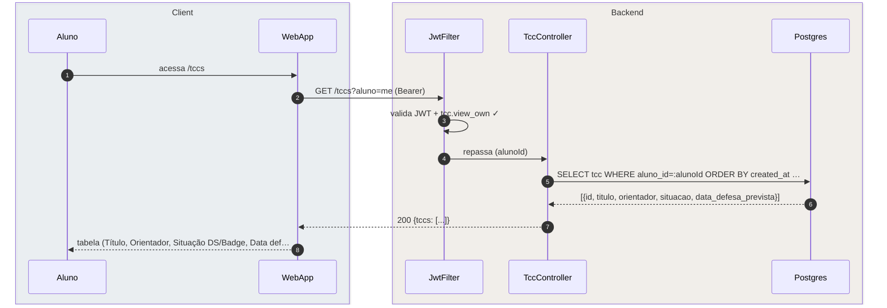
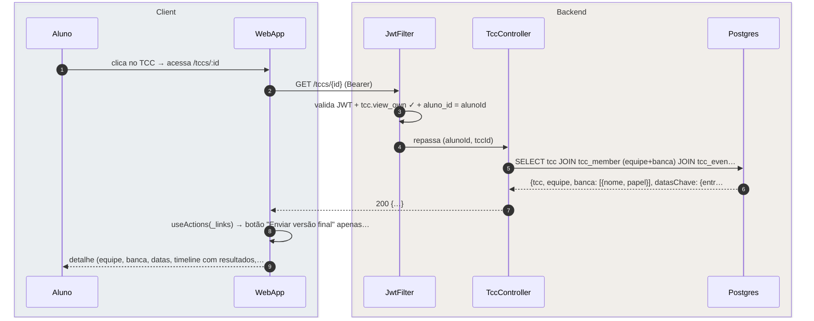

# US-F1-008 — Acompanhar TCC e Enviar Versão Final

| HU | Telas | Capability | API primária | Fonte |
|----|-------|------------|--------------|-------|
| US-F1-008 | F1.15 `/tccs` · F1.16 `/tccs/:id` | `tcc.view_own` | `GET /tccs?aluno=me` · `GET /tccs/{id}` · `POST /tccs/{id}/upload` | `HUs/F1 — Aluno/US-F1-008-TCC.md` · `fluxos_por_perfil.md` §4 F3.7 |

---

## Matriz de cobertura

| ID diagrama | Origem (CA / RN / sub-fluxo) | Tipo | Status |
|-------------|------------------------------|------|--------|
| F1.15-D01 | CA-01 · RN-F1.15-01 — listar TCCs do aluno | SEQUENCIA | gerado |
| F1.16-D02 | CA-03 · RN-F1.16-01 · RN-F1.16-02 · RN-F1.16-04 — GET /tccs/{id} (detalhe: banca, datas, timeline, _links) | SEQUENCIA | gerado |
| F1.16-D03 | CA-02 · RN-F1.16-03 — POST /tccs/{id}/upload (versão final + outbox banca) | SEQUENCIA | gerado |
| — | RN-F1.15-02 (máx. 1 TCC ativo por vez — regra de negócio, sem fluxo do aluno) | NAO_APLICAVEL | — |
| — | Upload arquivo MinIO presigned PUT (antes do POST /upload) | DRY | → `F1/US-F1-005-SOLICITACOES.md` F1.8-D03 (mesmo padrão P5) |
| — | RN-F1.16-01 (equipe + banca + datas + arquivo) | DRY | → F1.16-D02 |
| — | RN-F1.16-02 (_links.upload-final HATEOAS) | DRY | → F1.16-D02 |
| — | RN-F1.16-04 (resultado da avaliação na timeline) | DRY | → F1.16-D02 |

---

## Referências DRY

| Padrão | Arquivo canônico |
|--------|-----------------|
| JWT validation + capability check (JwtFilter) | `F0/US-F0-001-LOGIN.md` F0.1-a |
| Upload de arquivo MinIO presigned PUT + SHA-256 | `F1/US-F1-005-SOLICITACOES.md` F1.8-D03 |
| Outbox dispatcher (tcc.submitted → banca) | `transversal/10.1-outbox-notificacao.md` |

---

## Fora de sequência

| Item | Motivo |
|------|--------|
| RN-F1.15-02 — Máx. 1 TCC ativo por vez | Restrição de negócio aplicada no backend ao criar o TCC (responsabilidade da secretaria/coordenação em F5). Do ponto de vista do aluno, nenhum fluxo de mensagens é afetado — ele apenas visualiza o que existe. |

---

## F1.15-D01 — Listar TCCs do aluno (GET /tccs?aluno=me)

**Escopo:** CA-01 · RN-F1.15-01 — happy path — aluno vê tabela de TCCs registrados pela secretaria  
**Atores:** Aluno, WebApp, JwtFilter, TccController, Postgres  
**Pré-condições:** aluno autenticado com `tcc.view_own`



**Notas:**
- Se `tccs: []`, a UI exibe `DS/EmptyState` "Nenhum TCC registrado. Consulte a secretaria." — mesmo fluxo HTTP, payload diferente.
- TCCs de períodos anteriores com `situacao=CONCLUIDO` aparecem na lista (RN-F1.15-02): o aluno pode ter histórico de TCCs, mas apenas um `ATIVO` por vez.
- O aluno **não** possui botão "Novo TCC": a abertura é feita pela secretaria (F5) e a ausência de `_links.novo` na resposta garante isso via HATEOAS.

**Lacunas:** nenhuma.

---

## F1.16-D02 — Detalhe do TCC: equipe, banca, datas, timeline e _links

**Escopo:** CA-03 · RN-F1.16-01 · RN-F1.16-02 · RN-F1.16-04 — GET /tccs/{id} retorna tudo em uma resposta  
**Atores:** Aluno, WebApp, JwtFilter, TccController, Postgres  
**Pré-condições:** aluno autenticado com `tcc.view_own`; TCC pertence ao aluno



**Notas:**
- Passo 5: uma única query JOIN retorna equipe, banca, datas e timeline — tudo na mesma resposta (RN-F1.16-01). Sem round-trips adicionais.
- `_links.upload-final` aparece somente quando o estado do TCC permite submissão (ex.: `EM_ELABORACAO`, `CORREÇÕES_SOLICITADAS`) — HATEOAS controla a visibilidade do botão (RN-F1.16-02).
- `tccEvents` com `tipo=AVALIACAO` e campo `resultado` (aprovado/reprovado/com_correcoes) constrói a timeline de resultados da banca (RN-F1.16-04).
- Data limite com badge `danger`: computação client-side após receber `datasChave.entrega` — sem diagrama adicional.

**Lacunas:** nenhuma.

---

## F1.16-D03 — Enviar versão final do TCC (POST /tccs/{id}/upload)

**Escopo:** CA-02 · RN-F1.16-03 — aluno faz upload do PDF final e banca é notificada via Outbox  
**Atores:** Aluno, WebApp, JwtFilter, TccController, SubmitTccUseCase, Postgres  
**Pré-condições:** `_links.upload-final` presente (D02); arquivo enviado ao MinIO (DRY → F1.8-D03); `fileKey` disponível

```mermaid
sequenceDiagram
    autonumber
    box rgba(230,245,255,0.3) Client
        participant Aluno
        participant WebApp
    end
    box rgba(255,245,230,0.3) Backend
        participant JwtFilter
        participant TccController
        participant SubmitTccUseCase
        participant Postgres
    end

    Aluno->>WebApp: clica "Enviar versão final" (fileKey disponível via Min…
    WebApp->>JwtFilter: POST /tccs/{id}/upload {fileKey} (Bearer)
    JwtFilter->>JwtFilter: valida JWT + tcc.view_own ✓
    JwtFilter->>TccController: repassa (alunoId, tccId, fileKey)
    TccController->>SubmitTccUseCase: execute(cmd)
    SubmitTccUseCase->>Postgres: BEGIN; UPDATE tcc SET fileKey=:key, situacao=SUBMETIDO,…
    SubmitTccUseCase->>Postgres: INSERT tcc_event {tipo=SUBMISSAO, data=now()} + INSERT …
    TccController-->>WebApp: 200 OK {situacao: SUBMETIDO, _links}
    WebApp-->>Aluno: badge "SUBMETIDO" + botão "Enviar versão final" desaparece
```

**Notas:**
- Passo 1: upload do PDF ao MinIO ocorre **antes** desta chamada — DRY → `F1/US-F1-005-SOLICITACOES.md` F1.8-D03 (presigned PUT). O POST aqui registra apenas o `fileKey`.
- Passo 6: a cláusula `AND aluno_id=:alunoId` é o guard IDOR — garante que nenhum aluno submeta versão ao TCC de outro.
- Passo 7: `INSERT tcc_event` + `INSERT outbox_event` + `COMMIT` são atômicos. O `outbox_event` notifica todos os membros da banca (`bancaIds` obtidos do JOIN em passo 6). Dispatch: `transversal/10.1-outbox-notificacao.md`.
- Passo 9: `_links` retornado após submissão não contém mais `upload-final` — o botão desaparece sem lógica de estado hardcoded no frontend (CA-02 último critério).

**Lacunas:** nenhuma.
