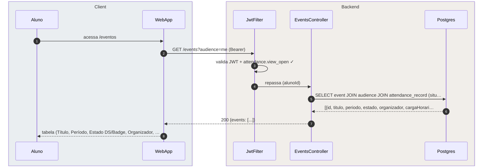
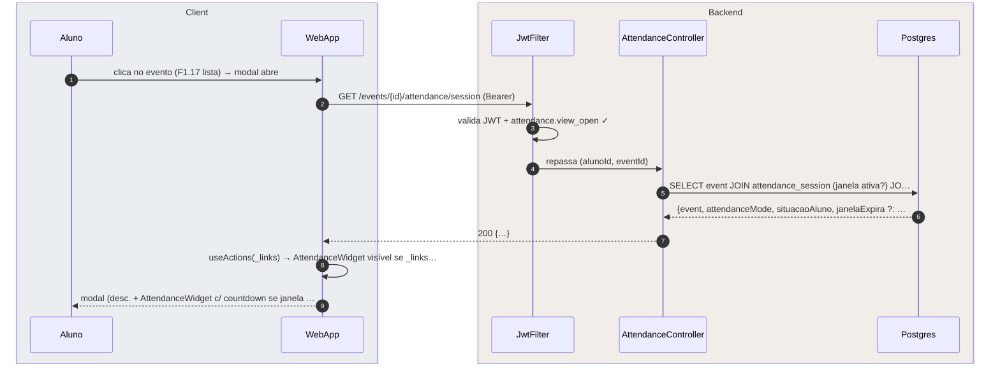
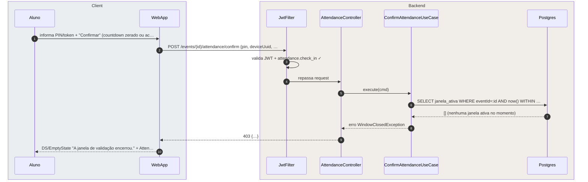

# US-F1-009 — Consultar Eventos e Confirmar Presença

| HU | Telas | Capabilities | API primária | Fonte |
|----|-------|--------------|--------------|-------|
| US-F1-009 | F1.17 `/eventos` · F1.18 `/eventos/:id/presenca` | `attendance.view_open` · `attendance.check_in` | `GET /events?audience=me` · `GET /events/{id}/attendance/session` · `POST /events/{id}/attendance/confirm` | `HUs/F1 — Aluno/US-F1-009-PRESENCA.md` · `endpoints_canonicos_presenca_eventos_v4.md` |

---

## Matriz de cobertura

| ID diagrama | Origem (CA / RN / sub-fluxo) | Tipo | Status |
|-------------|------------------------------|------|--------|
| F1.17-D01 | CA-01 · RN-F1.17-01 — `GET /events?audience=me` (lista com badges de estado e presença) | SEQUENCIA | gerado |
| F1.17-D02 | CA-02 · CA-03 · RN-F1.17-02 — `GET /events/{id}/attendance/session` (modal: _links.confirmar-presenca condicional) | SEQUENCIA | gerado |
| F1.18-D03 | CA-04 · RN-F1.18-01 · RN-F1.18-06 · RN-F1.18-08 — `POST /confirm` SECRET_SINGLE happy path (+ device binding + outbox) | SEQUENCIA | gerado |
| F1.18-D04 | CA-05 · RN-F1.18-02 — `POST /confirm` DUAL fase ENTRADA → `situacaoAluno: PARCIAL` | SEQUENCIA | gerado |
| F1.18-D05 | CA-06 · RN-F1.18-05 — `POST /confirm` fora da janela → 403 sem revelar política | ERRO | gerado |
| — | CA-07 · RN-F1.18-09 — aluno não autenticado redirecionado para /login (retorno à URL original) | DRY | → `F0/US-F0-001-LOGIN.md` F0.1-a |
| — | RN-F1.17-03 — AttendanceWidget renderiza variantes conforme `attendanceMode` (lógica client-side) | NAO_APLICAVEL | — |
| — | RN-F1.18-03 — Modo QR_SINGLE (mesmo endpoint `POST /confirm`, campo `token` em vez de `pin`) | DRY | → F1.18-D03 |
| — | RN-F1.18-04 — Modo QR_DUAL (mesmo padrão dual de D04, campo `token`) | DRY | → F1.18-D04 |
| — | RN-F1.18-07 — Countdown client-side (sem mensagem HTTP adicional, cálculo com `janelaExpira` recebida em D02) | NAO_APLICAVEL | — |
| — | RN-F1.18-08 — Outbox dispatch `presenca.confirmed` → geração de formativa/certificado | DRY | → `transversal/10.1-outbox-notificacao.md` |

---

## Referências DRY

| Padrão | Arquivo canônico |
|--------|-----------------|
| JWT validation + capability check | `F0/US-F0-001-LOGIN.md` F0.1-a |
| Redirect para /login com retorno à URL original (RN-F1.18-09) | `F0/US-F0-001-LOGIN.md` F0.1-a |
| Modos QR_SINGLE e QR_DUAL (mesmo endpoint POST, campo `token`) | F1.18-D03 e F1.18-D04 respectivamente |
| Outbox dispatcher (`presenca.confirmed` → formativa/certificado) | `transversal/10.1-outbox-notificacao.md` |

---

## Fora de sequência

| Item | Motivo |
|------|--------|
| RN-F1.17-03 — AttendanceWidget variantes (SECRET/QR × SINGLE/DUAL) | Renderização client-side baseada no campo `attendanceMode` da resposta de D02. Sem HTTP adicional. |
| RN-F1.18-07 — Countdown em fonte mono | Cálculo client-side usando `janelaExpira` (timestamp UTC) recebido em D02. Bloqueio local ao chegar a zero; o backend recusa via 403 (coberto em D05). |
| Geolocalização, geofence, trust score, BLE | Explicitamente fora do escopo v4.1. |

---

## F1.17-D01 — Listar eventos disponíveis para o aluno (GET /events?audience=me)

**Escopo:** CA-01 · RN-F1.17-01 — happy path — aluno vê tabela de eventos com badge de estado e situação de presença  
**Atores:** Aluno, WebApp, JwtFilter, EventsController, Postgres  
**Pré-condições:** aluno autenticado com `attendance.view_open`



**Notas:**
- `situacaoPresenca` por evento: `PENDENTE` / `PARCIAL` (DUAL fase ENTRADA concluída) / `COMPLETA`.
- Evento com `janelaAtiva: true` recebe badge adicional "Janela aberta" (success) na coluna situação.
- Se `events: []`, a UI exibe `DS/EmptyState` — mesmo fluxo HTTP, payload diferente.

**Lacunas:** nenhuma.

---

## F1.17-D02 — Modal de detalhe: GET /events/{id}/attendance/session

**Escopo:** CA-02 · CA-03 · RN-F1.17-02 — modal retorna detalhe do evento + session info; `_links.confirmar-presenca` condicional à janela ativa  
**Atores:** Aluno, WebApp, JwtFilter, AttendanceController, Postgres  
**Pré-condições:** aluno autenticado com `attendance.view_open`



**Notas:**
- `_links.confirmar-presenca` aparece **somente** se uma janela de validação está ativa no momento (RN-F1.17-02). Sem a link, o modal não exibe widget nem botão de confirmação (CA-03).
- `attendanceMode` determina a variante do `DS/AttendanceWidget`: `SECRET_SINGLE`, `SECRET_DUAL`, `QR_SINGLE`, `QR_DUAL` (RN-F1.17-03 — renderização client-side).
- `janelaExpira` (timestamp UTC) alimenta o `DS/Countdown` client-side. Sem round-trip adicional (RN-F1.18-07).
- CA-03 (janela fechada) usa a **mesma** rota HTTP — apenas `_links.confirmar-presenca` está ausente e `janelaExpira` é nulo.

**Lacunas:** nenhuma.

---

## F1.18-D03 — Confirmação de presença SECRET_SINGLE (POST /events/{id}/attendance/confirm)

**Escopo:** CA-04 · RN-F1.18-01 · RN-F1.18-06 · RN-F1.18-08 — happy path — aluno informa PIN + deviceUuid, presença registrada atomicamente com outbox  
**Atores:** Aluno, WebApp, JwtFilter, AttendanceController, ConfirmAttendanceUseCase, Postgres  
**Pré-condições:** `_links.confirmar-presenca` presente (D02); modo `SECRET_SINGLE`; janela de validação ativa

```mermaid
sequenceDiagram
    autonumber
    box rgba(230,245,255,0.3) Client
        participant Aluno
        participant WebApp
    end
    box rgba(255,245,230,0.3) Backend
        participant JwtFilter
        participant AttendanceController
        participant ConfirmAttendanceUseCase
        participant Postgres
    end

    Aluno->>WebApp: informa PIN + clica "Confirmar" (deviceUuid gerado clie…
    WebApp->>JwtFilter: POST /events/{id}/attendance/confirm {pin, deviceUuid, …
    JwtFilter->>JwtFilter: valida JWT + attendance.check_in ✓
    JwtFilter->>AttendanceController: repassa (alunoId, eventId, pin, deviceUuid, fase)
    AttendanceController->>ConfirmAttendanceUseCase: execute(cmd)
    ConfirmAttendanceUseCase->>Postgres: SELECT janela_ativa + pin_hash + devicePolicy WHERE eve…
    Postgres-->>ConfirmAttendanceUseCase: {attendanceMode: SECRET_SINGLE, pin_hash, devicePolicy:…
    ConfirmAttendanceUseCase->>Postgres: BEGIN; INSERT attendance_record {alunoId, eventId, devi…
    AttendanceController-->>WebApp: 200 OK {situacaoAluno: COMPLETA, _links}
    WebApp-->>Aluno: DS/AlertBanner success "Presença registrada!" + badge "…
```

**Notas:**
- Passo 1: `deviceUuid` gerado uma vez no client (localStorage / Keychain mobile) e enviado em toda confirmação. Não muda por sessão de navegador/app.
- Passo 8: `ON CONFLICT (eventId, deviceUuid)` é o guard de device binding (RN-F1.18-06). Em modo `devicePolicy: BIND`, o INSERT falha se outro aluno já usou o mesmo dispositivo no evento → `ROLLBACK` + HTTP 409.
- Passo 8: validação do `pin_hash` ocorre em memória no UseCase (BCrypt compare) antes de entrar na transação. Falha de PIN → 422 (não entra no BEGIN).
- Passo 8: `outbox_event(presenca.confirmed)` dispara geração de certificado/formativa assincronamente → `transversal/10.1-outbox-notificacao.md` (RN-F1.18-08).
- Modos **QR_SINGLE** e **QR_DUAL**: mesmo endpoint `POST /confirm`, campo `token` substitui `pin` — DRY.

**Lacunas:** nenhuma.

---

## F1.18-D04 — Confirmação DUAL fase ENTRADA (SECRET_DUAL / QR_DUAL)

**Escopo:** CA-05 · RN-F1.18-02 — fase ENTRADA de modo dual → `situacaoAluno: PARCIAL`; outbox somente após SAÍDA  
**Atores:** Aluno, WebApp, JwtFilter, AttendanceController, ConfirmAttendanceUseCase, Postgres  
**Pré-condições:** `_links.confirmar-presenca` com `fase: ENTRADA` presente (D02); janela de ENTRADA ativa; aluno sem registro de ENTRADA anterior

```mermaid
sequenceDiagram
    autonumber
    box rgba(230,245,255,0.3) Client
        participant Aluno
        participant WebApp
    end
    box rgba(255,245,230,0.3) Backend
        participant JwtFilter
        participant AttendanceController
        participant ConfirmAttendanceUseCase
        participant Postgres
    end

    Aluno->>WebApp: informa PIN de entrada + "Registrar Entrada"
    WebApp->>JwtFilter: POST /events/{id}/attendance/confirm {pin, deviceUuid, …
    JwtFilter->>JwtFilter: valida JWT + attendance.check_in ✓
    JwtFilter->>AttendanceController: repassa (alunoId, eventId, pin, deviceUuid, fase: ENTRADA)
    AttendanceController->>ConfirmAttendanceUseCase: execute(cmd)
    ConfirmAttendanceUseCase->>Postgres: SELECT janela_ENTRADA ativa + pin_entrada_hash + attend…
    Postgres-->>ConfirmAttendanceUseCase: {attendanceMode: SECRET_DUAL, pin_hash, entrada_existen…
    ConfirmAttendanceUseCase->>Postgres: BEGIN; INSERT attendance_record {alunoId, eventId, devi…
    AttendanceController-->>WebApp: 200 OK {situacaoAluno: PARCIAL, _links.confirmar-saida}
    WebApp-->>Aluno: "Entrada registrada. Confirme a saída quando solicitado…
```

**Notas:**
- Passo 7: se `entrada_existente` não for nulo (aluno já registrou entrada), o UseCase rejeita com 409 — idempotência protegida.
- Passo 8: **sem** `outbox_event` neste passo — o `presenca.confirmed` só é emitido após a SAÍDA completa (RN-F1.18-02). A fase SAÍDA usa o mesmo endpoint com `fase: SAIDA`.
- `_links.confirmar-saida` retornado em passo 9 habilita o widget de SAÍDA quando a janela de saída abrir (useActions — sem lógica hardcoded no frontend).
- Inelegibilidade: se a janela de ENTRADA expirar antes de o aluno confirmar, a janela de SAÍDA **não** aparece (`_links.confirmar-saida` ausente). Sem diagrama adicional — backend simplesmente não inclui o link.
- Modos **QR_DUAL**: mesmo fluxo, campo `token` substitui `pin` — DRY.

**Lacunas:** nenhuma.

---

## F1.18-D05 (ERRO) — Confirmação fora da janela de validação → 403

**Escopo:** CA-06 · RN-F1.18-05 — countdown zerou ou janela nunca abriu; backend retorna 403 sem revelar detalhes da política  
**Atores:** Aluno, WebApp, JwtFilter, AttendanceController, ConfirmAttendanceUseCase, Postgres  
**Pré-condições:** aluno autenticado; janela de validação expirada ou inativa no momento do POST



**Notas:**
- Passo 9: RFC 7807 Problem Details sem revelar hora de reabertura, configuração da janela ou PIN armazenado (RN-F1.18-05 — segurança).
- Passo 10: O `DS/AttendanceWidget` bloqueia inputs localmente via countdown (RN-F1.18-07). O backend é a autoridade final — o 403 é a segunda linha de defesa caso o countdown seja manipulado client-side.
- Rate limiting: `POST /events/{id}/attendance/confirm` deve ter rate limiter (Bucket4j) por `alunoId` — rejeições excessivas indicam força-bruta de PIN. Sem diagrama adicional (configuração cross-cutting).

**Lacunas:** nenhuma.
