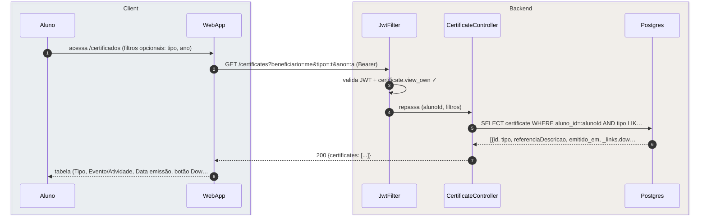
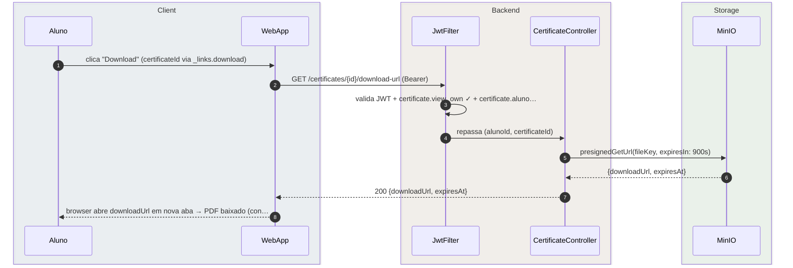

# US-F1-010 — Visualizar e Baixar Certificados Emitidos

| HU | Tela | Capability | API primária | Fonte |
|----|------|------------|--------------|-------|
| US-F1-010 | F1.19 `/certificados` | `certificate.view_own` | `GET /certificates?beneficiario=me` · `GET /certificates/{id}/download-url` | `HUs/F1 — Aluno/US-F1-010-CERTIFICADOS.md` · `fluxos_por_perfil.md` §2 F1.6 |

---

## Matriz de cobertura

| ID diagrama | Origem (CA / RN / sub-fluxo) | Tipo | Status |
|-------------|------------------------------|------|--------|
| F1.19-D01 | CA-01 · RN-F1.19-02 — `GET /certificates?beneficiario=me` (lista com filtros e _links.download) | SEQUENCIA | gerado |
| F1.19-D02 | CA-02 · RN-F1.19-03 — `GET /certificates/{id}/download-url` → MinIO presigned GET (15 min) | SEQUENCIA | gerado |
| F1.19-D03 | CA-03 · RN-F1.19-01 — `CertificateIssuerUseCase` background: gera PDF + SHA-256 + ED25519 + MinIO + outbox notificação | SEQUENCIA | gerado |
| — | RN-F1.19-04 — QR Code embutido no PDF (`/publico/verificar-certificado/:hash`) | DRY | → `F0/US-F0-007-VERIFICAR-CERTIFICADO.md` |
| — | RN-F1.19-05 — Imutabilidade (hash + assinatura permanecem; regra de persistência sem fluxo do aluno) | NAO_APLICAVEL | — |

---

## Referências DRY

| Padrão | Arquivo canônico |
|--------|-----------------|
| JWT validation + capability check | `F0/US-F0-001-LOGIN.md` F0.1-a |
| Outbox dispatcher (certificado.emitido → push + in-app) | `transversal/10.1-outbox-notificacao.md` |
| Verificação pública do QR Code (hash + ED25519) | `F0/US-F0-007-VERIFICAR-CERTIFICADO.md` |
| Emissão disparada por `presenca.confirmed` | `F1/US-F1-009-PRESENCA.md` F1.18-D03 |
| Emissão disparada por `formativa.approved` | `F1/US-F1-006-FORMATIVAS.md` |

---

## Fora de sequência

| Item | Motivo |
|------|--------|
| RN-F1.19-04 — QR Code embutido no PDF | Gerado durante `CertificateIssuerUseCase` (D03). Verificação pública via `/publico/verificar-certificado/:hash` já coberta em `F0/US-F0-007`. Sem fluxo adicional no contexto F1.19. |
| RN-F1.19-05 — Imutabilidade | Propriedade da persistência: hash e assinatura gravados uma vez, sem UPDATE. Não gera mensagens HTTP. |

---

## F1.19-D01 — Listar certificados do aluno (GET /certificates?beneficiario=me)

**Escopo:** CA-01 · RN-F1.19-02 — happy path — aluno vê tabela de certificados emitidos, filtrável por tipo e ano  
**Atores:** Aluno, WebApp, JwtFilter, CertificateController, Postgres  
**Pré-condições:** aluno autenticado com `certificate.view_own`



**Notas:**
- Filtros `tipo` e `ano` são opcionais — sem eles retorna todos os certificados do aluno.
- Se `certificates: []`, a UI exibe `DS/EmptyState` "Você ainda não possui certificados emitidos."
- `_links.download` por certificado: rel canônico que aponta para `GET /certificates/{id}/download-url`. Frontend usa `useActions` por item para renderizar o botão.
- Certificados são somente-leitura para o aluno: nenhum `_links.delete` ou `_links.edit` existe na resposta.

**Lacunas:** nenhuma.

---

## F1.19-D02 — Download do PDF via MinIO presigned URL

**Escopo:** CA-02 · RN-F1.19-03 — aluno clica "Download"; backend gera presigned GET URL de 15 min no MinIO  
**Atores:** Aluno, WebApp, JwtFilter, CertificateController, MinIO  
**Pré-condições:** `_links.download` presente (D01); aluno autenticado com `certificate.view_own`



**Notas:**
- Passo 3: `certificate.aluno_id = alunoId` é o guard IDOR — aluno não baixa certificado de outro.
- Passo 5: `presignedGetUrl` gera URL temporária (15 min / 900s) assinada com credenciais MinIO. O PDF não é exposto publicamente por URL permanente.
- Se a URL expirar (> 15 min desde o clique), novo clique em "Download" executa este mesmo fluxo e gera nova URL — conforme CA-02.
- O PDF retornado pelo MinIO contém QR Code com URL `/publico/verificar-certificado/:hash` (RN-F1.19-04 — DRY → `F0/US-F0-007-VERIFICAR-CERTIFICADO.md`).

**Lacunas:** nenhuma.

---

## F1.19-D03 — Emissão automática de certificado (CertificateIssuerUseCase — background)

**Escopo:** CA-03 · RN-F1.19-01 — processo background disparado por `outbox_event` após presença confirmada ou formativa aprovada  
**Atores:** OutboxScheduler, CertificateIssuerUseCase, Postgres, MinIO, NotificacaoDispatcher  
**Pré-condições:** `outbox_event` com `type IN ('presenca.confirmed', 'formativa.approved')` e `status=PENDING` existe na tabela

```mermaid
sequenceDiagram
    autonumber
    box rgba(240,240,255,0.3) Scheduled
        participant OutboxScheduler
        participant CertificateIssuerUseCase
    end
    box rgba(255,245,230,0.3) Persistence
        participant Postgres
        participant MinIO
    end
    box rgba(240,255,240,0.3) Notification
        participant NotificacaoDispatcher
    end

    OutboxScheduler->>Postgres: SELECT outbox_event WHERE type IN ('presenca.confirmed'…
    Postgres-->>OutboxScheduler: [{id, type, payload: {alunoId, referenciaId, tipo}}]
    OutboxScheduler->>CertificateIssuerUseCase: issue(alunoId, referenciaId, tipo)
    CertificateIssuerUseCase->>CertificateIssuerUseCase: gerar PDF (dados+QR Code) + SHA-256(pdf) + ED25519.sign…
    CertificateIssuerUseCase->>MinIO: PUT certificado_{hash}.pdf (upload via SDK interno)
    MinIO-->>CertificateIssuerUseCase: {fileKey, etag}
    CertificateIssuerUseCase->>Postgres: BEGIN; INSERT certificate {alunoId, tipo, referenciaId,…
    OutboxScheduler->>NotificacaoDispatcher: dispatch(certificado.emitido, alunoId, tipo)
    NotificacaoDispatcher->>Postgres: INSERT notificacao_in_app + enqueue push FCM (async)
    NotificacaoDispatcher-->>OutboxScheduler: enviado
```

**Notas:**
- Passo 4: self-call agrupa geração de PDF, cálculo SHA-256 e assinatura ED25519 — operações em memória no servidor. O QR Code (`/publico/verificar-certificado/:hash`) é embutido no PDF neste passo.
- Passo 7: `INSERT certificate` + `INSERT outbox_event` + `UPDATE outbox_event (PROCESSED)` são atômicos. Falha no MinIO (passo 5-6) interrompe antes do BEGIN — o `outbox_event` original permanece PENDING e será reprocessado no próximo ciclo (at-least-once delivery).
- Passo 10: `notificacao_in_app` incrementa o KpiCard de certificados no Dashboard (CA-03 / US-F1-001 TanStack Query invalida ao próximo poll ou SSE).
- O push FCM notifica: "Seu certificado de [atividade] foi emitido." (CA-03).
- Dispatch detalhado do outbox: `transversal/10.1-outbox-notificacao.md`.

**Lacunas:** nenhuma.
