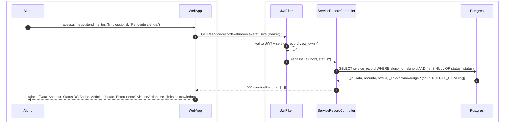

# US-F1-011 — Consultar Atendimentos e Dar Ciência

| HU | Tela | Capability | API primária | Fonte |
|----|------|------------|--------------|-------|
| US-F1-011 | F1.20 `/meus-atendimentos` | `service_record.view_own` | `GET /service-records?aluno=me` · `POST /service-records/{id}/acknowledge` | `HUs/F1 — Aluno/US-F1-011-ATENDIMENTOS.md` · `fluxos_por_perfil.md` §2 F1.8 |

---

## Matriz de cobertura

| ID diagrama | Origem (CA / RN / sub-fluxo) | Tipo | Status |
|-------------|------------------------------|------|--------|
| F1.20-D01 | CA-01 · CA-03 · RN-F1.20-01 · RN-F1.20-02 — `GET /service-records?aluno=me` (lista com filtro status, badges, _links.acknowledge condicional) | SEQUENCIA | gerado |
| F1.20-D02 | CA-02 · RN-F1.20-03 — `POST /service-records/{id}/acknowledge` (ciência + audit_log) | SEQUENCIA | gerado |
| — | RN-F1.20-04 — Outbox `atendimentos.created` → push + e-mail + in-app (disparado pela secretaria em F5; padrão idêntico ao transversal) | DRY | → `transversal/10.1-outbox-notificacao.md` |
| — | RN-F1.20-05 — Pendência no Dashboard (contagem de `PENDENTE_CIENCIA` retornada pelo BFF) | DRY | → `F1/US-F1-001-DASHBOARD.md` F1.1-D01 |

---

## Referências DRY

| Padrão | Arquivo canônico |
|--------|-----------------|
| JWT validation + capability check | `F0/US-F0-001-LOGIN.md` F0.1-a |
| Outbox dispatcher (atendimentos.created → push + e-mail + in-app) | `transversal/10.1-outbox-notificacao.md` |
| Pendência no Dashboard (countPendencias BFF) | `F1/US-F1-001-DASHBOARD.md` F1.1-D01 |

---

## Fora de sequência

| Item | Motivo |
|------|--------|
| RN-F1.20-04 — Criação e disparo de notificação pela secretaria | O trigger (F5.13) e o dispatch do Outbox são responsabilidade da fase F5. Do ponto de vista do aluno, o efeito é a notificação recebida — padrão coberto em `transversal/10.1`. |
| RN-F1.20-05 — Badge de pendência no Dashboard | Contagem de `PENDENTE_CIENCIA` já inclusa na query BFF do Dashboard (US-F1-001). Sem fluxo novo em F1.20. |

---

## F1.20-D01 — Listar atendimentos (GET /service-records?aluno=me)

**Escopo:** CA-01 · CA-03 · RN-F1.20-01 · RN-F1.20-02 — happy path — tabela de atendimentos com badge e filtro por status  
**Atores:** Aluno, WebApp, JwtFilter, ServiceRecordController, Postgres  
**Pré-condições:** aluno autenticado com `service_record.view_own`



**Notas:**
- CA-03 usa o mesmo endpoint com `status=PENDENTE_CIENCIA`: se resultado `[]`, UI exibe `DS/EmptyState` "Nenhum atendimento pendente."
- `_links.acknowledge` por item: presente apenas quando `status=PENDENTE_CIENCIA` — HATEOAS controla a renderização do botão sem lógica hardcoded no frontend.
- Atendimentos registrados pela secretaria (F5.13) chegam com `status=PENDENTE_CIENCIA` por padrão (RN-F1.20-01).
- O aluno não possui `_links` de criação ou contestação — somente visualização e ciência.

**Lacunas:** nenhuma.

---

## F1.20-D02 — Dar ciência (POST /service-records/{id}/acknowledge)

**Escopo:** CA-02 · RN-F1.20-03 — aluno confirma ciência; transição de estado + registro em audit_log com IP  
**Atores:** Aluno, WebApp, JwtFilter, ServiceRecordController, AcknowledgeUseCase, Postgres  
**Pré-condições:** `_links.acknowledge` presente (D01); `status=PENDENTE_CIENCIA`; aluno autenticado

```mermaid
sequenceDiagram
    autonumber
    box #e8f4fc Cliente
        participant Aluno
        participant WebApp
    end
    box #fff8ee Servidor
        participant JwtFilter
        participant ServiceRecordController
        participant AcknowledgeUseCase
        participant Postgres
    end

    Aluno->>WebApp: clica "Estou ciente" (serviceRecordId via _links.acknowledge href)
    WebApp->>JwtFilter: POST /service-records/{id}/acknowledge (Bearer)
    JwtFilter->>JwtFilter: valida JWT + service_record.view_own ✓
    JwtFilter->>ServiceRecordController: repassa (alunoId, serviceRecordId, ip=X-Forwarded-For)
    ServiceRecordController->>AcknowledgeUseCase: execute(cmd)
    AcknowledgeUseCase->>Postgres: BEGIN; UPDATE service_record SET status=CIENCIA_DADA, ciencia_em=now(), ciencia_ip=:ip) + INSERT audit_log + COMMIT
    ServiceRecordController-->>WebApp: 200 OK {id, status: CIENCIA_DADA, ciencia_em, _links}
    WebApp-->>Aluno: badge "Ciente" (success) + botão "Estou ciente" desaparece
```

**Notas:**
- Passo 6: `AND status=PENDENTE_CIENCIA` na cláusula WHERE é o guard de idempotência — se o aluno tentar confirmar duas vezes, UPDATE afeta 0 linhas. O UseCase deve verificar `rowsAffected=0` e retornar 409 (already acknowledged).
- Passo 6: `AND aluno_id=:alunoId` é o guard IDOR — aluno não confirma atendimento de outro.
- Passo 6: `ciencia_ip` armazena o IP para rastreabilidade legal (RN-F1.20-03). Extraído do header `X-Forwarded-For` (nginx reverse proxy) ou `RemoteAddr` como fallback.
- `INSERT audit_log` e `UPDATE` são atômicos (mesmo `BEGIN...COMMIT`): sem audit_log sem transição, sem transição sem audit_log.
- Passo 8: `_links` retornado sem `acknowledge` → frontend descarta botão via `useActions`. Pendência some do Dashboard no próximo poll/invalidação TanStack Query (RN-F1.20-05).

**Lacunas:** nenhuma.
