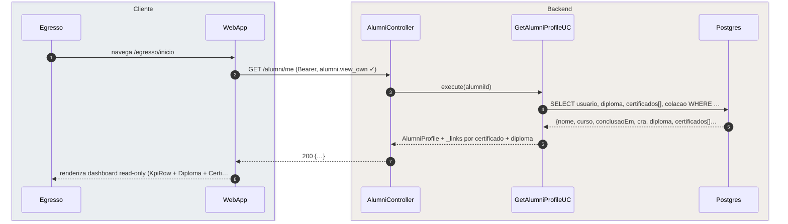
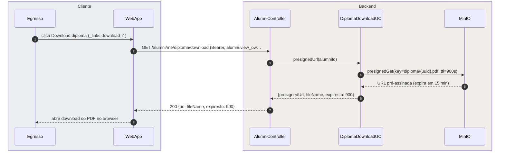
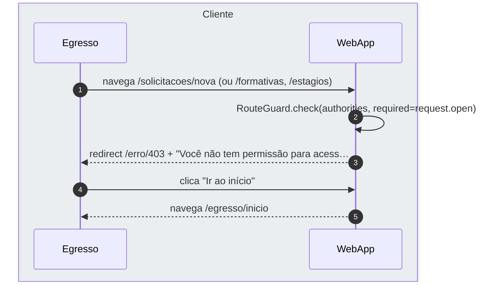

# US-F2-001 — Dashboard do Egresso e Reemissão de Certificados

| HU | Tela | Capability | API primária | Fonte |
|----|------|------------|-------------|-------|
| US-F2-001 | F2.1 — `/egresso/inicio` | `alumni.view_own` | `GET /alumni/me` | `fluxos_por_perfil.md` §3 F2.1 |

---

## Matriz de cobertura

| ID diagrama | Origem (CA/RN) | Tipo | Status |
|-------------|----------------|------|--------|
| F2.1-D01 | CA-02 — `GET /alumni/me` dashboard read-only | SEQUENCIA | gerado |
| F2.1-D02 | RN-F2.1-10 — `_links.download` diploma (presigned MinIO) | SEQUENCIA | gerado |
| F2.1-D03 | CA-03 — reemitir certificado (`_links.reemitir`, mesmo hash) | SEQUENCIA | gerado |
| F2.1-D04 | CA-04 — 403 egresso tenta rota exclusiva de aluno | ERRO | gerado |
| — | CA-05 — navegar para /perfil e /certificados | DRY | → US-F1-003, US-F1-010 |
| — | Trigger transição ALUNO→EGRESSO | DRY | → US-F5-005 (tela F5.11) |
| — | CA-06 — Loading (Skeleton) / EmptyState | NAO_APLICAVEL | ver §Fora de sequência |
| — | CA-07 — Acessibilidade WCAG 2.1 AA | NAO_APLICAVEL | ver §Fora de sequência |

---

## Referências DRY

- **CA-05 — Perfil:** `PATCH /users/me` + upload de foto (presigned MinIO) →
  [`F1/US-F1-003-PERFIL.md`](../F1/US-F1-003-PERFIL.md) (F1.3-D01, F1.3-D02).
  O egresso mantém `user.update_own_profile`; os fluxos são idênticos.

- **CA-05 — Certificados:** listagem + download presigned →
  [`F1/US-F1-010-CERTIFICADOS.md`](../F1/US-F1-010-CERTIFICADOS.md) (F1.19-D01, F1.19-D02).
  Mesmos endpoints; capability `alumni.view_own` é a que autentica ambos os perfis.

- **Trigger egresso (transição ALUNO→EGRESSO):** registrar colação/diploma,
  revogar capabilities de aluno, conceder `alumni.view_own`, `outbox_event` `egressos.graduated` →
  coberto em **US-F5-005** (tela F5.11). Este arquivo documenta somente o comportamento
  **após** a transição.

- **Dispatch `egressos.graduated`:** fluxo assíncrono de notificação →
  [`transversal/10.1-outbox-notificacao.md`](../transversal/10.1-outbox-notificacao.md) §10.1b.

---

## Fora de sequência

| CA/RN | Motivo |
|-------|--------|
| CA-06 — Skeleton (loading) | Estado TanStack Query `isFetching`; o backend executa o mesmo `GET /alumni/me` — sem fluxo distinto. |
| CA-06 — EmptyState (sem certificados) | Condicional de apresentação: `certificados[]` vazio retornado na resposta F2.1-D01 — sem nova chamada. |
| CA-07 — aria-readonly, H1/H2, aria-label em botões | Atributos HTML estáticos; nenhuma chamada backend específica. |
| RN-F2.1-02 — redirect `/erro/403` (client-side) | Parte do fluxo F2.1-D04 (RouteGuard); sem sequência backend adicional. |
| RN-F2.1-03 — rotas mantidas (/perfil, /certificados) | Reaproveitamento direto (DRY) → US-F1-003 e US-F1-010. |

---

## F2.1-D01 — GET /alumni/me — Dashboard read-only (happy path)

**Escopo:** Egresso autenticado acessa `/egresso/inicio`; WebApp carrega dados via `GET /alumni/me` e renderiza dashboard estritamente read-only com diploma, certificados e dados de colação.
**Atores:** Egresso, WebApp, AlumniController, GetAlumniProfileUC, Postgres
**Pré-condições:** JWT válido com `alumni.view_own`; `usuario.role = EGRESSO`; registro de diploma existe na base.



**Notas:**
- Passo 4: consulta restrita ao `alumniId` do JWT — sem acesso a dados de outros egressos ou listagem de turma (RN-F2.1-06).
- Passo 7: resposta HATEOAS — `_links.download` no objeto `diploma`; `_links.reemitir` por certificado. O frontend usa `useActions(resource)` para renderizar botões condicionalmente (RN-F2.1-09).
- Dashboard **estritamente read-only**: nenhum CTA de criação; todos os badges em variante `success`/`neutral` "Concluído" (RN-F2.1-04/05).

**Lacunas:** nenhuma.

---

## F2.1-D02 — Download Diploma (presigned MinIO)

**Escopo:** Egresso clica em "Download" do diploma; backend gera URL pré-assinada do MinIO para o PDF oficial sem regenerar o artefato.
**Atores:** Egresso, WebApp, AlumniController, DiplomaDownloadUC, MinIO
**Pré-condições:** `_links.download` presente na resposta F2.1-D01; arquivo `diploma/{uuid}.pdf` armazenado no MinIO pela secretaria (US-F5-005).



**Notas:**
- Passo 4: `ttl=900s` — URL gerada sob demanda; nenhum novo artefato criado (RN-F2.1-10).
- O PDF é o arquivo oficial armazenado pela secretaria ao registrar o diploma (US-F5-005 tela F5.11); não é regenerado nem reassinado.
- Diferença de F2.1-D03 (reemissão de certificado): diploma não tem hash/assinatura ED25519 — é documento institucional direto via MinIO presigned.

**Lacunas:** nenhuma.

---

## F2.1-D03 — Reemitir Certificado (presigned MinIO — mesmo hash/assinatura)

**Escopo:** Egresso clica em "Reemitir PDF" de um certificado; backend recupera o artefato já existente no MinIO e gera URL pré-assinada — **sem criar novo certificado** nem nova assinatura.
**Atores:** Egresso, WebApp, CertificateController, ReissueCertificateUC, Postgres, MinIO
**Pré-condições:** `_links.reemitir` presente para o certificado; `certificate.storage_key` aponta para PDF no MinIO com `estado = EMITIDO`.

```mermaid
sequenceDiagram
  autonumber
  box rgba(230,245,255,0.3) Cliente
    participant Egresso
    participant WebApp
  end
  box rgba(255,245,230,0.3) Backend
    participant CertCtrl as CertificateController
    participant ReissueUC as ReissueCertificateUC
    participant PG as Postgres
    participant MinIO
  end

  Egresso->>WebApp: clica Reemitir PDF (_links.reemitir ✓)
  WebApp->>CertCtrl: POST /certificates/{id}/reissue (Bearer, alumni.view_ow…
  CertCtrl->>ReissueUC: reissue(certId, alumniId)
  ReissueUC->>PG: SELECT certificate WHERE id=certId AND owner=alumniId
  PG-->>ReissueUC: {storage_key, hash, signature, estado=EMITIDO}
  ReissueUC->>MinIO: presignedGet(storage_key, ttl=900s)
  MinIO-->>ReissueUC: URL pré-assinada (expira em 15 min)
  ReissueUC-->>CertCtrl: {presignedUrl, hash, fileName, expiresIn: 900}
  CertCtrl-->>WebApp: 200 {…}
  WebApp-->>Egresso: download inicia; hash disponível para verificação pública
```

**Notas:**
- Passo 4–5: `owner = alumniId` previne IDOR — sem acesso a certificados de outros egressos (RN-F2.1-06).
- Passos 6–7: **sem novo certificado** — apenas URL pré-assinada para o artefato existente. Hash SHA-256 e assinatura ED25519 são os originais (RN-F2.1-07/08). Nenhum `INSERT certificate` ocorre.
- Passo 9: `_links.verify` aponta para `/publico/verificar-certificado/{hash}` — o certificado reemitido continua verificável publicamente (CA-03). Ver [`F0/US-F0-007-VERIFICAR-CERTIFICADO.md`](../F0/US-F0-007-VERIFICAR-CERTIFICADO.md).

**Lacunas:** nenhuma.

---

## F2.1-D04 — 403: Egresso tenta rota exclusiva de aluno (erro)

**Escopo:** Egresso (`role=EGRESSO`, sem `request.open`) tenta acessar `/solicitacoes/nova`; RouteGuard do frontend bloqueia antes mesmo de chamar o backend; botão "Ir ao início" redireciona para `/egresso/inicio`.
**Atores:** Egresso, WebApp
**Pré-condições:** JWT válido com `alumni.view_own`; `request.open` ausente nas authorities.



**Notas:**
- Passo 2: self-call no `WebApp` — RouteGuard verifica `authorities[]` do JWT em memória; nenhuma chamada ao backend é feita (RN-F2.1-02). A tela `/egresso/inicio` não expõe links para rotas exclusivas de aluno (RN-F2.1-04).
- Se a chamada ao backend ocorrer por bypass direto, `@PreAuthorize("hasAuthority('request.open')")` retorna `403 Problem Details` (`type: access_denied`) — corpo em `{title: "Acesso negado", detail: "Capability request.open ausente"}`.
- A tela `/erro/403` é coberta em [`F0/US-F0-005-ERRO.md`](../F0/US-F0-005-ERRO.md) (F0.5-b).

**Lacunas:** nenhuma.
