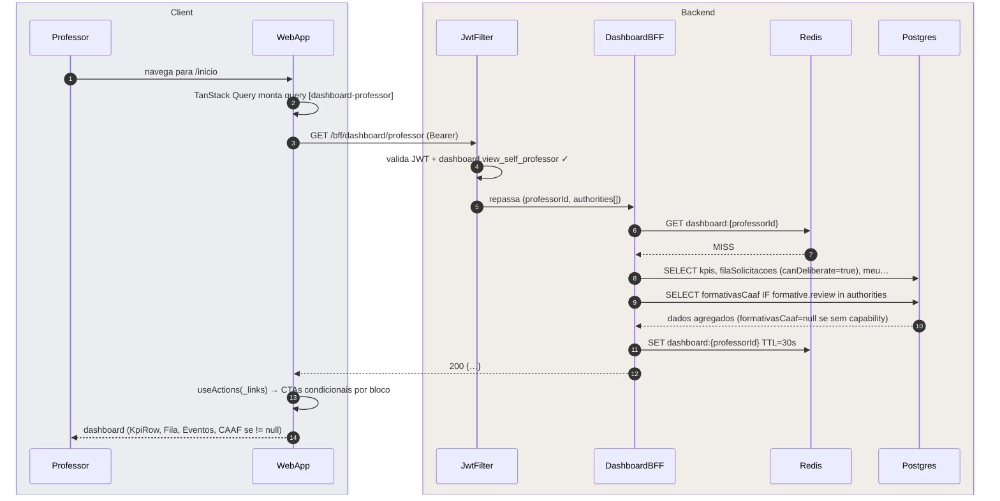
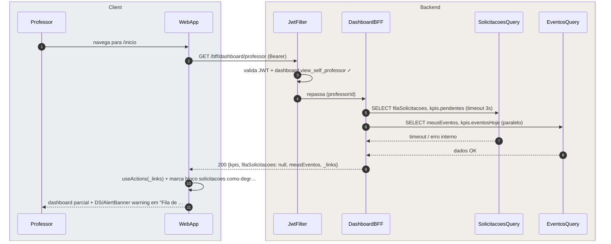

# US-F3-001 — Dashboard do Professor

| HU | Tela | Capability | API primária | Fonte |
|----|------|------------|--------------|-------|
| US-F3-001 | F3.1 — `/inicio` | `dashboard.view_self_professor` | `GET /bff/dashboard/professor` | `HUs/F3 — Professor/US-F3-001-DASHBOARD.md` · `fluxos_por_perfil.md` §4 F3.1 |

---

## Matriz de cobertura

| ID diagrama | Origem (CA / RN / sub-fluxo) | Tipo | Status |
|-------------|------------------------------|------|--------|
| F3.1-D01 | CA-01 · RN-F3.1-01 · RN-F3.1-02 · RN-F3.1-03 · RN-F3.1-04 · RN-F3.1-05 — carregamento inicial (cache MISS) | SEQUENCIA | gerado |
| F3.1-D02 | CA-04 · RN-F3.1-06 — degradação graciosa (módulo solicitações indisponível) | SEQUENCIA | gerado |
| — | CA-02 (KpiCard SLA urgentes — `slaUrgentes < now + 24h`) | DRY | → F3.1-D01 (`kpis.slaUrgentes` calculado pelo BFF antes de retornar) |
| — | CA-03 (evento ativo hoje — badge "Em andamento" + CTA "Operar evento") | DRY | → F3.1-D01 (`meusEventos[].estado=EM_ANDAMENTO` + `_links.operar` na resposta BFF) |
| — | RN-F3.1-01 (estrutura DashboardA — mesma rota `/inicio`, BFF contextual, UI cega a perfil) | DRY | → [`F1/US-F1-001-DASHBOARD.md` F1.1-D01](../F1/US-F1-001-DASHBOARD.md) |
| — | RN-F3.1-02 (KpiRow: pendências deliberar, formativas CAAF, eventos hoje, SLA warnings) | DRY | → F3.1-D01 (`kpis.*` na resposta BFF) |
| — | RN-F3.1-03 (bloco Formativas CAAF condicional por `formative.review`) | DRY | → F3.1-D01 (BFF retorna `formativasCaaf=null` se sem capability; bloco não renderizado) |
| — | RN-F3.1-04 (fila filtrada por `canDeliberate=true` para o professor) | DRY | → F3.1-D01 (query BFF filtra no SELECT) |
| — | RN-F3.1-05 (Meus eventos com `event.manage`; badge "Em andamento" para janela ativa) | DRY | → F3.1-D01 (`meusEventos[].estado` + `_links.operar` HATEOAS) |
| — | Skeleton (DS/Skeleton entre requisição e renderização) | NAO_APLICAVEL | — |
| — | Empty state (arrays vazios — `filaSolicitacoes: []`) | NAO_APLICAVEL | — |
| — | Responsividade (375 / 768 / 1280 px) | NAO_APLICAVEL | — |

---

## Referências DRY

| Padrão | Arquivo canônico |
|--------|-----------------|
| Blueprint DashboardA (mesma estrutura `/inicio` para todos os perfis) | [`F1/US-F1-001-DASHBOARD.md`](../F1/US-F1-001-DASHBOARD.md) F1.1-D01 |
| JWT validation + `dashboard.view_self_professor` FGAC | [`F0/US-F0-001-LOGIN.md`](../F0/US-F0-001-LOGIN.md) F0.1-a (JwtFilter) |
| Outbox dispatcher (notificação async) | [`transversal/10.1-outbox-notificacao.md`](../transversal/10.1-outbox-notificacao.md) |
| BFF aggregation pattern (P7) | `.cursor/skills/fullstack-sequence-diagrams/reference.md` §P7 |

---

## Fora de sequência

| Item | Motivo |
|------|--------|
| Skeleton (DS/Skeleton entre request e render) | Lógica puramente frontend: componente exibido enquanto `isLoading=true` no TanStack Query; sem chamada HTTP adicional. |
| Empty state (`filaSolicitacoes: []` ou `meusEventos: []`) | Mesmo fluxo de F3.1-D01; diferença é só o conteúdo do JSON retornado (arrays vazios). Sem variação de participantes ou mensagens. |
| Responsividade (375 / 768 / 1280 px) | Requisito de layout CSS; sem troca de mensagens entre camadas. |
| Badge SLA (célula em `status/danger` quando `prazo_em < now + 24h`) | Comparação client-side derivada de `kpis.slaUrgentes` já presente na resposta do BFF. |

---

## F3.1-D01 — Carregamento inicial do dashboard (happy path — cache MISS)

**Escopo:** happy path — professor acessa `/inicio`; cache Redis expirado ou ausente  
**Atores:** Professor, WebApp, JwtFilter, DashboardBFF, Redis, Postgres  
**Pré-condições:** professor autenticado com `dashboard.view_self_professor`; access token válido; capabilities podem incluir `event.manage`, `request.deliberate` e opcionalmente `formative.review`

**Notas:**
- Passos 8–9: o BFF executa as queries em paralelo (coroutines / `Promise.all`); a query de `formativasCaaf` só é disparada se `formative.review` estiver nas `authorities[]` extraídas do JWT — professores sem vínculo à CAAF nunca recebem esse bloco (RN-F3.1-03).
- Passo 10: `formativasCaaf=null` é retornado no JSON quando a capability está ausente; o frontend interpreta `null` como ausência do bloco — sem renderização, sem placeholder.
- Passo 12: `meusEventos[].estado=EM_ANDAMENTO` aciona badge "Em andamento" e `_links.operar` disponibiliza o CTA "Operar evento" somente nos cards ativos (CA-03). O `useActions` oculta o botão se o link estiver ausente (RN-F3.1-05).
- Passo 12: `kpis.slaUrgentes` conta solicitações com `prazo_em < now + 24h`; o KpiCard exibe badge warning no client-side (CA-02 — DRY, sem HTTP extra).
- `filaSolicitacoes` é filtrada no BFF por `canDeliberate=true` para o `professorId` corrente — um professor não vê solicitações atribuídas a outro (RN-F3.1-04).

**Lacunas:** nenhuma.

---

## F3.1-D02 — Degradação graciosa (módulo de solicitações indisponível)

**Escopo:** erro parcial de módulo — CA-04, RN-F3.1-06  
**Atores:** Professor, WebApp, JwtFilter, DashboardBFF, SolicitacoesQuery, EventosQuery  
**Pré-condições:** módulo de solicitações lança timeout ou 503; módulos de eventos e KPIs respondem normalmente

**Notas:**
- Passo 9: o BFF retorna `HTTP 200` mesmo com módulo parcialmente degradado; `filaSolicitacoes: null` sinaliza ao frontend que o bloco deve exibir `DS/AlertBanner warning` (RN-F3.1-06). Os blocos de eventos e formativas CAAF (se aplicável) renderizam normalmente.
- Passo 10: `DS/AlertBanner` exibe "Não foi possível carregar as solicitações no momento." — CA-04. O professor conserva acesso a todos os demais blocos.
- O BFF usa `try/catch` isolado por sub-query dentro do agregador; a falha de um módulo não cancela os demais (mesma política de F1.1-D03).

**Lacunas:** nenhuma.
