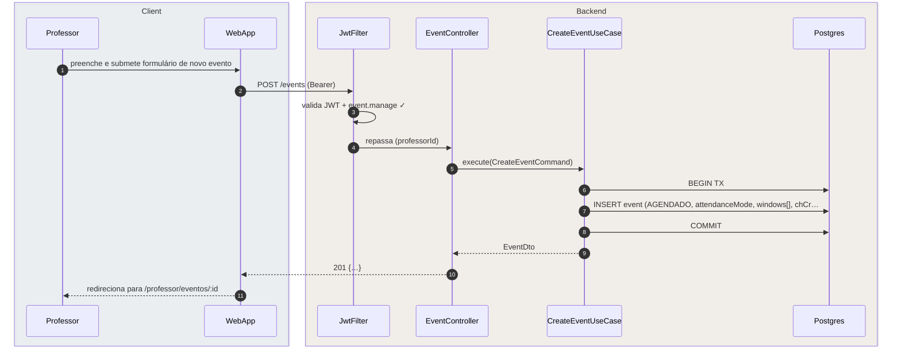
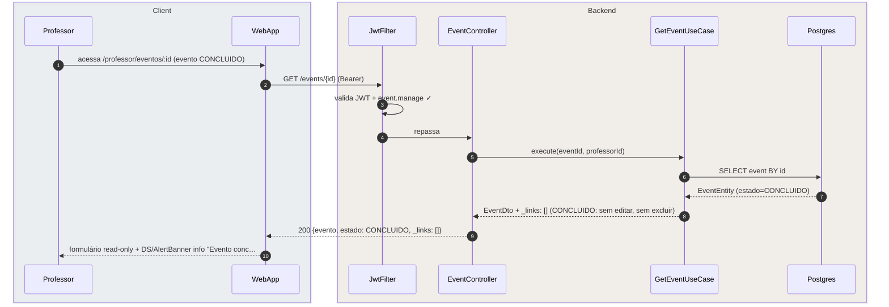
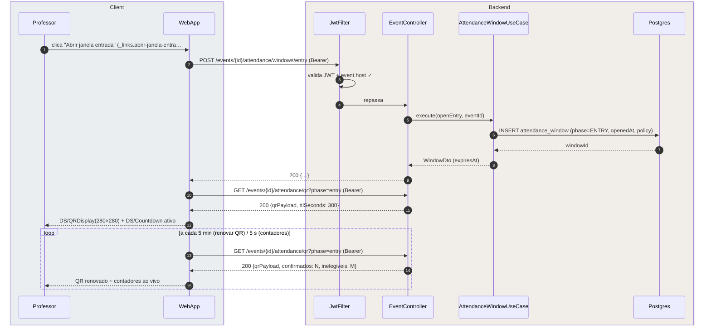
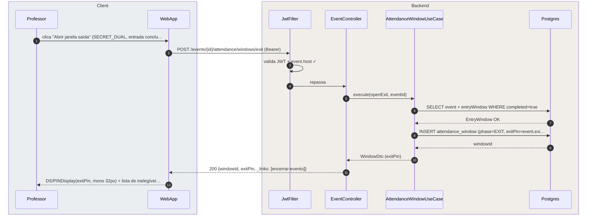
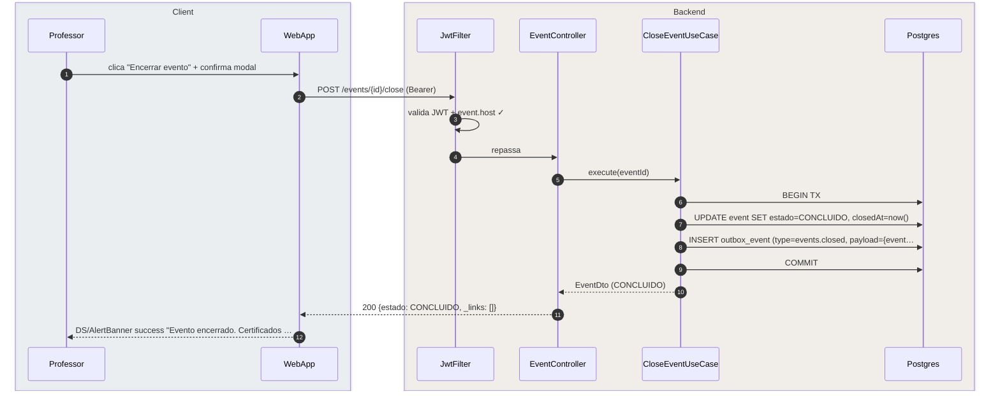
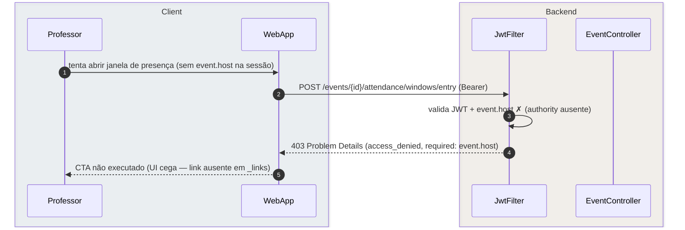

# US-F3-002 — Criar, Editar e Operar Eventos Formativos (v4.1)

| HU | Telas | Capability | API primária | Fonte |
|----|-------|------------|--------------|-------|
| US-F3-002 | F3.2a `/professor/eventos` · F3.2b `/professor/eventos/:id` · F3.2c `/professor/eventos/:id/operacao` | `event.manage` (CRUD) · `event.host` (operação ao vivo) | `GET/POST /events` · `GET/PATCH /events/{id}` · endpoints presença v4.1 | `HUs/F3 — Professor/US-F3-002-EVENTOS.md` · `fluxos_por_perfil.md` §4 F3.2 · `endpoints_canonicos_presenca_eventos_v4.md` |

---

## Matriz de cobertura

| ID diagrama | Origem (CA / RN / sub-fluxo) | Tipo | Status |
|-------------|------------------------------|------|--------|
| F3.2-D01 | CA-01 · RN-F3.2-02 · RN-F3.2-03 · RN-F3.2-04 · RN-F3.2-07 — criar evento (POST /events) | SEQUENCIA | gerado |
| F3.2-D02 | CA-03 · RN-F3.2-05 · RN-F3.2-06 — detalhe evento CONCLUIDO (imutável + _links condicional) | SEQUENCIA | gerado |
| F3.2-D03 | CA-04 · CA-06 · RN-F3.2-08 · RN-F3.2-09 · RN-F3.2-11 · RN-F3.2-12 — painel QR_SINGLE: abrir janela + QR + polling | SEQUENCIA | gerado |
| F3.2-D04 | CA-05 · RN-F3.2-10 — painel SECRET_DUAL: abrir janela saída + PIN display | SEQUENCIA | gerado |
| F3.2-D05 | CA-07 · RN-F3.2-13 — encerrar evento + outbox (CONCLUIDO) | SEQUENCIA | gerado |
| F3.2-ERRO | RN-F3.2-08 (event.host ausente) — 403 FGAC ao tentar operar janela | ERRO | gerado |
| — | CA-02 (janelas DUAL no formulário) | DRY | → F3.2-D01 (mesmo fluxo POST; payload inclui `windows[]` com sub-janela entrada + saída obrigatórias) |
| — | CA-06 (contadores ao vivo 5s) | DRY | → F3.2-D03 (loop de polling inclui `confirmados`/`inelegiveis` na resposta) |
| — | RN-F3.2-01 (lista `/professor/eventos` filtrada `onlyMine=true`) | DRY | → GET /events?onlyMine=true — padrão HATEOAS GET; `_links.novoEvento` presente se `event.manage ✓` |
| — | RN-F3.2-06 (excluir via `_links.excluir` apenas em AGENDADO) | DRY | → F3.2-D02 (`_links.excluir` ausente em CONCLUIDO) · DELETE /events/{id} segue mesmo padrão HATEOAS |
| — | RN-F3.2-14 (tela operação otimizada para projeção 1280px) | NAO_APLICAVEL | — |
| — | Geolocalização / geofence · trust score · aula regular | NAO_APLICAVEL | — |
| — | DS/Skeleton (F3.2a) · empty state (lista vazia) | NAO_APLICAVEL | — |

---

## Referências DRY

| Padrão | Arquivo canônico |
|--------|-----------------|
| JWT validation + FGAC (`event.manage` / `event.host`) | [`F0/US-F0-001-LOGIN.md`](../F0/US-F0-001-LOGIN.md) F0.1-a (JwtFilter) |
| Outbox dispatcher (notificação de certificado/formativa após encerramento) | [`transversal/10.1-outbox-notificacao.md`](../transversal/10.1-outbox-notificacao.md) |
| Emissão de certificado (trigger background após `events.closed`) | [`transversal/10.4-certificado-emissao.md`](../transversal/10.4-certificado-emissao.md) |
| Confirmação de presença pelo aluno (modos QR/PIN) | [`F1/US-F1-009-PRESENCA.md`](../F1/US-F1-009-PRESENCA.md) F1.18-D03..D05 |
| Endpoints canônicos presença v4.1 | `foundationDocs/analysis/endpoints_canonicos_presenca_eventos_v4.md` |

---

## Fora de sequência

| Item | Motivo |
|------|--------|
| RN-F3.2-14 — tela de operação para projeção (1280px, alto contraste) | Requisito de layout CSS; sem troca de mensagens entre camadas. |
| Geolocalização / geofence — fora de escopo v4.1 | Explicitamente removido da especificação (§5 HU). |
| Trust score — fora de escopo v4.1 | Idem. |
| Aula regular / chamada diária | Competência de SIGA / UFPR Virtual; fora deste módulo. |
| DS/Skeleton (F3.2a loading) | Lógica puramente frontend: componente exibido enquanto `isLoading=true`; sem chamada HTTP adicional. |
| Empty state (lista de eventos vazia) | Mesmo fluxo GET /events?onlyMine=true; diferença é apenas `items: []` na resposta. |

---

## F3.2-D01 — Criar evento (happy path — POST /events)

**Escopo:** happy path — professor com `event.manage` submete formulário de criação  
**Atores:** Professor, WebApp, JwtFilter, EventController, CreateEventUseCase, Postgres  
**Pré-condições:** professor autenticado com `event.manage`; acessou `/professor/eventos` onde `_links.novoEvento` está presente

**Notas:**
- Passo 5: `CreateEventUseCase` valida antes do INSERT: `fimEm > inicioEm`, janelas dentro do intervalo do evento e `chCreditadas > 0` (RN-F3.2-07). Se inválido → 422 Unprocessable Entity (Problem Details); nenhum INSERT ocorre.
- Passo 7: para `attendanceMode = QR_DUAL` ou `SECRET_DUAL` (CA-02), o payload inclui `windows: [{phase: ENTRY, ...}, {phase: EXIT, ...}]`; ambas as sub-janelas são obrigatórias. O fluxo é idêntico; apenas o payload do POST difere.
- Passo 10: `_links.excluir` presente porque estado = `AGENDADO` (RN-F3.2-06); ausente para eventos `EM_ANDAMENTO` ou `CONCLUIDO`.

**Lacunas:** nenhuma.

---

## F3.2-D02 — Detalhe evento CONCLUIDO (imutável + _links condicional por estado)

**Escopo:** professor acessa detalhe de evento encerrado — campos read-only, _links vazios  
**Atores:** Professor, WebApp, JwtFilter, EventController, GetEventUseCase, Postgres  
**Pré-condições:** professor autenticado com `event.manage`; evento existe com `estado = CONCLUIDO`

**Notas:**
- Passo 8: o HATEOAS assembler do `GetEventUseCase` suprime `_links.editar` e `_links.excluir` quando `estado = CONCLUIDO` (RN-F3.2-05/06). Para `estado = AGENDADO`, ambos os links estariam presentes; para `EM_ANDAMENTO`, apenas campos operacionais (janelas) seriam editáveis via PATCH.
- RN-F3.2-06 (excluir via DELETE): o frontend só exibe o botão "Excluir" se `_links.excluir` estiver presente. A chamada `DELETE /events/{id}` → `204 No Content` segue o mesmo padrão HATEOAS; não gera diagrama separado por ser trivial.
- Passo 10: `DS/AlertBanner info` informa o professor sobre a imutabilidade; nenhum botão de edição é exibido (`useActions(_links)` retorna lista vazia).

**Lacunas:** nenhuma.

---

## F3.2-D03 — Painel de operação QR_SINGLE: abrir janela + QR + polling

**Escopo:** professor abre janela de entrada em modo QR_SINGLE, obtém QR e monitora contadores em tempo real  
**Atores:** Professor, WebApp, JwtFilter, EventController, AttendanceWindowUseCase, Postgres  
**Pré-condições:** professor com `event.host`; evento `EM_ANDAMENTO`; `_links.abrir-janela-entrada` presente na resposta anterior

**Notas:**
- Passo 5: `AttendanceWindowUseCase` valida internamente que `event.estado = EM_ANDAMENTO` e que a janela de entrada não foi aberta anteriormente (RN-F3.2-11); se inválido → 409 Conflict.
- Passos 10–12: o GET de QR é chamado imediatamente após o POST da janela; todas as requisições HTTP passam pelo JwtFilter (validação JWT em cada chamada) — exibido apenas na primeira para clareza do diagrama.
- Loop: QR renovado a cada 5 min (TTL do token, RN-F3.2-09); contadores (`confirmados`, `inelegiveis`) atualizados a cada 5 s (RN-F3.2-12). Na prática, estas são duas chamadas separadas; o diagrama as mostra consolidadas para brevidade.
- Para `QR_DUAL`: ao concluir a fase de entrada, `_links.abrir-janela-saida` aparece; o professor repete o fluxo com `POST .../windows/exit` e exibe `DS/QRDisplay` para a fase de saída — mesmo padrão que D03, endpoint `.../qr?phase=exit`.

**Lacunas:** nenhuma.

---

## F3.2-D04 — Painel operação SECRET_DUAL: abrir janela saída + PIN display

**Escopo:** professor abre a fase de saída em modo SECRET_DUAL após entrada concluída  
**Atores:** Professor, WebApp, JwtFilter, EventController, AttendanceWindowUseCase, Postgres  
**Pré-condições:** professor com `event.host`; evento `EM_ANDAMENTO`; fase de entrada já concluída; `_links.abrir-janela-saida` presente

**Notas:**
- Passo 5: o UseCase verifica que a `entryWindow` está com `completed=true` antes de abrir a saída; alunos que não completaram a entrada ficam inelegíveis (`canExit=false`) e aparecem na lista ao vivo (RN-F3.2-10).
- Passo 8: `exitPin` é o PIN configurado pelo professor no formulário do evento ou gerado pelo sistema; já está armazenado no registro do evento — não é gerado neste momento.
- Para `SECRET_SINGLE`: apenas `POST .../windows/entry` é necessário; não há fase de saída. O PIN de entrada é exibido em DS/PINDisplay com o mesmo padrão.

**Lacunas:** nenhuma.

---

## F3.2-D05 — Encerrar evento + outbox (emissão de certificados)

**Escopo:** professor encerra o evento; backend transiciona para CONCLUIDO e enfileira emissão de certificados via outbox  
**Atores:** Professor, WebApp, JwtFilter, EventController, CloseEventUseCase, Postgres  
**Pré-condições:** professor com `event.host`; evento `EM_ANDAMENTO`; `_links.encerrar-evento` presente

**Notas:**
- Passos 6–9: transação atômica — o estado `CONCLUIDO` e o `outbox_event` são gravados na mesma TX. Se o COMMIT falhar, nenhum certificado é emitido (at-least-once garantido pelo outbox).
- O `OutboxDispatcher` (a cada 5 s) lê o `outbox_event 'events.closed'` e aciona o `CertificateIssuerUseCase` para cada aluno com `attendance_session.completedAt IS NOT NULL`. Esse fluxo completo está em → [`transversal/10.4-certificado-emissao.md`](../transversal/10.4-certificado-emissao.md).
- Encerramento automático: o scheduler também pode acionar `CloseEventUseCase` ao cruzar `scheduledEnd` do evento — mesmo fluxo, sem ação do professor.

**Lacunas:** nenhuma.

---

## F3.2-ERRO — 403 FGAC: tentativa de operar janela sem event.host

**Escopo:** professor (ou usuário) sem `event.host` tenta acionar janela de presença  
**Atores:** Professor, WebApp, JwtFilter, EventController  
**Pré-condições:** JWT válido; `event.host` ausente nas authorities; UI cega (link ausente), mas POST direto ou sessão expirada pode gerar a chamada

**Notas:**
- Passo 5: em condições normais, o frontend nunca chega a este estado porque `useActions(_links)` suprime o botão "Abrir janela entrada" quando `_links.abrir-janela-entrada` está ausente (HATEOAS UI cega). O 403 é defesa em profundidade.
- Se o professor possui `event.manage` mas não `event.host` em seus próprios eventos: a regra RN-F3.2-08 equipara `event.manage` a `event.host` para o organizador do evento. O conflito só ocorre quando outro usuário tenta operar um evento de terceiro com apenas `event.manage`.

**Lacunas:** nenhuma.
