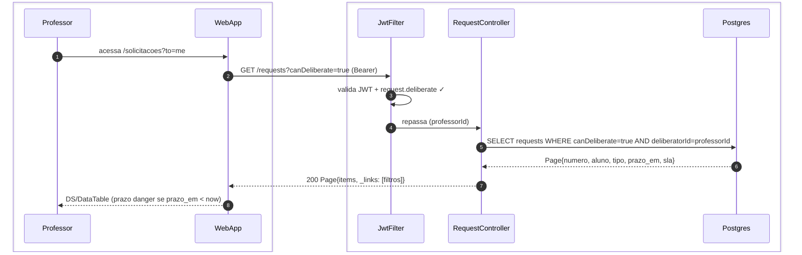
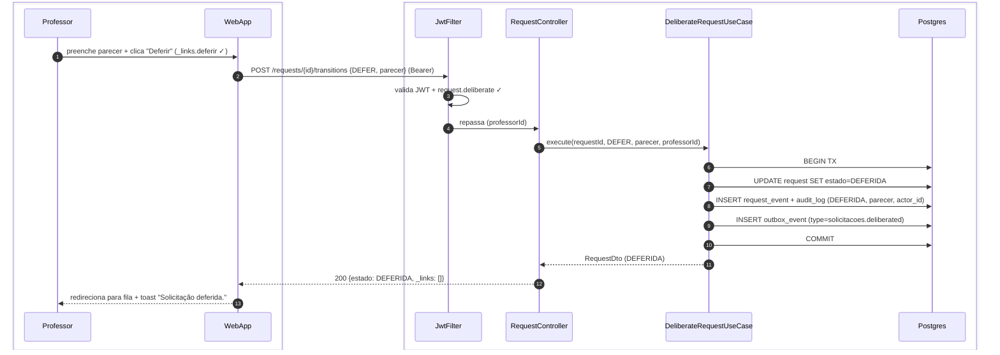
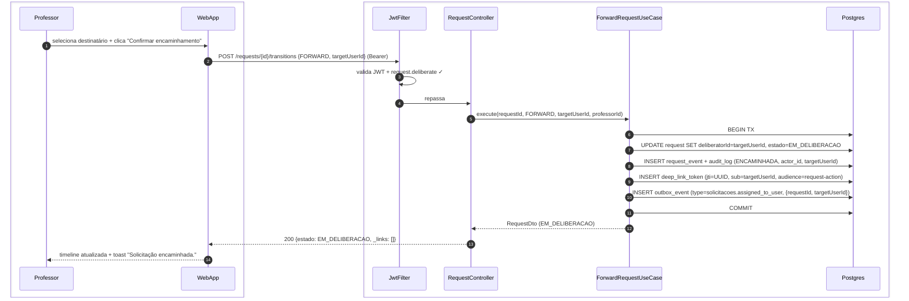
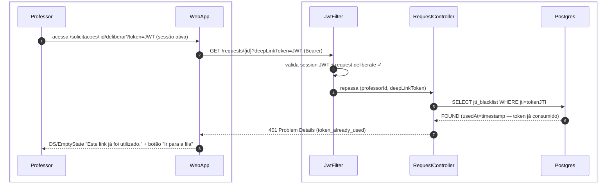
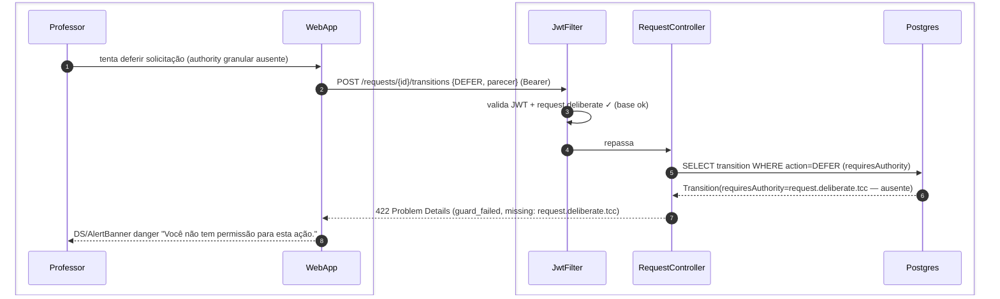

# US-F3-003 — Deliberar Solicitações (Fila + Deep-link por E-mail)

| HU | Telas | Capability | API primária | Fonte |
|----|-------|------------|--------------|-------|
| US-F3-003 | F3.3 `/solicitacoes?to=me` · F3.4 `/solicitacoes/:id/deliberar` | `request.deliberate` | `GET /requests?canDeliberate=true` · `POST /requests/{id}/transitions` | `HUs/F3 — Professor/US-F3-003-DELIBERAR-SOLICITACOES.md` · `fluxos_por_perfil.md` §4 F3.3–F3.4 |

---

## Matriz de cobertura

| ID diagrama | Origem (CA / RN / sub-fluxo) | Tipo | Status |
|-------------|------------------------------|------|--------|
| F3.3-D01 | CA-01 · RN-F3.3-01 · RN-F3.3-02 — fila de deliberação (GET /requests?canDeliberate=true) | SEQUENCIA | gerado |
| F3.4-D02 | CA-03 · RN-F3.4-03 · RN-F3.4-05 · RN-F3.4-08 — deferir solicitação + TX outbox | SEQUENCIA | gerado |
| F3.4-D03 | CA-04 · RN-F3.4-01 · RN-F3.4-02 — deep-link: professor não logado (preview → login → validate) | SEQUENCIA | gerado |
| F3.4-D04 | CA-06 · RN-F3.4-06 — encaminhar (FORWARD + novo JWT 1-uso + outbox) | SEQUENCIA | gerado |
| F3.4-ERRO-a | CA-05 · RN-F3.4-05 — deep-link JTI blacklisted (401 token_already_used) | ERRO | gerado |
| F3.4-ERRO-b | RN-F3.4-05 — authority/guard inválido ao tentar transição (422 guard_failed) | ERRO | gerado |
| — | CA-02 (navegação da fila para /solicitacoes/:id/deliberar) | DRY | → F3.3-D01 (clique na linha) · F3.4-D02 (GET /requests/{id} antes do POST, _links determinam ações disponíveis — RN-F3.4-03) |
| — | RN-F3.3-03 (ações em lote `batchDeliberate=true`) | DRY | → mesmo endpoint POST /requests/{id}/transitions chamado N vezes; sem fluxo novo |
| — | RN-F3.4-07 (solicitar ajustes → estado EM_AJUSTE) | DRY | → F3.4-D02 (mesmo TX pattern com `action=REQUEST_ADJUSTMENT`; outbox `solicitacoes.adjustment_requested` → aluno recebe push) |
| — | Outbox dispatch (push/e-mail pós-DEFER e pós-FORWARD) | DRY | → [`transversal/10.1-outbox-notificacao.md`](../transversal/10.1-outbox-notificacao.md) |
| — | CA-07 / RN-F3.4-04 (parecer obrigatório, mín. 20 chars no Indeferir) | NAO_APLICAVEL | — |
| — | RN-F3.4-09 (painel Textarea sticky no rodapé / bottom sheet mobile) | NAO_APLICAVEL | — |

---

## Referências DRY

| Padrão | Arquivo canônico |
|--------|-----------------|
| JWT 1-uso (audience + JTI blacklist) | [`F0/US-F0-001-LOGIN.md`](../F0/US-F0-001-LOGIN.md) F0.1-e (deep-link) |
| Outbox dispatcher (notificação pós-deliberação) | [`transversal/10.1-outbox-notificacao.md`](../transversal/10.1-outbox-notificacao.md) |
| Login F0.1 (referenciado em F3.4-D03 passo 5) | [`F0/US-F0-001-LOGIN.md`](../F0/US-F0-001-LOGIN.md) F0.1-a |
| HATEOAS `useActions` / `_links` | [`F1/US-F1-001-DASHBOARD.md`](../F1/US-F1-001-DASHBOARD.md) F1.1-D01 |
| Detalhe aluno (view da solicitação) | [`F1/US-F1-005-SOLICITACOES.md`](../F1/US-F1-005-SOLICITACOES.md) F1.9-D06 |

---

## Fora de sequência

| Item | Motivo |
|------|--------|
| CA-07 — parecer obrigatório (campo Textarea vazio) | Validação client-side (React Hook Form + Zod); nenhuma chamada HTTP é realizada. |
| RN-F3.4-04 — mínimo de 20 caracteres para Indeferir | Idem — validação Zod antes do POST. Erro exibido via `DS/Textarea` borda danger. |
| RN-F3.4-09 — painel sticky (desktop) / bottom sheet (mobile) | Requisito de layout CSS; sem troca de mensagens entre camadas. |

---

## F3.3-D01 — Fila de deliberação (GET /requests?canDeliberate=true)

**Escopo:** professor acessa `/solicitacoes?to=me` e obtém lista filtrada por `canDeliberate=true`  
**Atores:** Professor, WebApp, JwtFilter, RequestController, Postgres  
**Pré-condições:** professor autenticado com `request.deliberate`



**Notas:**
- Passo 5: o backend calcula `canDeliberate` com base no workflow atual da solicitação + `requiresAuthority` da transição pendente × authorities do `professorId`. Solicitações de outros deliberantes são invisíveis (RN-F3.3-01).
- Passo 7: `prazo_em < now` é computado pelo frontend ao renderizar a célula de prazo (badge danger); sem HTTP extra (RN-F3.3-02).
- CA-02: clicar em uma linha navega para `/solicitacoes/:id/deliberar` → WebApp faz `GET /requests/{id}` (Bearer) → retorna `RequestDto + _links` com as ações disponíveis. O _links determina quais botões são exibidos (RN-F3.4-03) — mesmo padrão HATEOAS de F3.4-D02.

**Lacunas:** nenhuma.

---

## F3.4-D02 — Deferir solicitação (POST /transitions DEFER + TX outbox)

**Escopo:** professor delibera `DEFER` via sistema — transição workflow + TX atômica + outbox  
**Atores:** Professor, WebApp, JwtFilter, RequestController, DeliberateRequestUseCase, Postgres  
**Pré-condições:** professor autenticado com `request.deliberate`; `_links.deferir` presente na resposta de GET /requests/{id}; parecer preenchido (≥1 char)



**Notas:**
- Passo 5: `DeliberateRequestUseCase` valida internamente (RN-F3.4-05): (a) authority `request.deliberate` × `Transition.requiresAuthority`, (b) guard do workflow satisfeito, (c) JTI não está na blacklist quando oriundo de deep-link. Qualquer falha → 422 sem executar TX (ver F3.4-ERRO-b).
- Passos 6–10: transação atômica — `UPDATE estado`, `INSERT request_event`, `INSERT audit_log` e `INSERT outbox_event` gravados em uma única TX (padrão P4). Se o COMMIT falhar, nenhum evento é emitido.
- Passo 9: o `OutboxDispatcher` (a cada 5 s) consome `solicitacoes.deliberated` e dispara push/e-mail ao aluno. Fluxo completo → [`transversal/10.1-outbox-notificacao.md`](../transversal/10.1-outbox-notificacao.md).
- `RN-F3.4-07` — Solicitar ajustes: mesmo fluxo com `action=REQUEST_ADJUSTMENT`; `UPDATE request SET estado=EM_AJUSTE`; outbox `solicitacoes.adjustment_requested` → aluno recebe push para corrigir (DRY — não gera diagrama separado).
- `RN-F3.4-08`: `request_event` e `audit_log` são imutáveis após COMMIT — sem UPDATE/DELETE permitidos nessas tabelas.

**Lacunas:** nenhuma.

---

## F3.4-D03 — Deep-link por e-mail: professor não logado (preview → login → validar token)

**Escopo:** professor acessa deep-link sem sessão ativa — modo preview, login e retorno com ações liberadas  
**Atores:** Professor, WebApp, JwtFilter, RequestController, Postgres  
**Pré-condições:** professor recebeu e-mail com URL `/solicitacoes/:id/deliberar?token=JWT`; JWT 1-uso com `audience=request-action`, `TTL=7d`, `JTI` único; professor não possui sessão ativa

```mermaid
sequenceDiagram
    autonumber
    box #e8f4fc Cliente
        participant Professor
        participant WebApp
    end
    box #fff8ee Servidor
        participant JwtFilter
        participant RequestController
        participant Postgres
    end

    Professor->>WebApp: clica link do e-mail (/solicitacoes/:id/deliberar?token=JWT)
    WebApp->>WebApp: detecta ausência de sessão → modo preview (sem chamada autenticada)
    WebApp-->>Professor: tela preview read-only + DS/AlertBanner info "Faça login para deliberar esta solicitação."
    Professor->>WebApp: clica "Fazer login" → /login?returnUrl=/solicitacoes/:id/deliberar?token=JWT
    WebApp-->>Professor: fluxo login F0.1 (access token + refresh emitidos; ver F0.1-a)
    Professor->>WebApp: retorna para /solicitacoes/:id/deliberar?token=JWT (sessão ativa)
    WebApp->>JwtFilter: GET /requests/{id}?deepLinkToken=JWT (Bearer)
    JwtFilter->>JwtFilter: valida session JWT + request.deliberate ✓
    JwtFilter->>RequestController: repassa (professorId, deepLinkToken)
    RequestController->>Postgres: SELECT jti_blacklist WHERE jti=tokenJTI
    Postgres-->>RequestController: NOT FOUND (token válido; audience=request-action, sub=professorId)
    RequestController->>Postgres: SELECT request, workflow_state WHERE id=requestId
    Postgres-->>RequestController: RequestEntity + transições disponíveis
    RequestController-->>WebApp: 200 {…}
    WebApp-->>Professor: formulário deliberação com ações disponíveis (F3.4-D02 fluxo)
```

**Notas:**
- Passo 2: sem sessão ativa, o WebApp não faz chamada autenticada ao backend — o `requestId` e o `token` são lidos da query string para montar o preview local.
- Passo 5: o fluxo de login é descrito em [`F0/US-F0-001-LOGIN.md`](../F0/US-F0-001-LOGIN.md) F0.1-a; a URL de retorno é preservada via `returnUrl` no state do React Router (ou query param).
- Passos 10–11: o `RequestController` valida o `deepLinkToken`: `audience=request-action`, `sub=professorId` (professor correto), `exp` dentro do prazo, `JTI` não blacklisted. Token válido não é imediatamente blacklistado — só após a transição ser executada com sucesso (para permitir recarregar a página).
- Após o passo 15, o professor preenche parecer e aplica ação → F3.4-D02 (o `JTI` é blacklistado na TX do `DeliberateRequestUseCase`).

**Lacunas:** nenhuma.

---

## F3.4-D04 — Encaminhar para outro professor (FORWARD + novo JWT 1-uso + outbox)

**Escopo:** professor encaminha deliberação a outro professor — gera novo JWT de e-mail e enfileira notificação  
**Atores:** Professor, WebApp, JwtFilter, RequestController, ForwardRequestUseCase, Postgres  
**Pré-condições:** professor autenticado com `request.deliberate`; `_links.encaminhar` presente; professor destinatário selecionado



**Notas:**
- Passo 9: o novo JWT 1-uso é gravado na tabela `deep_link_token` (ou gerado on-the-fly pelo dispatcher no passo 10). A abordagem recomendada é gerar o JTI e armazená-lo na TX para garantir atomicidade com o outbox.
- Passo 10: o `OutboxDispatcher` consome `solicitacoes.assigned_to_user`, renderiza o template `REQUEST_NEEDS_ACTION` com a URL `https://app/solicitacoes/{id}/deliberar?token={jwt}` e envia e-mail ao `targetUserId`. Fluxo completo → [`transversal/10.1-outbox-notificacao.md`](../transversal/10.1-outbox-notificacao.md).
- O professor originador não pode mais deliberar após o FORWARD — o `deliberatorId` mudou e o `canDeliberate` retorna `false` para ele.

**Lacunas:** nenhuma.

---

## F3.4-ERRO-a — Deep-link com JTI blacklisted (401 token_already_used)

**Escopo:** professor tenta usar deep-link cujo JTI já foi consumido — CA-05, RN-F3.4-05  
**Atores:** Professor, WebApp, JwtFilter, RequestController, Postgres  
**Pré-condições:** professor logado (sessão válida); `deepLinkToken` na URL com JTI presente na blacklist



**Notas:**
- Passo 6: JTI encontrado na blacklist significa que uma transição já foi aplicada com esse token. A resposta é `401` (não `403`) pois o token em si é inválido, não a authority do usuário.
- O professor pode acessar a solicitação normalmente via `/solicitacoes?to=me` (F3.3-D01) se ainda houver ações disponíveis para ele.

**Lacunas:** nenhuma.

---

## F3.4-ERRO-b — Authority ou guard inválido na transição (422 guard_failed)

**Escopo:** professor tenta aplicar transição sem a authority granular exigida ou com guard workflow não satisfeito — RN-F3.4-05  
**Atores:** Professor, WebApp, JwtFilter, RequestController, Postgres  
**Pré-condições:** professor autenticado; `request.deliberate` presente, mas authority granular específica (`request.deliberate.tcc`) ausente; ou `guard` do workflow não satisfeito



**Notas:**
- Em condições normais, o `GET /requests/{id}` não retornaria `_links.deferir` para um professor sem `request.deliberate.tcc` — UI cega via HATEOAS. O 422 é defesa em profundidade contra UI desatualizada (stale cache) ou chamada direta.
- O mesmo 422 é retornado se o `guard` do `workflow_json` não for satisfeito (ex.: pré-requisito de estado não atingido). O `Problem Details` inclui o campo `detail` com o motivo específico.

**Lacunas:** nenhuma.
