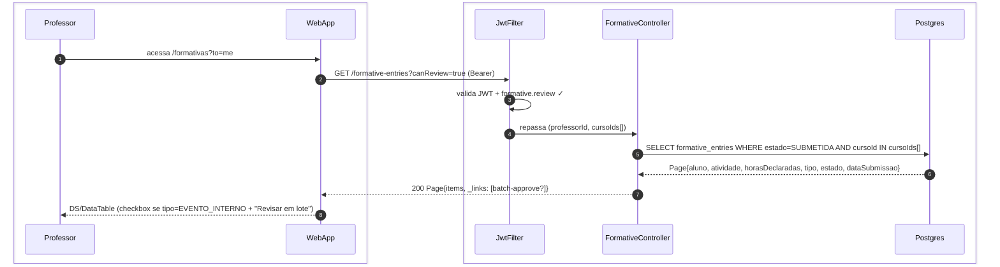
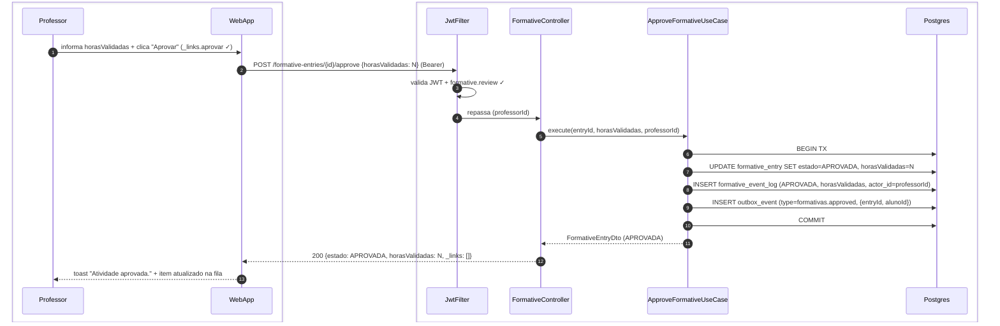
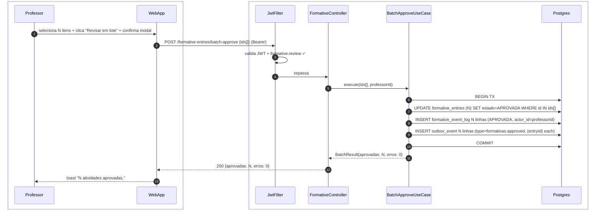
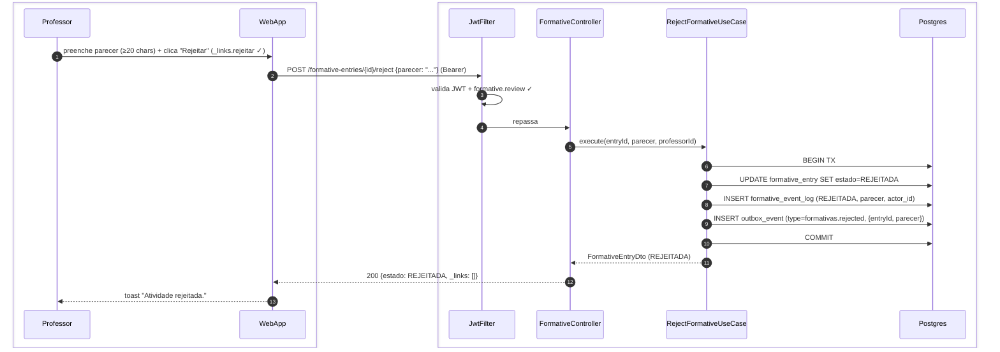
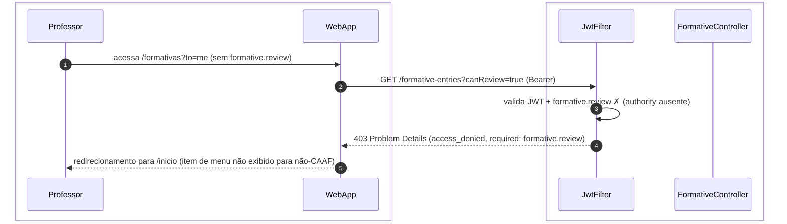

# US-F3-004 — Revisar Atividades Formativas (CAAF)

| HU | Tela | Capability | API primária | Fonte |
|----|------|------------|--------------|-------|
| US-F3-004 | F3.5 — `/formativas?to=me` | `formative.review` (somente membros CAAF) | `GET /formative-entries?canReview=true` · `POST /formative-entries/{id}/approve` · `POST /formative-entries/{id}/reject` | `HUs/F3 — Professor/US-F3-004-REVISAR-FORMATIVAS.md` · `fluxos_por_perfil.md` §4 F3.5 |

---

## Matriz de cobertura

| ID diagrama | Origem (CA / RN / sub-fluxo) | Tipo | Status |
|-------------|------------------------------|------|--------|
| F3.5-D01 | CA-01 · RN-F3.5-02 — fila de revisão CAAF (GET /formative-entries?canReview=true) | SEQUENCIA | gerado |
| F3.5-D02 | CA-02 · RN-F3.5-04 · RN-F3.5-06 — aprovar formativa individual + TX outbox + trigger certificado | SEQUENCIA | gerado |
| F3.5-D03 | CA-03 · RN-F3.5-03 — aprovar em lote (`EVENTO_INTERNO_PRESENCA_VALIDADA`) | SEQUENCIA | gerado |
| F3.5-D04 | CA-04 (happy path) · RN-F3.5-05 · RN-F3.5-06 — rejeitar formativa com parecer + TX outbox | SEQUENCIA | gerado |
| F3.5-ERRO | RN-F3.5-01 — 403 FGAC: acesso sem `formative.review` | ERRO | gerado |
| — | CA-04 parte 1 (parecer < 20 chars — erro inline) | NAO_APLICAVEL | — |
| — | RN-F3.5-05 (mínimo 20 chars — validação frontend) | NAO_APLICAVEL | — |
| — | DS/Skeleton · empty state (fila vazia) | NAO_APLICAVEL | — |

---

## Referências DRY

| Padrão | Arquivo canônico |
|--------|-----------------|
| Outbox dispatcher (push/e-mail ao aluno após aprovação/rejeição) | [`transversal/10.1-outbox-notificacao.md`](../transversal/10.1-outbox-notificacao.md) |
| Emissão de certificado (trigger por `formativas.approved`) | [`transversal/10.4-certificado-emissao.md`](../transversal/10.4-certificado-emissao.md) |
| Submissão de formativa pelo aluno (origem do `formative_entry`) | [`F1/US-F1-006-FORMATIVAS.md`](../F1/US-F1-006-FORMATIVAS.md) F1.11-D02 |
| JWT validation + `formative.review` FGAC | [`F0/US-F0-001-LOGIN.md`](../F0/US-F0-001-LOGIN.md) F0.1-a (JwtFilter) |

---

## Fora de sequência

| Item | Motivo |
|------|--------|
| CA-04 parte 1 — parecer < 20 chars (erro inline) | Validação client-side (React Hook Form + Zod); nenhuma chamada HTTP realizada antes de corrigir. |
| RN-F3.5-05 — mínimo 20 caracteres no parecer | Idem — regra Zod; erro exibido via `DS/Textarea` borda danger. |
| DS/Skeleton (F3.5 loading) | Lógica puramente frontend; sem chamada HTTP adicional. |
| Empty state (fila de revisão vazia) | Mesmo fluxo de F3.5-D01; diferença é `items: []` na resposta — sem variação de participantes. |

---

## F3.5-D01 — Fila de revisão CAAF (GET /formative-entries?canReview=true)

**Escopo:** professor membro da CAAF acessa `/formativas?to=me` e obtém fila filtrada por escopo de curso  
**Atores:** Professor, WebApp, JwtFilter, FormativeController, Postgres  
**Pré-condições:** professor autenticado com `formative.review`; vínculo com CAAF do curso

**Notas:**
- Passo 4: `cursoIds[]` extraído do vínculo CAAF do professor no JWT (claim de escopo); ele não vê submissões de alunos de outros cursos (RN-F3.5-02).
- Passo 7: `_links.batch-approve` presente apenas quando há itens do tipo `EVENTO_INTERNO_PRESENCA_VALIDADA` na página — o frontend exibe o seletor de lote somente nesses itens (RN-F3.5-03).

**Lacunas:** nenhuma.

---

## F3.5-D02 — Aprovar formativa individual + TX outbox + trigger certificado

**Escopo:** professor aprova `formative_entry` com `horasValidadas` — TX atômica + outbox que aciona emissão de certificado  
**Atores:** Professor, WebApp, JwtFilter, FormativeController, ApproveFormativeUseCase, Postgres  
**Pré-condições:** professor com `formative.review`; `_links.aprovar` presente; `formative_entry.estado = SUBMETIDA`

**Notas:**
- Passos 6–10: TX atômica — `UPDATE estado`, `INSERT event_log` e `INSERT outbox_event` gravados juntos (RN-F3.5-06). Se o COMMIT falhar, nenhum certificado é emitido.
- Passo 9: o `OutboxDispatcher` (a cada 5 s) consome `formativas.approved` e aciona o `CertificateIssuerUseCase` para o aluno. O fluxo completo de emissão (Gotenberg PDF + SHA-256 + ED25519 + MinIO) está em → [`transversal/10.4-certificado-emissao.md`](../transversal/10.4-certificado-emissao.md).
- `horasValidadas` pode diferir das horas declaradas pelo aluno (RN-F3.5-04). O certificado usará o valor validado.
- Notificação push/e-mail ao aluno após despacho do outbox → [`transversal/10.1-outbox-notificacao.md`](../transversal/10.1-outbox-notificacao.md).

**Lacunas:** nenhuma.

---

## F3.5-D03 — Aprovar em lote (EVENTO_INTERNO_PRESENCA_VALIDADA)

**Escopo:** professor aprova N formativas de evento com presença já validada pelo sistema em uma única chamada batch  
**Atores:** Professor, WebApp, JwtFilter, FormativeController, BatchApproveUseCase, Postgres  
**Pré-condições:** professor com `formative.review`; `_links.batch-approve` presente; itens selecionados são todos do tipo `EVENTO_INTERNO_PRESENCA_VALIDADA`

**Notas:**
- Passo 7: a cláusula `WHERE tipo=EVENTO_INTERNO_PRESENCA_VALIDADA` é validada no UseCase antes do UPDATE — itens inválidos (tipo errado ou estado diferente de SUBMETIDA) são excluídos do batch sem cancelar os demais (RN-F3.5-03).
- Passo 9: cada item gera seu próprio `outbox_event`, garantindo que o `CertificateIssuerUseCase` seja acionado individualmente por aluno → [`transversal/10.4-certificado-emissao.md`](../transversal/10.4-certificado-emissao.md).
- Para atividades com comprovante manual, o lote não está disponível — cada item exige revisão individual (F3.5-D02).

**Lacunas:** nenhuma.

---

## F3.5-D04 — Rejeitar formativa com parecer + TX outbox

**Escopo:** professor rejeita `formative_entry` com parecer fundamentado — TX + outbox notifica aluno  
**Atores:** Professor, WebApp, JwtFilter, FormativeController, RejectFormativeUseCase, Postgres  
**Pré-condições:** professor com `formative.review`; `_links.rejeitar` presente; parecer ≥ 20 chars (validado no frontend antes do POST)

**Notas:**
- Passo 1: se o parecer tiver menos de 20 caracteres, o React Hook Form / Zod bloqueia o POST antes de ser disparado — validação client-side, sem chamada HTTP (CA-04 parte 1 → NAO_APLICAVEL).
- Passo 9: o `OutboxDispatcher` consome `formativas.rejected`, renderiza template com o parecer e envia push/e-mail ao aluno para corrigir e resubmeter (RN-F3.5-05). Fluxo completo → [`transversal/10.1-outbox-notificacao.md`](../transversal/10.1-outbox-notificacao.md).
- O aluno poderá corrigir e resubmeter a atividade → estado retorna a `SUBMETIDA` (fluxo em [`F1/US-F1-006-FORMATIVAS.md`](../F1/US-F1-006-FORMATIVAS.md) F1.11-D02).

**Lacunas:** nenhuma.

---

## F3.5-ERRO — 403 FGAC: acesso sem formative.review

**Escopo:** professor sem `formative.review` tenta acessar a rota de revisão CAAF — RN-F3.5-01  
**Atores:** Professor, WebApp, JwtFilter, FormativeController  
**Pré-condições:** professor autenticado; `formative.review` ausente nas authorities (não é membro CAAF)

**Notas:**
- Passo 5: em condições normais, o menu "Formativas CAAF" não é exibido para professores sem `formative.review` — o BFF não retorna o bloco correspondente no dashboard (RN-F3.5-01 · RN-F3.1-03 da US-F3-001). O 403 é defesa em profundidade contra navegação direta pela URL.

**Lacunas:** nenhuma.
