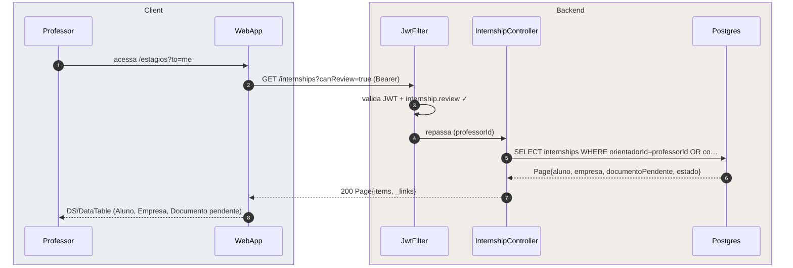
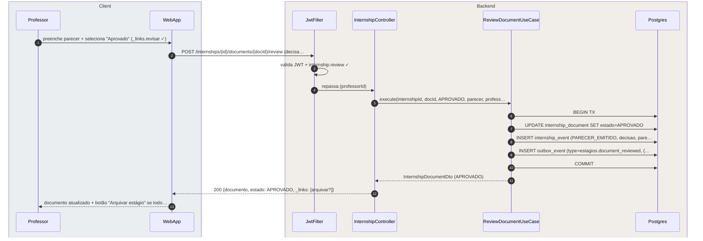
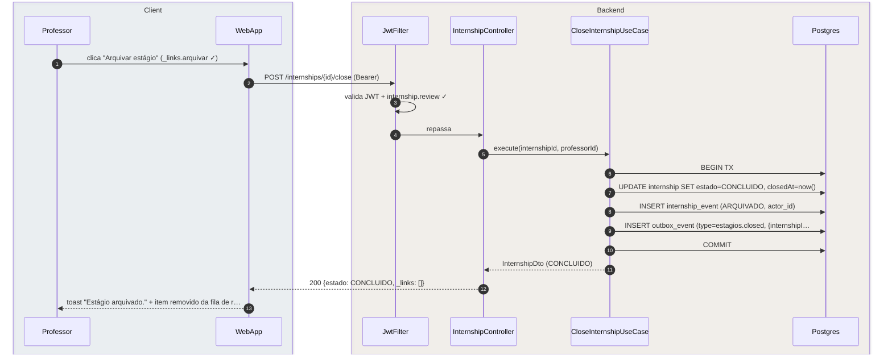
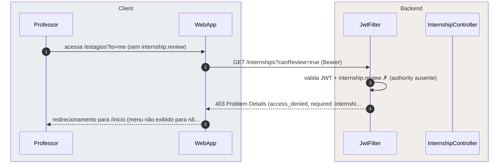

# US-F3-005 — Emitir Pareceres de Estágio (Orientador / COE)

| HU | Tela | Capability | API primária | Fonte |
|----|------|------------|--------------|-------|
| US-F3-005 | F3.6 — `/estagios?to=me` | `internship.review` | `GET /internships?canReview=true` · `POST /internships/{id}/documents/{docId}/review` · `POST /internships/{id}/close` | `HUs/F3 — Professor/US-F3-005-ESTAGIO-ORIENTACAO.md` · `fluxos_por_perfil.md` §4 F3.6 |

---

## Matriz de cobertura

| ID diagrama | Origem (CA / RN / sub-fluxo) | Tipo | Status |
|-------------|------------------------------|------|--------|
| F3.6-D01 | CA-01 · RN-F3.6-01 · RN-F3.6-02 — listar estágios para revisão | SEQUENCIA | gerado |
| F3.6-D02 | CA-02 · RN-F3.6-04 · RN-F3.6-06 — emitir parecer em documento + TX outbox | SEQUENCIA | gerado |
| F3.6-D03 | CA-03 · RN-F3.6-05 · RN-F3.6-06 — arquivar estágio concluído + TX outbox | SEQUENCIA | gerado |
| F3.6-ERRO | RN-F3.6-01 (403 sem `internship.review`) | ERRO | gerado |
| — | RN-F3.6-03 (detalhe `/estagios/:id` com tabs Documentos / Pareceres / linha do tempo) | DRY | → F3.6-D02 (`GET /internships/{id}` carrega antes do POST; `_links.revisar` determina disponibilidade da ação) |
| — | RN-F3.6-06 (outbox dispatch — push/e-mail ao aluno) | DRY | → [`transversal/10.1-outbox-notificacao.md`](../transversal/10.1-outbox-notificacao.md) |
| — | Upload de documento pelo aluno (origem do `internship_document`) | DRY | → [`F1/US-F1-007-ESTAGIO.md`](../F1/US-F1-007-ESTAGIO.md) F1.14-D03 |
| — | DS/EmptyState (nenhum estágio aguardando revisão) | NAO_APLICAVEL | — |
| — | DS/Skeleton (F3.6 loading) | NAO_APLICAVEL | — |
| — | Interação de tabs (Documentos / Pareceres) na tela de detalhe | NAO_APLICAVEL | — |

---

## Referências DRY

| Padrão | Arquivo canônico |
|--------|-----------------|
| Outbox dispatcher (push/e-mail ao aluno após parecer) | [`transversal/10.1-outbox-notificacao.md`](../transversal/10.1-outbox-notificacao.md) |
| Upload de documento pelo aluno (origem do evento) | [`F1/US-F1-007-ESTAGIO.md`](../F1/US-F1-007-ESTAGIO.md) F1.14-D03 |
| JWT validation + `internship.review` FGAC | [`F0/US-F0-001-LOGIN.md`](../F0/US-F0-001-LOGIN.md) F0.1-a (JwtFilter) |

---

## Fora de sequência

| Item | Motivo |
|------|--------|
| DS/EmptyState — nenhum estágio aguardando revisão | Mesmo fluxo de F3.6-D01; diferença é `items: []` na resposta — sem variação de participantes. |
| DS/Skeleton (F3.6 loading) | Lógica puramente frontend; sem chamada HTTP adicional. |
| Interação de tabs (Documentos / Pareceres / Linha do tempo) | Navegação client-side entre seções de dados já carregados no GET /internships/{id}; sem chamada HTTP extra. |

---

## F3.6-D01 — Listar estágios para revisão

**Escopo:** professor orientador ou membro do COE acessa `/estagios?to=me` e obtém fila filtrada  
**Atores:** Professor, WebApp, JwtFilter, InternshipController, Postgres  
**Pré-condições:** professor autenticado com `internship.review`; vínculo como orientador ou membro do COE

**Notas:**
- Passo 5: o backend filtra por `orientadorId = professorId` (estágios sob orientação direta) **ou** por vínculo COE para o curso do aluno (RN-F3.6-01). Professor sem nenhum dos dois vínculos recebe lista vazia ou 403 (ver F3.6-ERRO).
- Passo 7: `documentoPendente` é o tipo do documento mais recente com `estado=AGUARDANDO_PARECER` — campo calculado no repositório (RN-F3.6-02).

**Lacunas:** nenhuma.

---

## F3.6-D02 — Emitir parecer em documento + TX outbox

**Escopo:** professor revisa um documento de estágio e emite parecer (APROVADO ou REPROVADO) — TX atômica + notificação outbox  
**Atores:** Professor, WebApp, JwtFilter, InternshipController, ReviewDocumentUseCase, Postgres  
**Pré-condições:** professor com `internship.review`; em `/estagios/:id` (GET carregou `_links.revisar`); parecer preenchido

**Notas:**
- Passo 1: antes do POST, o frontend carregou `/estagios/:id` via `GET /internships/{id}` — a resposta inclui os documentos e `_links.revisar` quando `documento.estado = AGUARDANDO_PARECER` (RN-F3.6-03). Sem o link, o botão não é exibido (`useActions`).
- Passo 9: o `OutboxDispatcher` consome `estagios.document_reviewed` e envia push/e-mail ao aluno com o resultado do parecer (RN-F3.6-06). Fluxo completo → [`transversal/10.1-outbox-notificacao.md`](../transversal/10.1-outbox-notificacao.md).
- Passo 12: `_links.arquivar` aparece na resposta somente se todos os documentos obrigatórios do estágio estiverem com `estado=APROVADO` (RN-F3.6-05) — HATEOAS condicional.

**Lacunas:** nenhuma.

---

## F3.6-D03 — Arquivar estágio concluído + TX outbox

**Escopo:** professor arquiva o estágio após aprovação de todos os documentos obrigatórios — TX + notificação outbox ao aluno  
**Atores:** Professor, WebApp, JwtFilter, InternshipController, CloseInternshipUseCase, Postgres  
**Pré-condições:** professor com `internship.review`; `_links.arquivar` presente (todos documentos obrigatórios aprovados)

**Notas:**
- Passo 5: `CloseInternshipUseCase` valida internamente que todos os documentos obrigatórios estão `APROVADO` antes de prosseguir. Se algum documento ainda estiver pendente → 422 `documents_pending`; neste caso `_links.arquivar` não deveria ter sido retornado (defesa em profundidade).
- Passo 9: o `OutboxDispatcher` consome `estagios.closed` e notifica o aluno de que o estágio foi concluído formalmente (RN-F3.6-06). Fluxo completo → [`transversal/10.1-outbox-notificacao.md`](../transversal/10.1-outbox-notificacao.md).
- Estágios `CONCLUIDO` tornam-se imutáveis — sem pareceres adicionais ou reabertura sem capability extra.

**Lacunas:** nenhuma.

---

## F3.6-ERRO — 403 FGAC: acesso sem internship.review

**Escopo:** professor sem `internship.review` tenta acessar a rota de revisão de estágios — RN-F3.6-01  
**Atores:** Professor, WebApp, JwtFilter, InternshipController  
**Pré-condições:** professor autenticado; `internship.review` ausente (não é orientador nem membro do COE)

**Notas:**
- Em condições normais, o menu "Estágios" para revisão não é exibido a professores sem `internship.review` — HATEOAS UI cega via dashboard BFF. O 403 é defesa em profundidade contra navegação direta pela URL.

**Lacunas:** nenhuma.
