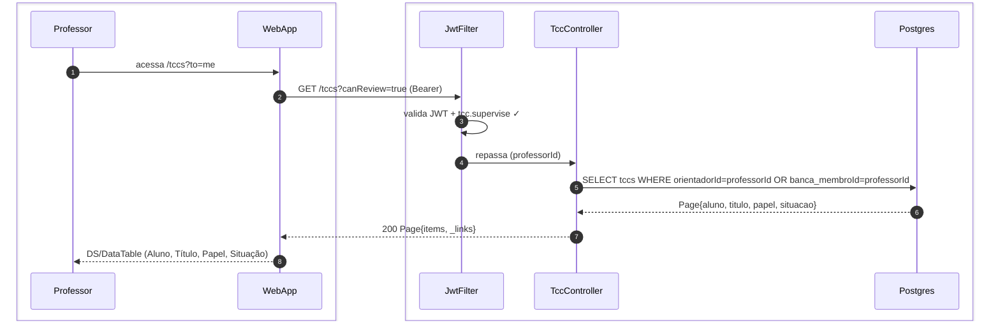
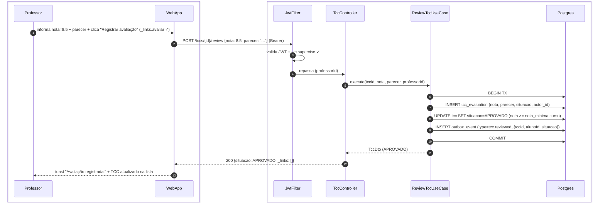
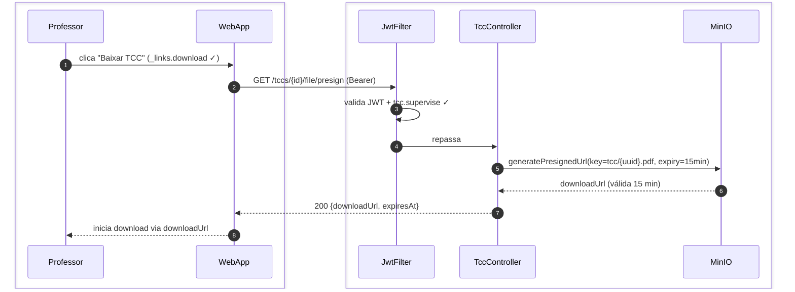
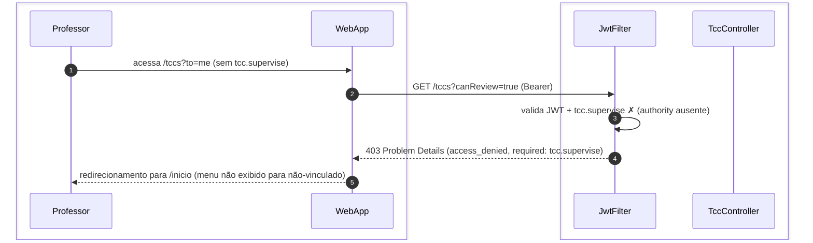

# US-F3-006 — Avaliar TCC (Orientador / Banca)

| HU | Tela | Capability | API primária | Fonte |
|----|------|------------|--------------|-------|
| US-F3-006 | F3.7 — `/tccs?to=me` | `tcc.supervise` | `GET /tccs?canReview=true` · `POST /tccs/{id}/review` | `HUs/F3 — Professor/US-F3-006-TCC-ORIENTACAO.md` · `fluxos_por_perfil.md` §4 F3.7 |

---

## Matriz de cobertura

| ID diagrama | Origem (CA / RN / sub-fluxo) | Tipo | Status |
|-------------|------------------------------|------|--------|
| F3.7-D01 | CA-01 · RN-F3.7-01 · RN-F3.7-02 — listar TCCs para avaliação | SEQUENCIA | gerado |
| F3.7-D02 | CA-02 · RN-F3.7-04 · RN-F3.7-05 · RN-F3.7-06 — registrar avaliação + TX + cert trigger | SEQUENCIA | gerado |
| F3.7-D03 | CA-03 · RN-F3.7-03 — download arquivo TCC (presigned MinIO) | SEQUENCIA | gerado |
| F3.7-ERRO | RN-F3.7-01 (403 sem `tcc.supervise`) | ERRO | gerado |
| — | RN-F3.7-01/02 (filtro orientador/banca + colunas) | DRY | → F3.7-D01 (filtro `canReview=true` + campos na resposta) |
| — | RN-F3.7-05 (`CertificateIssuerUseCase` trigger se APROVADO) | DRY | → F3.7-D02 passo 9 (outbox `tcc.reviewed`) · [`transversal/10.4-certificado-emissao.md`](../transversal/10.4-certificado-emissao.md) |
| — | RN-F3.7-06 (`tcc_evaluation` INSERT na TX) | DRY | → F3.7-D02 passo 7 |
| — | Outbox dispatch (push/e-mail ao aluno com resultado) | DRY | → [`transversal/10.1-outbox-notificacao.md`](../transversal/10.1-outbox-notificacao.md) |
| — | Upload do arquivo TCC pelo aluno (origem do arquivo) | DRY | → [`F1/US-F1-008-TCC.md`](../F1/US-F1-008-TCC.md) F1.16-D03 |
| — | DS/EmptyState (nenhum TCC aguardando avaliação) | NAO_APLICAVEL | — |
| — | DS/Skeleton (F3.7 loading) | NAO_APLICAVEL | — |

---

## Referências DRY

| Padrão | Arquivo canônico |
|--------|-----------------|
| Emissão de certificado de conclusão (trigger por `tcc.reviewed` APROVADO) | [`transversal/10.4-certificado-emissao.md`](../transversal/10.4-certificado-emissao.md) |
| Outbox dispatcher (push/e-mail ao aluno com resultado) | [`transversal/10.1-outbox-notificacao.md`](../transversal/10.1-outbox-notificacao.md) |
| Download presigned MinIO (padrão P5) | `.cursor/skills/fullstack-sequence-diagrams/reference.md` §P5 |
| Upload do arquivo TCC pelo aluno | [`F1/US-F1-008-TCC.md`](../F1/US-F1-008-TCC.md) F1.16-D03 |
| JWT validation + `tcc.supervise` FGAC | [`F0/US-F0-001-LOGIN.md`](../F0/US-F0-001-LOGIN.md) F0.1-a (JwtFilter) |

---

## Fora de sequência

| Item | Motivo |
|------|--------|
| DS/EmptyState — nenhum TCC aguardando avaliação | Mesmo fluxo de F3.7-D01; diferença é `items: []` — sem variação de participantes. |
| DS/Skeleton (F3.7 loading) | Lógica puramente frontend; sem chamada HTTP adicional. |

---

## F3.7-D01 — Listar TCCs para avaliação

**Escopo:** professor orientador ou membro de banca acessa `/tccs?to=me` e obtém fila filtrada por `canReview=true`  
**Atores:** Professor, WebApp, JwtFilter, TccController, Postgres  
**Pré-condições:** professor autenticado com `tcc.supervise`; vínculo como orientador, co-orientador ou membro de banca

**Notas:**
- Passo 5: filtra por `orientadorId = professorId` (orientação direta) **ou** vínculo de banca para o TCC. Colunas incluem `papel` (Orientador / Co-orientador / Banca) e `situacao` (DS/Badge) — RN-F3.7-01/02.
- Passo 7: `_links` inclui `avaliar` por item se `_links.avaliar` disponível (aluno enviou arquivo e TCC está em estado aguardando avaliação).

**Lacunas:** nenhuma.

---

## F3.7-D02 — Registrar avaliação + TX outbox + trigger certificado

**Escopo:** professor registra nota e parecer — TX atômica + outbox que aciona notificação e, se APROVADO, emissão de certificado  
**Atores:** Professor, WebApp, JwtFilter, TccController, ReviewTccUseCase, Postgres  
**Pré-condições:** professor com `tcc.supervise`; `_links.avaliar` presente; aluno enviou arquivo final

**Notas:**
- Passo 8: `ReviewTccUseCase` calcula `situacao` internamente com base em `nota >= nota_minima` configurada no sistema — pode resultar em APROVADO, COM_CORRECOES ou REPROVADO (RN-F3.7-04). O frontend envia apenas `nota` e `parecer`; o `situacao` é determinado pelo backend.
- Passo 9: o `OutboxDispatcher` consome `tcc.reviewed` e: (a) envia push/e-mail ao aluno com o resultado; (b) se `situacao=APROVADO` e aluno elegível, aciona `CertificateIssuerUseCase`. Fluxo completo de emissão → [`transversal/10.4-certificado-emissao.md`](../transversal/10.4-certificado-emissao.md). Notificação → [`transversal/10.1-outbox-notificacao.md`](../transversal/10.1-outbox-notificacao.md).
- Passo 7: `tcc_evaluation` é imutável após INSERT — cada professor de banca registra a sua avaliação individualmente (RN-F3.7-06). A `situacao` final do TCC pode depender da consolidação de múltiplas avaliações de banca (regra de negócio a definir no `workflow_json` do RequestType).

**Lacunas:** nenhuma.

---

## F3.7-D03 — Download arquivo TCC (presigned MinIO)

**Escopo:** professor baixa o arquivo final do TCC via URL pré-assinada do MinIO para avaliação offline  
**Atores:** Professor, WebApp, JwtFilter, TccController, MinIO  
**Pré-condições:** professor com `tcc.supervise`; `_links.download` presente; aluno fez upload do arquivo final

**Notas:**
- Passo 5: a URL pré-assinada expira em 15 min — tempo suficiente para iniciar o download. Se o professor precisar baixar novamente, uma nova chamada a `/presign` gera nova URL (RN-F3.7-03).
- O arquivo nunca trafega pelo backend — o download vai diretamente de MinIO para o navegador do professor após o redirecionamento.

**Lacunas:** nenhuma.

---

## F3.7-ERRO — 403 FGAC: acesso sem tcc.supervise

**Escopo:** professor sem `tcc.supervise` tenta acessar `/tccs?to=me`  
**Atores:** Professor, WebApp, JwtFilter, TccController  
**Pré-condições:** professor autenticado; `tcc.supervise` ausente (sem vínculo de orientação ou banca)

**Notas:**
- Em condições normais, o menu "TCCs" para revisão não é exibido a professores sem `tcc.supervise` — HATEOAS UI cega via dashboard BFF. O 403 é defesa em profundidade.

**Lacunas:** nenhuma.
