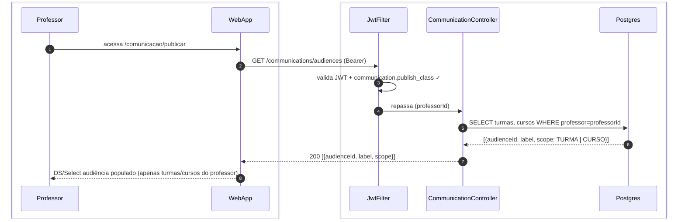
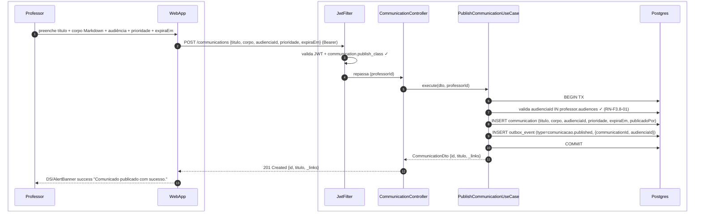
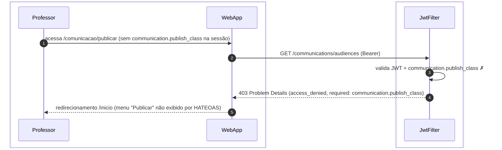
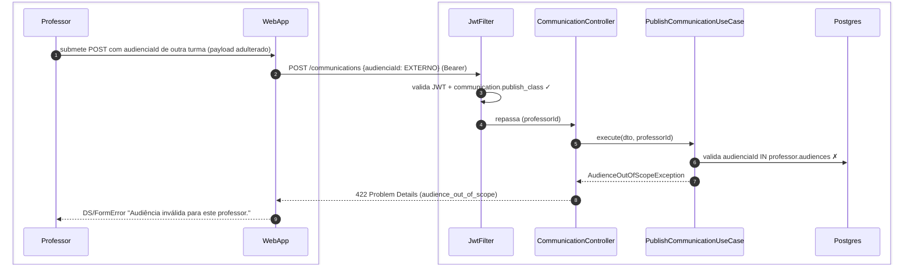

# US-F3-007 — Publicar Comunicado para Turma ou Curso

| HU | Tela | Capability | API primária | Fonte |
|----|------|------------|--------------|-------|
| US-F3-007 | F3.8 — `/comunicacao/publicar` | `communication.publish_class` | `GET /communications/audiences` · `POST /communications` | `HUs/F3 — Professor/US-F3-007-PUBLICAR-COMUNICADO.md` · `fluxos_por_perfil.md` §4 F3.8 |

---

## Matriz de cobertura

| ID diagrama | Origem (CA / RN / sub-fluxo) | Tipo | Status |
|-------------|------------------------------|------|--------|
| F3.8-D01 | CA-04 · RN-F3.8-01 — GET audiências disponíveis (turmas/cursos do professor) | SEQUENCIA | gerado |
| F3.8-D02 | CA-02 · RN-F3.8-05 · RN-F3.8-02 · RN-F3.8-03 · RN-F3.8-06 — publicar + TX + outbox fan-out | SEQUENCIA | gerado |
| F3.8-ERRO | 403 sem `communication.publish_class` · 422 audiência fora de scope (RN-F3.8-01) | ERRO | gerado |
| — | CA-01 (formulário carrega, campos, button enabled) | NAO_APLICAVEL | sem chamada HTTP; validação client-side React Hook Form |
| — | CA-03 (Markdown preview em tempo real) | NAO_APLICAVEL | renderização puramente client-side (ex.: `marked` ou `react-markdown`) |
| — | CA-05 (tabs Editor/Preview em mobile < 768px) | NAO_APLICAVEL | CSS/responsive layout, sem variação de fluxo HTTP |
| — | RN-F3.8-02 (prioridade → canal de entrega: CRITICAL/HIGH/MEDIUM/LOW) | DRY | → F3.8-D02 Nota (payload) · [`transversal/10.1-outbox-notificacao.md`](../transversal/10.1-outbox-notificacao.md) (fan-out por canal) |
| — | RN-F3.8-03 (campo `expiraEm`) | DRY | → F3.8-D02 passo 8 (campo no INSERT) |
| — | RN-F3.8-04 (Markdown + tipografia Body) | DRY | → CA-03 NAO_APLICAVEL |
| — | RN-F3.8-06 (confirmação + hub) | DRY | → F3.8-D02 passo 13 (toast + redirect) |
| — | Outbox fan-out (`communication_delivery` por destinatário) | DRY | → [`transversal/10.1-outbox-notificacao.md`](../transversal/10.1-outbox-notificacao.md) |
| — | Recebimento do comunicado pelo aluno | DRY | → [`F1/US-F1-004-COMUNICACAO.md`](../F1/US-F1-004-COMUNICACAO.md) F1.6-D01/D02 |

---

## Referências DRY

| Padrão | Arquivo canônico |
|--------|-----------------|
| Outbox dispatcher + fan-out multicanal (prioridade CRITICAL/HIGH/MEDIUM/LOW → push/e-mail/in-app) | [`transversal/10.1-outbox-notificacao.md`](../transversal/10.1-outbox-notificacao.md) |
| Recebimento e marcação de lido pelo aluno | [`F1/US-F1-004-COMUNICACAO.md`](../F1/US-F1-004-COMUNICACAO.md) |
| JWT validation + FGAC `communication.publish_class` | [`F0/US-F0-001-LOGIN.md`](../F0/US-F0-001-LOGIN.md) (JwtFilter) |

---

## Fora de sequência

| Item | Motivo |
|------|--------|
| CA-01 — Formulário de publicação (campos, button enabled, preview) | Interação puramente client-side. React Hook Form controla o estado de disabled; DS/MarkdownPreview renderiza localmente. Sem chamada HTTP para carregar o form (apenas F3.8-D01 carrega as opções de audiência). |
| CA-03 — Preview Markdown em tempo real | Biblioteca client-side (`react-markdown` ou similar) processa o texto sem requisição HTTP. |
| CA-05 — Responsividade mobile (tabs Editor / Preview) | CSS responsive / media query. Nenhuma variação de fluxo API entre desktop e mobile. |

---

## F3.8-D01 — Carregar opções de audiência (restrição de scope)

**Escopo:** professor abre `/comunicacao/publicar` e o select de audiência é populado apenas com suas turmas e cursos  
**Atores:** Professor, WebApp, JwtFilter, CommunicationController, Postgres  
**Pré-condições:** professor autenticado com `communication.publish_class`

**Notas:**
- Passo 5: O endpoint retorna apenas as turmas e cursos vinculados ao professor autenticado — nunca inclui a opção "todos os alunos da universidade" (requer `system.broadcast`, fora do escopo deste professor) — CA-04 / RN-F3.8-01.
- O DS/Select no frontend não precisa filtrar no cliente: a lista já vem pre-filtrada pelo backend. HATEOAS: ausência de `system.broadcast` na capability lista do token impede a exibição da opção broadcast.

**Lacunas:** nenhuma.

---

## F3.8-D02 — Publicar comunicado (POST + TX atômica + outbox fan-out)

**Escopo:** professor preenche título, corpo Markdown, audiência, prioridade e expiraEm — backend insere `Communication` + enfileira outbox para fan-out assíncrono  
**Atores:** Professor, WebApp, JwtFilter, CommunicationController, PublishCommunicationUseCase, Postgres  
**Pré-condições:** professor com `communication.publish_class`; audiência selecionada dentro do seu scope

**Notas:**
- Passo 9: `OutboxDispatcher` (fora desta TX) consome `comunicacao.published` e cria `communication_delivery` por destinatário conforme `audienciaId`. O canal de entrega depende da prioridade (RN-F3.8-02): CRITICAL → push imediato + ignora DND; HIGH → push + e-mail; MEDIUM → push se fora do DND; LOW → somente in-app. Fan-out completo → [`transversal/10.1-outbox-notificacao.md`](../transversal/10.1-outbox-notificacao.md).
- Passo 8: `expiraEm` é armazenado em `communication.expires_at` (TIMESTAMPTZ). Após esta data, o comunicado permanece no histórico mas perde o status "não lido" nos destinatários — RN-F3.8-03.
- Passo 13: O redirect para `/comunicacao` permite ao professor ver o comunicado recém-publicado no hub — RN-F3.8-06.

**Lacunas:** nenhuma.

---

## F3.8-ERRO — 403 FGAC + 422 audiência fora de scope

**Escopo:** dois cenários de erro na publicação de comunicado  
**Atores:** Professor, WebApp, JwtFilter, CommunicationController, PublishCommunicationUseCase, Postgres

### Cenário A — 403 sem communication.publish_class

### Cenário B — 422 audiência fora do scope do professor

**Notas:**
- Cenário A: em condições normais, o link `/comunicacao/publicar` não aparece no menu para professores sem `communication.publish_class` — HATEOAS UI cega. O 403 é defesa em profundidade (URL digitada manualmente).
- Cenário B: defesa contra adulteração de `audienciaId` no payload — o backend revalida o vínculo professor↔audiência dentro da TX, independente do que o frontend enviou (RN-F3.8-01).
