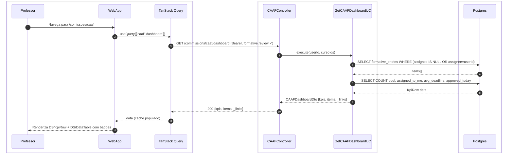
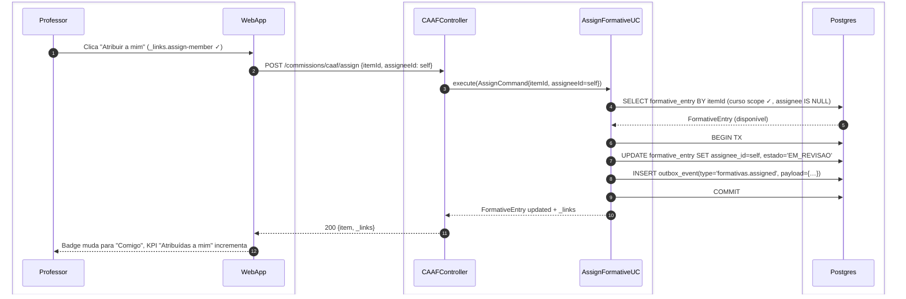
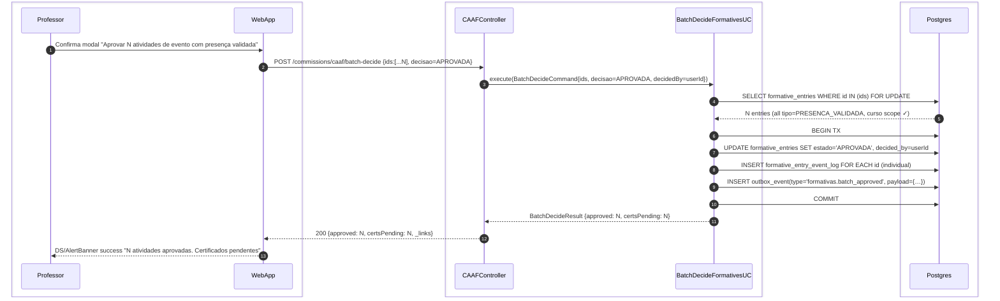
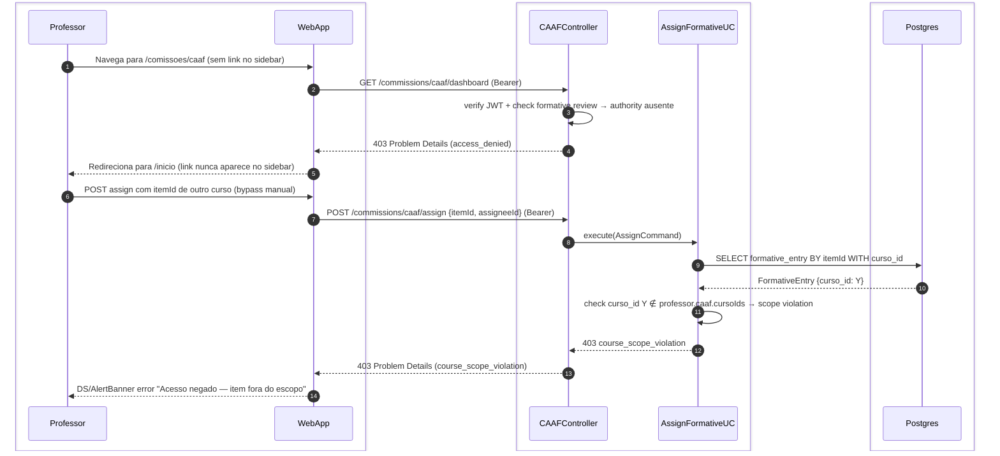
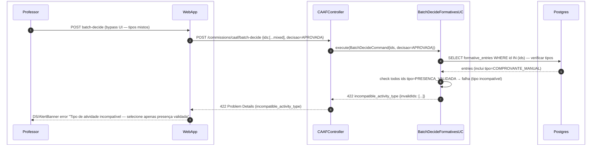

# US-F4-001 — Pool CAAF: Atribuir e Aprovar Atividades Formativas em Lote

| HU | Tela | Capability | API primária | Fonte |
|----|------|------------|--------------|-------|
| US-F4-001 | F4.1 — `/comissoes/caaf` | `formative.review` + escopo CAAF do curso | `GET /commissions/caaf/dashboard` · `GET /commissions/caaf/members` · `POST /commissions/caaf/assign` · `POST /commissions/caaf/batch-decide` | `fluxos_por_perfil.md` §5 · HU US-F4-001 |

---

## Matriz de cobertura

| ID diagrama | Origem (CA/RN) | Tipo | Status |
|-------------|----------------|------|--------|
| F4.1a | CA-01, RN-F4.1-02, RN-F4.1-03 | SEQUENCIA | gerado |
| F4.1b | CA-02, RN-F4.1-04 | SEQUENCIA | gerado |
| F4.1c | CA-03, RN-F4.1-05 | SEQUENCIA | gerado |
| F4.1d | CA-04, RN-F4.1-06 | SEQUENCIA | gerado |
| F4.1e | RN-F4.1-01, RN-F4.1-09 | ERRO | gerado |
| F4.1f | CA-05, RN-F4.1-07 (guard backend) | ERRO | gerado |
| — | RN-F4.1-08 (outbox dispatch multcanal) | DRY | → `transversal/10.1` |
| — | RN-F4.1-08 (emissão de certificado) | DRY | → `transversal/10.4` |
| — | Revisão individual pós-atribuição | DRY | → `F3/US-F3-004` |
| — | CA-06 (EmptyState pool vazio) | NAO_APLICAVEL | — |
| — | RN-F4.1-07 (tooltip UI tipo incompatível) | NAO_APLICAVEL | — |

---

## Referências DRY

- **Outbox dispatch** (fase async após qualquer TX): [`../transversal/10.1-outbox-notificacao.md`](../transversal/10.1-outbox-notificacao.md) — cobre o `formativas.assigned` → push/email ao professor destinatário e o `formativas.batch_approved` → push/email aos alunos.
- **Emissão de certificado** (trigger pós `batch_approved`): [`../transversal/10.4-certificado-emissao.md`](../transversal/10.4-certificado-emissao.md) — `CertificateIssuerUseCase` consome o outbox_event e emite PDF+SHA-256+ED25519 por aluno.
- **Revisão individual CAAF** (fluxo que se inicia após atribuição): [`../F3/US-F3-004-REVISAR-FORMATIVAS.md`](../F3/US-F3-004-REVISAR-FORMATIVAS.md) — approve/reject de item individual em `/formativas?to=me` é idêntico ao fluxo pós-self-assign ou pós-atribuição a colega.

---

## Fora de sequência

- **CA-06 EmptyState**: estado UI puro — quando `GET /commissions/caaf/dashboard` retorna `items: []`, o WebApp exibe `DS/EmptyState`; o backend segue o mesmo caminho de F4.1a com lista vazia; nenhum diagrama adicional necessário.
- **RN-F4.1-07 tooltip (frontend)**: `DS/BulkActionBar` avalia os tipos dos itens selecionados no estado local (TanStack Query cache) e desabilita "Aprovar selecionados" com tooltip quando detecta tipo misto — lógica 100% client-side, sem chamada ao servidor. O diagrama F4.1f cobre o guard equivalente no backend (defesa em profundidade).

---

## F4.1a — Carregar pool CAAF (happy path)

**Escopo:** happy path — professor com `formative.review` acessa `/comissoes/caaf`; API retorna KPIs + pool de formativas (não atribuídas + atribuídas ao próprio usuário).
**Atores:** Professor, WebApp, CAAFController, GetCAAFDashboardUC, Postgres.
**Pré-condições:** professor autenticado com JWT válido e vinculado a uma CAAF ativa; pelo menos 1 formativa no pool.



**Notas:**
- Passo 5: a query filtra `estado NOT IN ('APROVADA','REJEITADA')` e respeita escopo de curso via `commission_member.curso_id` (RN-F4.1-09).
- Badges: `assignee IS NULL` → `DS/Badge "No pool"` (secondary); `assignee = userId` → `DS/Badge "Comigo"` (primary).
- `_links` retorna `assign-member` por item apenas quando `formative_entry.assignee IS NULL` ou `assignee = userId` (FGAC HATEOAS).

**Lacunas:** nenhuma.

---

## F4.1b — Self-assign (happy path)

**Escopo:** happy path — membro da CAAF atribui um item do pool a si mesmo (`_links.assign-member` presente); item migra para fila individual.
**Atores:** Professor, WebApp, CAAFController, AssignFormativeUC, Postgres.
**Pré-condições:** item sem responsável no pool; professor com `formative.review` e escopo de curso compatível.



**Notas:**
- Passos 6–9: transação atômica garante que a entrada em `outbox_event` só existe se o UPDATE confirmar (sem notificação fantasma).
- O `outbox_event 'formativas.assigned'` com `assigneeId = self` não dispara push externo ao próprio professor; o dispatcher filtra destinatário ≠ ator da ação.
- Após o COMMIT, o item aparece em `/formativas?to=me` (F3.5) no próximo carregamento da fila individual; o cache TanStack da listagem CAAF é invalidado via `queryClient.invalidateQueries(['caaf','dashboard'])`.

**Lacunas:** nenhuma.

---

## F4.1c — Atribuir a outro membro via AssignmentBoard

**Escopo:** happy path — professor abre overlay `DS/AssignmentBoard`, consulta carga dos membros, seleciona colega e confirma atribuição.
**Atores:** Professor, WebApp, CAAFController, GetCAAFMembersUC, AssignFormativeUC, Postgres.
**Pré-condições:** item no pool ou atribuído ao próprio usuário; comissão tem ≥ 2 membros; professor com `formative.review`.

```mermaid
sequenceDiagram
    autonumber
    box #f4f4f4 Cliente
        participant Professor
        participant WebApp
    end
    box #f4f4f4 API
        participant CTRL as CAAFController
        participant MUC as GetCAAFMembersUC
        participant AUC as AssignFormativeUC
    end
    box #f4f4f4 Infra
        participant DB as Postgres
    end

    Professor->>WebApp: Clica "Atribuir..." na linha (_links.assign-member ✓)
    WebApp->>CTRL: GET /commissions/caaf/members?cursoId=X (Bearer, formative.review ✓)
    CTRL->>MUC: execute(cursoId)
    MUC->>DB: SELECT users JOIN commission_members WITH load=COUNT(assignee_id)
    DB-->>MUC: members[] {id, nome, load}
    MUC-->>CTRL: CAAFMembersDto
    CTRL-->>WebApp: 200 {members: [{id, nome, load}]}
    WebApp-->>Professor: DS/AssignmentBoard abre (membro maior carga recebe DS/Badge warning)
    Professor->>WebApp: Seleciona colega + clica "Confirmar"
    WebApp->>CTRL: POST /commissions/caaf/assign {itemId, assigneeId: colega}
    CTRL->>AUC: execute(AssignCommand{itemId, assigneeId=colega})
    AUC->>DB: BEGIN TX; UPDATE formative_entry SET assignee_id=colega; INSERT outbox
    AUC-->>CTRL: FormativeEntry updated
    CTRL-->>WebApp: 200 {item, _links}
    WebApp-->>Professor: Overlay fecha, badge da linha atualiza com nome do colega
```

**Notas:**
- Passo 4: `load` é calculado como `COUNT(*) WHERE assignee_id = member.id AND estado = 'EM_REVISAO'` — reflete apenas itens ativos.
- Passo 12: transação atômica; `outbox_event 'formativas.assigned'` com `assigneeId = colega.id` — o dispatcher entrega push/email ao colega (→ [`../transversal/10.1-outbox-notificacao.md`](../transversal/10.1-outbox-notificacao.md)).
- Após atribuição ao colega, o item **desaparece** da listagem do professor atual (RN-F4.1-02: formativas atribuídas a outro membro não aparecem no pool).

**Lacunas:** nenhuma.

---

## F4.1d — Aprovação em lote — batch-decide (presença validada)

**Escopo:** happy path — professor seleciona N formativas do tipo `EVENTO_INTERNO_PRESENCA_VALIDADA`, confirma modal e aprova em lote; cada item recebe `event_log` individual; certificados são disparados via outbox.
**Atores:** Professor, WebApp, CAAFController, BatchDecideFormativesUC, Postgres.
**Pré-condições:** N itens selecionados, todos do tipo `EVENTO_INTERNO_PRESENCA_VALIDADA`; `DS/BulkActionBar` habilita "Aprovar selecionados"; professor com `formative.review`.



**Notas:**
- Passos 6–10: transação única cobre todos os N updates + event_logs + um único `outbox_event` de lote; o dispatcher fan-out individual por aluno ocorre na fase async (→ [`../transversal/10.1-outbox-notificacao.md`](../transversal/10.1-outbox-notificacao.md)).
- O `outbox_event 'formativas.batch_approved'` dispara o `CertificateIssuerUseCase` via outbox para cada `aluno_id` do payload (→ [`../transversal/10.4-certificado-emissao.md`](../transversal/10.4-certificado-emissao.md)).
- `formative_entry_event_log` garante rastreabilidade individual mesmo em aprovação coletiva (RN-F4.1-06 DoD).

**Lacunas:** nenhuma.

---

## F4.1e — ERRO 403 — sem formative.review ou violação de escopo de curso

**Escopo:** caminhos de erro 403 — (A) professor sem `formative.review` tenta acessar `/comissoes/caaf`; (B) professor com `formative.review` tenta atribuir item de curso fora do escopo da sua comissão.
**Atores:** Professor, WebApp, CAAFController, Postgres.
**Pré-condições:** (A) professor autenticado, JWT válido, mas sem a authority `formative.review`; (B) professor com `formative.review` mas `itemId.curso_id ∉ commission_member.cursoIds`.



**Notas:**
- Passo 3 (cenário A): o `@PreAuthorize("hasAuthority('formative.review')")` na `CAAFController` rejeita antes de qualquer query ao banco; o sidebar nunca renderiza o link sem a authority (UI cega via `_links` no BFF dashboard).
- Passos 6–14 (cenário B): a validação de escopo de curso é feita na camada de use case após a query — não confiar só no JWT; garante que mesmo um token válido não pode operar cross-curso (RN-F4.1-09).
- Ambos retornam RFC 7807 Problem Details; corpo completo em `Notas` do backend: `{type: "access_denied"|"course_scope_violation", title, status:403, detail}`.

**Lacunas:** nenhuma.

---

## F4.1f — ERRO 422 — batch-decide com tipos de atividade incompatíveis (guard backend)

**Escopo:** defesa em profundidade — cliente envia `POST /commissions/caaf/batch-decide` com `ids` contendo formativas de tipo misto (não exclusivamente `EVENTO_INTERNO_PRESENCA_VALIDADA`); backend rejeita com 422 antes de qualquer UPDATE.
**Atores:** Professor, WebApp, CAAFController, BatchDecideFormativesUC, Postgres.
**Pré-condições:** seleção contém ≥ 1 formativa de tipo `COMPROVANTE_MANUAL` (ou outro tipo sem aprovação em lote); chamada pode ocorrer por bypass da UI (manipulação direta da API).



**Notas:**
- Passo 6: a validação ocorre **antes** de qualquer BEGIN TX — sem efeito colateral no banco para payload inválido.
- No caminho normal da UI, este cenário é prevenido pelo `DS/BulkActionBar` que desabilita "Aprovar selecionados" e exibe tooltip quando a seleção é de tipos mistos (RN-F4.1-07) — este diagrama cobre o guard de backend equivalente.
- O campo `invalidIds` no corpo 422 permite ao cliente identificar e destacar os itens incompatíveis na `DS/DataTable`.

**Lacunas:** nenhuma.

---

## Execução fila

- **Item:** US-F4-001
- **Status:** pendente → feito
- **Arquivo:** `sequenceDiagrams/F4/US-F4-001-COMISSAO-CAAF.md`
- **Próximo:** US-F3-002 (ordem 21, pendente) — mas F4-001 foi gerado fora de ordem por solicitação direta; próximo na fila regular é US-F3-002.
