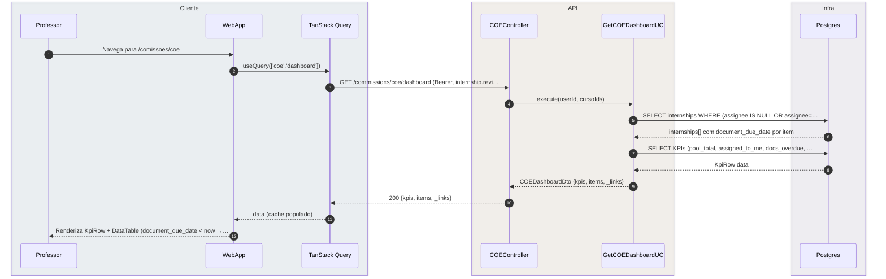
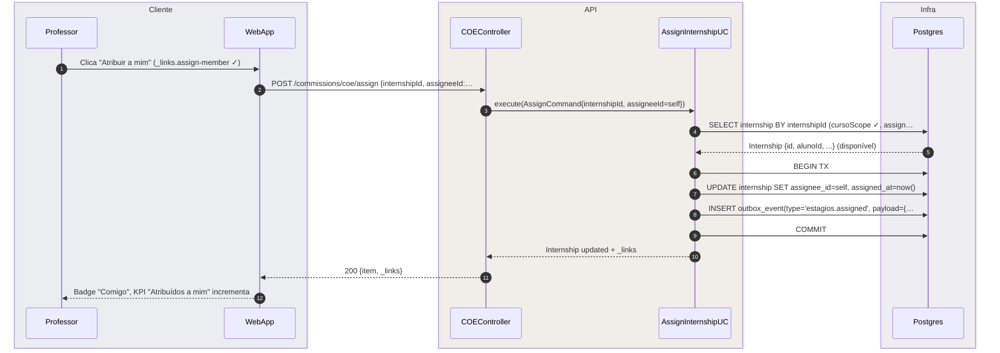
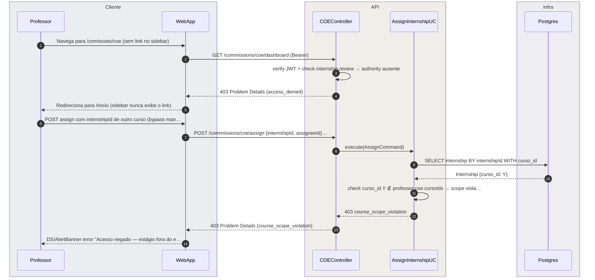

# US-F4-002 — Pool COE: Atribuir e Acompanhar Estágios em Lote

| HU | Tela | Capability | API primária | Fonte |
|----|------|------------|--------------|-------|
| US-F4-002 | F4.2 — `/comissoes/coe` | `internship.review` + escopo COE do curso/centro | `GET /commissions/coe/dashboard` · `GET /commissions/coe/members` · `POST /commissions/coe/assign` | `fluxos_por_perfil.md` §5 · HU US-F4-002 |

---

## Matriz de cobertura

| ID diagrama | Origem (CA/RN) | Tipo | Status |
|-------------|----------------|------|--------|
| F4.2a | CA-01, RN-F4.2-02, RN-F4.2-03, RN-F4.2-04, RN-F4.2-09, RN-F4.2-10 | SEQUENCIA | gerado |
| F4.2b | CA-02, RN-F4.2-05 | SEQUENCIA | gerado |
| F4.2c | CA-03, RN-F4.2-06 | SEQUENCIA | gerado |
| F4.2d | CA-04, RN-F4.2-07 | SEQUENCIA | gerado |
| F4.2e | RN-F4.2-01 | ERRO | gerado |
| — | RN-F4.2-08 (outbox dispatch multicanal) | DRY | → `transversal/10.1` |
| — | F4.1 (estrutura análoga dashboard + assign) | DRY | → `F4/US-F4-001-COMISSAO-CAAF.md` |
| — | Revisão individual por documento pós-assign | DRY | → `F3/US-F3-005-ESTAGIO-ORIENTACAO.md` |
| — | CA-05 EmptyState (pool vazio) | NAO_APLICAVEL | — |
| — | CA-06 célula SLA vencido | NAO_APLICAVEL | — |
| — | Ausência de batch-approve (RN-F4.2-07 UI) | NAO_APLICAVEL | — |

---

## Referências DRY

- **Outbox dispatch** (fase async após qualquer TX): [`../transversal/10.1-outbox-notificacao.md`](../transversal/10.1-outbox-notificacao.md) — cobre o `estagios.assigned` → push/email ao orientador designado e ao aluno.
- **Estrutura análoga CAAF** (dashboard pool + AssignmentBoard + 403): [`./US-F4-001-COMISSAO-CAAF.md`](./US-F4-001-COMISSAO-CAAF.md) — o padrão arquitetural de pool coletivo, `DS/AssignmentBoard` e escopo de capability é idêntico; as diferenças são domínio (estágios vs formativas), ausência de batch-approve e notificação adicional ao aluno.
- **Revisão individual COE** (fluxo que se inicia após atribuição): [`../F3/US-F3-005-ESTAGIO-ORIENTACAO.md`](../F3/US-F3-005-ESTAGIO-ORIENTACAO.md) — parecer por documento em `/estagios/:id` após o orientador ser designado.

---

## Fora de sequência

- **CA-05 EmptyState**: estado UI puro — quando `GET /commissions/coe/dashboard` retorna `items: []`, o WebApp exibe `DS/EmptyState`; sem sequência adicional de backend além de F4.2a com lista vazia.
- **CA-06 SLA vencido (célula `status/danger`)**: o campo `document_due_date` é retornado em cada item de F4.2a; a coloração de perigo e o tooltip são lógica de apresentação no `DS/DataTable` (comparação `document_due_date < now()` no cliente); nenhuma chamada de backend adicional.
- **Ausência de "Aprovar selecionados" no BulkActionBar** (RN-F4.2-07): o `DS/BulkActionBar` do COE simplesmente não renderiza o botão "Aprovar selecionados" — decisão de design intencional (pareceres de estágio são juridicamente sensíveis e sempre individuais); não há guard de erro para esta rota pois o endpoint não existe no COE.

---

## F4.2a — Carregar pool COE (happy path)

**Escopo:** happy path — professor com `internship.review` acessa `/comissoes/coe`; API retorna KPIs + lista de estágios (não atribuídos + atribuídos ao próprio usuário); itens com SLA de documento vencido incluem `document_due_date` para coloração de perigo no cliente.
**Atores:** Professor, WebApp, COEController, GetCOEDashboardUC, Postgres.
**Pré-condições:** professor autenticado, JWT válido, vinculado a COE ativo; estágios `estado != 'CONCLUIDO'` no escopo do curso.



**Notas:**
- Passo 5: `estado != 'CONCLUIDO'` implementa RN-F4.2-10 — estágios encerrados ficam apenas no histórico individual do orientador (`/estagios?to=me`).
- Passo 6: `document_due_date` é o prazo do documento mais antigo ainda sem parecer (`internship_document.review_due_date WHERE reviewed_at IS NULL ORDER BY review_due_date ASC LIMIT 1`); se `null`, nenhum documento pendente.
- Passo 12: a comparação `document_due_date < now()` e a renderização `status/danger` + tooltip com dias de atraso ocorrem no `DS/DataTable` client-side (CA-06 — sem chamada backend extra).

**Lacunas:** nenhuma.

---

## F4.2b — Self-assign com notificação ao aluno (happy path)

**Escopo:** happy path — membro do COE atribui um estágio a si mesmo como orientador; aluno recebe notificação push/email com o nome do orientador designado.
**Atores:** Professor, WebApp, COEController, AssignInternshipUC, Postgres.
**Pré-condições:** estágio sem orientador no pool; professor com `internship.review` e escopo de curso compatível; `_links.assign-member` presente.



**Notas:**
- Passos 6–9: transação atômica — UPDATE + outbox_event em commit único (sem notificação fantasma).
- O payload `{assigneeId=self, alunoId}` resulta em **dois** destinatários no dispatcher: (a) `assigneeId = self` é filtrado como ator da ação (sem auto-notificação); (b) `alunoId` recebe push/email "Seu orientador de estágio foi definido: [nome do professor]" (RN-F4.2-05, CA-02). Fase dispatch → [`../transversal/10.1-outbox-notificacao.md`](../transversal/10.1-outbox-notificacao.md).
- **Diferença chave vs CAAF F4.1b**: no COE o aluno é notificado no momento da atribuição (orientador definido), não apenas na conclusão da análise.

**Lacunas:** nenhuma.

---

## F4.2c — Atribuir a outro orientador via AssignmentBoard

**Escopo:** happy path — membro do COE abre `DS/AssignmentBoard`, consulta carga ativa dos orientadores, seleciona colega e confirma; orientador E aluno recebem notificação.
**Atores:** Professor, WebApp, COEController, GetCOEMembersUC, AssignInternshipUC, Postgres.
**Pré-condições:** estágio sem orientador ou atribuído ao próprio usuário; COE com ≥ 2 membros; professor com `internship.review`.

```mermaid
sequenceDiagram
    autonumber
    box rgba(230,245,255,0.3) Cliente
        participant Professor
        participant WebApp
    end
    box rgba(255,245,230,0.3) API
        participant CTRL as COEController
        participant MUC as GetCOEMembersUC
        participant AUC as AssignInternshipUC
    end
    box rgba(245,240,255,0.3) Infra
        participant DB as Postgres
    end

    Professor->>WebApp: Clica "Atribuir..." na linha (_links.assign-member ✓)
    WebApp->>CTRL: GET /commissions/coe/members?cursoId=X (Bearer, interns…
    CTRL->>MUC: execute(cursoId)
    MUC->>DB: SELECT users JOIN commission_members WITH load=COUNT(ac…
    DB-->>MUC: members[] {id, nome, load}
    MUC-->>CTRL: COEMembersDto
    CTRL-->>WebApp: 200 {members: [{id, nome, load}]}
    WebApp-->>Professor: DS/AssignmentBoard abre (membro com load acima da média…
    Professor->>WebApp: Seleciona orientador + clica "Confirmar"
    WebApp->>CTRL: POST /commissions/coe/assign {internshipId, assigneeId:…
    CTRL->>AUC: execute(AssignCommand{internshipId, assigneeId=orientad…
    AUC->>DB: BEGIN TX; UPDATE internship SET assignee_id=orientador;…
    AUC-->>CTRL: Internship updated
    CTRL-->>WebApp: 200 {item, _links}
    WebApp-->>Professor: Overlay fecha, badge da linha atualiza com nome do orie…
```

**Notas:**
- Passo 4: `load` = `COUNT(*) WHERE assignee_id = member.id AND estado IN ('EM_ANDAMENTO', 'AGUARDANDO_DOC')` — reflete apenas estágios ativos em análise.
- Passo 12 (TX): `outbox_event` com `payload={assigneeId=orientador, alunoId}` → dispatcher entrega: (a) push/email ao orientador "Novo estágio atribuído a você"; (b) push/email ao aluno "Seu orientador foi definido: [nome]". Fase dispatch → [`../transversal/10.1-outbox-notificacao.md`](../transversal/10.1-outbox-notificacao.md).
- Após atribuição ao colega, o estágio **desaparece** do pool do professor atual (RN-F4.2-02).

**Lacunas:** nenhuma.

---

## F4.2d — BulkActionBar — atribuição em lote a um orientador

**Escopo:** happy path — professor seleciona N estágios no pool, abre `DS/AssignmentBoard` pelo `DS/BulkActionBar` (que exibe apenas "Atribuir selecionados", sem "Aprovar"), atribui todos ao mesmo orientador em um único commit; cada estágio recebe `outbox_event` individual.
**Atores:** Professor, WebApp, COEController, AssignInternshipUC, Postgres.
**Pré-condições:** N estágios selecionados no pool (todos do mesmo curso/COE); professor com `internship.review`.

```mermaid
sequenceDiagram
    autonumber
    box rgba(230,245,255,0.3) Cliente
        participant Professor
        participant WebApp
    end
    box rgba(255,245,230,0.3) API
        participant CTRL as COEController
        participant UC as AssignInternshipUC
    end
    box rgba(245,240,255,0.3) Infra
        participant DB as Postgres
    end

    Professor->>WebApp: Seleciona N estágios → BulkActionBar aparece (somente "…
    Professor->>WebApp: Clica "Atribuir selecionados"
    WebApp->>CTRL: GET /commissions/coe/members (Bearer, internship.review ✓)
    CTRL->>DB: SELECT commission_members WITH active internship load
    DB-->>CTRL: members[] {id, nome, load}
    CTRL-->>WebApp: 200 {members}
    WebApp-->>Professor: DS/AssignmentBoard abre para N estágios selecionados
    Professor->>WebApp: Seleciona orientador + "Confirmar para todos (N)"
    WebApp->>CTRL: POST /commissions/coe/assign {internshipIds:[...N], ass…
    CTRL->>UC: execute(BulkAssignCommand{ids, assigneeId})
    UC->>DB: SELECT internships WHERE id IN (ids) FOR UPDATE (cursoS…
    DB-->>UC: N internships com alunoIds[]
    UC->>DB: BEGIN TX; UPDATE N internships SET assignee_id; INSERT …
    UC-->>CTRL: BulkAssignResult {assigned: N}
    CTRL-->>WebApp: 200 {assigned: N, _links}
    WebApp-->>Professor: N linhas com badge "Comigo", KPI "Atribuídos a mim" inc…
```

**Notas:**
- Passo 1: o `DS/BulkActionBar` do COE **não** renderiza "Aprovar selecionados" — diferença intencional em relação ao CAAF (RN-F4.2-07). Pareceres de estágio são juridicamente sensíveis e exigem análise individual por documento.
- Passo 13 (TX): N `outbox_events` individualmente (um por estágio) garantem fan-out correto por aluno → dispatcher entrega notificação ao orientador (uma mensagem consolidada ou N separadas, conforme template) e N notificações individuais aos alunos. Fase dispatch → [`../transversal/10.1-outbox-notificacao.md`](../transversal/10.1-outbox-notificacao.md).
- O endpoint `POST /commissions/coe/assign` aceita `internshipIds: UUID[]` para suporte ao bulk; quando recebe array com 1 elemento, comportamento é idêntico ao F4.2b/F4.2c.

**Lacunas:** nenhuma.

---

## F4.2e — ERRO 403 — sem internship.review ou violação de escopo

**Escopo:** caminhos de erro 403 — (A) professor sem `internship.review` tenta acessar `/comissoes/coe`; (B) professor com `internship.review` tenta atribuir estágio de curso/centro fora do escopo do seu COE.
**Atores:** Professor, WebApp, COEController, AssignInternshipUC, Postgres.
**Pré-condições:** (A) JWT válido, sem authority `internship.review`; (B) `internship.curso_id ∉ commission_member.cursoIds`.



**Notas:**
- Passo 3 (cenário A): `@PreAuthorize("hasAuthority('internship.review')")` rejeita antes de qualquer query; o sidebar BFF não inclui link `/comissoes/coe` sem a authority (UI cega via `_links`).
- Passo 11 (cenário B): validação de escopo no use case após query — não confiar apenas no JWT; defesa em profundidade contra acesso cross-curso/centro.
- Padrão idêntico ao F4.1e (CAAF); diferenças apenas no nome da authority (`internship.review` vs `formative.review`) e no endpoint.

**Lacunas:** nenhuma.

---

## Execução fila

- **Item:** US-F4-002
- **Status:** pendente → feito
- **Arquivo:** `sequenceDiagrams/F4/US-F4-002-COMISSAO-COE.md`
- **Próximo:** US-F3-002 (ordem 21, pendente) — próximo item da fila regular.
