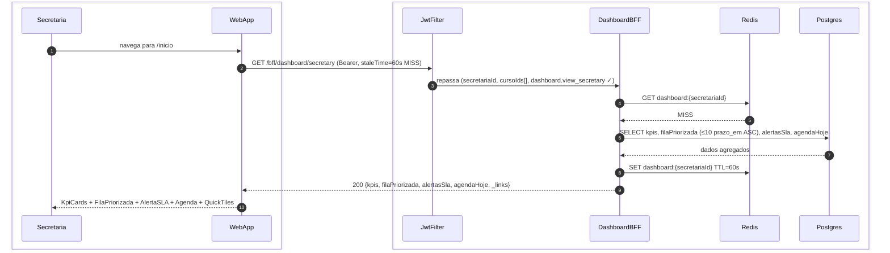
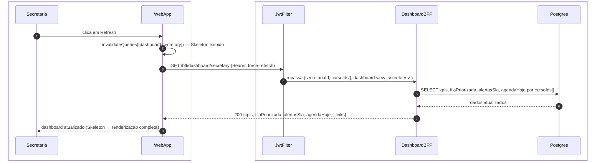
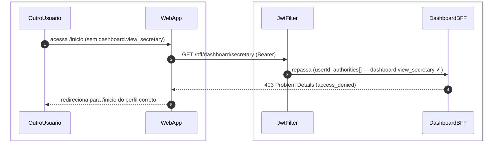

# US-F5-001 — Dashboard Operacional da Secretaria

| HU | Tela | Capability | API primária | Fonte |
|----|------|------------|--------------|-------|
| US-F5-001 | F5.1 — `/inicio` | `dashboard.view_secretary` | `GET /bff/dashboard/secretary` | `HUs/F5 — Secretaria/US-F5-001-DASHBOARD.md` · `fluxos_por_perfil.md` §6 F5.1 |

---

## Matriz de cobertura

| ID diagrama | Origem (CA / RN / sub-fluxo) | Tipo | Status |
|-------------|------------------------------|------|--------|
| F5.1-D01 | CA-F5-001-01 · RN-F5-001-02 · RN-F5-001-03 · RN-F5-001-05 — carregamento inicial (cache MISS) | SEQUENCIA | gerado |
| F5.1-D02 | CA-F5-001-05 · RN-F5-001-08 — refresh manual (cache invalidado) | SEQUENCIA | gerado |
| F5.1-D03 | RN-F5-001-01 — 403 FGAC (acesso sem `dashboard.view_secretary`) | ERRO | gerado |
| — | CA-F5-001-02 (SLA breach — banner `alertasSla[]` + itens `status/danger`) | DRY | → F5.1-D01 (`alertasSla[]` + `filaPriorizada[].sla_status` calculados pelo BFF; renderização client-side) |
| — | CA-F5-001-03 (Empty state — `filaPriorizada: []`) | DRY | → F5.1-D01 (mesmo fluxo HTTP; diferença é apenas `filaPriorizada: []` no JSON retornado) |
| — | CA-F5-001-04 (QuickTiles HATEOAS — tiles condicionais por `_links`) | DRY | → F5.1-D01 (`_links` na resposta BFF → `useActions(_links)` no frontend) |
| — | RN-F5-001-04 (destaque visual breach — `status/danger`) | DRY | → F5.1-D01 (`filaPriorizada[].sla_status` derivado de `prazo_em < now()` no BFF) |
| — | RN-F5-001-06 (Empty state) | NAO_APLICAVEL | — |
| — | RN-F5-001-07 (QuickTiles via `_links`) | DRY | → F5.1-D01 (`useActions` consome `_links` da resposta) |
| — | Skeleton DS/Skeleton (entre request e render) | NAO_APLICAVEL | — |
| — | Responsividade (375 / 768 / 1280 px) | NAO_APLICAVEL | — |

---

## Referências DRY

| Padrão | Arquivo canônico |
|--------|-----------------|
| Blueprint DashboardA (estrutura `/inicio` idêntica para todos os perfis; BFF contextual; UI cega a perfil) | [`F1/US-F1-001-DASHBOARD.md`](../F1/US-F1-001-DASHBOARD.md) F1.1-D01 |
| BFF dashboard professor (mesmo padrão Redis TTL + degradação graciosa) | [`F3/US-F3-001-DASHBOARD.md`](../F3/US-F3-001-DASHBOARD.md) F3.1-D01 |
| JWT validation + FGAC JwtFilter | [`F0/US-F0-001-LOGIN.md`](../F0/US-F0-001-LOGIN.md) F0.1-a |
| BFF aggregation pattern (P7) | `.cursor/skills/fullstack-sequence-diagrams/reference.md` §P7 |
| Outbox dispatcher (notificações assíncronas para a secretaria) | [`transversal/10.1-outbox-notificacao.md`](../transversal/10.1-outbox-notificacao.md) |

---

## Fora de sequência

| Item | Motivo |
|------|--------|
| Skeleton (DS/Skeleton durante `isLoading=true`) | Lógica puramente frontend: componente exibido enquanto TanStack Query aguarda resposta; sem chamada HTTP adicional. |
| Empty state (`filaPriorizada: []`) | Mesmo fluxo HTTP de F5.1-D01; diferença é apenas o conteúdo do JSON (arrays vazios) — sem variação de participantes ou mensagens. |
| Responsividade (375 / 768 / 1280 px) | Requisito de layout CSS; sem troca de mensagens entre camadas. |
| SLA badge visual (`status/danger`, `status/warning`) | Comparação client-side derivada de `filaPriorizada[].sla_status` e `alertasSla[]` já presentes na resposta do BFF. Sem HTTP extra. |
| QuickTiles individuais (Cursos, Alunos, Importações…) | Renderização condicional via `useActions(_links)` sobre a mesma resposta de F5.1-D01; cada tile ausente = `_link` ausente. |

---

## F5.1-D01 — Carregamento inicial do dashboard (happy path — cache MISS)

**Escopo:** happy path — secretária acessa `/inicio`; cache Redis expirado ou ausente  
**Atores:** Secretaria, WebApp, JwtFilter, DashboardBFF, Redis, Postgres  
**Pré-condições:** secretária autenticada com `dashboard.view_secretary`; access token válido; `cursoIds[]` extraídos das capabilities escopeadas

**Notas:**
- Passo 6: BFF executa as 4 sub-queries em paralelo (coroutines/`awaitAll`); `filaPriorizada` limitada a ≤ 10 registros ordenados por `prazo_em ASC, criado_em ASC` (RN-F5-001-03); todas filtradas por `cursoIds[]` extraídos do JWT/escopeamento do usuário (RN-F5-001-05).
- Passo 6: `alertasSla` = itens com `prazo_em < now()`; `filaPriorizada[].sla_status` é calculado pelo BFF (`danger` se `prazo_em < now()`, `warning` se `prazo_em < now + 24h`) — renderização visual client-side via CSS tokens (CA-F5-001-02).
- Passo 9: `_links` inclui entradas para `solicitacoes`, `alunos`, `cursos`, `importacoes` — somente os que a secretária possui capability; `useActions(_links)` no frontend oculta QuickTiles sem `_link` correspondente (RN-F5-001-07, CA-F5-001-04).
- Passo 9: `filaPriorizada: []` retornado quando não há solicitações → EmptyState renderizado client-side (CA-F5-001-03, RN-F5-001-06).

**Lacunas:** nenhuma.

---

## F5.1-D02 — Refresh manual (cache invalidado pelo usuário)

**Escopo:** secretária clica no botão Refresh; TanStack Query invalida cache e força nova chamada  
**Atores:** Secretaria, WebApp, JwtFilter, DashboardBFF, Postgres  
**Pré-condições:** dashboard já renderizado com dados em cache (staleTime = 60 s); secretária deseja ver dados atualizados antes do TTL natural

**Notas:**
- Passo 2: `queryClient.invalidateQueries` zera apenas o cache client-side (TanStack Query `staleTime=60s`); o cache Redis server-side (TTL=60s) pode ainda estar válido. Se Redis HIT ocorrer no passo 5, o BFF devolve dados do cache de servidor (que pode ter até 60 s de defasagem). Comportamento esperado e documentado — para dados 100% em tempo real, o TTL Redis deve ser reduzido.
- Passo 2: Skeleton (`DS/Skeleton`) exibido imediatamente após `invalidateQueries`, enquanto `isLoading=true`; oculto ao completar o passo 8 (CA-F5-001-01, CA-F5-001-05).
- Redis omitido do diagrama para brevidade; comportamento completo (com HIT/MISS Redis) em F5.1-D01.

**Lacunas:** nenhuma.

---

## F5.1-D03 — Erro 403 FGAC (acesso sem `dashboard.view_secretary`)

**Escopo:** usuário sem capability `dashboard.view_secretary` tenta acessar `/bff/dashboard/secretary`  
**Atores:** OutroUsuario, WebApp, JwtFilter, DashboardBFF  
**Pré-condições:** JWT válido; authorities não incluem `dashboard.view_secretary` (ex.: aluno, professor sem role de secretaria)

**Notas:**
- Passo 4: `@PreAuthorize("hasAuthority('dashboard.view_secretary')")` no controller bloqueia a requisição antes de qualquer query ao Postgres; resposta é RFC 7807 Problem Details com `type=access_denied`.
- Passo 5: a rota `/inicio` é universal; o frontend detecta o 403 e redireciona para o BFF endpoint correto do perfil do usuário (`/bff/dashboard/aluno`, `/bff/dashboard/professor`, etc.) conforme a authority presente no JWT — comportamento DRY via mesma rota (RN-F5-001-01, `fluxos_por_perfil.md` §13).
- Diagrama relacionado: F5.1-D01 (happy path com capability válida).

**Lacunas:** nenhuma.
