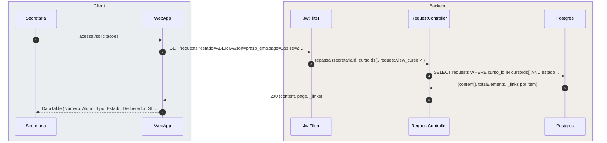
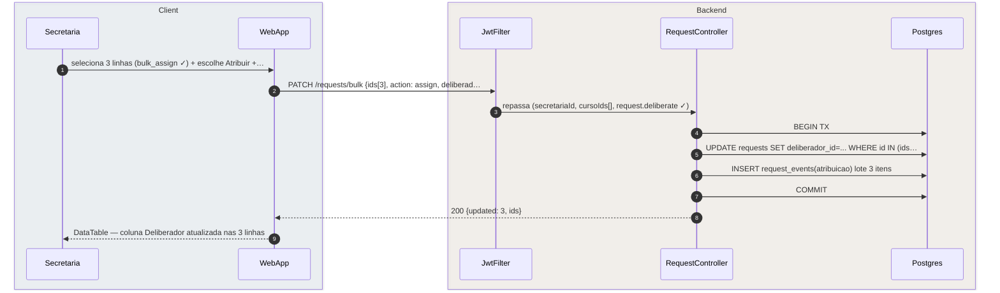
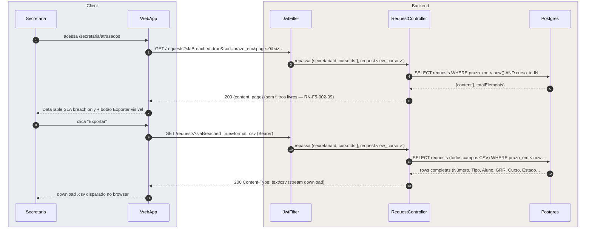
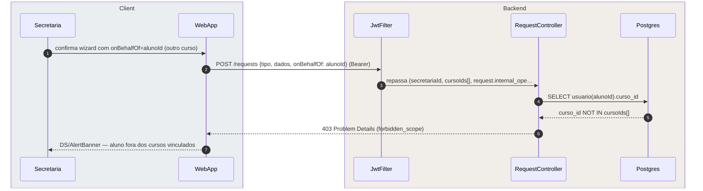
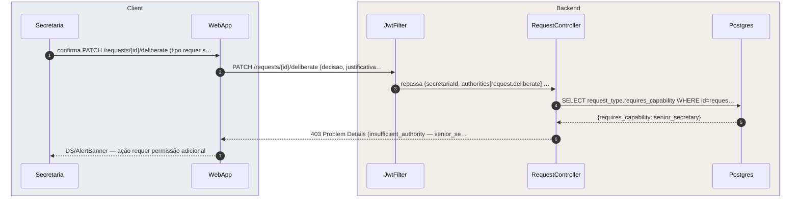

# US-F5-002 — Fila de Solicitações, Nova Interna, Deliberar e Atrasados

| HU | Telas | Capabilities | APIs primárias | Fonte |
|----|-------|--------------|----------------|-------|
| US-F5-002 | F5.2 (`/solicitacoes`) · F5.3 (`/solicitacoes/nova`) · F5.4 (`/solicitacoes/:id/deliberar`) · F5.5 (`/secretaria/atrasados`) | `request.view_curso` · `request.internal_open` · `request.deliberate` | `GET /requests` · `POST /requests {onBehalfOf}` · `PATCH /requests/:id/deliberate` · `PATCH /requests/bulk` | `HUs/F5 — Secretaria/US-F5-002-SOLICITACOES.md` · `fluxos_por_perfil.md` §6 F5.1–F5.2 |

---

## Matriz de cobertura

| ID diagrama | Origem (CA / RN / sub-fluxo) | Tipo | Status |
|-------------|------------------------------|------|--------|
| F5.2-D01 | CA-F5-002-01 · RN-F5-002-01 · RN-F5-002-04 — fila paginada com filtros + HATEOAS | SEQUENCIA | gerado |
| F5.3-D02 | CA-F5-002-02 · RN-F5-002-05 — nova interna (Combobox + POST /requests onBehalfOf + TX + outbox) | SEQUENCIA | gerado |
| F5.4-D03 | CA-F5-002-03 · RN-F5-002-07 — deliberar sem deep-link (GET detalhe + PATCH + TX + outbox) | SEQUENCIA | gerado |
| F5.2-D04 | CA-F5-002-04 · RN-F5-002-08 — ação em massa (PATCH /requests/bulk assign) | SEQUENCIA | gerado |
| F5.5-D05 | CA-F5-002-05 · RN-F5-002-09 · RN-F5-002-10 — atrasados (slaBreached=true) + exportar CSV | SEQUENCIA | gerado |
| F5.3-ERRO | RN-F5-002-06 — 403 nova interna: aluno fora de escopo de cursos | ERRO | gerado |
| F5.4-ERRO | RN-F5-002-07 — 403 deliberar: `senior_secretary` ausente para o RequestType | ERRO | gerado |
| — | CA-F5-002-06 (Empty state — `filaPriorizada: []`) | DRY | → F5.2-D01 (mesma query; diferença é arrays vazios no JSON) |
| — | RN-F5-002-02 (filtros padrão + localStorage por sessão) | NAO_APLICAVEL | — |
| — | RN-F5-002-03 (colunas obrigatórias + SLA visual `status/danger`) | DRY | → F5.2-D01 (ordenação e `sla_status` calculados no backend; renderização client-side) |
| — | Wizard F1.8 (GET /request-types elegíveis + form_schema + upload) | DRY | → [`F1/US-F1-005-SOLICITACOES.md`](../F1/US-F1-005-SOLICITACOES.md) F1.8-D02, F1.8-D03 |
| — | Skeleton / Empty / Error states da DataTable | NAO_APLICAVEL | — |
| — | Responsividade (375 / 768 / 1280 px) | NAO_APLICAVEL | — |

---

## Referências DRY

| Padrão | Arquivo canônico |
|--------|-----------------|
| Wizard de abertura (GET /request-types + form_schema + upload MinIO) | [`F1/US-F1-005-SOLICITACOES.md`](../F1/US-F1-005-SOLICITACOES.md) F1.8-D02, F1.8-D03 |
| Deliberar via deep-link (mesmo PATCH, com JWT 1-uso) | `F3/US-F3-003-DELIBERAR-SOLICITACOES.md` F3.4-D01 *(pendente — referenciar quando gerado)* |
| TX commit atômico + outbox (fase dispatch) | [`transversal/10.1-outbox-notificacao.md`](../transversal/10.1-outbox-notificacao.md) 10.1a + 10.1b |
| JWT validation + FGAC JwtFilter | [`F0/US-F0-001-LOGIN.md`](../F0/US-F0-001-LOGIN.md) F0.1-a |
| Workflow state machine (ciclo de vida da solicitação) | `fluxos_por_perfil.md` §10.2 (stateDiagram — referência, não sequência) |

---

## Fora de sequência

| Item | Motivo |
|------|--------|
| Filtros padrão + persistência em `localStorage` (RN-F5-002-02) | Estado client-side puro; sem chamada HTTP ao alterar filtros já carregados. |
| Coluna SLA `status/danger` / `status/warning` (RN-F5-002-03) | Derivado de `sla_status` já presente na resposta de F5.2-D01; comparação e aplicação de token CSS feita no frontend. |
| Skeleton (DS/Skeleton enquanto `isLoading=true`) | Lógica TanStack Query client-side; sem chamada HTTP adicional. |
| Empty state (`content: []`) (CA-F5-002-06) | Mesmo fluxo de F5.2-D01; diferença é `content: []` no JSON. Sem variação de participantes. |
| Navegação dos 3 passos do wizard F5.3 | Client-side routing; sem troca de mensagens entre camadas. |
| Responsividade | Requisito CSS; sem troca de mensagens. |
| Aprovação em lote (fora do escopo desta HU) | Explicitamente fora de escopo — apenas atribuição/encaminhamento em massa. |

---

## F5.2-D01 — Fila de solicitações (lista paginada com filtros e HATEOAS — happy path)

**Escopo:** happy path — secretária acessa `/solicitacoes`; listagem filtrada por cursos vinculados; ações por linha via `_links`  
**Atores:** Secretaria, WebApp, JwtFilter, RequestController, Postgres  
**Pré-condições:** autenticada com `request.view_curso`; `cursoIds[]` escopeados no JWT; filtros padrão `estado=ABERTA&sort=prazo_em`



**Notas:**
- Passo 4: `cursoIds[]` é extraído das capabilities escopeadas do JWT — a secretária nunca vê solicitações de cursos fora de sua competência (RN-F5-002-01).
- Passo 5: `_links` é calculado por item no `RequestController` conforme `authorities[]` da secretária e estado atual da solicitação (workflow); botões `deliberate`, `assign`, `encaminhar` aparecem somente se o `rel` correspondente estiver presente (RN-F5-002-04).
- Passo 5: `sla_status` (`danger` se `prazo_em < now()`, `warning` se `prazo_em < now + 24h`) é calculado no backend e retornado na resposta; renderização visual (`status/danger`, `status/warning`) é client-side — sem HTTP extra (RN-F5-002-03).
- Paginação adicional: nova chamada com `page=1&size=20`; mesmo fluxo sem variação de participantes.

**Lacunas:** nenhuma.

---

## F5.3-D02 — Nova interna em nome de aluno (Combobox + POST /requests + TX + outbox)

**Escopo:** happy path — secretária abre solicitação em nome de aluno; busca por GRR/nome; wizard reutiliza F1.8; `onBehalfOf` na TX  
**Atores:** Secretaria, WebApp, JwtFilter, RequestController, Postgres  
**Pré-condições:** autenticada com `request.internal_open`; aluno pertence a um dos cursos da secretária; tipos elegíveis já carregados (DRY → F1.8-D02)

```mermaid
sequenceDiagram
    autonumber
    box rgba(230,245,255,0.3) Client
        participant Secretaria
        participant WebApp
    end
    box rgba(255,245,230,0.3) Backend
        participant JwtFilter
        participant RequestController
        participant Postgres
    end

    Secretaria->>WebApp: clica "Nova interna" + digita GRR no Combobox
    WebApp->>JwtFilter: GET /students?q=20231234 (Bearer, request.internal_open ✓)
    JwtFilter->>RequestController: repassa (secretariaId, cursoIds[])
    RequestController->>Postgres: SELECT usuario WHERE (grr=... OR nome LIKE) AND curso_i…
    Postgres-->>RequestController: [{id, nome, grr, curso}]
    RequestController-->>WebApp: 200 [{id, nome, grr, curso}]
    WebApp-->>Secretaria: aluno no Combobox; secretária preenche wizard e confirma
    WebApp->>JwtFilter: POST /requests {tipo, dados, onBehalfOf: alunoId} (Bearer)
    JwtFilter->>RequestController: repassa (secretariaId, cursoIds[], request.internal_ope…
    RequestController->>Postgres: BEGIN TX
    RequestController->>Postgres: INSERT request(onBehalfOf=alunoId, estado=ABERTA, prazo…
    RequestController->>Postgres: INSERT outbox_event(solicitacoes.opened)
    RequestController->>Postgres: COMMIT
    RequestController-->>WebApp: 201 {id, numero, estado=ABERTA, _links}
    WebApp-->>Secretaria: /solicitacoes/:id — titular=aluno (dispatch async → lin…
```

**Notas:**
- Passo 4: busca com trigramas PostgreSQL (`pg_trgm`) para nome; `GRR` por igualdade exata; `AND curso_id IN cursoIds[]` restringe a alunos da competência da secretária (RN-F5-002-06 — validado também no POST, passo 9).
- Passo 7: o wizard percorre os 3 passos de F1.8 (tipos elegíveis → formulário dinâmico → revisar); a diferença é o campo adicional `Combobox` de aluno (RN-F5-002-05). DRY → [`F1/US-F1-005-SOLICITACOES.md`](../F1/US-F1-005-SOLICITACOES.md) F1.8-D02, F1.8-D03 para as etapas de tipos e upload de anexo.
- Passos 10–13: transação atômica — `INSERT request` + `INSERT outbox_event` em único COMMIT; se falhar, nenhum evento é enfileirado (padrão 10.1a). `numero_anual` gerado atomicamente (`ano-NNNN`).
- Passo 15: dispatch assíncrono notifica o aluno titular (in-app + push + email) via `OutboxDispatcher` → DRY [`transversal/10.1-outbox-notificacao.md`](../transversal/10.1-outbox-notificacao.md) 10.1b.

**Lacunas:** nenhuma.

---

## F5.4-D03 — Deliberar solicitação sem deep-link (GET detalhe + PATCH + TX + outbox)

**Escopo:** happy path — secretária acessa `/solicitacoes/:id/deliberar` diretamente pela fila; delibera sem JWT de email  
**Atores:** Secretaria, WebApp, JwtFilter, RequestController, Postgres  
**Pré-condições:** autenticada com `request.deliberate`; `_link deliberate` presente na resposta da fila (F5.2-D01); RequestType não exige `senior_secretary`

```mermaid
sequenceDiagram
    autonumber
    box rgba(230,245,255,0.3) Client
        participant Secretaria
        participant WebApp
    end
    box rgba(255,245,230,0.3) Backend
        participant JwtFilter
        participant RequestController
        participant Postgres
    end

    Secretaria->>WebApp: clica linha → /solicitacoes/:id/deliberar
    WebApp->>JwtFilter: GET /requests/{id} (Bearer, request.deliberate ✓)
    JwtFilter->>RequestController: repassa (secretariaId, cursoIds[], request.deliberate ✓)
    RequestController->>Postgres: SELECT request + request_events + _links calculados
    Postgres-->>RequestController: {request, timeline, _links: [deliberate, encaminhar, ...]}
    RequestController-->>WebApp: 200 {request, timeline, _links}
    Secretaria->>WebApp: seleciona ação (ex.: DEFERIDA) + digita justificativa +…
    WebApp->>JwtFilter: PATCH /requests/{id}/deliberate {decisao=DEFERIDA, just…
    JwtFilter->>RequestController: repassa (secretariaId, request.deliberate ✓)
    RequestController->>Postgres: BEGIN TX
    RequestController->>Postgres: UPDATE request SET estado=DEFERIDA; INSERT request_even…
    RequestController->>Postgres: INSERT outbox_event(solicitacoes.deliberated)
    RequestController->>Postgres: COMMIT
    RequestController-->>WebApp: 200 {request, estado=DEFERIDA, _links}
    WebApp-->>Secretaria: solicitação atualizada (notif. async → link 10.1b)
```

**Notas:**
- Passos 2–6: `GET /requests/{id}` retorna `_links` com base nas `authorities[]` da secretária + estado atual da solicitação. O botão de ação no frontend é renderizado somente se o `rel` existir — garante que a secretária não vê ações além de sua capability (RN-F5-002-04, RN-F5-002-07).
- Passo 7: fluxo sem JWT deep-link (diferença central em relação a F3.4). Secretária acessa diretamente pela fila; sem redirecionamento por email. Mesmo endpoint `PATCH /requests/{id}/deliberate` (RN-F5-002-07, DRY → `F3/US-F3-003-DELIBERAR-SOLICITACOES.md` F3.4-D01 quando gerado).
- Passos 10–13: TX atômica — `UPDATE request`, `INSERT request_event`, `INSERT outbox_event` em COMMIT único (padrão 10.1a). `decisao` pode ser `DEFERIDA`, `INDEFERIDA` ou `COMPLEMENTACAO`.
- Passo 15: `OutboxDispatcher` notifica o aluno titular (in-app + push + email); DRY → [`transversal/10.1-outbox-notificacao.md`](../transversal/10.1-outbox-notificacao.md) 10.1b.

**Lacunas:** nenhuma.

---

## F5.2-D04 — Ação em massa: atribuir deliberador (PATCH /requests/bulk)

**Escopo:** happy path — secretária seleciona múltiplas solicitações com `_link bulk_assign` e atribui um deliberador em lote  
**Atores:** Secretaria, WebApp, JwtFilter, RequestController, Postgres  
**Pré-condições:** autenticada com `request.deliberate`; ao menos uma solicitação com `_link bulk_assign` na fila; professor deliberador selecionado



**Notas:**
- Passo 1: `DS/BulkActionBar` só renderiza checkboxes em linhas cujo `_link bulk_assign` está presente na resposta — linhas em estados incompatíveis não participam da seleção (RN-F5-002-08).
- Passo 5: a query filtra `id IN (ids) AND curso_id IN cursoIds[]` para prevenir modificação de solicitações fora do escopo da secretária, mesmo com IDs forjados; backend revalida capability antes do UPDATE.
- Passo 6: cada `request_event` registra `tipo=ATRIBUICAO, por=secretariaId, para=deliberadorId` — mantém rastreabilidade individual mesmo em ação de lote.
- Não há `outbox_event` neste fluxo (atribuição não gera notificação ao aluno por padrão); a notificação ao deliberador pode ser configurada via `request_type.workflow_json` (fora do escopo desta HU).

**Lacunas:** nenhuma.

---

## F5.5-D05 — Atrasados com exportação CSV (slaBreached=true + GET format=csv)

**Escopo:** happy path — secretária acessa `/secretaria/atrasados`, visualiza fila SLA breached e exporta CSV da página  
**Atores:** Secretaria, WebApp, JwtFilter, RequestController, Postgres  
**Pré-condições:** autenticada com `request.view_curso`; existem solicitações com `prazo_em < now()`



**Notas:**
- Passo 6: a resposta da tela Atrasados omite os controles de filtro livre (estado, tipo, curso) pois o filtro `slaBreached=true` é persistente e fixo (RN-F5-002-09). A DataTable exibe o mesmo conjunto de colunas de F5.2-D01.
- Passos 8–14: exportação síncrona da página atual — sem job assíncrono; `format=csv` aciona o marshaller CSV no `RequestController` (RN-F5-002-10). Campos do CSV: Número, Tipo, Aluno, GRR, Curso, Estado, Deliberador, Data Abertura, Prazo, Dias de Atraso.
- Passo 13: `Content-Disposition: attachment; filename=atrasados-{date}.csv`; encoding UTF-8 BOM para compatibilidade com Excel.

**Lacunas:** nenhuma.

---

## F5.3-ERRO — 403 nova interna: aluno fora do escopo de cursos da secretária

**Escopo:** erro de escopo — secretária tenta abrir solicitação em nome de aluno de curso não vinculado  
**Atores:** Secretaria, WebApp, JwtFilter, RequestController, Postgres  
**Pré-condições:** secretária possui `request.internal_open`; `onBehalfOf` aponta para aluno de curso fora de `cursoIds[]`



**Notas:**
- Passo 4: o `RequestController` verifica `alunoId.curso_id IN cursoIds[]` antes de qualquer INSERT — mesma validação feita no Combobox (passo 4 de F5.3-D02), mas repetida no backend por defense-in-depth (RN-F5-002-06).
- Passo 6: RFC 7807 Problem Details `type=forbidden_scope`; corpo completo em **Notas** — não inline na seta.
- Passo 7: `DS/AlertBanner` exibe "O aluno selecionado não pertence aos cursos vinculados à sua conta." — permite que a secretária corrija o aluno no Combobox sem sair do wizard.

**Lacunas:** nenhuma.

---

## F5.4-ERRO — 403 deliberar: RequestType exige `senior_secretary` ausente

**Escopo:** erro de autoridade insuficiente — secretária tenta deliberar RequestType que requer capability `senior_secretary`  
**Atores:** Secretaria, WebApp, JwtFilter, RequestController, Postgres  
**Pré-condições:** secretária possui `request.deliberate` mas não `senior_secretary`; RequestType tem `requires_capability: senior_secretary`



**Notas:**
- Passo 4: o `RequestController` consulta `request_type.requires_capability` para o tipo da solicitação; se a capability exigida não estiver nas `authorities[]` do JWT, a deliberação é bloqueada antes de qualquer mutação (RN-F5-002-07).
- Observação HATEOAS: idealmente o `_link deliberate` não deveria estar presente para este usuário neste RequestType (o BFF deveria omiti-lo); o diagrama documenta a defesa backend para o caso de `_link` presente indevidamente ou acesso direto à URL.
- Passo 7: `DS/AlertBanner` exibe "Você não possui permissão para deliberar este tipo de solicitação. Contate um secretário sênior." — orienta a ação corretiva.

**Lacunas:** nenhuma.
