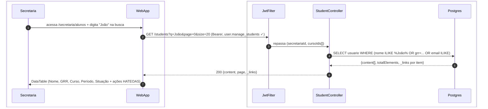
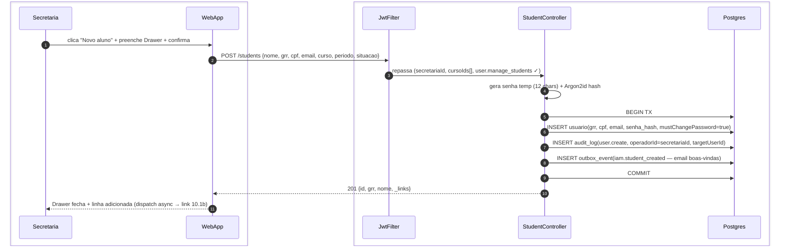
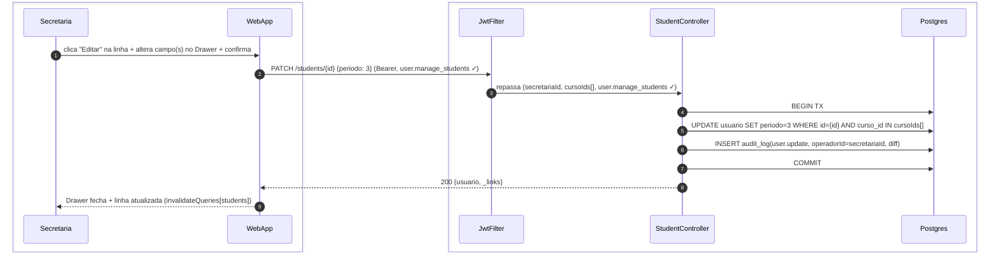
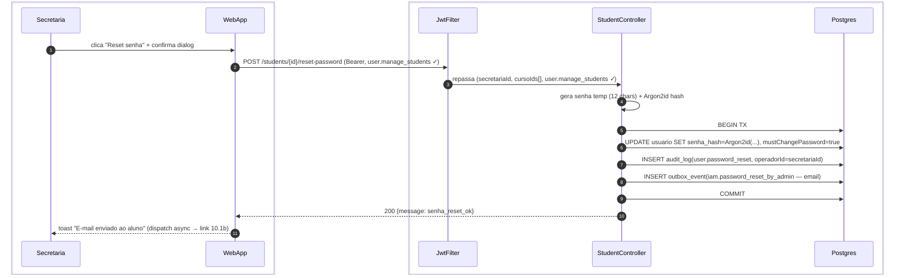
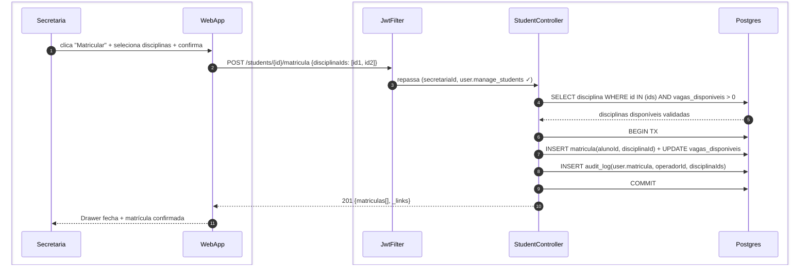
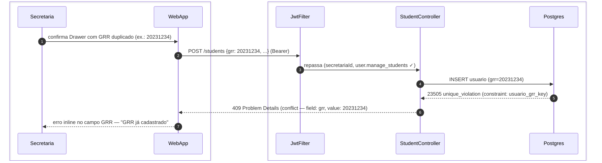
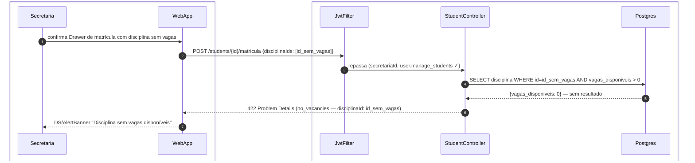
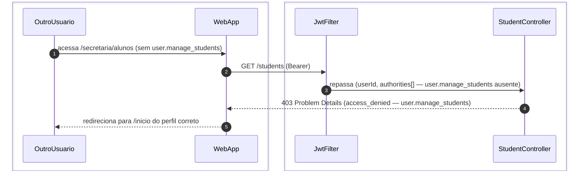

# US-F5-003 — Gestão de Alunos

| HU | Tela | Capability | APIs primárias | Fonte |
|----|------|------------|----------------|-------|
| US-F5-003 | F5.6 — `/secretaria/alunos` | `user.manage_students` | `GET /students` · `POST /students` · `PATCH /students/:id` · `POST /students/:id/reset-password` · `POST /students/:id/matricula` | `HUs/F5 — Secretaria/US-F5-003-GESTAO-ALUNOS.md` · `fluxos_por_perfil.md` §6 F5.4 |

---

## Matriz de cobertura

| ID diagrama | Origem (CA / RN / sub-fluxo) | Tipo | Status |
|-------------|------------------------------|------|--------|
| F5.6-D01 | CA-F5-003-01 · RN-F5-003-02 · RN-F5-003-08 — busca de alunos (GET /students + HATEOAS por linha) | SEQUENCIA | gerado |
| F5.6-D02 | CA-F5-003-02 · RN-F5-003-07 — cadastrar novo aluno (POST /students + audit_log + outbox email boas-vindas) | SEQUENCIA | gerado |
| F5.6-D03 | CA-F5-003-03 · RN-F5-003-07 — editar aluno (PATCH /students/:id + audit_log + TanStack invalidate) | SEQUENCIA | gerado |
| F5.6-D04 | CA-F5-003-04 · RN-F5-003-05 · RN-F5-003-07 — reset de senha (POST reset-password + Argon2id + mustChangePassword + outbox + audit_log) | SEQUENCIA | gerado |
| F5.6-D05 | RN-F5-003-06 — matrícula em disciplina (POST /matricula + validação vagas + audit_log) | SEQUENCIA | gerado |
| F5.6-ERRO-01 | CA-F5-003-05 · RN-F5-003-04 — 409 conflito GRR/CPF | ERRO | gerado |
| F5.6-ERRO-02 | RN-F5-003-06 — 422 matrícula sem vagas disponíveis | ERRO | gerado |
| F5.6-ERRO-03 | RN-F5-003-01 — 403 FGAC `user.manage_students` ausente | ERRO | gerado |
| — | CA-F5-003-06 (aluno de outro curso — ações ausentes) | DRY | → F5.6-D01 (`_links` ausentes para alunos de cursos fora de `cursoIds[]` — RN-F5-003-08) |
| — | RN-F5-003-03 (formulário Drawer — campos, máscaras, validações) | NAO_APLICAVEL | — |
| — | RN-F5-003-09 (Drawer fecha + TanStack Query invalidate sem reload) | NAO_APLICAVEL | — |
| — | DS/Skeleton, DS/EmptyState | NAO_APLICAVEL | — |
| — | Responsividade (375 / 768 / 1280 px) | NAO_APLICAVEL | — |

---

## Referências DRY

| Padrão | Arquivo canônico |
|--------|-----------------|
| JWT validation + FGAC JwtFilter | [`F0/US-F0-001-LOGIN.md`](../F0/US-F0-001-LOGIN.md) F0.1-a |
| Reset de senha iniciado pelo usuário (fluxo análogo) | [`F0/US-F0-002-RECUPERAR-SENHA.md`](../F0/US-F0-002-RECUPERAR-SENHA.md) F0.2-a |
| TX commit atômico + outbox dispatch | [`transversal/10.1-outbox-notificacao.md`](../transversal/10.1-outbox-notificacao.md) 10.1a + 10.1b |
| Reset administrativo de senha (F7.6) | `fluxos_por_perfil.md` §8 F7.6 *(padrão `POST /users/{id}/password-reset` — sem exposição da senha ao admin)* |

---

## Fora de sequência

| Item | Motivo |
|------|--------|
| Formulário Drawer (campos, máscaras, validação Zod client-side) — RN-F5-003-03 | Renderização e validação client-side; sem chamada HTTP enquanto o usuário preenche o Drawer. |
| Drawer fecha + TanStack Query `invalidateQueries` sem reload — RN-F5-003-09 | Client-side puro — `onSuccess` chama `queryClient.invalidateQueries([students])`; a nova lista é buscada pelo hook, sem variação de participantes backend. |
| DS/Skeleton, DS/EmptyState | Lógica `isLoading` / `data.length === 0` no frontend; sem chamada HTTP adicional. |
| Responsividade | CSS / layout; sem troca de mensagens. |
| Exclusão permanente de aluno (fora de escopo) | Soft-delete via `situacao=INATIVO` no `PATCH /students/:id` — coberto por F5.6-D03. |

---

## F5.6-D01 — Busca de alunos (lista paginada + HATEOAS por linha — happy path)

**Escopo:** happy path — secretária pesquisa alunos por nome/GRR/e-mail; ações por linha controladas por `_links`  
**Atores:** Secretaria, WebApp, JwtFilter, StudentController, Postgres  
**Pré-condições:** autenticada com `user.manage_students`; `cursoIds[]` no JWT; busca dispara com debounce 300 ms

**Notas:**
- Passo 4: busca com `pg_trgm` para `nome` (trigramas, case-insensitive); `grr` por igualdade exata; `email` por `ILIKE prefix%`. Os três campos combinados com `OR` (RN-F5-003-02). Busca não filtra por `cursoIds[]` — alunos de qualquer curso aparecem nos resultados.
- Passo 5: `_links` calculados por item: `edit`, `reset-password`, `matricula` presentes **somente** se `aluno.curso_id IN cursoIds[]`; alunos de outros cursos retornam sem `_links` de ação — botões ocultos no frontend (RN-F5-003-08, CA-F5-003-06).
- Paginação adicional: nova chamada com `page=1`; mesmo fluxo sem variação de participantes.

**Lacunas:** nenhuma.

---

## F5.6-D02 — Cadastrar novo aluno (POST /students + audit_log + outbox email boas-vindas)

**Escopo:** happy path — secretária preenche Drawer e cria novo aluno; TX inclui senha temporária Argon2id + audit_log + outbox  
**Atores:** Secretaria, WebApp, JwtFilter, StudentController, Postgres  
**Pré-condições:** autenticada com `user.manage_students`; GRR e CPF ainda não existem no sistema

**Notas:**
- Passo 4: `StudentController` gera a senha temporária em memória (não persistida em texto claro) e calcula o hash Argon2id antes de abrir a TX — a senha temporária só trafega no payload do `outbox_event` (criptografado em trânsito via TLS; template de e-mail é o único ponto de exposição).
- Passos 5–9: TX atômica — `INSERT usuario` + `INSERT audit_log` + `INSERT outbox_event` em COMMIT único; se falhar, nenhum evento é enfileirado e nenhum e-mail é enviado (padrão 10.1a).
- Passo 11: dispatch assíncrono via `OutboxDispatcher` envia e-mail de boas-vindas com senha temporária; DRY → [`transversal/10.1-outbox-notificacao.md`](../transversal/10.1-outbox-notificacao.md) 10.1b. `mustChangePassword=true` força troca no próximo login (DRY → [`F1/US-F1-002-PRIMEIRO-ACESSO.md`](../F1/US-F1-002-PRIMEIRO-ACESSO.md)).

**Lacunas:** nenhuma.

---

## F5.6-D03 — Editar aluno (PATCH /students/:id + audit_log)

**Escopo:** happy path — secretária abre Drawer pré-preenchido, altera campo e salva; resposta atualiza linha sem reload  
**Atores:** Secretaria, WebApp, JwtFilter, StudentController, Postgres  
**Pré-condições:** autenticada com `user.manage_students`; `_link edit` presente na linha (aluno do curso gerenciado)

**Notas:**
- Passo 5: `AND curso_id IN cursoIds[]` previne que a secretária edite alunos de cursos fora de sua competência mesmo com PATCH direto à URL (RN-F5-003-08); retorna 404 se `id` não pertencer ao escopo (preferível a 403 para não vazar existência de registros).
- Passo 6: `audit_log` persiste `diff` — objeto com `{campo, de, para}` para cada campo alterado — e `operadorId` (RN-F5-003-07). Campos não alterados não integram o diff.
- Passo 9: `queryClient.invalidateQueries([students])` (RN-F5-003-09) aciona nova chamada `GET /students` pelo TanStack Query hook, atualizando a tabela sem `window.location.reload()`.

**Lacunas:** nenhuma.

---

## F5.6-D04 — Reset de senha administrativo (POST reset-password + Argon2id + mustChangePassword + outbox + audit_log)

**Escopo:** happy path — secretária reseta senha de aluno; nova senha temporária Argon2id, mustChangePassword e e-mail via outbox  
**Atores:** Secretaria, WebApp, JwtFilter, StudentController, Postgres  
**Pré-condições:** autenticada com `user.manage_students`; `_link reset-password` presente (aluno do curso gerenciado)

**Notas:**
- Passo 4: geração de senha temporária em memória antes da TX; nunca persistida em texto claro. Hash Argon2id calculado no mesmo passo (RN-F5-003-05).
- Passo 6: `mustChangePassword=true` força redirecionamento ao fluxo de primeiro acesso no próximo login do aluno (DRY → [`F1/US-F1-002-PRIMEIRO-ACESSO.md`](../F1/US-F1-002-PRIMEIRO-ACESSO.md) F1.2-D01 guard `mustChangePassword`).
- Passo 7: `audit_log` registra `tipo=user.password_reset`, `operadorId`, `targetUserId`, `timestamp`; a senha temporária **não** é registrada no audit_log (RN-F5-003-07). A secretária em nenhum momento visualiza a senha — ela é entregue diretamente ao aluno por e-mail (segue padrão `fluxos_por_perfil.md` §8 F7.6).
- Passo 11: dispatch async → [`transversal/10.1-outbox-notificacao.md`](../transversal/10.1-outbox-notificacao.md) 10.1b. Template `PASSWORD_RESET_BY_ADMIN` (diferente do self-service `PASSWORD_RESET` de F0.2-a).

**Lacunas:** nenhuma.

---

## F5.6-D05 — Matrícula em disciplina (POST /matricula + validação de vagas + audit_log)

**Escopo:** happy path — secretária vincula aluno a disciplinas do período vigente; validação de vagas antes do INSERT  
**Atores:** Secretaria, WebApp, JwtFilter, StudentController, Postgres  
**Pré-condições:** autenticada com `user.manage_students`; `_link matricula` presente; disciplinas existem no catálogo com vagas disponíveis

**Notas:**
- Passo 4: `SELECT ... FOR UPDATE` trava as linhas de disciplina antes da TX para prevenir condição de corrida em matrículas concorrentes (RN-F5-003-06). Se qualquer disciplina retornar `vagas_disponiveis = 0`, o fluxo desvia para F5.6-ERRO-02 antes de abrir a TX.
- Passo 7: `UPDATE vagas_disponiveis -= 1` e `INSERT matricula` executados em lote por disciplina dentro da mesma TX; rollback automático se qualquer INSERT falhar.
- Sem `outbox_event` neste fluxo — notificação de matrícula ao aluno é opcional e configúrável em `request_type.workflow_json`; fora do escopo desta HU.

**Lacunas:** nenhuma.

---

## F5.6-ERRO-01 — 409 conflito de GRR ou CPF

**Escopo:** erro de unicidade — secretária tenta cadastrar aluno com GRR ou CPF já existente  
**Atores:** Secretaria, WebApp, JwtFilter, StudentController, Postgres  
**Pré-condições:** `POST /students` disparado; GRR ou CPF já existe em `usuario`

**Notas:**
- Passo 5: o erro Postgres `23505` (`unique_violation`) é capturado pelo `ExceptionHandler`; o `StudentController` extrai o nome da constraint para identificar o campo conflitante (`grr` ou `cpf`) e compõe o Problem Details correspondente (RN-F5-003-04).
- Passo 6: RFC 7807 Problem Details com `type=conflict`, `field=grr`, `value=20231234`; corpo completo em **Notas** — não inline na seta.
- Passo 7: o Drawer permanece aberto com o campo GRR destacado em `status/danger`; nenhum dado é perdido — secretária pode corrigir o valor sem reabrir o Drawer.

**Lacunas:** nenhuma.

---

## F5.6-ERRO-02 — 422 matrícula sem vagas disponíveis

**Escopo:** erro de validação — secretária tenta matricular aluno em disciplina sem vagas  
**Atores:** Secretaria, WebApp, JwtFilter, StudentController, Postgres  
**Pré-condições:** `POST /students/:id/matricula` disparado; ao menos uma disciplina com `vagas_disponiveis = 0`

**Notas:**
- Passo 4: verificação feita **antes** de abrir a TX — evita rollback desnecessário e `LOCK` em disciplinas válidas da mesma requisição (RN-F5-003-06).
- Passo 6: RFC 7807 Problem Details `type=no_vacancies`; body inclui `disciplinaId` e `nome` da disciplina para facilitar correção pelo operador.
- O Drawer permanece aberto; secretária pode desmarcar a disciplina sem vagas e confirmar somente as disponíveis.

**Lacunas:** nenhuma.

---

## F5.6-ERRO-03 — 403 FGAC: acesso sem `user.manage_students`

**Escopo:** erro de autorização — usuário sem capability `user.manage_students` tenta acessar a tela de gestão de alunos  
**Atores:** OutroUsuario, WebApp, JwtFilter, StudentController  
**Pré-condições:** JWT válido; authorities não incluem `user.manage_students`

**Notas:**
- Passo 4: `@PreAuthorize("hasAuthority('user.manage_students')")` no `StudentController` bloqueia antes de qualquer query ao Postgres; resposta RFC 7807 `type=access_denied` (RN-F5-003-01).
- Passo 5: o frontend detecta o 403 e redireciona para o BFF endpoint do perfil do usuário (`/bff/dashboard/aluno`, `/bff/dashboard/professor`, etc.) via lógica análoga ao F5.1-D03.

**Lacunas:** nenhuma.
