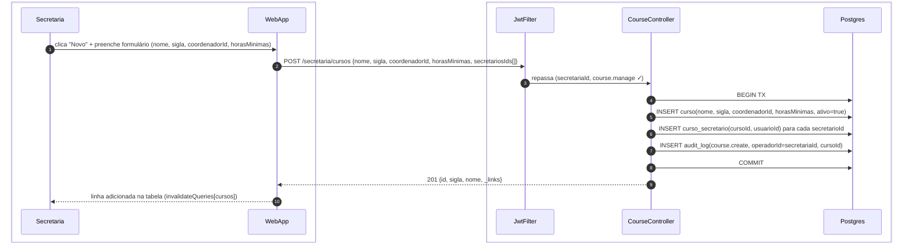
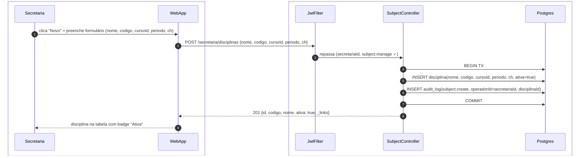
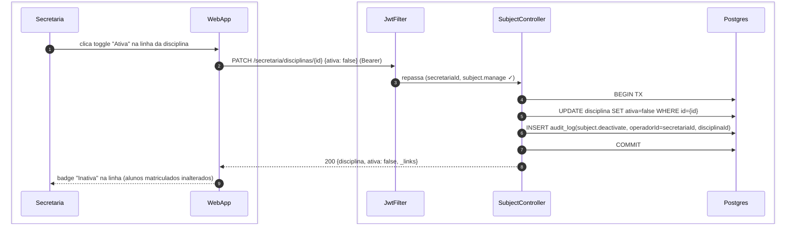
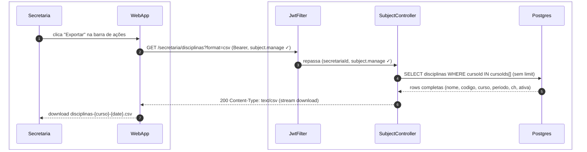
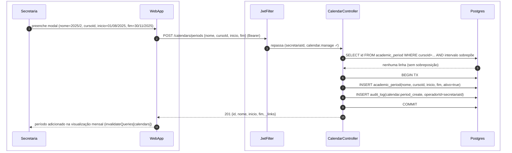
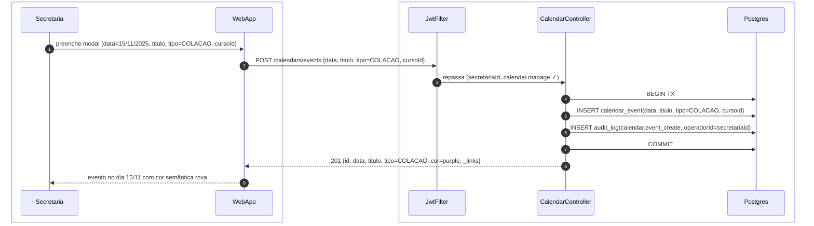
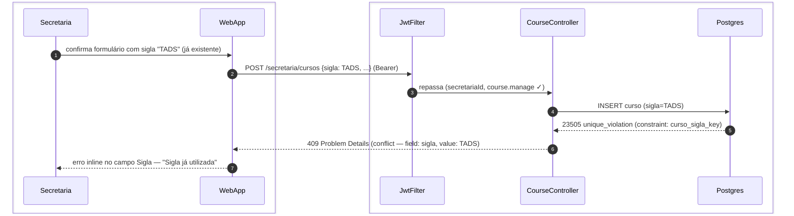
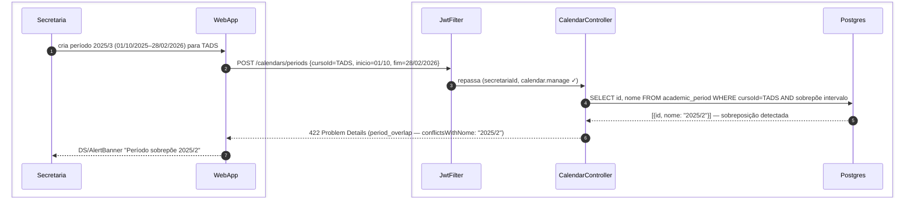

# US-F5-004 — Dados Acadêmicos: Cursos, Disciplinas e Calendários

| HU | Telas | Capabilities | APIs primárias | Fonte |
|----|-------|--------------|----------------|-------|
| US-F5-004 | F5.7 (`/secretaria/cursos`) · F5.8 (`/secretaria/disciplinas`) · F5.9 (`/secretaria/calendarios`) | `course.manage` · `subject.manage` · `calendar.manage` | `POST/PATCH /secretaria/cursos` · `POST/PATCH /secretaria/disciplinas` · `POST /calendars/periods` · `POST /calendars/events` | `HUs/F5 — Secretaria/US-F5-004-DADOS-ACADEMICOS.md` · `fluxos_por_perfil.md` §6 F5.4 |

---

## Matriz de cobertura

| ID diagrama | Origem (CA / RN / sub-fluxo) | Tipo | Status |
|-------------|------------------------------|------|--------|
| F5.7-D01 | CA-F5-004-01 · RN-F5-004-03 — criar curso + vínculo secretários + audit_log | SEQUENCIA | gerado |
| F5.8-D02 | CA-F5-004-03 — criar disciplina (POST /secretaria/disciplinas + audit_log) | SEQUENCIA | gerado |
| F5.8-D03 | CA-F5-004-04 · RN-F5-004-07 — desativar disciplina (PATCH ativa=false + audit_log) | SEQUENCIA | gerado |
| F5.8-D04 | RN-F5-004-08 — exportar CSV de disciplinas (GET ?format=csv) | SEQUENCIA | gerado |
| F5.9-D05 | CA-F5-004-05 — criar período letivo (POST /calendars/periods + validação sobreposição + audit_log) | SEQUENCIA | gerado |
| F5.9-D06 | CA-F5-004-07 — criar evento de calendário (POST /calendars/events + audit_log) | SEQUENCIA | gerado |
| F5.7-ERRO-01 | CA-F5-004-02 · RN-F5-004-02 — 409 sigla de curso duplicada | ERRO | gerado |
| F5.9-ERRO-02 | CA-F5-004-06 · RN-F5-004-12 — 422 sobreposição de período letivo | ERRO | gerado |
| — | GET listar cursos (`GET /secretaria/cursos`) | DRY | → [`F5/US-F5-003-GESTAO-ALUNOS.md`](US-F5-003-GESTAO-ALUNOS.md) F5.6-D01 (mesmo padrão GET + Postgres + HATEOAS por linha) |
| — | GET listar disciplinas (`GET /secretaria/disciplinas`) | DRY | → F5.6-D01 |
| — | GET visualizar calendário (`GET /calendars?cursoId=...`) | DRY | → F5.6-D01 |
| — | PATCH editar curso (nome, coordenador, horasMinimas) | DRY | → [`F5/US-F5-003-GESTAO-ALUNOS.md`](US-F5-003-GESTAO-ALUNOS.md) F5.6-D03 (PATCH + audit_log + invalidateQueries) |
| — | PATCH editar disciplina (nome, ch, periodo) | DRY | → F5.6-D03 |
| — | PATCH desativar curso (`ativo=false`) | DRY | → F5.8-D03 (mesmo padrão; RN-F5-004-04 — histórico preservado) |
| — | RN-F5-004-01 (403 `course.manage` ausente) | DRY | → [`F5/US-F5-003-GESTAO-ALUNOS.md`](US-F5-003-GESTAO-ALUNOS.md) F5.6-ERRO-03 (403 FGAC pattern) |
| — | RN-F5-004-05 (403 `subject.manage` ausente) | DRY | → F5.6-ERRO-03 |
| — | RN-F5-004-09 (403 `calendar.manage` ausente) | DRY | → F5.6-ERRO-03 |
| — | RN-F5-004-13 (alerta dashboard sem período ativo) | DRY | → [`F5/US-F5-001-DASHBOARD.md`](US-F5-001-DASHBOARD.md) F5.1-D01 (`alertasSla[]` no BFF dashboard inclui alerta de período inativo) |
| — | RN-F5-004-10 (tabs Períodos / Eventos — navegação client-side) | NAO_APLICAVEL | — |
| — | RN-F5-004-11 (cor semântica dos tipos de evento — CSS token por tipo) | NAO_APLICAVEL | — |
| — | DS/Skeleton, DS/EmptyState, DS/Calendar render visual | NAO_APLICAVEL | — |
| — | Responsividade (375 / 768 / 1280 px) | NAO_APLICAVEL | — |

---

## Referências DRY

| Padrão | Arquivo canônico |
|--------|-----------------|
| GET lista paginada + HATEOAS por linha (F5.7, F5.8, F5.9) | [`F5/US-F5-003-GESTAO-ALUNOS.md`](US-F5-003-GESTAO-ALUNOS.md) F5.6-D01 |
| PATCH edição simples + audit_log + invalidateQueries | [`F5/US-F5-003-GESTAO-ALUNOS.md`](US-F5-003-GESTAO-ALUNOS.md) F5.6-D03 |
| 403 FGAC capability ausente | [`F5/US-F5-003-GESTAO-ALUNOS.md`](US-F5-003-GESTAO-ALUNOS.md) F5.6-ERRO-03 |
| Exportação CSV síncrona | [`F5/US-F5-002-SOLICITACOES.md`](US-F5-002-SOLICITACOES.md) F5.5-D05 (passos 8–14) |
| JWT validation + FGAC JwtFilter | [`F0/US-F0-001-LOGIN.md`](../F0/US-F0-001-LOGIN.md) F0.1-a |

---

## Fora de sequência

| Item | Motivo |
|------|--------|
| Tabs Períodos / Eventos (RN-F5-004-10) | Navegação client-side entre abas; sem chamada HTTP ao trocar de aba se dados já carregados. |
| Cor semântica dos tipos de evento (RN-F5-004-11) | Mapeamento `tipo → token CSS` (`COLACAO → purple`, `PRAZO → orange`, etc.) feito no frontend; sem variação de participantes backend. |
| DS/Skeleton / DS/EmptyState | `isLoading` / `data.length === 0` frontend; sem HTTP adicional. |
| DS/Calendar render (visualização mensal) | Componente visual que consome dados já carregados no cache TanStack Query. |
| Responsividade | CSS / layout. |
| Importação em lote de disciplinas (fora de escopo desta HU) | Ver US-F5-009. |
| Configuração curricular (fora de escopo) | Ver F6 — Coordenação. |

---

## F5.7-D01 — Criar curso com vínculo de secretários (POST /secretaria/cursos + audit_log)

**Escopo:** happy path — secretária cria novo curso e vincula secretários responsáveis; vínculo reflete em `request.view_curso`  
**Atores:** Secretaria, WebApp, JwtFilter, CourseController, Postgres  
**Pré-condições:** autenticada com `course.manage`; `coordenadorId` e `secretariosIds[]` são usuários existentes

**Notas:**
- Passo 6: `INSERT curso_secretario` materializa o vínculo secretária ↔ curso; esse vínculo é consultado pelo `JwtFilter` na montagem de `cursoIds[]` no JWT para a capability `request.view_curso` (RN-F5-004-03). Alterações no vínculo exigem re-emissão do token ou invalidação de cache de autorização.
- Passos 4–8: TX única — se o INSERT dos secretários falhar (ex.: usuário inválido), o curso também não é criado. Consistência garantida sem compensação manual.
- Desativar curso: `PATCH /secretaria/cursos/{id} {ativo: false}` — DRY → F5.6-D03 (mesmo padrão PATCH + audit_log; RN-F5-004-04: histórico de alunos e solicitações preservado).

**Lacunas:** nenhuma.

---

## F5.8-D02 — Criar disciplina (POST /secretaria/disciplinas + audit_log)

**Escopo:** happy path — secretária cria nova disciplina vinculada a um curso  
**Atores:** Secretaria, WebApp, JwtFilter, SubjectController, Postgres  
**Pré-condições:** autenticada com `subject.manage`; `cursoId` existe no catálogo

**Notas:**
- Passo 5: `codigo` é `UNIQUE` por `cursoId` (não globalmente); a API retorna 409 se houver duplicidade no mesmo curso (análogo a F5.7-ERRO-01; não desenhado separadamente — mesmo padrão de constraint `unique_violation`).
- Editar disciplina (nome, ch, período): DRY → F5.6-D03 (`PATCH /secretaria/disciplinas/{id}` + audit_log + `invalidateQueries[disciplinas]`).

**Lacunas:** nenhuma.

---

## F5.8-D03 — Desativar disciplina (PATCH ativa=false + audit_log)

**Escopo:** happy path — secretária desativa disciplina via toggle; alunos já matriculados permanecem vinculados  
**Atores:** Secretaria, WebApp, JwtFilter, SubjectController, Postgres  
**Pré-condições:** autenticada com `subject.manage`; disciplina existe e está ativa

**Notas:**
- Passo 5: `UPDATE disciplina SET ativa=false` não afeta a tabela `matricula` — alunos já matriculados mantêm o vínculo; desmatrícula manual exige ação separada (RN-F5-004-07).
- Passo 8: `_links` retornados: se `ativa=false`, o link `deactivate` é substituído por `activate`; o frontend exibe toggle "Reativar" via `useActions(_links)`.
- Padrão idêntico ao `PATCH /secretaria/cursos/{id} {ativo: false}` para desativar curso (DRY).

**Lacunas:** nenhuma.

---

## F5.8-D04 — Exportar CSV de disciplinas (GET ?format=csv)

**Escopo:** happy path — secretária exporta disciplinas do curso corrente em formato CSV  
**Atores:** Secretaria, WebApp, JwtFilter, SubjectController, Postgres  
**Pré-condições:** autenticada com `subject.manage`; ao menos uma disciplina cadastrada

**Notas:**
- Passo 4: sem `LIMIT` — a exportação inclui todas as disciplinas do curso; pode ser filtrada pelos mesmos parâmetros da tela (ex.: `ativa=true` se filtro estiver ativo).
- Passo 6: `Content-Disposition: attachment; filename=disciplinas-{sigla}-{date}.csv`; UTF-8 BOM para compatibilidade com Excel (RN-F5-004-08). Mesmo padrão de F5.5-D05 passos 8–14 (DRY).

**Lacunas:** nenhuma.

---

## F5.9-D05 — Criar período letivo (POST /calendars/periods + validação sobreposição + audit_log)

**Escopo:** happy path — secretária cria período letivo para um curso; validação de sobreposição antes da TX  
**Atores:** Secretaria, WebApp, JwtFilter, CalendarController, Postgres  
**Pré-condições:** autenticada com `calendar.manage`; nenhum período com datas sobrepostas para o mesmo curso

**Notas:**
- Passo 4: verificação de sobreposição feita **antes** da TX com query de intervalo `[inicio_novo, fim_novo]` vs `[inicio_existente, fim_existente]`; sem `FOR UPDATE` (leitura não-destrutiva); se linha retornar → desvia para F5.9-ERRO-02 (RN-F5-004-12).
- Passo 7: ao criar um período com `ativo=true`, outros períodos ativos do mesmo curso não são desativados automaticamente — a secretária pode ter períodos sobrepostos **entre cursos diferentes**. Sobreposição bloqueada somente dentro do mesmo `cursoId`.
- RN-F5-004-13: o BFF do dashboard (F5.1-D01) emite alerta de `alertasSla[]` quando não há período ativo configurado; a criação bem-sucedida de um período remove esse alerta no próximo refresh.

**Lacunas:** nenhuma.

---

## F5.9-D06 — Criar evento de calendário (POST /calendars/events + audit_log)

**Escopo:** happy path — secretária cria evento de data especial (colação, feriado, prazo) no calendário do curso  
**Atores:** Secretaria, WebApp, JwtFilter, CalendarController, Postgres  
**Pré-condições:** autenticada com `calendar.manage`; período letivo vigente existe para o curso

**Notas:**
- Passo 5: `tipo` é um enum `{FERIADO, COLACAO, PRAZO, INSTITUCIONAL}`; a cor semântica é calculada no backend e retornada no campo `cor` (`purple`, `gray`, `orange`, `blue`), permitindo que o frontend aplique diretamente o token CSS sem lógica de mapeamento própria (RN-F5-004-11).
- Múltiplos eventos podem coexistir na mesma data (ex.: `PRAZO` + `INSTITUCIONAL`); sem validação de unicidade por data.
- PATCH e DELETE de eventos: DRY → F5.6-D03 (PATCH) / padrão simples `DELETE /calendars/events/{id}` + audit_log, não desenhado separadamente.

**Lacunas:** nenhuma.

---

## F5.7-ERRO-01 — 409 sigla de curso duplicada

**Escopo:** erro de unicidade — secretária tenta criar curso com sigla já existente  
**Atores:** Secretaria, WebApp, JwtFilter, CourseController, Postgres  
**Pré-condições:** sigla informada já existe em `curso`

**Notas:**
- Passo 5: `23505 unique_violation` capturado pelo `ExceptionHandler`; extrai o nome da constraint (`curso_sigla_key`) para identificar o campo conflitante (CA-F5-004-02, RN-F5-004-02). Padrão idêntico a F5.6-ERRO-01 (GRR/CPF).
- O formulário permanece aberto com o campo Sigla destacado em `status/danger`; secretária corrige sem perder os demais campos preenchidos.

**Lacunas:** nenhuma.

---

## F5.9-ERRO-02 — 422 sobreposição de período letivo

**Escopo:** erro de validação — secretária cria período com datas sobrepostas a período existente do mesmo curso  
**Atores:** Secretaria, WebApp, JwtFilter, CalendarController, Postgres  
**Pré-condições:** período 2025/2 (01/08–30/11/2025) já existe para curso TADS

**Notas:**
- Passo 4: query de intervalo usa a condição clássica de sobreposição `A.inicio <= B.fim AND A.fim >= B.inicio`; feita **antes** de abrir TX para evitar lock desnecessário (RN-F5-004-12).
- Passo 6: RFC 7807 Problem Details `type=period_overlap`; body inclui `conflictsWithId` e `conflictsWithNome` para que o frontend mostre o nome do período conflitante na mensagem de erro.
- O modal permanece aberto; secretária pode ajustar as datas sem perder o formulário.

**Lacunas:** nenhuma.
