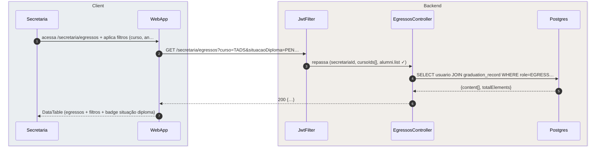
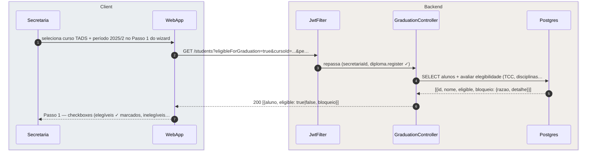
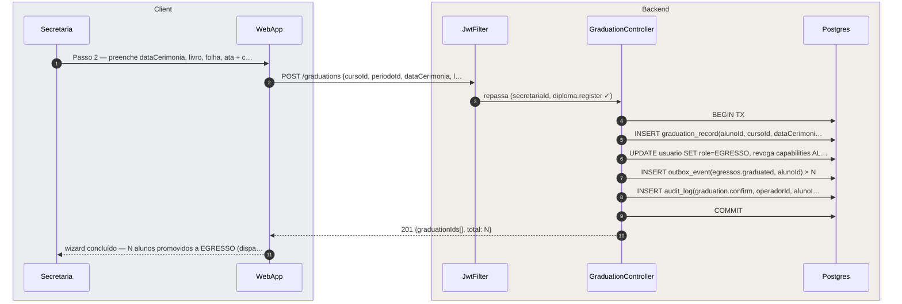
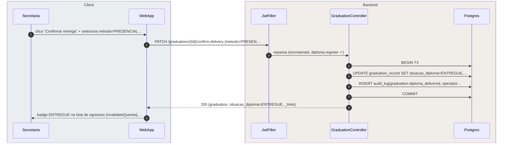
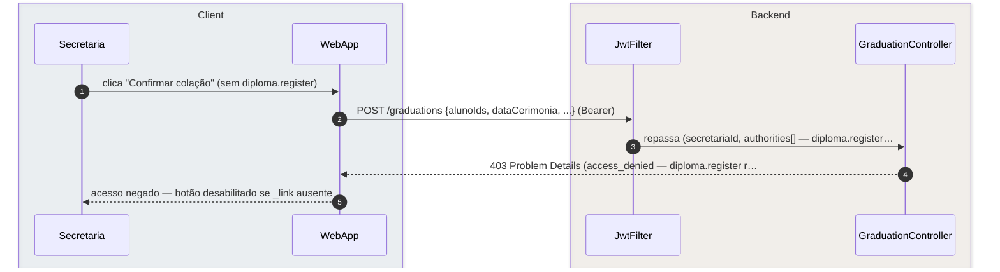

# US-F5-005 — Egressos e Colação de Grau

| HU | Telas | Capabilities | APIs primárias | Fonte |
|----|-------|--------------|----------------|-------|
| US-F5-005 | F5.10 (`/secretaria/egressos`) · F5.11 (`/secretaria/diplomas`) | `alumni.list` · `diploma.register` | `GET /secretaria/egressos` · `GET /students?eligibleForGraduation=true` · `POST /graduations` · `PATCH /graduations/:id/confirm-delivery` | `HUs/F5 — Secretaria/US-F5-005-EGRESSOS-DIPLOMAS.md` · `fluxos_por_perfil.md` §6 F5.7 |

---

## Matriz de cobertura

| ID diagrama | Origem (CA / RN / sub-fluxo) | Tipo | Status |
|-------------|------------------------------|------|--------|
| F5.10-D01 | CA-F5-005-01 · RN-F5-005-02 · RN-F5-005-03 — listar egressos (GET + filtros) | SEQUENCIA | gerado |
| F5.11-D02 | CA-F5-005-02 · RN-F5-005-07 · RN-F5-005-12 — buscar elegíveis + verificação 5 critérios | SEQUENCIA | gerado |
| F5.11-D03 | CA-F5-005-03 · RN-F5-005-09 · RN-F5-005-10 · §5.2 F5.11/F5.11b/F5.11c — confirmar colação em lote (TX: graduation_record + role→EGRESSO + outbox × N + audit_log) | SEQUENCIA | gerado |
| F5.11-D04 | CA-F5-005-05 · RN-F5-005-11 — confirmar entrega física (PATCH confirm-delivery + audit_log) | SEQUENCIA | gerado |
| F5.11-ERRO-01 | RN-F5-005-06 — 403 FGAC `diploma.register` ausente | ERRO | gerado |
| — | CA-F5-005-04 (aluno inelegível — checkbox desabilitado + tooltip) | DRY | → F5.11-D02 (`eligible: false` + `bloqueio: {razao, detalhe}` na resposta — renderização client-side) |
| — | RN-F5-005-01 (403 `alumni.list` ausente) | DRY | → [`F5/US-F5-003-GESTAO-ALUNOS.md`](US-F5-003-GESTAO-ALUNOS.md) F5.6-ERRO-03 (padrão 403 FGAC) |
| — | RN-F5-005-04 (criar egresso manual — excepcional) | DRY | → F5.11-D03 (fluxo automático; criação manual = mesmo `POST /graduations` com 1 alunoId) |
| — | RN-F5-005-05 (exportação CSV egressos) | DRY | → [`F5/US-F5-004-DADOS-ACADEMICOS.md`](US-F5-004-DADOS-ACADEMICOS.md) F5.8-D04 (mesmo padrão `GET ?format=csv`) |
| — | RN-F5-005-08 (wizard 2 passos — navegação client-side) | NAO_APLICAVEL | — |
| — | DS/Skeleton, DS/EmptyState, Checkbox multiselect (visual) | NAO_APLICAVEL | — |
| — | Responsividade | NAO_APLICAVEL | — |
| — | Emissão PDF de diploma (processo externo — fora de escopo) | NAO_APLICAVEL | — |

---

## Referências DRY

| Padrão | Arquivo canônico |
|--------|-----------------|
| Outbox fase TX (INSERT outbox_event em COMMIT único) | [`transversal/10.1-outbox-notificacao.md`](../transversal/10.1-outbox-notificacao.md) 10.1a |
| Outbox fase dispatch (notificação push + e-mail ao egresso) | [`transversal/10.1-outbox-notificacao.md`](../transversal/10.1-outbox-notificacao.md) 10.1b |
| Dashboard Egresso (efeito downstream de F5.11-D03) | [`F2/US-F2-001-DASHBOARD-EGRESSO.md`](../F2/US-F2-001-DASHBOARD-EGRESSO.md) F2.1-D01 |
| 403 FGAC capability ausente | [`F5/US-F5-003-GESTAO-ALUNOS.md`](US-F5-003-GESTAO-ALUNOS.md) F5.6-ERRO-03 |
| JWT validation + JwtFilter | [`F0/US-F0-001-LOGIN.md`](../F0/US-F0-001-LOGIN.md) F0.1-a |
| Exportação CSV síncrona | [`F5/US-F5-004-DADOS-ACADEMICOS.md`](US-F5-004-DADOS-ACADEMICOS.md) F5.8-D04 |

---

## Fora de sequência

| Item | Motivo |
|------|--------|
| Wizard 2 passos — navegação client-side (RN-F5-005-08) | Transição entre Passo 1 (lista elegíveis) e Passo 2 (dados cerimônia) é roteamento frontend; sem chamada HTTP entre passos. |
| Aluno inelegível — checkbox desabilitado + tooltip (CA-F5-005-04) | Renderização client-side derivada de `eligible: false` e `bloqueio` presentes na resposta de F5.11-D02; sem HTTP adicional. |
| DS/Skeleton, DS/EmptyState, Checkbox multiselect | Lógica visual frontend; sem variação de participantes backend. |
| Emissão PDF de diploma (fora de escopo desta HU) | Processo externo ao sistema; sem endpoint mapeado nesta HU. |
| Reemissão de diploma por perda | Fluxo de solicitação — ver módulo US-F1-005. |

---

## F5.10-D01 — Listar egressos (GET /secretaria/egressos + filtros — happy path)

**Escopo:** happy path — secretária acessa lista de egressos filtrada por curso, ano de colação e situação do diploma  
**Atores:** Secretaria, WebApp, JwtFilter, EgressosController, Postgres  
**Pré-condições:** autenticada com `alumni.list`; `cursoIds[]` no JWT

**Notas:**
- Passo 4: JOIN entre `usuario` (role=EGRESSO) e `graduation_record` (situacao_diploma, data_colacao); `cursoIds[]` restringe a egressos dos cursos de competência da secretária (RN-F5-005-01).
- Passo 6: `_links` por item inclui `confirm-delivery` somente se `situacao_diploma=PENDENTE`; item com `ENTREGUE` retorna apenas `view` — HATEOAS controla ações disponíveis por linha.
- Exportação CSV: DRY → F5.8-D04 (`GET /secretaria/egressos?format=csv` — mesmo padrão stream download) (RN-F5-005-05).

**Lacunas:** nenhuma.

---

## F5.11-D02 — Buscar elegíveis para colação (GET /students?eligibleForGraduation=true)

**Escopo:** happy path — secretária inicia wizard de colação; backend verifica 5 critérios de elegibilidade por aluno  
**Atores:** Secretaria, WebApp, JwtFilter, GraduationController, Postgres  
**Pré-condições:** autenticada com `diploma.register`; curso e período selecionados no formulário

**Notas:**
- Passo 4: o backend avalia os 5 critérios de elegibilidade por aluno em paralelo (RN-F5-005-07): (a) TCC aprovado, (b) todas as disciplinas do currículo concluídas, (c) `horas_formativas >= curso.horas_minimas`, (d) sem pendências financeiras (se integração ativa), (e) sem solicitações bloqueantes abertas. Resultado materializado em `eligible` + `bloqueio.razao` (ex.: `"Horas formativas insuficientes: 60/120 h"`).
- Passo 6: alunos com `eligible: false` retornam `bloqueio: {razao, detalhe}` — frontend desabilita o checkbox e exibe tooltip com a razão (CA-F5-005-04, RN-F5-005-12). Sem HTTP extra.
- Alunos já com `role=EGRESSO` (colação anterior) são excluídos da query.

**Lacunas:** nenhuma.

---

## F5.11-D03 — Confirmar colação em lote (POST /graduations + TX: graduation_record + role→EGRESSO + outbox × N + audit_log)

**Escopo:** happy path — secretária confirma colação de N alunos; TX atômica cria `graduation_record`, transiciona `usuario.role` → `EGRESSO` e enfileira `outbox_event` por egresso  
**Atores:** Secretaria, WebApp, JwtFilter, GraduationController, Postgres  
**Pré-condições:** autenticada com `diploma.register`; ao menos 1 aluno selecionado com `eligible: true`; dados da cerimônia preenchidos no Passo 2

**Notas:**
- Passos 4–9: **TX única** para todos os N alunos — se qualquer INSERT/UPDATE falhar, o COMMIT não ocorre e nenhum aluno é promovido (RN-F5-005-09). Evita estado parcial onde parte dos alunos seria EGRESSO e outra parte continuaria ALUNO.
- Passo 6: `UPDATE usuario SET role=EGRESSO` remove as capabilities do perfil ALUNO (`request.view_own`, `event.attend`, etc.) e concede as do perfil EGRESSO (`alumni.view_own`). O JWT do aluno retém as capabilities antigas até expirar (15 min); em `/egresso/inicio` o frontend força re-autenticação via refresh token se detectar `role ≠ EGRESSO` (§5.2 F5.11b).
- Passo 7: `INSERT outbox_event(egressos.graduated)` × N — um evento por aluno; `OutboxDispatcher` processa em lote e envia e-mail de boas-vindas ao portal do egresso (RN-F5-005-10). DRY → [`transversal/10.1-outbox-notificacao.md`](../transversal/10.1-outbox-notificacao.md) 10.1b para o dispatch completo.
- Downstream (DRY): após a promoção, o aluno passa a ter acesso via `GET /alumni/me` (dashboard egresso) → [`F2/US-F2-001-DASHBOARD-EGRESSO.md`](../F2/US-F2-001-DASHBOARD-EGRESSO.md) F2.1-D01.

**Lacunas:** nenhuma.

---

## F5.11-D04 — Confirmar entrega física do diploma (PATCH confirm-delivery + audit_log)

**Escopo:** happy path — secretária registra entrega do diploma impresso (presencial, procuração ou correio) após a colação  
**Atores:** Secretaria, WebApp, JwtFilter, GraduationController, Postgres  
**Pré-condições:** autenticada com `diploma.register`; `graduation_record` com `situacao_diploma=PENDENTE`; `_link confirm-delivery` presente

**Notas:**
- Passo 5: `metodo_entrega` enum: `{PRESENCIAL, PROCURACAO, CORREIO}` (RN-F5-005-11); `data_entrega` persiste como `TIMESTAMPTZ`.
- Passo 6: `audit_log` registra a evidência formal da entrega — relevante para compliance; campos: `operadorId`, `metodo_entrega`, `data_entrega`, `graduation_record_id`.
- Passo 8: `_links` após ENTREGUE: remove `confirm-delivery`, mantém `view`; possível `revert-delivery` com capability adicional (fora do escopo desta HU).

**Lacunas:** nenhuma.

---

## F5.11-ERRO-01 — 403 FGAC: `diploma.register` ausente

**Escopo:** erro de autorização — usuário com `alumni.list` mas sem `diploma.register` tenta confirmar colação  
**Atores:** Secretaria, WebApp, JwtFilter, GraduationController  
**Pré-condições:** JWT válido; authorities incluem `alumni.list` mas não `diploma.register`

**Notas:**
- Passo 4: `@PreAuthorize("hasAuthority('diploma.register')")` bloqueia antes de qualquer query; RFC 7807 `type=access_denied` (RN-F5-005-06).
- Observação HATEOAS: o botão "Confirmar colação" somente aparece se o `_link confirm` estiver na resposta de `GET /students?eligibleForGraduation=true` — secretária sem `diploma.register` não vê o botão. O diagrama documenta a defesa backend para acesso direto à URL.
- Padrão idêntico a F5.6-ERRO-03 (DRY).

**Lacunas:** nenhuma.
