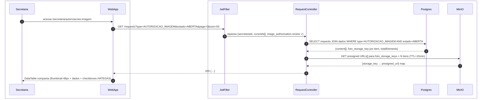
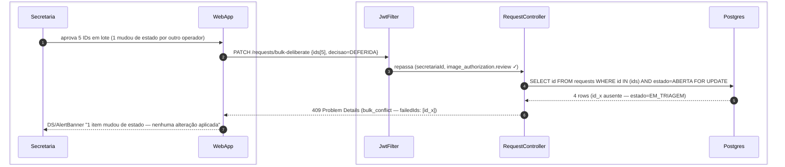

# US-F5-006 — Revisão de Autorizações de Uso de Imagem

| HU | Tela | Capability | APIs primárias | Fonte |
|----|------|------------|----------------|-------|
| US-F5-006 | F5.12 — `/secretaria/autorizacoes-imagem` | `image_authorization.review` | `GET /requests?type=AUTORIZACAO_IMAGEM` · `PATCH /requests/bulk-deliberate` | `HUs/F5 — Secretaria/US-F5-006-AUTORIZACOES-IMAGEM.md` · `fluxos_por_perfil.md` §6 |

---

## Matriz de cobertura

| ID diagrama | Origem (CA / RN / sub-fluxo) | Tipo | Status |
|-------------|------------------------------|------|--------|
| F5.12-D01 | CA-F5-006-01 · RN-F5-006-03 · RN-F5-006-08 — listar solicitações compactas + presigned thumbnails MinIO | SEQUENCIA | gerado |
| F5.12-D02 | CA-F5-006-02 · CA-F5-006-05 · RN-F5-006-06 · RN-F5-006-07 — bulk-deliberate (PATCH + SELECT FOR UPDATE + TX × N + outbox × N) | SEQUENCIA | gerado |
| F5.12-ERRO-01 | CA-F5-006-03 · RN-F5-006-06 — 409 falha parcial por concorrência (estado mudou — rollback pré-TX) | ERRO | gerado |
| — | CA-F5-006-04 (thumbnail expirado — placeholder client-side) | NAO_APLICAVEL | — |
| — | CA-F5-006-05 (rejeitar com justificativa) | DRY | → F5.12-D02 (mesmo PATCH, `decisao=INDEFERIDA` + campo `justificativa` opcional) |
| — | RN-F5-006-01 (403 `image_authorization.review` ausente) | DRY | → [`F5/US-F5-003-GESTAO-ALUNOS.md`](US-F5-003-GESTAO-ALUNOS.md) F5.6-ERRO-03 (padrão 403 FGAC) |
| — | RN-F5-006-02 (variante compacta de F5.2 filtrada por type) | DRY | → [`F5/US-F5-002-SOLICITACOES.md`](US-F5-002-SOLICITACOES.md) F5.2-D01 (listagem base) |
| — | RN-F5-006-05 (`_link bulk_deliberate` HATEOAS — botão só com link presente) | DRY | → F5.12-D01 (`_links.bulk_deliberate` na resposta da listagem) |
| — | RN-F5-006-08 (estado ≠ ABERTA → sem checkbox, somente leitura) | DRY | → F5.12-D01 (`_links` ausentes por item — `useActions` oculta checkbox) |
| — | DS/Skeleton, DS/EmptyState | NAO_APLICAVEL | — |
| — | Responsividade | NAO_APLICAVEL | — |

---

## Referências DRY

| Padrão | Arquivo canônico |
|--------|-----------------|
| Listagem base de solicitações (GET + HATEOAS por linha) | [`F5/US-F5-002-SOLICITACOES.md`](US-F5-002-SOLICITACOES.md) F5.2-D01 |
| Bulk-assign (PATCH /requests/bulk — padrão de ação em massa) | [`F5/US-F5-002-SOLICITACOES.md`](US-F5-002-SOLICITACOES.md) F5.2-D04 |
| Análogo CAAF (batch-decide com TX + outbox) | [`F4/US-F4-001-COMISSAO-CAAF.md`](../F4/US-F4-001-COMISSAO-CAAF.md) F4.1d |
| Outbox fase TX + dispatch | [`transversal/10.1-outbox-notificacao.md`](../transversal/10.1-outbox-notificacao.md) 10.1a + 10.1b |
| MinIO presigned URL download (TTL 15 min) | [`F1/US-F1-010-CERTIFICADOS.md`](../F1/US-F1-010-CERTIFICADOS.md) F1.19-D02 |
| 403 FGAC capability ausente | [`F5/US-F5-003-GESTAO-ALUNOS.md`](US-F5-003-GESTAO-ALUNOS.md) F5.6-ERRO-03 |

---

## Fora de sequência

| Item | Motivo |
|------|--------|
| Thumbnail expirado — placeholder com ícone (CA-F5-006-04) | Fallback client-side: `` substitui `src` pelo placeholder SVG quando a presigned URL retorna 403 (MinIO). Sem chamada HTTP adicional ao backend (RN-F5-006-04). |
| `_link bulk_deliberate` ausente → botão oculto (RN-F5-006-05) | `useActions(_links)` oculta `DS/BulkActionBar` se `bulk_deliberate` não estiver na resposta — lógica client-side derivada de F5.12-D01. |
| Estado ≠ ABERTA → sem checkbox (RN-F5-006-08) | `_links` ausente por item na resposta de F5.12-D01; frontend desabilita checkbox — sem HTTP extra. |
| DS/Skeleton, DS/EmptyState | Lógica `isLoading` / `content: []` frontend. |
| Visualização em tamanho completo e edição de foto (fora de escopo) | — |

---

## F5.12-D01 — Listar solicitações compactas com thumbnails presigned (happy path)

**Escopo:** happy path — secretária carrega lista compacta de autorizações abertas; backend gera presigned URLs dos thumbnails MinIO  
**Atores:** Secretaria, WebApp, JwtFilter, RequestController, Postgres, MinIO  
**Pré-condições:** autenticada com `image_authorization.review`; solicitações `type=AUTORIZACAO_IMAGEM, estado=ABERTA` existem



**Notas:**
- Passo 4: filtro `type=AUTORIZACAO_IMAGEM` garante que somente esse tipo aparece na tela (RN-F5-006-02); `cursoIds[]` restringe ao escopo da secretária; `page_size=50` permite tabela densa eficiente.
- Passos 6–7: o `RequestController` gera as presigned URLs em batch antes de responder; TTL=15 min (RN-F5-006-03). Se `foto_storage_key` for null (aluno não enviou foto), `thumbnail_url` retorna `null` — frontend exibe placeholder imediatamente sem tentar `GET` ao MinIO.
- Passo 8: `_links.bulk_deliberate` presente apenas quando `estado=ABERTA` por item (RN-F5-006-08); itens com estado diferente retornam sem esse `_link` → checkbox desabilitado via `useActions`. `_links` global inclui `bulk_deliberate` se ao menos 1 item for selecionável.

**Lacunas:** nenhuma.

---

## F5.12-D02 — Aprovar ou rejeitar em lote (PATCH bulk-deliberate + SELECT FOR UPDATE + TX × N + outbox × N)

**Escopo:** happy path — secretária delibera N solicitações abertas em lote; TX única garante atomicidade; outbox notifica cada aluno  
**Atores:** Secretaria, WebApp, JwtFilter, RequestController, Postgres  
**Pré-condições:** N linhas selecionadas com `_link bulk_deliberate`; todas com `estado=ABERTA`; confirmação no dialog

```mermaid
sequenceDiagram
    autonumber
    box #e8f4fc Cliente
        participant Secretaria
        participant WebApp
    end
    box #fff8ee Servidor
        participant JwtFilter
        participant RequestController
        participant Postgres
    end

    Secretaria->>WebApp: seleciona N linhas + clica "Aprovar lote" + confirma dialog
    WebApp->>JwtFilter: PATCH /requests/bulk-deliberate {ids[N], decisao=DEFERIDA}
    JwtFilter->>RequestController: repassa (secretariaId, image_authorization.review ✓)
    RequestController->>Postgres: SELECT id FROM requests WHERE id IN (ids) AND estado=ABERTA FOR UPDATE
    Postgres-->>RequestController: N rows válidas (count = N — sem divergência)
    RequestController->>Postgres: BEGIN TX
    RequestController->>Postgres: UPDATE requests SET estado=DEFERIDA; INSERT request_event × N
    RequestController->>Postgres: INSERT outbox_event(autorizacoes.deliberated, alunoId) × N
    RequestController->>Postgres: INSERT audit_log(image_auth.bulk_deliberate, operadorId, ids[])
    RequestController->>Postgres: COMMIT
    RequestController-->>WebApp: 200 {updated: N, ids}
    WebApp-->>Secretaria: N linhas atualizam status=DEFERIDA (dispatch async → link 10.1b)
```

**Notas:**
- Passo 4: `SELECT ... FOR UPDATE` trava as N linhas antes de abrir a TX — previne condição de corrida com outro operador que possa ter alterado o estado entre a listagem e a deliberação. Se o `count` retornado for menor que N → desvia para F5.12-ERRO-01 (sem TX aberta).
- Passos 6–10: TX única para todos os N itens (RN-F5-006-06); `UPDATE + INSERT request_event + INSERT outbox_event + INSERT audit_log` em COMMIT único. Se qualquer operação falhar → rollback automático → nenhuma solicitação é alterada.
- Passo 8: `INSERT outbox_event` × N — um evento por aluno com payload `{alunoId, decisao, justificativa?}`; template de e-mail `AUTORIZACAO_DELIBERATED` inclui justificativa se `INDEFERIDA` (RN-F5-006-07, CA-F5-006-05). DRY → [`transversal/10.1-outbox-notificacao.md`](../transversal/10.1-outbox-notificacao.md) 10.1b para dispatch.
- Rejeitar com justificativa (CA-F5-006-05): mesmo fluxo com `decisao=INDEFERIDA` + `justificativa: "Foto ilegível"` no body; sem variação de participantes ou mensagens — DRY.

**Lacunas:** nenhuma.

---

## F5.12-ERRO-01 — 409 falha parcial por concorrência (estado mudou — TX não aberta)

**Escopo:** erro de concorrência — ao menos um dos IDs selecionados não está mais `ABERTA` no momento do PATCH; nenhuma alteração é aplicada  
**Atores:** Secretaria, WebApp, JwtFilter, RequestController, Postgres  
**Pré-condições:** 1 dos N IDs teve `estado` alterado por outro operador entre a listagem e a confirmação



**Notas:**
- Passo 5: o `RequestController` compara `count(rows retornadas)` com `len(ids solicitados)`; divergência detectada **antes** de abrir a TX — zero mutações no banco, nenhum rollback necessário (RN-F5-006-06).
- Passo 6: RFC 7807 Problem Details `type=bulk_conflict`; body inclui `failedIds[]` com os IDs divergentes. O frontend exibe `DS/AlertBanner` listando os IDs problemáticos (CA-F5-006-03).
- Ação corretiva: o frontend recarrega a lista (`invalidateQueries`) para refletir o estado atualizado; a secretária pode refazer a seleção excluindo os itens em conflito.

**Lacunas:** nenhuma.
