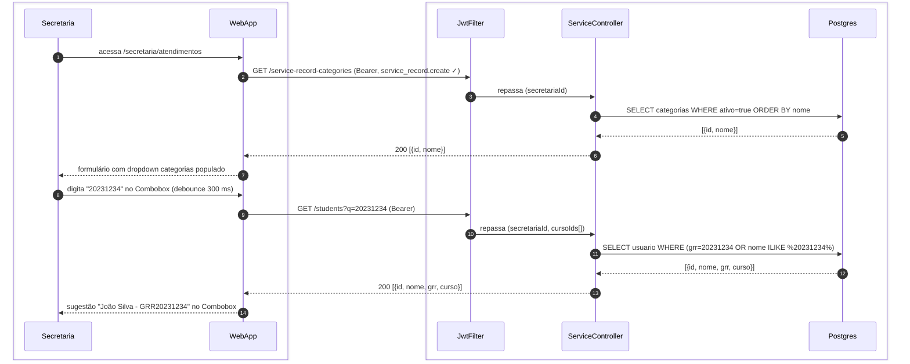
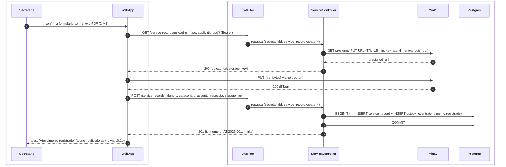

# US-F5-007 — Registro de Atendimento Presencial

| HU | Tela | Capability | APIs primárias | Fonte |
|----|------|------------|----------------|-------|
| US-F5-007 | F5.13 — `/secretaria/atendimentos` | `service_record.create` | `GET /service-record-categories` · `GET /students?q=...` · `GET /service-records/upload-url` · `POST /service-records` | `HUs/F5 — Secretaria/US-F5-007-ATENDIMENTOS.md` · `fluxos_por_perfil.md` §6 F5.6 |

---

## Matriz de cobertura

| ID diagrama | Origem (CA / RN / sub-fluxo) | Tipo | Status |
|-------------|------------------------------|------|--------|
| F5.13-D01 | CA-F5-007-01 · RN-F5-007-03 — carregar formulário (GET categorias + busca aluno Combobox) | SEQUENCIA | gerado |
| F5.13-D02 | CA-F5-007-02 · RN-F5-007-04 · RN-F5-007-06 — registrar atendimento com anexo (presigned PUT MinIO + POST /service-records + TX + outbox) | SEQUENCIA | gerado |
| — | CA-F5-007-03 (registrar sem anexo) | DRY | → F5.13-D02 (mesmo fluxo; passos 2–8 MinIO omitidos; `anexoUrl` ausente no body) |
| — | CA-F5-007-04 (arquivo > 10 MB — bloqueio frontend) | NAO_APLICAVEL | — |
| — | CA-F5-007-05 (preview de notificação real-time) | NAO_APLICAVEL | — |
| — | RN-F5-007-01 (403 `service_record.create` ausente) | DRY | → [`F5/US-F5-003-GESTAO-ALUNOS.md`](US-F5-003-GESTAO-ALUNOS.md) F5.6-ERRO-03 (padrão 403 FGAC) |
| — | RN-F5-007-02 (campos obrigatórios — validação Zod) | NAO_APLICAVEL | — |
| — | RN-F5-007-05 (preview notificação atualizado em tempo real) | NAO_APLICAVEL | — |
| — | RN-F5-007-07 (aluno vê em F1-011) | DRY | → [`F1/US-F1-011-ATENDIMENTOS.md`](../F1/US-F1-011-ATENDIMENTOS.md) F1.20-D01 (lista + ciência) |
| — | RN-F5-007-08 (imutável após registro — sem edit/delete) | NAO_APLICAVEL | — |
| — | DS/FileDropzone, DS/Skeleton, toast confirmação | NAO_APLICAVEL | — |
| — | Responsividade | NAO_APLICAVEL | — |

---

## Referências DRY

| Padrão | Arquivo canônico |
|--------|-----------------|
| Busca aluno Combobox (GET /students?q=...) | [`F5/US-F5-002-SOLICITACOES.md`](US-F5-002-SOLICITACOES.md) F5.3-D02 passos 2–6 |
| MinIO presigned PUT + upload client-side | [`F1/US-F1-005-SOLICITACOES.md`](../F1/US-F1-005-SOLICITACOES.md) F1.8-D03 |
| Outbox fase TX + dispatch (notificação ao aluno) | [`transversal/10.1-outbox-notificacao.md`](../transversal/10.1-outbox-notificacao.md) 10.1a + 10.1b |
| Vista do aluno (F1.20 — histórico atendimentos + ciência) | [`F1/US-F1-011-ATENDIMENTOS.md`](../F1/US-F1-011-ATENDIMENTOS.md) F1.20-D01 |
| 403 FGAC capability ausente | [`F5/US-F5-003-GESTAO-ALUNOS.md`](US-F5-003-GESTAO-ALUNOS.md) F5.6-ERRO-03 |
| JWT validation + JwtFilter | [`F0/US-F0-001-LOGIN.md`](../F0/US-F0-001-LOGIN.md) F0.1-a |

---

## Fora de sequência

| Item | Motivo |
|------|--------|
| Arquivo > 10 MB — bloqueio frontend (CA-F5-007-04) | `DS/FileDropzone` valida tamanho client-side via `file.size`; sem chamada HTTP ao backend (RN-F5-007-04). |
| Preview de notificação real-time (CA-F5-007-05) | Card estático computado a partir do estado local do formulário (React state); sem HTTP ao atualizar campos (RN-F5-007-05). |
| Campos obrigatórios + validação Zod (RN-F5-007-02) | Validação client-side antes do submit; sem HTTP extra. |
| Imutabilidade do atendimento (RN-F5-007-08) | Ausência de endpoints PATCH/DELETE; sem diagrama negativo necessário. |
| DS/FileDropzone, toast confirmação | Comportamentos frontend; sem trocas de mensagens entre camadas. |
| Listagem do histórico pela secretaria | Fora de escopo desta HU — consulta via F5.2 (`GET /service-records` com filtros); padrão DRY → F5.2-D01. |

---

## F5.13-D01 — Carregar formulário: categorias + busca aluno Combobox

**Escopo:** página carrega dropdown de categorias; secretária digita no Combobox e recebe sugestão de aluno  
**Atores:** Secretaria, WebApp, JwtFilter, ServiceController, Postgres  
**Pré-condições:** autenticada com `service_record.create`

**Notas:**
- Passos 2–7: `GET /service-record-categories` é chamado na montagem da página; categorias são configuráveis pelo admin e raramente mudam — TanStack Query usa `staleTime` longo (ex.: 5 min) para evitar re-fetches desnecessários (RN-F5-007-03).
- Passos 9–14: busca Combobox com debounce 300 ms; DRY → [`F5/US-F5-002-SOLICITACOES.md`](US-F5-002-SOLICITACOES.md) F5.3-D02 passos 2–6. `cursoIds[]` restringe aos alunos dos cursos da secretária.
- Passo 14: ao selecionar o aluno, o preview de notificação (card estático) atualiza em tempo real via React state — sem HTTP adicional (RN-F5-007-05, CA-F5-007-05).

**Lacunas:** nenhuma.

---

## F5.13-D02 — Registrar atendimento com anexo (presigned PUT + POST + TX + outbox)

**Escopo:** happy path — secretária confirma formulário com PDF; arquivo vai para MinIO; `POST /service-records` cria registro e dispara outbox  
**Atores:** Secretaria, WebApp, JwtFilter, ServiceController, MinIO, Postgres  
**Pré-condições:** autenticada com `service_record.create`; campos obrigatórios preenchidos; arquivo PDF ≤ 10 MB validado client-side

**Notas:**
- Passos 2–8 (fase MinIO): padrão presigned PUT idêntico a F1.8-D03. O `storage_key` retornado no passo 6 é incluído como `anexoUrl` no POST do passo 9; o arquivo já está no MinIO antes de criar o registro — objeto sem registro é removido por TTL-based cleanup.
- Passo 11: TX atômica — `INSERT service_record` + `INSERT outbox_event` em COMMIT único (padrão 10.1a). `numero` gerado atomicamente (`AT-{ano}-{seq}`).
- Passo 14: `OutboxDispatcher` processa `atendimento.registrado` → envia e-mail ao aluno com assunto, resposta e link para `/meus-atendimentos` (US-F1-011). DRY → [`transversal/10.1-outbox-notificacao.md`](../transversal/10.1-outbox-notificacao.md) 10.1b.
- **Sem anexo (CA-F5-007-03):** passos 2–8 omitidos; `POST /service-records` sem `storage_key`; mesmo TX e outbox — DRY, sem diagrama separado.

**Lacunas:** nenhuma.
