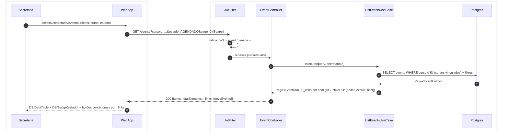
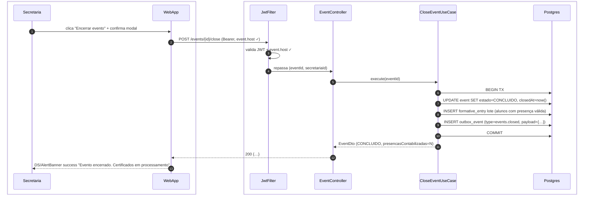
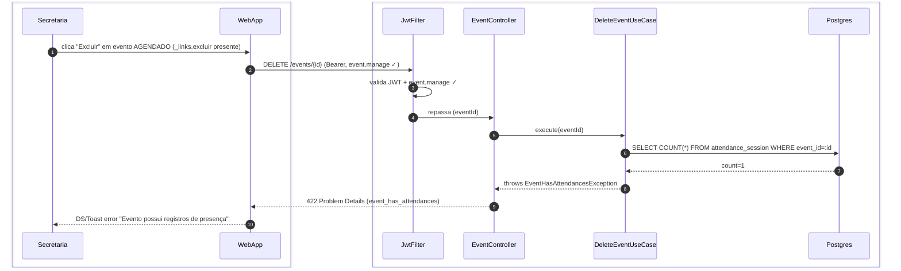

# US-F5-008 — Gestão de Eventos Institucionais (Secretaria)

| HU | Telas | Capability | API primária | Fonte |
|----|-------|------------|--------------|-------|
| US-F5-008 | F5.14 `/secretaria/eventos` · F5.15 `/secretaria/eventos/:id/operacao` | `event.manage` (CRUD) · `event.host` (operação ao vivo) | `GET/POST /events` · `PATCH /events/:id` · `POST /events/:id/attendance/windows/entry` · `POST /events/:id/close` | `HUs/F5 — Secretaria/US-F5-008-EVENTOS.md` · `fluxos_por_perfil.md` §6 F5.8 · `endpoints_canonicos_presenca_eventos_v4.md` |

---

## Matriz de cobertura

| ID diagrama | Origem (CA / RN / sub-fluxo) | Tipo | Status |
|-------------|------------------------------|------|--------|
| F5.8-D01 | CA-F5-008-01 · RN-F5-008-02 · RN-F5-008-03 · RN-F5-008-05 — lista de eventos (scope secretaria, filtros, _links condicional) | SEQUENCIA | gerado |
| F5.8-D04 | CA-F5-008-04 · RN-F5-008-10 · RN-F5-008-11 — encerrar evento: formative_entry lote + outbox certificado | SEQUENCIA | gerado |
| F5.8-ERRO | CA-F5-008-05 · RN-F5-008-06 — 422 excluir evento com presença já registrada | ERRO | gerado |
| — | CA-F5-008-02 · RN-F5-008-04 — criar evento (POST /events; formulário F3.2a reutilizado) | DRY | → [F3.2-D01](../F3/US-F3-002-EVENTOS.md#F3.2-D01) |
| — | CA-F5-008-03 · RN-F5-008-08 — painel operação QR_SINGLE (frame F5.15 = instância F3.2c) | DRY | → [F3.2-D03](../F3/US-F3-002-EVENTOS.md#F3.2-D03) |
| — | RN-F5-008-09 (QR_DUAL / SECRET_SINGLE / SECRET_DUAL) — variações de modo | DRY | → [F3.2-D03](../F3/US-F3-002-EVENTOS.md#F3.2-D03) (QR_DUAL) · [F3.2-D04](../F3/US-F3-002-EVENTOS.md#F3.2-D04) (SECRET_DUAL) |
| — | RN-F5-008-07 — 403 event.host ausente ao tentar operar janela | DRY | → [F3.2-ERRO](../F3/US-F3-002-EVENTOS.md#F3.2-ERRO) |
| — | RN-F5-008-11 — emissão certificado (PDF + SHA-256 + ED25519, background) | DRY | → [transversal/10.4-certificado-emissao.md](../transversal/10.4-certificado-emissao.md) |
| — | RN-F5-008-12 — scheduler encerra eventos passados das 23:59 | DRY | → [F3.2-D05](../F3/US-F3-002-EVENTOS.md#F3.2-D05) (nota scheduler; mesmo CloseEventUseCase) |
| — | Geofence, BLE, aula regular (explicitamente fora de escopo v4.1) | NAO_APLICAVEL | — |
| — | DS/Skeleton (loading lista) · DS/EmptyState (lista vazia) | NAO_APLICAVEL | — |
| — | Tela de operação para projeção 1280px / alto contraste | NAO_APLICAVEL | — |

---

## Referências DRY

| Padrão | Arquivo canônico |
|--------|-----------------|
| Criar evento (POST /events — mesmo formulário F3.2a) | [`F3/US-F3-002-EVENTOS.md`](../F3/US-F3-002-EVENTOS.md) — F3.2-D01 |
| Painel operação ao vivo QR_SINGLE | [`F3/US-F3-002-EVENTOS.md`](../F3/US-F3-002-EVENTOS.md) — F3.2-D03 |
| Painel operação SECRET_DUAL (janela saída + PIN) | [`F3/US-F3-002-EVENTOS.md`](../F3/US-F3-002-EVENTOS.md) — F3.2-D04 |
| 403 FGAC (event.host ausente) | [`F3/US-F3-002-EVENTOS.md`](../F3/US-F3-002-EVENTOS.md) — F3.2-ERRO |
| Outbox dispatcher (notificações multicanal) | [`transversal/10.1-outbox-notificacao.md`](../transversal/10.1-outbox-notificacao.md) |
| Emissão certificado (PDF + hash + assinatura + outbox) | [`transversal/10.4-certificado-emissao.md`](../transversal/10.4-certificado-emissao.md) |
| JWT validation + FGAC (JwtFilter) | [`F0/US-F0-001-LOGIN.md`](../F0/US-F0-001-LOGIN.md) — F0.1-a |
| Confirmação de presença pelo aluno (modos QR/PIN) | [`F1/US-F1-009-PRESENCA.md`](../F1/US-F1-009-PRESENCA.md) — F1.18-D03..D05 |

---

## Fora de sequência

| Item | Motivo |
|------|--------|
| Criar evento — CA-F5-008-02 / RN-F5-008-04 | Fluxo HTTP (POST /events) idêntico a F3.2-D01; diferença é somente no escopo de autorização (secretaria enxerga todos os cursos vinculados). DRY. |
| Painel operação ao vivo — CA-F5-008-03 / RN-F5-008-08 | Frame Figma F5.15 é instância de F3.2c (RN-F5-008-08 explícita); fluxo de janelas, QR e PIN idêntico. DRY. |
| Modos QR_DUAL e SECRET_SINGLE | Variações do padrão de janela já cobertas nos DRY de F3.2-D03 / F3.2-D04. |
| 403 event.host — RN-F5-008-07 | Mesmo FGAC de F3.2-ERRO; ator muda de Professor para Secretaria, fluxo idêntico. DRY. |
| Scheduler — RN-F5-008-12 | CloseEventUseCase acionado por `@Scheduled`; mesma TX de F3.2-D05 (nota scheduler já documentada). DRY. |
| Emissão certificado — RN-F5-008-11 | Fluxo assíncrono completo (PDF, SHA-256, ED25519, outbox) em transversal/10.4. DRY. |
| Geofence / BLE / aula regular | Explicitamente fora de escopo v4.1 (§8 HU). |
| DS/Skeleton · DS/EmptyState | Comportamento puramente frontend; sem chamada HTTP adicional. |
| Tela operação para projeção (1280px, alto contraste) | Requisito CSS/layout; sem troca de mensagens entre camadas. |

---

## F5.8-D01 — Lista de eventos com filtros (scope secretaria)

**Escopo:** happy path — secretaria lista eventos de todos os cursos vinculados com filtros e _links condicionais por estado  
**Atores:** Secretaria, WebApp, JwtFilter, EventController, ListEventsUseCase, Postgres  
**Pré-condições:** secretaria autenticada com `event.manage`; acessa `/secretaria/eventos`

**Notas:**
- Passo 5: `ListEventsUseCase` resolve os `cursoIds` vinculados à `secretariaId` internamente — sem `onlyMine=true` (RN-F5-008-02). A secretaria enxerga eventos de todos os cursos sob sua gestão, incluindo eventos criados por professores.
- Passo 8: HATEOAS assembler suprime `_links.editar` e `_links.excluir` para `estado=CONCLUIDO` (RN-F5-008-05); `_links.host` presente quando `event.host ✓` nas authorities da secretaria. `_links.novoEvento` sempre presente enquanto `event.manage ✓`.
- Filtros suportados: `cursoId`, `estado` (`AGENDADO|EM_ANDAMENTO|CONCLUIDO`), `onlyMine` (boolean, opcional para filtrar apenas eventos da secretaria), `page`/`size`.

**Lacunas:** nenhuma.

---

## F5.8-D04 — Encerrar evento: formative_entry + outbox certificado

**Escopo:** secretaria encerra evento EM_ANDAMENTO; backend processa presenças, gera formative_entry em lote e enfileira emissão de certificados via outbox  
**Atores:** Secretaria, WebApp, JwtFilter, EventController, CloseEventUseCase, Postgres  
**Pré-condições:** secretaria com `event.host`; evento `EM_ANDAMENTO`; `_links.encerrar-evento` presente

**Notas:**
- Passos 6–10: transação atômica — UPDATE event + INSERT formative_entry (lote para todos os alunos com `attendance_session.completedAt IS NOT NULL` e `chCreditadas` atingidas) + INSERT outbox_event na mesma TX (RN-F5-008-10). Se o COMMIT falhar, nenhum `formative_entry` é persistido e nenhum certificado é emitido.
- Passo 8: `formative_entry` criado apenas para alunos que atingiram o limiar de presença configurado no evento. Alunos sem presença válida não recebem entrada e, consequentemente, não recebem certificado.
- Passo 9: o `OutboxDispatcher` (a cada 5 s) lê `events.closed` e aciona `CertificateIssuerUseCase` para cada `formative_entry` do evento — emissão assíncrona completa (PDF + SHA-256 + ED25519 + outbox) documentada em → [`transversal/10.4-certificado-emissao.md`](../transversal/10.4-certificado-emissao.md) (RN-F5-008-11).
- RN-F5-008-12 (scheduler): `@Scheduled` aciona `CloseEventUseCase.execute(eventId)` automaticamente às 23:59 para eventos ainda `EM_ANDAMENTO` — mesmo fluxo a partir do passo 5, sem ação da secretaria.

**Lacunas:** nenhuma.

---

## F5.8-ERRO — 422 excluir evento com presença já registrada

**Escopo:** secretaria tenta excluir evento AGENDADO que possui ao menos um registro de presença — operação rejeitada com 422  
**Atores:** Secretaria, WebApp, JwtFilter, EventController, DeleteEventUseCase, Postgres  
**Pré-condições:** JWT válido com `event.manage`; evento `estado=AGENDADO`; existe ao menos 1 `attendance_session` para o evento (inconsistência de dados — CA-F5-008-05)

**Notas:**
- Passo 6: o `DeleteEventUseCase` verifica sequencialmente: (a) `event.estado = AGENDADO` — se `EM_ANDAMENTO` ou `CONCLUIDO` → 409 Conflict; (b) ausência de `attendance_session` — se `count > 0` → 422 (RN-F5-008-06). Ambas as condições devem ser verdadeiras para o DELETE ocorrer.
- Passo 9: RFC 7807 `type=event_has_attendances`, `status=422`, `detail="Evento possui registros de presença"`. O frontend exibe `DS/Toast error` e a linha permanece na tabela (CA-F5-008-05).
- Em condições normais, eventos `EM_ANDAMENTO` e `CONCLUIDO` não exibem `_links.excluir` (HATEOAS cego). O 422 é defesa em profundidade para inconsistências de dados ou race conditions.

**Lacunas:** nenhuma.
