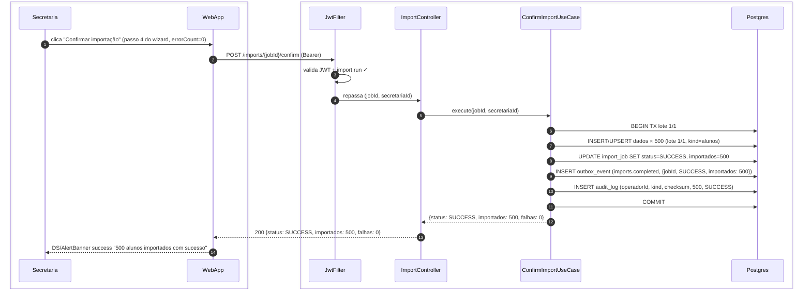
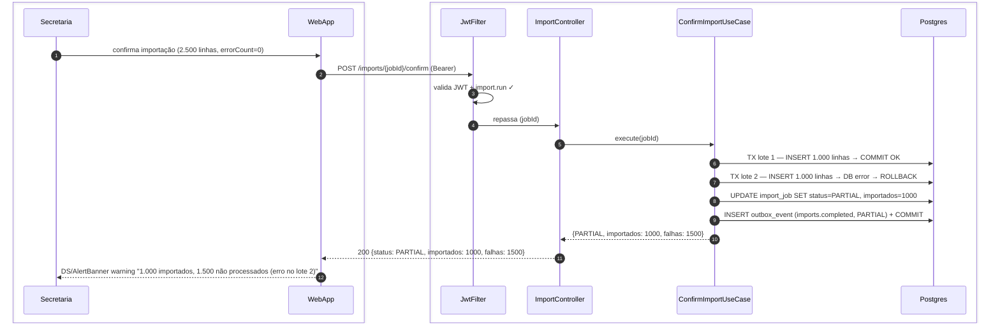
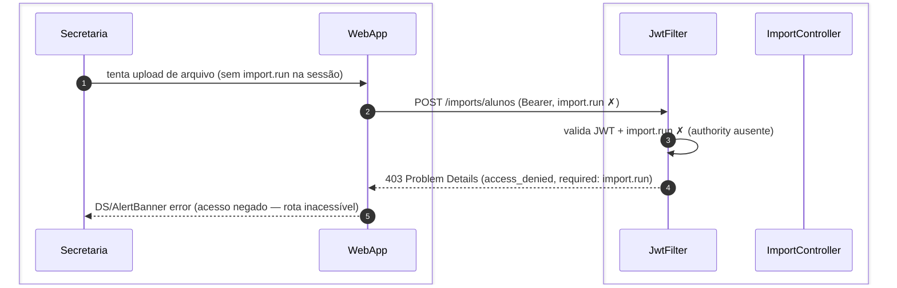

# US-F5-009 — Importações em Lote

| HU | Tela | Capability | API primária | Fonte |
|----|------|------------|--------------|-------|
| US-F5-009 | F5.16 `/secretaria/importacoes` | `import.run` | `GET /imports/templates/:kind` · `POST /imports/:kind` · `GET /imports/:jobId` · `POST /imports/:jobId/confirm` | `HUs/F5 — Secretaria/US-F5-009-IMPORTACOES.md` · `fluxos_por_perfil.md` §6 F5.5 |

---

## Matriz de cobertura

| ID diagrama | Origem (CA / RN / sub-fluxo) | Tipo | Status |
|-------------|------------------------------|------|--------|
| F5.9-D01 | CA-F5-009-01 · RN-F5-009-11 — Baixar modelo CSV/XLSX gerado dinamicamente | SEQUENCIA | gerado |
| F5.9-D02 | CA-F5-009-02 · RN-F5-009-03 · 04 · 05 · 06 · 07 — Upload multipart + import_job/rows TX + polling até VALIDATED + preview com erros | SEQUENCIA | gerado |
| F5.9-D03 | CA-F5-009-03 · RN-F5-009-08 · 09 · 10 — Confirmar importação válida: lotes TX + audit_log + outbox `imports.completed` | SEQUENCIA | gerado |
| F5.9-ERRO-D04 | CA-F5-009-04 · RN-F5-009-08 — Processamento parcial: TX lote 2 falha → PARTIAL | ERRO | gerado |
| F5.9-ERRO-403 | RN-F5-009-01 — 403 FGAC: `import.run` ausente | ERRO | gerado |
| — | CA-F5-009-05 — arquivo >20 MB bloqueado no frontend | NAO_APLICAVEL | validação DS/FileDropzone; sem chamada HTTP |
| — | CA-F5-009-06 — auditabilidade do import_job | DRY | → F5.9-D03 (audit_log escrito na TX de confirmação) |
| — | RN-F5-009-10 — dispatch outbox `imports.completed` (multicanal) | DRY | → [`transversal/10.1-outbox-notificacao.md`](../transversal/10.1-outbox-notificacao.md) |
| — | Importação via API externa / integração SIGA | NAO_APLICAVEL | fora de escopo (§ Fora de Escopo da HU) |
| — | Reversão / rollback de importação confirmada | NAO_APLICAVEL | idem |
| — | DS/WizardStepper · DS/Skeleton · DS/FileDropzone · DS/Badge | NAO_APLICAVEL | comportamento puramente frontend |

---

## Referências DRY

| Padrão | Arquivo canônico |
|--------|-----------------|
| Outbox dispatcher — `imports.completed` (multicanal: email sumário) | [`transversal/10.1-outbox-notificacao.md`](../transversal/10.1-outbox-notificacao.md) |
| JWT validation + FGAC (JwtFilter) | [`F0/US-F0-001-LOGIN.md`](../F0/US-F0-001-LOGIN.md) — F0.1-a |
| audit_log — geração de entrada auditável | F5.9-D03 (passos 9–10: INSERT audit_log na TX de confirmação) |

---

## Fora de sequência

| Item | Motivo |
|------|--------|
| CA-F5-009-05 — arquivo >20 MB | Bloqueio no `DS/FileDropzone` (validação de tamanho antes do HTTP); nenhum POST enviado ao backend. |
| CA-F5-009-06 — auditabilidade | `import_job` auditável (RN-F5-009-09) é gerado dentro da TX de confirmação (F5.9-D03); não gera diagrama separado. |
| RN-F5-009-10 — dispatch outbox | INSERT no `outbox_event` mostrado em F5.9-D03; dispatch async completo (poll + multicanal) em `transversal/10.1`. DRY. |
| Importação via API SIGA | Explicitamente fora de escopo (§ Fora de Escopo HU). |
| Rollback de importação confirmada | Idem. |
| DS/WizardStepper / DS/Skeleton / DS/FileDropzone | Componentes de UI; sem chamadas HTTP adicionais. |

---

## F5.9-D01 — Baixar modelo CSV/XLSX

**Escopo:** happy path — secretaria seleciona `kind` e faz download do modelo gerado dinamicamente  
**Atores:** Secretaria, WebApp, JwtFilter, ImportController, ImportTemplateUseCase  
**Pré-condições:** secretaria autenticada com `import.run`; acessa passo 1 do wizard `/secretaria/importacoes`

```mermaid
sequenceDiagram
    autonumber
    box #e8f4fc Cliente
        participant Secretaria
        participant WebApp
    end
    box #fff8ee Servidor
        participant JwtFilter
        participant ImportController
        participant ImportTemplateUC as ImportTemplateUseCase
    end

    Secretaria->>WebApp: seleciona kind "alunos" e clica "Baixar modelo"
    WebApp->>JwtFilter: GET /imports/templates/alunos (Bearer)
    JwtFilter->>JwtFilter: valida JWT + import.run ✓
    JwtFilter->>ImportController: repassa (kind=alunos)
    ImportController->>ImportTemplateUC: execute(kind)
    ImportTemplateUC-->>ImportController: CSV bytes (headers + linha exemplo, RN-F5-009-11)
    ImportController-->>WebApp: 200 Content-Disposition: attachment; filename=alunos_modelo.csv
    WebApp-->>Secretaria: download iniciado no browser
```

**Notas:**
- Passo 5: `ImportTemplateUseCase` gera o modelo dinamicamente com as colunas obrigatórias, tipos e uma linha de exemplo (RN-F5-009-11). Não consulta dados reais — apenas o schema do `kind`.
- Resposta retorna o arquivo diretamente na resposta HTTP (inline bytes); nenhum MinIO envolvido para este endpoint.
- Kinds disponíveis (RN-F5-009-02): `alunos`, `disciplinas`, `usuarios`, `alocacao_professor`. Mesmo fluxo para todos.

**Lacunas:** nenhuma.

---

## F5.9-D02 — Upload + validação assíncrona + polling (preview com erros)

**Escopo:** secretaria faz upload de CSV; backend cria import_job + rows em TX e executa validação assíncrona; frontend faz polling até VALIDATED e exibe preview linha a linha  
**Atores:** Secretaria, WebApp, JwtFilter, ImportController, ValidateImportUseCase, Postgres  
**Pré-condições:** secretaria com `import.run`; arquivo CSV/XLSX ≤ 20 MB e ≤ 10.000 linhas (RN-F5-009-04)

```mermaid
sequenceDiagram
    autonumber
    box #e8f4fc Cliente
        participant Secretaria
        participant WebApp
    end
    box #fff8ee Servidor
        participant JwtFilter
        participant ImportController
        participant ValidateImportUC as ValidateImportUseCase
        participant Postgres
    end

    Secretaria->>WebApp: arrasta alunos.csv no DS/FileDropzone (passo 2 do wizard)
    WebApp->>JwtFilter: POST /imports/alunos (multipart/form-data, Bearer)
    JwtFilter->>JwtFilter: valida JWT + import.run ✓
    JwtFilter->>ImportController: repassa (kind, fileBytes, secretariaId)
    ImportController->>ValidateImportUC: execute(kind, fileBytes)
    ValidateImportUC->>Postgres: BEGIN TX
    ValidateImportUC->>Postgres: INSERT import_job (PROCESSING, checksum, totalLinhas=500)
    ValidateImportUC->>Postgres: INSERT import_row × 500 (status=PENDING)
    ValidateImportUC->>Postgres: COMMIT; agenda validação assíncrona
    ValidateImportUC-->>ImportController: {jobId, status: PROCESSING}
    ImportController-->>WebApp: 202 {jobId, status: PROCESSING}
    loop polling a cada 2s até status ≠ PROCESSING
        WebApp->>ImportController: GET /imports/{jobId} (Bearer)
        ImportController-->>WebApp: 200 {status: VALIDATED, rows, errorCount: 20}
    end
    WebApp-->>Secretaria: DS/DataTable preview (480 verdes, 20 vermelhas) + confirmar habilitado se errorCount=0
```

**Notas:**
- Passo 9: "agenda validação assíncrona" — um `@Async` worker (ou `@Scheduled`) lê os `import_row` com `status=PENDING` e valida cada linha (tipo de campo, CPF, GRR, duplicata). Atualiza `import_row.status` (VALID / WARNING / INVALID) e `import_row.errorMessage`. Ao terminar, `import_job.status` = `VALIDATED`.
- Loop (passos 12–13): o frontend repete o GET a cada ~2 s. Se `status = FAILED` (erro de parsing — ex.: XLSX corrompido), o polling termina e o WebApp exibe DS/AlertBanner error; `_links.confirm` não é emitido.
- Passo 14: botão "Confirmar importação" só fica habilitado quando `errorCount = 0` (RN-F5-009-07). Linhas com `WARNING` (amarelo) não bloqueiam — secretaria tem ciência antes de confirmar.

**Lacunas:** nenhuma.

---

## F5.9-D03 — Confirmar importação: lotes TX + audit_log + outbox

**Escopo:** secretaria confirma importação sem erros; backend processa em lotes de 1.000, registra audit_log e enfileira `imports.completed` via outbox  
**Atores:** Secretaria, WebApp, JwtFilter, ImportController, ConfirmImportUseCase, Postgres  
**Pré-condições:** secretaria com `import.run`; `import_job.status = VALIDATED`; `errorCount = 0`; `_links.confirm` presente



**Notas:**
- Passos 6–11: todos dentro da mesma TX do lote 1 (único lote para 500 linhas). Para importações com N > 1.000 linhas, o `ConfirmImportUseCase` itera em lotes de 1.000 — cada lote tem sua própria TX (ver F5.9-ERRO-D04 para falha parcial).
- Passo 9: INSERT `outbox_event` do tipo `imports.completed` na mesma TX do lote final. O `OutboxDispatcher` (a cada 5 s) lê o evento e envia e-mail de sumário para a secretária — fluxo completo de dispatch em → [`transversal/10.1-outbox-notificacao.md`](../transversal/10.1-outbox-notificacao.md).
- Passo 10: `audit_log` registra `operadorId`, `kind`, checksum SHA-256 do arquivo, `totalLinhas`, `status` final — base de auditabilidade (RN-F5-009-09, CA-F5-009-06).

**Lacunas:** nenhuma.

---

## F5.9-ERRO-D04 — Processamento parcial (TX lote 2 falha)

**Escopo:** importação de 2.500 linhas processa lote 1 com sucesso, lote 2 falha (DB error); job encerrado como PARTIAL; lotes anteriores já confirmados permanecem  
**Atores:** Secretaria, WebApp, JwtFilter, ImportController, ConfirmImportUseCase, Postgres  
**Pré-condições:** secretaria com `import.run`; `import_job.status = VALIDATED`; `errorCount = 0`; 2.500 linhas (3 lotes: 1.000 / 1.000 / 500)



**Notas:**
- Passo 6: lote 1 usa TX própria; ao concluir com COMMIT, os 1.000 registros estão persistidos e não são desfeitos por falhas subsequentes (RN-F5-009-08).
- Passo 7: falha no lote 2 (ex.: `DataIntegrityViolationException` — duplicata ou FK inválida) provoca ROLLBACK apenas do lote 2. O `ConfirmImportUseCase` captura a exceção e interrompe o processamento dos lotes restantes (lote 3 também não é executado).
- Passos 8–9: `import_job.status = PARTIAL` + `outbox_event` registrados em TX própria de finalização. O e-mail de sumário (via outbox) descreve o erro do lote 2 (RN-F5-009-10, CA-F5-009-04).
- Lotes processados com sucesso são irreversíveis — não há mecanismo de rollback de importação confirmada (fora de escopo da HU).

**Lacunas:** nenhuma.

---

## F5.9-ERRO-403 — 403 FGAC: import.run ausente

**Escopo:** usuário sem `import.run` tenta iniciar importação — acesso negado no JwtFilter  
**Atores:** Secretaria, WebApp, JwtFilter, ImportController  
**Pré-condições:** JWT válido; `import.run` ausente nas authorities do usuário



**Notas:**
- Em condições normais, a rota `/secretaria/importacoes` não é acessível sem `import.run` (guarda de rota no frontend também). O 403 é defesa em profundidade contra chamadas diretas ou sessão com authority expirada.
- Passo 4: RFC 7807 `type=access_denied`, `status=403`, `detail="Authority import.run required"`. Corpo completo em **Notas**; inline apenas o shorthand.

**Lacunas:** nenhuma.
