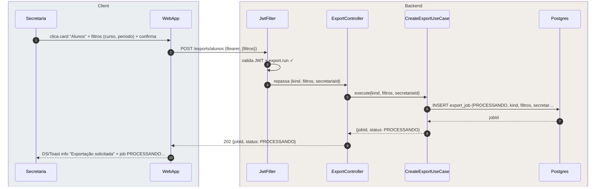
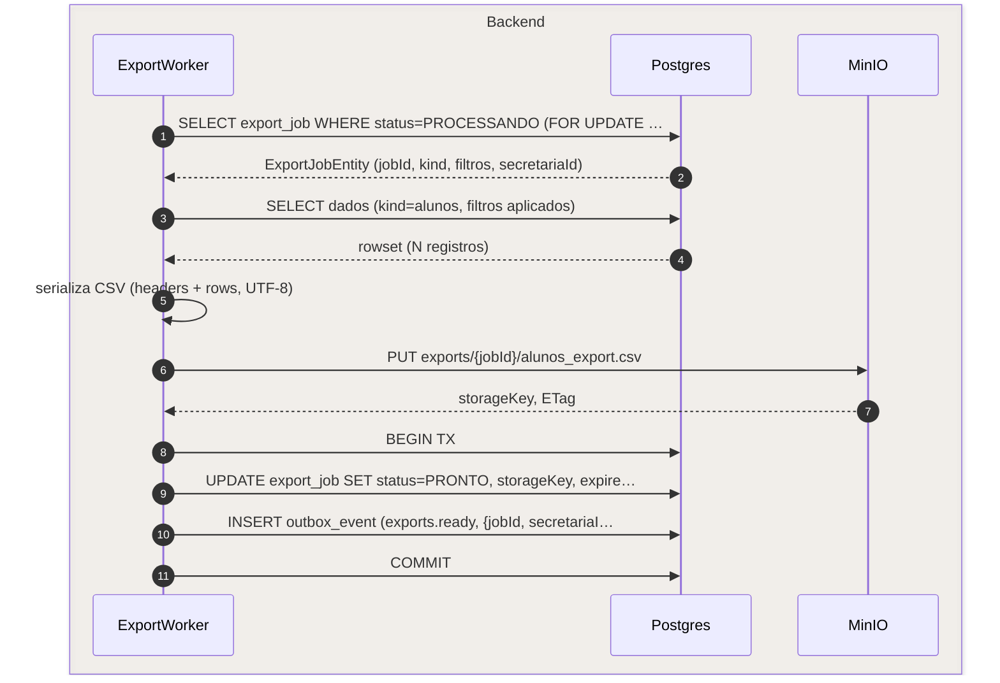
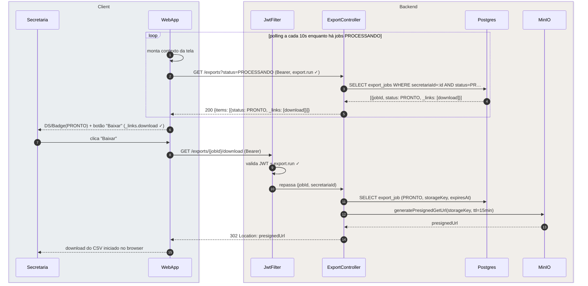
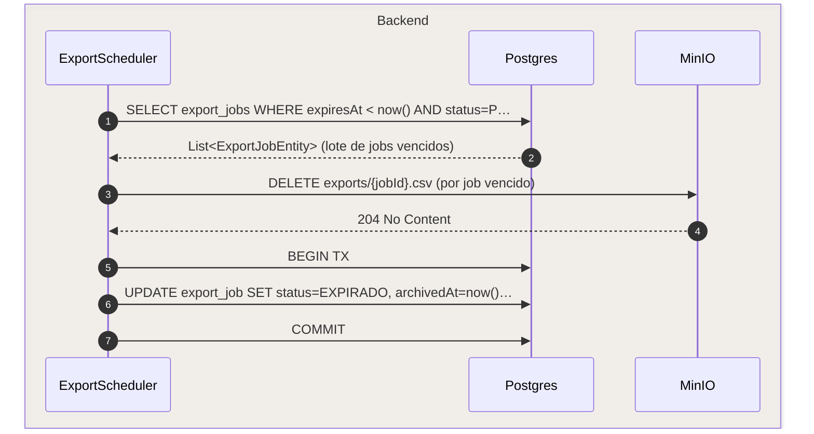
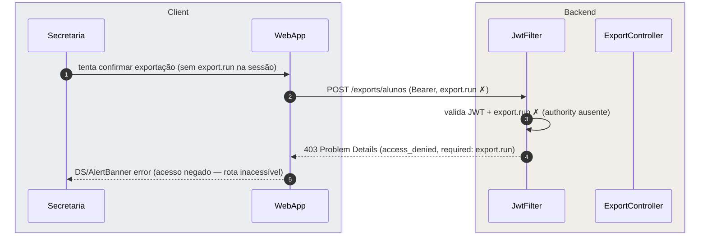

# US-F5-010 — Exportações Assíncronas

| HU | Tela | Capability | API primária | Fonte |
|----|------|------------|--------------|-------|
| US-F5-010 | F5.17 `/secretaria/exportacoes` | `export.run` | `POST /exports/:kind` · `GET /exports` · `GET /exports/:jobId/download` | `HUs/F5 — Secretaria/US-F5-010-EXPORTACOES.md` · `fluxos_por_perfil.md` §6 F5.9 |

---

## Matriz de cobertura

| ID diagrama | Origem (CA / RN / sub-fluxo) | Tipo | Status |
|-------------|------------------------------|------|--------|
| F5.10-D01 | CA-F5-010-01 · RN-F5-010-03 · 04 — Solicitar exportação: POST /exports/:kind → 202 + export_job PROCESSANDO | SEQUENCIA | gerado |
| F5.10-D02 | RN-F5-010-04 · 08 — Job assíncrono: worker gera CSV → PUT MinIO → UPDATE PRONTO + outbox TX | SEQUENCIA | gerado |
| F5.10-D03 | CA-F5-010-02 · RN-F5-010-05 · 06 · 07 — Polling detecta PRONTO + download via presigned URL MinIO | SEQUENCIA | gerado |
| F5.10-D04 | CA-F5-010-03 · RN-F5-010-06 · 09 — Scheduler expira job: DELETE MinIO + UPDATE EXPIRADO | SEQUENCIA | gerado |
| F5.10-ERRO-403 | RN-F5-010-01 — 403 FGAC: `export.run` ausente | ERRO | gerado |
| — | CA-F5-010-03 — exibição `EXPIRADO` no histórico (lista) | DRY | → F5.10-D03 (mesmo GET /exports; `_links.download` ausente quando EXPIRADO) + F5.10-D04 (scheduler que define o status) |
| — | CA-F5-010-04 — `aria-live="polite"` para leitor de tela | NAO_APLICAVEL | atributo HTML/frontend; sem chamada HTTP adicional |
| — | RN-F5-010-08 — dispatch outbox `exports.ready` (e-mail com link) | DRY | → [`transversal/10.1-outbox-notificacao.md`](../transversal/10.1-outbox-notificacao.md) |
| — | Exportação XLSX / agendamento recorrente / logs de auditoria | NAO_APLICAVEL | explicitamente fora de escopo (§ Fora de Escopo HU) |
| — | DS/Card grid · DS/Badge · Dialog de filtros · DS/Skeleton | NAO_APLICAVEL | comportamento puramente frontend |

---

## Referências DRY

| Padrão | Arquivo canônico |
|--------|-----------------|
| Outbox dispatcher — `exports.ready` (e-mail com link de download) | [`transversal/10.1-outbox-notificacao.md`](../transversal/10.1-outbox-notificacao.md) |
| JWT validation + FGAC (JwtFilter) | [`F0/US-F0-001-LOGIN.md`](../F0/US-F0-001-LOGIN.md) — F0.1-a |
| Upload presigned MinIO (padrão PUT) | [`F1/US-F1-005-SOLICITACOES.md`](../F1/US-F1-005-SOLICITACOES.md) — F1.8-D03 (padrão §P5) |
| Download presigned MinIO (padrão GET) | [`F1/US-F1-010-CERTIFICADOS.md`](../F1/US-F1-010-CERTIFICADOS.md) — F1.19-D02 |

---

## Fora de sequência

| Item | Motivo |
|------|--------|
| CA-F5-010-03 — exibição EXPIRADO na lista | Mesmo GET /exports de D03; diferença é só `status: EXPIRADO` e ausência de `_links.download` (HATEOAS cego). DRY. |
| CA-F5-010-04 — aria-live / acessibilidade | Atributo `aria-live="polite"` no componente de status; nenhuma chamada HTTP adicional. |
| RN-F5-010-08 — dispatch e-mail export.ready | INSERT outbox mostrado em D02 (TX); dispatch async completo (multicanal) em `transversal/10.1`. DRY. |
| Exportação XLSX | Fora de escopo (apenas CSV). |
| Agendamento automático de exportações | Fora de escopo. |
| Exportações de logs de auditoria | Restrito ao Admin; fora de escopo desta HU. |
| DS/Card grid · Dialog de filtros | Comportamento puramente frontend sem chamada HTTP adicional além do POST. |

---

## F5.10-D01 — Solicitar exportação (POST /exports/:kind → 202)

**Escopo:** happy path — secretaria seleciona kind, informa filtros e solicita exportação; backend cria export_job assíncrono  
**Atores:** Secretaria, WebApp, JwtFilter, ExportController, CreateExportUseCase, Postgres  
**Pré-condições:** secretaria autenticada com `export.run`; acessa `/secretaria/exportacoes`

**Notas:**
- Passo 6: `CreateExportUseCase` persiste o `export_job` com `status=PROCESSANDO`; não executa a geração do arquivo — isso é delegado ao `ExportWorker` assíncrono (ver F5.10-D02).
- Passo 9: o frontend não bloqueia após o 202 (RN-F5-010-04). A UI exibe o job no histórico imediatamente com `DS/Badge(PROCESSANDO)` e inicia o polling de 10 s (ver F5.10-D03).
- Kinds disponíveis (RN-F5-010-02): `alunos`, `solicitacoes`, `presencas`, `certificados`, `egressos`, `formativas`. Mesmo fluxo para todos.

**Lacunas:** nenhuma.

---

## F5.10-D02 — Job assíncrono: worker gera CSV → MinIO → outbox (fase TX)

**Escopo:** `ExportWorker` (background — `@Scheduled`) processa export_job PROCESSANDO: gera CSV, faz PUT no MinIO e transiciona para PRONTO em TX atômica com outbox  
**Atores:** ExportWorker, Postgres, MinIO  
**Pré-condições:** `export_job.status = PROCESSANDO`; worker rodando a cada N segundos

**Notas:**
- Passo 1: `FOR UPDATE SKIP LOCKED` evita que múltiplas instâncias do worker processem o mesmo job concorrentemente (padrão Outbox/Competing Consumers).
- Passo 5: a serialização acontece em memória. Para volumes muito grandes (N > threshold), `ExportWorker` pode usar streaming direto para MinIO via multipart upload — detalhe de implementação; fluxo lógico idêntico.
- Passos 8–11: TX atômica — `UPDATE export_job(PRONTO)` + `INSERT outbox_event(exports.ready)` na mesma TX. Se o COMMIT falhar (ex.: queda após PUT MinIO), o worker não marcará o job como PRONTO e reprocessará na próxima execução (at-least-once).
- Passo 10: o `OutboxDispatcher` (a cada 5 s) lê `exports.ready` e envia e-mail com link de download — fluxo completo em → [`transversal/10.1-outbox-notificacao.md`](../transversal/10.1-outbox-notificacao.md).

**Lacunas:** nenhuma.

---

## F5.10-D03 — Polling detecta PRONTO + download via presigned URL MinIO

**Escopo:** frontend faz polling e detecta job PRONTO; secretaria clica "Baixar" e recebe redirect para URL pré-assinada do MinIO (15 min)  
**Atores:** Secretaria, WebApp, JwtFilter, ExportController, Postgres, MinIO  
**Pré-condições:** secretaria com `export.run`; `export_job.status` transicionou para `PRONTO` (via D02)

**Notas:**
- Loop (passos 1–4): polling suspenso quando não há mais jobs `PROCESSANDO` na resposta (lista vazia ou todos `PRONTO`/`EXPIRADO`). O frontend usa `aria-live="polite"` ao atualizar o status (CA-F5-010-04 — detalhe de acessibilidade, sem chamada HTTP adicional).
- Passo 11: `ExportController` verifica `expiresAt > now()` antes de chamar MinIO. Se expirado → 410 Gone (defesa em profundidade; em condições normais, `_links.download` já estaria ausente por HATEOAS).
- Passo 13: a URL pré-assinada tem TTL de 15 min (curto por segurança); o arquivo MinIO tem TTL de 7 dias (RN-F5-010-06), gerenciado pelo scheduler (F5.10-D04).
- CA-F5-010-03 (status EXPIRADO): o mesmo GET /exports retorna `status: EXPIRADO` para jobs com `expiresAt < now()` — `_links.download` ausente (HATEOAS cego); sem diagrama separado. DRY.

**Lacunas:** nenhuma.

---

## F5.10-D04 — Scheduler expira job: DELETE MinIO + UPDATE EXPIRADO

**Escopo:** `ExportScheduler` (`@Scheduled`) detecta export_jobs com `expiresAt < now()`, remove arquivo do MinIO e marca status como EXPIRADO  
**Atores:** ExportScheduler, Postgres, MinIO  
**Pré-condições:** `export_job.status = PRONTO`; `expiresAt < now()` (≥ 7 dias desde criação)

**Notas:**
- Passo 1: `SKIP LOCKED` garante que instâncias concorrentes do scheduler não processem o mesmo lote. O scheduler roda periodicamente (ex.: a cada hora ou diariamente — frequência de configuração).
- Passos 3–4: DELETE do arquivo no MinIO ocorre **antes** do UPDATE no banco. Se o DELETE falhar, o job permanece `PRONTO` e será reprocessado na próxima execução (idempotente). Se o banco falhar após o DELETE, o arquivo já foi removido e o job será marcado `EXPIRADO` na próxima rodada com uma verificação de existência no MinIO.
- Passo 6: `status = EXPIRADO` não exclui o registro — ele permanece visível no histórico por 30 dias para fins de auditoria (RN-F5-010-09). Exclusão física do `export_job` ocorre após 30 dias (job separado ou coluna `purge_after`).
- CA-F5-010-03: após este scheduler, o GET /exports retorna `status: EXPIRADO` sem `_links.download` — comportamento coberto em F5.10-D03 (mesma listagem, estado diferente).

**Lacunas:** nenhuma.

---

## F5.10-ERRO-403 — 403 FGAC: export.run ausente

**Escopo:** usuário sem `export.run` tenta solicitar exportação — acesso negado no JwtFilter  
**Atores:** Secretaria, WebApp, JwtFilter, ExportController  
**Pré-condições:** JWT válido; `export.run` ausente nas authorities do usuário

**Notas:**
- Em condições normais, a rota `/secretaria/exportacoes` não é acessível sem `export.run` (guarda de rota frontend + `@PreAuthorize`). O 403 é defesa em profundidade.
- Passo 4: RFC 7807 `type=access_denied`, `status=403`, `detail="Authority export.run required"`.

**Lacunas:** nenhuma.
