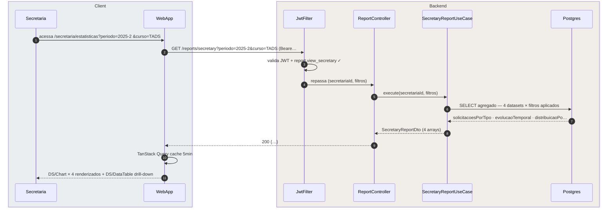
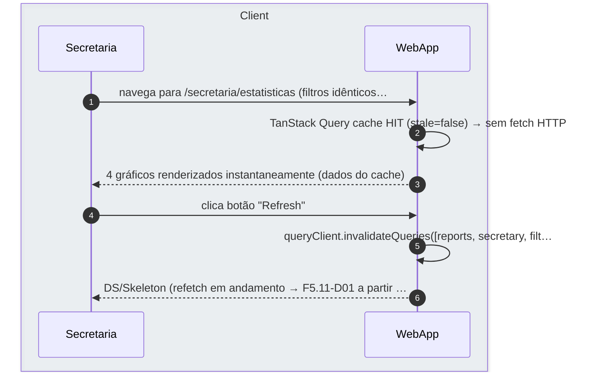
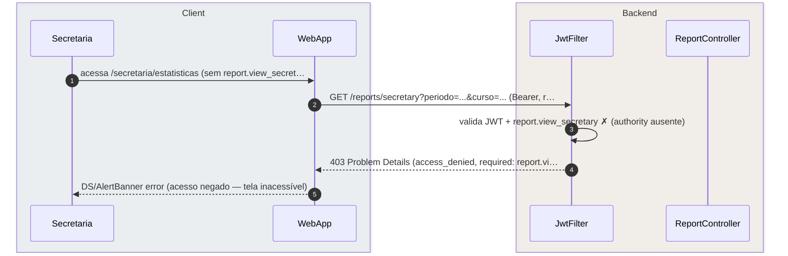

# US-F5-011 — Estatísticas da Secretaria

| HU | Tela | Capability | API primária | Fonte |
|----|------|------------|--------------|-------|
| US-F5-011 | F5.18 `/secretaria/estatisticas` | `report.view_secretary` | `GET /reports/secretary` | `HUs/F5 — Secretaria/US-F5-011-ESTATISTICAS.md` · `fluxos_por_perfil.md` §6 (sem sub-seção dedicada) · §7.2 F6.2 (análogo coordenação) |

---

## Matriz de cobertura

| ID diagrama | Origem (CA / RN / sub-fluxo) | Tipo | Status |
|-------------|------------------------------|------|--------|
| F5.11-D01 | CA-F5-011-01 · RN-F5-011-02 · 03 · 07 — GET /reports/secretary (cache MISS): filtros + 4 datasets agregados | SEQUENCIA | gerado |
| F5.11-D02 | RN-F5-011-07 — cache HIT (TanStack Query, staleTime=5min) + refresh manual (invalidação) | SEQUENCIA | gerado |
| F5.11-ERRO-403 | RN-F5-011-01 — 403 FGAC: `report.view_secretary` ausente | ERRO | gerado |
| — | CA-F5-011-02 — drill-down tabela paginada ao clicar no gráfico | DRY | → F5.11-D01 (dados já no payload 200; drill-down = filtragem + paginação client-side sobre arrays recebidos; sem HTTP adicional) |
| — | CA-F5-011-03 — DS/Skeleton durante carregamento | NAO_APLICAVEL | TanStack Query `isLoading=true`; sem chamada HTTP adicional |
| — | CA-F5-011-04 — acessibilidade (`aria-label`, `role="heading"`, resumo textual) | NAO_APLICAVEL | atributos HTML/ARIA; sem chamada HTTP |
| — | CA-F5-011-05 — persistência de filtros na URL (`?periodo=&curso=`) | DRY | → F5.11-D01 (query params da URL se tornam parâmetros do GET; mesma chamada, mesma resposta) |
| — | RN-F5-011-05 — tokens de cor Recharts (`--color-brand-*`) | NAO_APLICAVEL | CSS custom properties; sem chamada HTTP |
| — | RN-F5-011-06 — resumo textual acessível por gráfico | NAO_APLICAVEL | renderização frontend com dados do payload D01; sem HTTP adicional |
| — | US-F6-002 — relatórios analíticos de coordenação | DRY | → F5.11-D01 (mesmo padrão `GET /reports/:scope`; capability `report.view_coordinator`; dados distintos mas fluxo HTTP idêntico) |
| — | Exportação gráficos como imagem/PDF · alertas automáticos | NAO_APLICAVEL | explicitamente fora de escopo (§ Fora de Escopo HU) |

---

## Referências DRY

| Padrão | Arquivo canônico |
|--------|-----------------|
| JWT validation + FGAC (JwtFilter) | [`F0/US-F0-001-LOGIN.md`](../F0/US-F0-001-LOGIN.md) — F0.1-a |
| TanStack Query cache MISS (padrão GET read-only) | [`F1/US-F1-001-DASHBOARD.md`](../F1/US-F1-001-DASHBOARD.md) — F1.1-D01 (blueprint cache MISS) |
| TanStack Query cache HIT (sem HTTP) | [`F1/US-F1-001-DASHBOARD.md`](../F1/US-F1-001-DASHBOARD.md) — F1.1-D02 |
| Relatórios coordenação (análogo F6) | F5.11-D01 (mesmo fluxo; scope e capability distintos) |

---

## Fora de sequência

| Item | Motivo |
|------|--------|
| CA-F5-011-02 — drill-down paginado | O payload 200 já contém todos os arrays (`solicitacoesPorTipo`, etc.). Clicar em barra/fatia seleciona o dataset relevante; paginação de 20 linhas é client-side (sem HTTP adicional). |
| CA-F5-011-03 — DS/Skeleton | Estado `isLoading=true` do TanStack Query enquanto o fetch de D01 está em voo; sem nova chamada HTTP. |
| CA-F5-011-04 — acessibilidade ARIA | `aria-label`, `role="heading"`, resumo textual gerado a partir do payload D01; sem troca de mensagens entre camadas. |
| CA-F5-011-05 — filtros na URL | Inicializa o estado dos selects a partir dos query params da URL → aciona o mesmo GET de D01 com esses params. DRY. |
| RN-F5-011-05 — cores Recharts | `--color-brand-*` passados como props para os componentes DS/Chart; zero HTTP. |
| RN-F5-011-06 — resumo textual | Calculado no frontend (`max(array, 'total')`) sobre dados já recebidos. |
| Exportação gráficos | Fora de escopo. |
| Alertas automáticos | Fora de escopo. |

---

## F5.11-D01 — GET /reports/secretary (cache MISS — filtros + 4 datasets)

**Escopo:** happy path — secretaria acessa /secretaria/estatisticas com filtros; TanStack Query não tem cache; backend agrega 4 datasets e retorna payload único  
**Atores:** Secretaria, WebApp, JwtFilter, ReportController, SecretaryReportUseCase, Postgres  
**Pré-condições:** secretaria autenticada com `report.view_secretary`; cache TanStack Query ausente ou expirado (> 5 min)

**Notas:**
- Passo 6: `SecretaryReportUseCase` executa 4 queries agregadas com os filtros recebidos (`periodoId`, `cursoId`). Podem ser executadas em paralelo (coroutines) ou via CTE para reduzir round-trips. O `cursoId=null` retorna dados de todos os cursos vinculados à `secretariaId` (RN-F5-011-02).
- Passo 10: TanStack Query armazena o resultado com chave `['reports', 'secretary', { periodo, curso }]` e `staleTime=5min`. Enquanto não expirado, novas navegações para a mesma URL servem do cache (ver F5.11-D02).
- CA-F5-011-02 (drill-down): após o render, clicar em barra/fatia filtra client-side o array do dataset correspondente e renderiza a `DS/DataTable` com paginação de 20 por página — sem HTTP adicional. DRY.
- CA-F5-011-05 (URL): params `?periodo=2025-2&curso=TADS` são lidos pela URL ao montar o componente e passados como `defaultValues` dos selects + como parâmetros do GET. Mesma chamada deste diagrama.

**Lacunas:** nenhuma.

---

## F5.11-D02 — Cache HIT + refresh manual

**Escopo:** secretaria retorna à tela dentro de 5 min (TanStack Query serve do cache sem HTTP); e cenário de refresh manual que invalida o cache e aciona novo fetch  
**Atores:** Secretaria, WebApp  
**Pré-condições:** cache TanStack Query presente e não expirado (staleTime=5min não atingido)

**Notas:**
- Passo 2: `staleTime=5min` garante que não haja HTTP enquanto os dados são considerados frescos. Após expirar, TanStack Query revalida automaticamente em background (background refetch) sem mostrar Skeleton — o usuário continua vendo os dados antigos até a resposta chegar.
- Passo 5: `invalidateQueries` força `stale=true` imediatamente, aciona um novo fetch e exibe `DS/Skeleton` (RN-F5-011-08) enquanto o refetch de F5.11-D01 está em voo. Funcional em todos os filtros da chave de cache.
- Este diagrama documenta o padrão de cache para leitura pura (sem mutação); aplica-se igualmente ao análogo F6.2 coordenação (`GET /reports/coordinator`).

**Lacunas:** nenhuma.

---

## F5.11-ERRO-403 — 403 FGAC: report.view_secretary ausente

**Escopo:** usuário sem `report.view_secretary` tenta acessar o endpoint de estatísticas  
**Atores:** Secretaria, WebApp, JwtFilter, ReportController  
**Pré-condições:** JWT válido; `report.view_secretary` ausente nas authorities

**Notas:**
- Em condições normais, a rota frontend `/secretaria/estatisticas` já tem guarda de capability; o 403 é defesa em profundidade para calls diretas ou authority expirada na sessão.
- Passo 4: RFC 7807 `type=access_denied`, `status=403`, `detail="Authority report.view_secretary required"`.

**Lacunas:** nenhuma.
