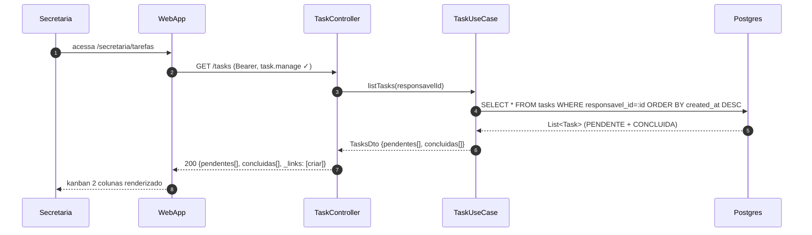
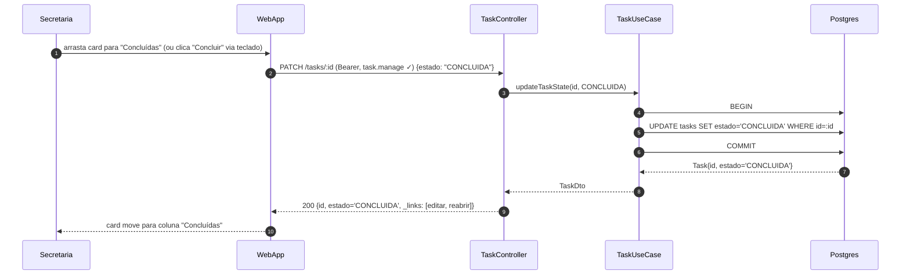
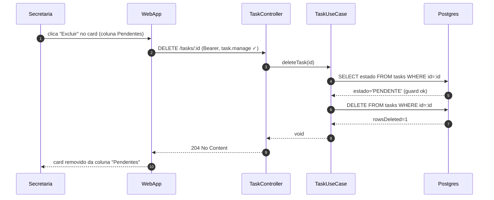
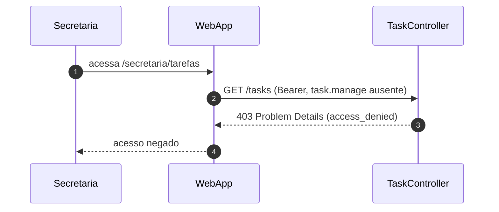
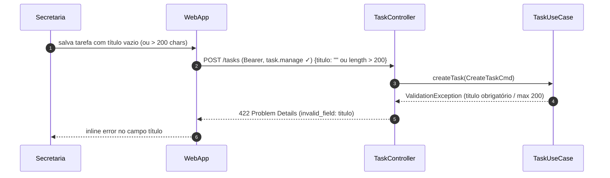
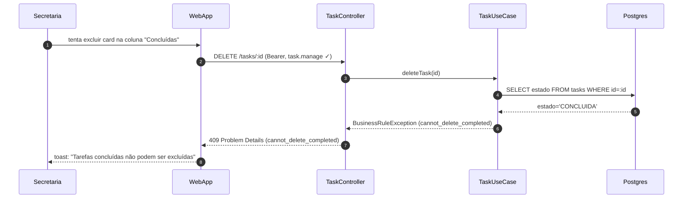

# US-F5-012 — Tarefas Internas da Secretaria

| HU | Tela | Capability | API primária | Fonte |
|----|------|-----------|-------------|-------|
| US-F5-012 | F5.19 — Tarefas Internas | `task.manage` | `/tasks` CRUD | `HUs/F5 — Secretaria/US-F5-012-TAREFAS.md` |

> **P3 / feature flag:** módulo controlado por `tasks.enabled`. Rota e item de menu só existem com flag ativa.

---

## Matriz de cobertura

| ID diagrama | Origem (CA/RN) | Classe | Status |
|-------------|----------------|--------|--------|
| F5.19-D01 | CA-F5-012-02 (GET lista) · RN-F5-012-02 (FGAC) | SEQUENCIA | gerado |
| F5.19-D02 | CA-F5-012-02 (POST criar) · RN-F5-012-03 (schema) | SEQUENCIA | gerado |
| F5.19-D03 | CA-F5-012-03 (drag-and-drop) · CA-F5-012-04 (teclado) | SEQUENCIA | gerado |
| F5.19-D04 | API: DELETE /tasks/:id · guard só PENDENTE | SEQUENCIA | gerado |
| F5.19-ERRO-01 | CA-F5-012-01 · RN-F5-012-01 (flag off → 404) | ERRO | gerado |
| F5.19-ERRO-02 | RN-F5-012-02 (403 task.manage ausente) | ERRO | gerado |
| F5.19-ERRO-03 | RN-F5-012-03 (422 título inválido) | ERRO | gerado |
| F5.19-ERRO-04 | API: DELETE só PENDENTE — 409 guard CONCLUIDA | ERRO | gerado |
| RN-F5-012-04 | Layout 2 colunas (kanban) | NAO_APLICAVEL | — |
| RN-F5-012-05 | Drag-and-drop (mecanismo UI) | DRY → F5.19-D03 | — |
| RN-F5-012-06 | Botão "Concluir"/"Reabrir" (a11y) | DRY → F5.19-D03 | — |
| RN-F5-012-07 | Vencimento ultrapassado (highlight UI) | NAO_APLICAVEL | — |
| RN-F5-012-08 | Exclusividade secretaria (escopo FGAC) | NAO_APLICAVEL | — |

---

## Referências DRY

- **CA-F5-012-04** (teclado Tab+Enter no botão "Concluir"): mesma chamada `PATCH /tasks/:id {estado}` do CA-F5-012-03 — ver **F5.19-D03**; diferença está apenas no evento de UI.
- **RN-F5-012-05** (drag-and-drop): detalhe de implementação React (dnd-kit / HTML5 drag); backend recebe o mesmo PATCH — ver **F5.19-D03**.
- Padrão FGAC 403 com `@PreAuthorize`: mesmo blueprint dos demais controladores F5 (US-F5-001…F5-011).

---

## Fora de sequência

| Elemento | Motivo |
|----------|--------|
| RN-F5-012-04 — Layout 2 colunas kanban | Estrutura CSS/React; sem interação backend |
| RN-F5-012-07 — Destaque vencimento ultrapassado | Comparação local `new Date() > vencimento` no WebApp; sem chamada adicional |
| RN-F5-012-08 — Exclusividade secretaria | Garantida pela capability `task.manage`; sem fluxo de sequência adicional |
| Editar tarefa (título/descrição/vencimento) | Sem CA explícito; contrato MVP define PATCH /tasks/:id apenas para `estado` |

---

## F5.19-D01 — Carregar kanban (happy path)

**Escopo:** GET /tasks — lista tarefas PENDENTE e CONCLUIDA da secretária logada; renderiza kanban 2 colunas.  
**Pré-condições:** JWT válido; `task.manage` presente; `tasks.enabled=true`.



**Notas:**
- Passo 4: query retorna todas as tarefas do `responsavel_id`; o UseCase particiona em `pendentes[]` e `concluidas[]` no DTO de resposta.
- `_links: [criar]` exposto apenas se `task.manage` confirmado — frontend usa `useActions(resource)` para exibir o botão "Nova tarefa".
- Feature flag `tasks.enabled` verificada no frontend (guard de rota React Router, oculta item de menu) e no backend como segunda barreira (ver F5.19-ERRO-01).

**Lacunas:** nenhuma.

---

## F5.19-D02 — Criar tarefa (happy path)

**Escopo:** POST /tasks — secretária cria nova tarefa; card aparece na coluna "Pendentes".  
**Pré-condições:** JWT válido; `task.manage` presente; título entre 1–200 chars.

```mermaid
sequenceDiagram
    autonumber
    participant Secretaria
    participant WebApp
    participant TaskController
    participant TaskUseCase
    participant Postgres

    Secretaria->>WebApp: clica "Nova tarefa"; preenche título e vencimento
    WebApp->>TaskController: POST /tasks (Bearer, task.manage ✓) {titulo, descricao, vencimento}
    TaskController->>TaskUseCase: createTask(CreateTaskCmd)
    TaskUseCase->>Postgres: BEGIN
    TaskUseCase->>Postgres: INSERT INTO tasks (id, titulo, estado='PENDENTE', vencimento, responsavel_id)
    TaskUseCase->>Postgres: COMMIT
    Postgres-->>TaskUseCase: Task{id, titulo, estado='PENDENTE'}
    TaskUseCase-->>TaskController: TaskDto
    TaskController-->>WebApp: 201 {…}
    WebApp-->>Secretaria: card aparece na coluna "Pendentes"
```

**Notas:**
- Passos 4–6: transação atômica; sem outbox (tarefas internas — sem notificações externas no MVP, RN-F5-012-08).
- `estado` é sempre `PENDENTE` no INSERT — nunca lido do body da requisição.
- `_links: [excluir]` presente apenas para `estado='PENDENTE'`; backend controla via HATEOAS (ver F5.19-D04).

**Lacunas:** nenhuma.

---

## F5.19-D03 — Atualizar estado — PATCH /tasks/:id (happy path)

**Escopo:** PATCH /tasks/:id — mover tarefa entre colunas; cobre CA-F5-012-03 (drag-and-drop) e CA-F5-012-04 (botão teclado) com a mesma chamada de API.  
**Pré-condições:** JWT válido; `task.manage` presente; tarefa existe e pertence ao responsável.



**Notas:**
- CA-F5-012-03 (drag) e CA-F5-012-04 (teclado) fazem a mesma chamada `PATCH /tasks/:id {estado}` — diferença está apenas no evento de UI que a dispara (DRY).
- Mover de "Concluídas" → "Pendentes" usa `{estado: "PENDENTE"}` no mesmo endpoint; `_links: [reabrir]` ativa esse fluxo.
- Resposta 200 omite `_links: [excluir]` quando `estado='CONCLUIDA'` — backend controla visibilidade via HATEOAS.

**Lacunas:** nenhuma.

---

## F5.19-D04 — Excluir tarefa (DELETE /tasks/:id)

**Escopo:** DELETE /tasks/:id — secretária exclui tarefa PENDENTE; guard backend impede exclusão de CONCLUIDA.  
**Pré-condições:** JWT válido; `task.manage` presente; tarefa em `estado='PENDENTE'`.



**Notas:**
- SELECT antes do DELETE garante o guard de estado; se `estado='CONCLUIDA'`, lança `BusinessRuleException` → 409 (ver F5.19-ERRO-04).
- Frontend oculta o botão "Excluir" para tarefas CONCLUIDA via ausência de `_links: [excluir]` (HATEOAS — defense-in-depth).
- Soft-delete não aplicável: tarefas internas sem histórico auditável exigido por compliance no MVP.

**Lacunas:** nenhuma.

---

## F5.19-ERRO-01 — Feature flag desativada (404)

**Escopo:** `tasks.enabled=false` → backend retorna 404; frontend oculta item de menu e redireciona.  
**Origem:** CA-F5-012-01 · RN-F5-012-01.

```mermaid
sequenceDiagram
    autonumber
    participant Secretaria
    participant WebApp
    participant TaskController

    Secretaria->>WebApp: navega para /secretaria/tarefas
    WebApp->>TaskController: GET /tasks (Bearer)
    TaskController-->>WebApp: 404 Problem Details (tasks.enabled=false)
    WebApp-->>Secretaria: redireciona /secretaria; item "Tarefas" oculto no menu
```

**Notas:**
- Frontend verifica `tasks.enabled` no guard de rota React Router antes de renderizar a tela (primeira barreira); chamada ao backend é a segunda barreira.
- Item "Tarefas" não incluído em `_links` do dashboard quando flag inativa — `useActions` não exibe o link.
- Feature flag controlada via variável de ambiente ou tabela `feature_flags`; sem hot-reload no MVP.

**Lacunas:** nenhuma.

---

## F5.19-ERRO-02 — 403 FGAC (task.manage ausente)

**Escopo:** usuário autenticado sem capability `task.manage` tenta qualquer endpoint `/tasks`.  
**Origem:** RN-F5-012-02.



**Notas:**
- `@PreAuthorize("hasAuthority('task.manage')")` no `TaskController` intercepta antes da execução do UseCase.
- Mesmo guard aplica-se a POST, PATCH e DELETE `/tasks`.
- Perfis aluno, professor e coordenador nunca recebem `task.manage` (RN-F5-012-08).

**Lacunas:** nenhuma.

---

## F5.19-ERRO-03 — 422 Validação (POST /tasks — título inválido)

**Escopo:** título vazio ou com mais de 200 chars → 422 Problem Details; inline error no campo.  
**Origem:** RN-F5-012-03.



**Notas:**
- Validação Jakarta (`@NotBlank`, `@Size(max=200)`) no DTO dispara antes do UseCase em produção; diagrama mostra o caminho semântico via UseCase para rastreabilidade de responsabilidades.
- WebApp pré-valida com Zod (`z.string().min(1).max(200)`) antes de enviar — 422 é a defesa backend.
- `descricao` e `responsavelId` são opcionais; `vencimento` também opcional (RN-F5-012-03).

**Lacunas:** nenhuma.

---

## F5.19-ERRO-04 — 409 DELETE tarefa CONCLUIDA

**Escopo:** tentativa de excluir tarefa no estado CONCLUIDA → 409 Conflict (guard de regra de negócio).  
**Origem:** API contract `DELETE /tasks/:id // somente tarefas PENDENTE`.



**Notas:**
- Fluxo normalmente inacessível pela UI (HATEOAS oculta `_links: [excluir]` para CONCLUIDA); este diagrama documenta a defesa backend.
- Para excluir uma tarefa concluída, a secretária deve primeiro reabri-la (`PATCH {estado: "PENDENTE"}`) e então excluí-la.

**Lacunas:** nenhuma.

---

## Execução fila

- **Item:** US-F5-012
- **Status:** pendente → feito
- **Arquivo:** `sequenceDiagrams/F5/US-F5-012-TAREFAS.md`
- **Próximo:** US-F6-001
