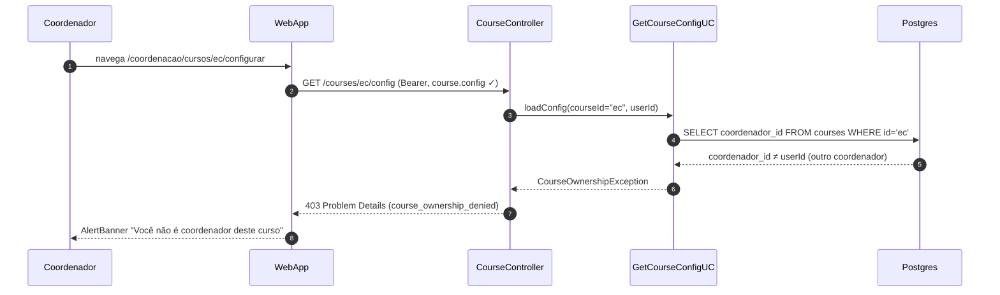

# US-F6-001 — Configurar Parâmetros do Curso

| HU | Tela | Capability | API primária | Fonte |
|----|------|-----------|-------------|-------|
| US-F6-001 | F6.1 — Configurar Curso (`/coordenacao/cursos/:id/configurar`) | `course.config` | `GET /courses/:id/config` · `PATCH /courses/:id/config` | `fluxos_por_perfil.md` §7.1 · HU US-F6-001 |

---

## Matriz de cobertura

| ID diagrama | Origem (CA / RN) | Classificação | Status |
|-------------|-----------------|---------------|--------|
| F6.1-D01 | CA-F6-001-01 · RN-01 — carregar config (GET + ownership ✓) | SEQUENCIA | gerado |
| F6.1-D02 | CA-F6-001-02 · RN-02..05..06 — salvar PATCH + audit_log (TX) | SEQUENCIA | gerado |
| F6.1-ERRO | CA-F6-001-04 · RN-01 — 403 curso alheio (GET ou PATCH) | ERRO | gerado |
| — | CA-F6-001-03 — dirty state + dialog cancelar | NAO_APLICAVEL | — |
| — | CA-F6-001-05 — não-retroatividade de horas formativas | NAO_APLICAVEL | — |
| — | CA-F6-001-06 — validação inline (0–1000), botão desabilitado | NAO_APLICAVEL | — |
| — | RN-F6-001-07 — não-retroatividade (invariante DB) | NAO_APLICAVEL | — |
| — | RN-F6-001-08 — DS/Breadcrumb navegação | NAO_APLICAVEL | — |
| — | RN-F6-001-09 — dirty state / habilitar botão Salvar | NAO_APLICAVEL | — |

---

## Referências DRY

Nenhuma dependência DRY com outra HU (US-F6-001 não possui tag `DRY`, `OUTBOX`, `CERT` nem `WORKFLOW`).

- Elegibilidade colação afetada: **US-F5-005** RN-F5-005-07 (não duplicar; citar como efeito downstream).
- Dados acadêmicos (CRUD curso): **US-F5-004** (escopo diferente — alteração de nome/sigla/coordenador, não parâmetros config).

---

## Fora de sequência

| Item | Motivo |
|------|--------|
| CA-F6-001-03 (dirty state + dialog cancelar) | Comportamento 100% frontend (React Hook Form `isDirty`); nenhuma chamada à API ocorre. |
| CA-F6-001-05 (não-retroatividade) | Invariante de negócio: o backend simplesmente **não** executa recálculo retroativo ao salvar. Não gera fluxo HTTP distinto — coberto em Notas de F6.1-D02. |
| CA-F6-001-06 (validação inline campos) | Validação Zod no cliente; botão permanece desabilitado antes do submit. Backend também valida (422 defense-in-depth), mas não há fluxo de sequência novo. |
| RN-F6-001-07 (invariante não-retroatividade) | Mesma razão de CA-05 acima. |
| RN-F6-001-08 (DS/Breadcrumb) | Componente de navegação puro — sem chamada de rede. |
| RN-F6-001-09 (dirty state / Cancelar dialog) | Estado UI gerenciado pelo componente React — sem chamada de rede. |

---

## F6.1-D01 — Carregar configuração do curso (happy path)

**Escopo:** happy path — coordenador abre a tela; WebApp dispara `GET /courses/:id/config`; valores persistidos populam o formulário.

**Pré-condições:**
- Coordenador autenticado com JWT válido e capability `course.config`.
- Coordenador é responsável pelo curso (`course.coordenador_id = usuario.id`).

```mermaid
sequenceDiagram
    autonumber
    participant Coordenador
    participant WebApp
    participant CourseController
    participant GetCourseConfigUC
    participant Postgres

    Coordenador->>WebApp: navega /coordenacao/cursos/tads/configurar
    WebApp->>CourseController: GET /courses/tads/config (Bearer, course.config ✓)
    CourseController->>GetCourseConfigUC: loadConfig(courseId="tads", userId)
    GetCourseConfigUC->>Postgres: SELECT * FROM course_config WHERE course_id='tads'
    Postgres-->>GetCourseConfigUC: horasFormativas=120, calendario=15_SEMANAS, bancaMembro…
    GetCourseConfigUC-->>CourseController: CourseConfigDto
    CourseController-->>WebApp: 200 {…}
    WebApp-->>Coordenador: form populado; botão Salvar desabilitado (dirty=false)
```

**Notas:**
- Passo 3: `GetCourseConfigUC` verifica `course.coordenador_id = userId` antes de prosseguir; se falhar → `CourseOwnershipException` (ver F6.1-ERRO).
- Passo 7: `_links.update` (rel `course:update-config`) presente **apenas** quando o coordenador tem capability `course.config` — o frontend usa `useActions(resource)` para habilitar o formulário.
- Botão "Salvar" habilitado somente quando `isDirty = true` (RN-F6-001-09 — comportamento frontend puro).

**Lacunas:** nenhuma.

---

## F6.1-D02 — Salvar configuração (PATCH + audit_log)

**Escopo:** happy path de escrita — coordenador altera um ou mais campos e confirma; `PATCH /courses/:id/config` persiste os campos dirty em transação atômica com `audit_log`.

**Pré-condições:**
- Formulário carregado via F6.1-D01 com `_links.update` presente.
- Ao menos um campo difere do valor persistido (`isDirty = true`).

```mermaid
sequenceDiagram
    autonumber
    participant Coordenador
    participant WebApp
    participant CourseController
    participant UpdateCourseConfigUC
    participant Postgres

    Coordenador->>WebApp: altera horasFormativasMinimas 120→150 (dirty=true)
    Coordenador->>WebApp: clica "Salvar"
    WebApp->>CourseController: PATCH /courses/tads/config {horasFormativasMinimas: 150…
    CourseController->>UpdateCourseConfigUC: updateConfig(courseId, patch, userId)
    UpdateCourseConfigUC->>Postgres: BEGIN; SELECT course_config WHERE course_id='tads' FOR …
    Postgres-->>UpdateCourseConfigUC: config atual {horasFormativasMinimas: 120, ...}
    UpdateCourseConfigUC->>Postgres: UPDATE course_config SET horasFormativasMinimas=150
    UpdateCourseConfigUC->>Postgres: INSERT audit_log {campo: horasFormativasMinimas, de: 12…
    UpdateCourseConfigUC->>Postgres: COMMIT
    Postgres-->>UpdateCourseConfigUC: ok
    UpdateCourseConfigUC-->>CourseController: CourseConfigDto (config atualizada completa)
    CourseController-->>WebApp: 200 {horasFormativasMinimas: 150, ..., _links: {update}}
    WebApp-->>Coordenador: toast "Configuração salva"; dirty=false; Salvar desabil…
```

**Notas:**
- Passos 5–9: transação atômica (`@Transactional`). O `SELECT … FOR UPDATE` lê o valor anterior para construir o diff do `audit_log` (RN-F6-001-06) e aplica o `UPDATE` na mesma TX.
- Se múltiplos campos forem alterados simultaneamente, o `INSERT audit_log` pode ser multi-row (um por campo modificado) dentro da mesma transação — detalhe de implementação, não altera o diagrama.
- Não-retroatividade (RN-F6-001-07): ao atualizar `horasFormativasMinimas`, o UC **não** recalcula elegibilidades existentes. Alunos já elegíveis pelo limiar antigo permanecem elegíveis; novos cálculos usarão o valor 150.
- Backend valida `horasFormativasMinimas ∈ [0, 1000]` (422 defense-in-depth) mesmo que o frontend impeça o submit com valor inválido.
- Campos opcionais na RN: `duracaoCalendario` (15/18 SEMANAS), `bancaMembrosExternos` (1 ou 2), `bancaModalidade` (PRESENCIAL/REMOTO/HÍBRIDO), `regimento` (máx. 10.000 chars) — todos seguem o mesmo padrão PATCH desta transação.

**Lacunas:** nenhuma.

---

## F6.1-ERRO — 403 FGAC: coordenador acessa curso alheio

**Escopo:** erro de autorização — coordenador tenta GET ou PATCH do config de um curso cujo `coordenador_id` não corresponde ao seu `userId`.

**Pré-condições:**
- Coordenador autenticado com JWT válido e capability `course.config` (Spring Security passa).
- `course.coordenador_id ≠ userId` para o curso requisitado.



**Notas:**
- Passo 2: `JwtFilter` valida JWT e Spring Security confirma capability `course.config` **antes** de chegar ao controller — esse pré-filtro não aparece no diagrama pois não causa 403 neste cenário (o coordenador tem a capability global; a restrição é de **escopo de dado**).
- O mesmo guard de ownership se aplica ao `PATCH /courses/ec/config` — o `UpdateCourseConfigUC` executa a mesma verificação antes de iniciar a TX.
- RFC 7807 Problem Details no corpo: `{ "type": "course_ownership_denied", "status": 403, "detail": "…" }` — não inline para não clipar o SVG.

**Lacunas:** nenhuma.
