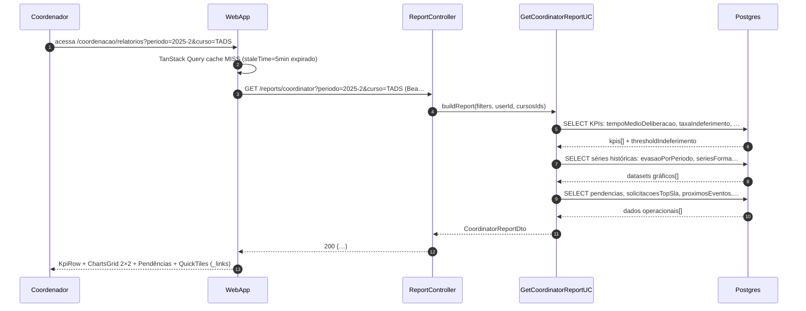

# US-F6-002 — Relatórios Analíticos de Coordenação

| HU | Tela | Capability | API primária | Fonte |
|----|------|-----------|-------------|-------|
| US-F6-002 | F6.2 — Relatórios Coordenação (`/coordenacao/relatorios`) | `report.view_coordinator` | `GET /reports/coordinator` | `fluxos_por_perfil.md` §7.2 · HU US-F6-002 |

---

## Matriz de cobertura

| ID diagrama | Origem (CA / RN) | Classificação | Status |
|-------------|-----------------|---------------|--------|
| F6.2-D01 | CA-F6-002-01..02 · RN-01,03,04,05,07,08,09,10,13 — GET cache MISS + métricas analíticas | SEQUENCIA | gerado |
| F6.2-D02 | RN-F6-002-12 — cache HIT (staleTime=5 min, padrão F5.18) | DRY → US-F5-011 F5.11-D02 | link |
| F6.2-ERRO | RN-F6-002-01 — 403 `report.view_coordinator` ausente | DRY → US-F5-011 F5.11-ERRO-403 | link |
| — | CA-F6-002-01 — DS/Skeleton Loading (UI interim enquanto GET está em voo) | NAO_APLICAVEL | — |
| — | CA-F6-002-03 — AlertBanner threshold indeferimento (renderização condicional) | NAO_APLICAVEL | — |
| — | CA-F6-002-04 — Pendências clicáveis (navegação React Router, sem API) | NAO_APLICAVEL | — |
| — | CA-F6-002-05 — gráfico Evasão (Recharts renderiza dados do response) | NAO_APLICAVEL | — |
| — | CA-F6-002-06 — QuickTiles HATEOAS (`useActions` lê `_links`, sem API extra) | NAO_APLICAVEL | — |
| — | CA-F6-002-07 — filtros persistem na URL (React Router `useSearchParams`) | NAO_APLICAVEL | — |
| — | CA-F6-002-08 — drill-down deliberador (dados já em `cargaPorDeliberador` no response) | NAO_APLICAVEL | — |
| — | RN-F6-002-06 — AlertBanner threshold (frontend: `taxaIndeferimento > thresholdIndeferimento`) | NAO_APLICAVEL | — |
| — | RN-F6-002-11 — QuickTile condicional via `useActions(resource)` | NAO_APLICAVEL | — |

---

## Referências DRY

| Padrão | Diagrama local | Referência canônica |
|--------|---------------|---------------------|
| Cache HIT (staleTime=5 min) | F6.2-D02 | [`../F5/US-F5-011-ESTATISTICAS.md` — F5.11-D02](../F5/US-F5-011-ESTATISTICAS.md) |
| 403 FGAC capability ausente | F6.2-ERRO | [`../F5/US-F5-011-ESTATISTICAS.md` — F5.11-ERRO-403](../F5/US-F5-011-ESTATISTICAS.md) |

**Diferença em relação ao DRY:** endpoint `/reports/coordinator` (vs `/reports/secretary`) e capability `report.view_coordinator` (vs `report.view_secretary`). O fluxo de rede e o comportamento de cache/FGAC são estruturalmente idênticos — não duplicar Mermaid.

---

## Fora de sequência

| Item | Motivo |
|------|--------|
| CA-F6-002-01 — Loading Skeleton | `isLoading=true` enquanto o GET está em voo — estado TanStack Query; nenhuma chamada de rede adicional. Coberto em Notas de F6.2-D01. |
| CA-F6-002-03 — AlertBanner threshold | Lógica frontend pura: `taxaIndeferimento > thresholdIndeferimento` sobre campos já presentes no response do F6.2-D01. Sem API call extra. |
| CA-F6-002-04 — Pendências clicáveis | `href` de cada `PendenciaItem` vem do response (campo `pendencias[].href`); o clique é `navigate(href)` — React Router. Sem API call. |
| CA-F6-002-05 — Gráfico Evasão (Recharts) | Renderização a partir de `evasaoPorPeriodo[]` já no response. Sem API call. |
| CA-F6-002-06 — QuickTiles HATEOAS | `useActions(resource)` filtra `_links` do response; sem API call extra. |
| CA-F6-002-07 — Filtros na URL | `useSearchParams` sincroniza estado de filtros ↔ URL; quando filtros mudam, dispara novo GET (mesmo fluxo F6.2-D01 com query params diferentes). |
| CA-F6-002-08 — Drill-down carga deliberador | `cargaPorDeliberador[]` já presente no response de F6.2-D01; a tabela de drill-down renderiza esses dados sem nova requisição. |
| RN-F6-002-06 — AlertBanner | Idem CA-03. |
| RN-F6-002-11 — QuickTile condicional | Idem CA-06. |

---

## F6.2-D01 — GET /reports/coordinator (cache MISS, com filtros)

**Escopo:** happy path — coordenador acessa `/coordenacao/relatorios` com filtros aplicados; TanStack Query não tem entrada em cache (primeira carga ou staleTime expirado); backend agrega KPIs, séries históricas e dados operacionais em resposta única.

**Pré-condições:**
- Coordenador autenticado com JWT válido e capability `report.view_coordinator`.
- TanStack Query: cache MISS para a chave `['coordinator-report', filters]`.
- Filtros aplicados via query string: `?periodo=2025-2&curso=TADS`.

**Notas:**
- Passo 2: enquanto o GET está em voo, WebApp exibe `DS/Skeleton/block` em cada área de gráfico e placeholders animados nos KpiCards (CA-F6-002-01) — estado `isLoading=true` do TanStack Query; não é uma chamada de rede separada.
- Passos 5–10: três rounds de queries por separação semântica. Na implementação, o UC pode executar em paralelo (`async`/coroutines) ou como single CTE; o diagrama representa a granularidade de agregação, não obrigatoriamente queries sequenciais.
- Passo 12: `thresholdIndeferimento` chega junto com `kpis`; o frontend compara `taxaIndeferimento > thresholdIndeferimento` para exibir o `DS/AlertBanner` (CA-F6-002-03 — lógica frontend pura).
- Passo 12: `_links` condicional por FGAC; `useActions(resource)` controla quais `DS/QuickTile` são renderizados (CA-F6-002-06, RN-F6-002-11).
- Passo 12: `pendencias[].href` contém o destino de navegação para cada pendência; o clique dispara `navigate(href)` sem nova API call (CA-F6-002-04).
- CA-F6-002-07 (filtros na URL): quando o usuário altera qualquer `DS/Select` de filtro, o `useSearchParams` atualiza a URL e TanStack Query invalida a chave, disparando um novo GET com os query params atualizados — mesmo fluxo deste diagrama.
- CA-F6-002-08 (drill-down): `cargaPorDeliberador[]` já está no response (passo 10→12); a tabela de drill-down renderiza esses dados localmente ao clicar no gráfico, sem nova requisição.
- Não há OUTBOX, CERT ou WORKFLOW neste fluxo — HU é read-only.

**Lacunas:** nenhuma.

---

## F6.2-D02 — Cache HIT

**DRY → [`../F5/US-F5-011-ESTATISTICAS.md` — F5.11-D02](../F5/US-F5-011-ESTATISTICAS.md)**

Padrão idêntico: TanStack Query retorna dados em memória (staleTime=5 min); nenhuma chamada ao backend. Apenas substitua:
- Endpoint: `/reports/coordinator` (vs `/reports/secretary`)
- Capability: `report.view_coordinator` (vs `report.view_secretary`)

---

## F6.2-ERRO — 403 `report.view_coordinator` ausente

**DRY → [`../F5/US-F5-011-ESTATISTICAS.md` — F5.11-ERRO-403](../F5/US-F5-011-ESTATISTICAS.md)**

Padrão idêntico: JwtFilter valida JWT; Spring Security rejeita por capability ausente antes de chegar ao controller; retorna `403 Problem Details`; WebApp exibe `DS/AlertBanner`. Apenas substitua capability e endpoint conforme indicado acima.
