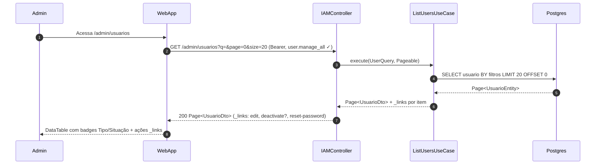
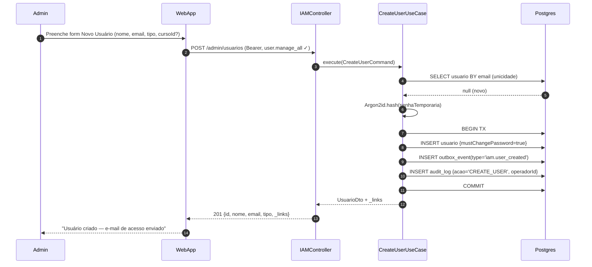
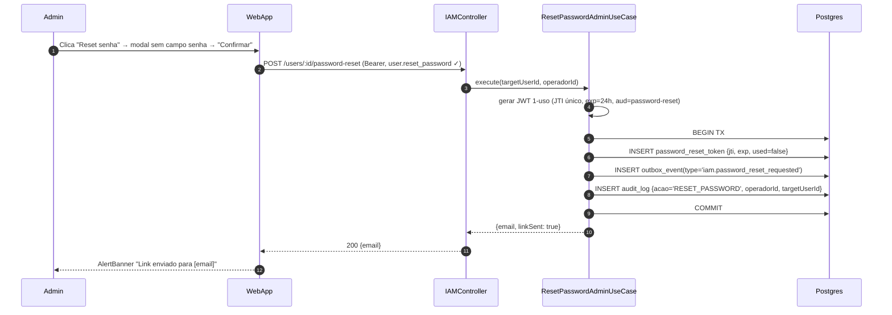
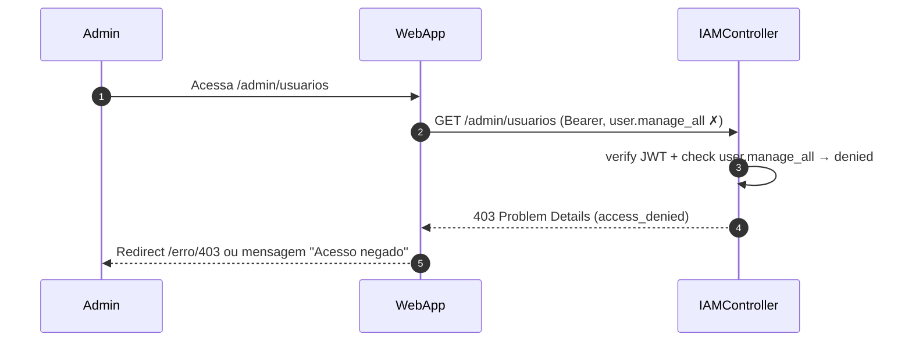

# US-F7-001 — Gestão de Usuários e Reset de Senha (Administrativo)

| Campo | Valor |
|-------|-------|
| **HU** | US-F7-001 |
| **Telas** | F7.1 — Usuários · F7.8 — Reset Senha |
| **Capability** | `user.manage_all` · `user.reset_password` |
| **API primária** | `GET /admin/usuarios` · `POST /admin/usuarios` · `PATCH /admin/usuarios/:id` · `POST /users/:id/password-reset` |
| **Fonte** | `fluxos_por_perfil.md` §8.1, §8.6 · `US-F7-001-IAM-USUARIOS.md` |

---

## Matriz de cobertura

| ID diagrama | Origem (CA/RN) | Classe | Status |
|-------------|----------------|--------|--------|
| F7.1-D01 | CA-01 · RN-01..04 · RN-10 | SEQUENCIA | gerado |
| F7.1-D02 | CA-02 · RN-05 · RN-09 | SEQUENCIA | gerado |
| F7.1-D03 | CA-03 · RN-06 · RN-09 | SEQUENCIA | gerado |
| F7.8-D04 | CA-04 · RN-07 · RN-08 · RN-09 | SEQUENCIA | gerado |
| F7.1-ERRO-01 | CA-01 (403 FGAC) | ERRO | gerado |
| — | CA-05 (link expirado) | DRY | → US-F0-003 F0.3-b |
| — | CA-06 (HATEOAS condicionais) | DRY | → F7.1-D01 (`_links` por item) |
| — | RN-08 (AlertBanner UI) | NAO_APLICAVEL | UI pura — sem chamada backend adicional |

---

## Referências DRY

| Ref | Destino | Motivo |
|-----|---------|--------|
| CA-05 — link reset expirado | [`F0/US-F0-003-NOVA-SENHA.md` F0.3-b](../F0/US-F0-003-NOVA-SENHA.md) | Fluxo idêntico: JWT 1-uso, exp check, 401 token_expired — o admin apenas aciona o disparo; o consumo do link pelo usuário é F0.3 |
| CA-06 — HATEOAS condicionais | F7.1-D01 (este arquivo) | `deactivate` rel ausente no `_links` de usuários INATIVO é capturado na resposta 200 de F7.1-D01 |
| Dispatch e-mail outbox | [`transversal/10.1-outbox-notificacao.md`](../transversal/10.1-outbox-notificacao.md) | Fase de dispatch (OutboxDispatcher → MailAdapter) não é redesenhada aqui |

---

## Fora de sequência

| Item | Motivo |
|------|--------|
| RN-08 — DS/AlertBanner "Link enviado" | Componente UI local; disparado pelo 200 da API — sem nova chamada backend |
| RN-02 — colunas da tabela (Nome, E-mail, Tipo, Situação, Último acesso) | Layout de dados — capturado na resposta 200 de F7.1-D01 |
| DS/Skeleton, DS/EmptyState | Estados de carregamento/vazio — puramente frontend, sem interação backend |
| Exclusão permanente | Fora de escopo (soft delete apenas) |

---

## F7.1-D01 — Listar e filtrar usuários (happy path)

**Escopo:** happy path — admin acessa `/admin/usuarios`; API retorna página de usuários com `_links` condicionais por item  
**Atores:** Admin, WebApp, IAMController, ListUsersUseCase, Postgres  
**Pré-condições:** admin autenticado com capability `user.manage_all`



**Notas:**
- JwtFilter valida Bearer e verifica `user.manage_all` antes de chegar ao controller (inline no label do passo 2)
- `deactivate` rel **ausente** na resposta para usuários com `status=INATIVO` (RN-04; CA-06 → DRY acima)
- Busca por trigrama (nome), prefix (e-mail), exato (GRR/matrícula) com debounce 300 ms no frontend (RN-03)
- Paginação padrão 20/página; ordenação por Nome ou Último acesso suportada via `sort=` query param (RN-10)

**Lacunas:** nenhuma

---

## F7.1-D02 — Criar usuário (POST + mustChangePassword + outbox)

**Escopo:** happy path — admin cria novo usuário; sistema gera senha temporária (Argon2id) e enfileira e-mail de acesso via Outbox  
**Atores:** Admin, WebApp, IAMController, CreateUserUseCase, Postgres  
**Pré-condições:** admin com `user.manage_all`; e-mail alvo inexistente no sistema



**Notas:**
- Admin **nunca visualiza** a senha temporária gerada (RN-05) — hash Argon2id persiste diretamente
- `mustChangePassword=true` força troca na primeira autenticação (fluxo US-F1-002)
- Fase de dispatch do e-mail (OutboxDispatcher → MailAdapter) → [transversal/10.1](../transversal/10.1-outbox-notificacao.md)
- `audit_log` registra `operadorId`, `targetUserId`, `acao`, `timestamp`, `payload` (RN-09)
- Se e-mail já existir → 409 Conflict (capturado via `SELECT BY email` antes da TX; diagrama de erro omitido — padrão idêntico a F5.6-ERRO-01)

**Lacunas:** nenhuma

---

## F7.1-D03 — Desativar usuário (PATCH + JTI blacklist + audit_log)

**Escopo:** happy path — admin desativa um usuário ativo; todos os tokens JWT do usuário são invalidados via JTI blacklist  
**Atores:** Admin, WebApp, IAMController, DeactivateUserUseCase, Postgres  
**Pré-condições:** admin com `user.manage_all`; usuário alvo com `status=ATIVO`

```mermaid
sequenceDiagram
    autonumber
    participant Admin
    participant WebApp
    participant IAMController
    participant DeactivateUserUC as DeactivateUserUseCase
    participant Postgres

    Admin->>WebApp: Clica "Desativar" + confirma dialog destrutivo
    WebApp->>IAMController: PATCH /admin/usuarios/:id (Bearer, user.manage_all ✓) {status: INATIVO}
    IAMController->>DeactivateUserUC: execute(userId, operadorId)
    DeactivateUserUC->>Postgres: BEGIN TX
    DeactivateUserUC->>Postgres: UPDATE usuario SET status=INATIVO
    DeactivateUserUC->>Postgres: INSERT jti_blacklist (todos os tokens ativos de userId)
    DeactivateUserUC->>Postgres: INSERT audit_log {acao='DEACTIVATE_USER', operadorId}
    DeactivateUserUC->>Postgres: COMMIT
    DeactivateUserUC-->>IAMController: UsuarioDto {status=INATIVO} + _links
    IAMController-->>WebApp: 200 {…}
    WebApp-->>Admin: Linha exibe badge "Inativo"; botão "Desativar" ausente
```

**Notas:**
- `jti_blacklist` invalida imediatamente todas as sessões ativas; próximas requisições do usuário retornam 401 (RN-06)
- `deactivate` rel ausente no `_links` da resposta confirma CA-06 (HATEOAS condicional)
- Nenhum dado histórico é excluído — soft delete via `status=INATIVO` (fora de escopo: exclusão permanente)
- TX atômica: falha no INSERT jti_blacklist faz rollback do PATCH — usuário permanece ATIVO

**Lacunas:** nenhuma

---

## F7.8-D04 — Reset de senha administrativo (POST + JWT 1-uso + outbox)

**Escopo:** happy path — admin dispara reset de senha para um usuário; link JWT 1-uso (24 h) é enviado por e-mail via Outbox; admin nunca vê a senha  
**Atores:** Admin, WebApp, IAMController, ResetPasswordAdminUseCase, Postgres  
**Pré-condições:** admin com `user.reset_password`; usuário alvo existe



**Notas:**
- Admin **nunca visualiza** o link nem a senha (RN-07) — modal apenas confirma envio
- Link enviado ao usuário: `/redefinir-senha?token=<JWT>` → fluxo de consumo em US-F0-003 (F0.3-a)
- Token expirado (CA-05) → DRY para [US-F0-003 F0.3-b](../../HUs/F0%20—%20Público/US-F0-003-NOVA-SENHA.md) — mecanismo idêntico
- Fase de dispatch (OutboxDispatcher → MailAdapter) → [transversal/10.1](../transversal/10.1-outbox-notificacao.md)
- `audit_log` inclui `operadorId`, `targetUserId`, `acao='RESET_PASSWORD'`, `timestamp` (RN-09)

**Lacunas:** nenhuma

---

## F7.1-ERRO-01 — 403 FGAC: user.manage_all ausente

**Escopo:** erro — usuário sem capability `user.manage_all` tenta acessar `/admin/usuarios`  
**Atores:** Admin (sem permissão), WebApp, IAMController  
**Pré-condições:** token JWT válido, mas sem `user.manage_all` nas authorities



**Notas:**
- `@PreAuthorize("hasAuthority('user.manage_all')")` no controller — Spring Security rejeita antes de atingir o use case
- RFC 7807 Problem Details: `type: access_denied`, `status: 403`, `title: Acesso negado`
- Mesmo padrão aplica-se ao `POST /users/:id/password-reset` sem `user.reset_password`

**Lacunas:** nenhuma
