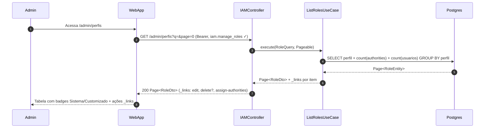
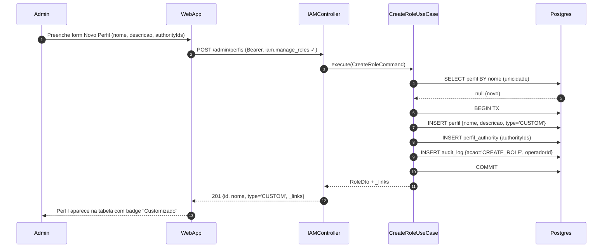
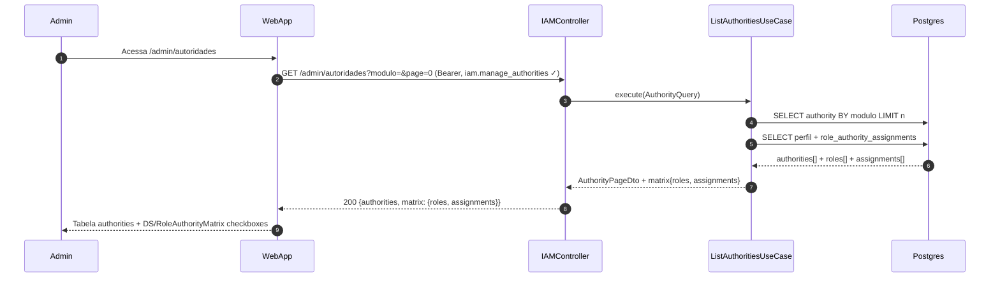
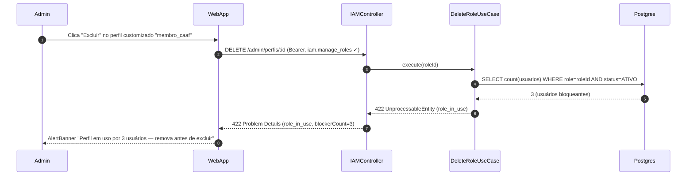
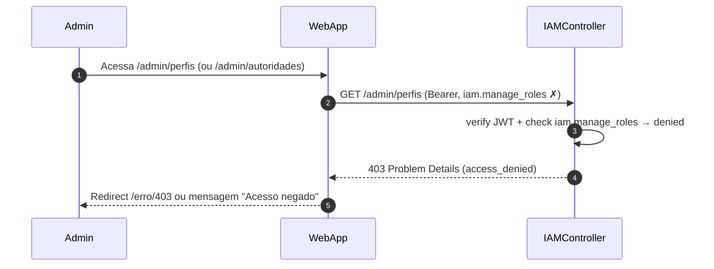

# US-F7-002 — Perfis (Roles) e Matriz de Autoridades

| Campo | Valor |
|-------|-------|
| **HU** | US-F7-002 |
| **Telas** | F7.2 — Perfis · F7.3 — Autoridades |
| **Capability** | `iam.manage_roles` · `iam.manage_authorities` |
| **API primária** | `GET /admin/perfis` · `POST /admin/perfis` · `DELETE /admin/perfis/:id` · `GET /admin/autoridades` · `PATCH /admin/perfis/:roleId/authorities` · `PUT /users/:id/roles` |
| **Fonte** | `fluxos_por_perfil.md` §8.1 · `US-F7-002-IAM-PERFIS-AUTORIDADES.md` |

---

## Matriz de cobertura

| ID diagrama | Origem (CA/RN) | Classe | Status |
|-------------|----------------|--------|--------|
| F7.2-D01 | CA-01 · RN-01..04 · RN-03 | SEQUENCIA | gerado |
| F7.2-D02 | CA-02 · RN-04 · RN-13 | SEQUENCIA | gerado |
| F7.2-D03 | CA-04 (listar authorities + matriz) · RN-07..10 | SEQUENCIA | gerado |
| F7.2-D04 | CA-04 (salvar delta role×authority) · RN-09 · RN-12 · RN-13 | SEQUENCIA | gerado |
| F7.2-D05 | CA-05 · RN-11 · RN-12 · RN-13 | SEQUENCIA | gerado |
| F7.2-ERRO-01 | CA-03 · RN-06 | ERRO | gerado |
| F7.2-ERRO-02 | CA-01/CA-04 (403 FGAC) | ERRO | gerado |
| — | CA-06 · RN-10 | NAO_APLICAVEL | campo Nome desabilitado — lógica UI pura; PATCH só aceita `{descricao}` (capturado em D03 Notas) |
| — | RN-05 (F7.2 usa F7.3 como painel de referência) | NAO_APLICAVEL | layout/navegação UI — sem chamada backend adicional |

---

## Referências DRY

| Ref | Destino | Motivo |
|-----|---------|--------|
| F7.2-ERRO-02 (403 padrão) | [`F7/US-F7-001-IAM-USUARIOS.md` F7.1-ERRO-01](US-F7-001-IAM-USUARIOS.md) | Mesmo padrão Spring Security `@PreAuthorize` — capability diferente (`iam.manage_roles` vs `user.manage_all`), mecanismo idêntico |
| Dispatch outbox (se adicionado no futuro) | [`transversal/10.1-outbox-notificacao.md`](../transversal/10.1-outbox-notificacao.md) | Mutações IAM desta HU não disparam outbox (email/push) no MVP — audit_log é local à TX |

---

## Fora de sequência

| Item | Motivo |
|------|--------|
| CA-06 / RN-10 — campo Nome desabilitado para authorities do sistema | Prop `disabled` no input React com base em `systemDefined=true` retornado na listagem (D03); sem chamada backend adicional |
| RN-05 — F7.2 usa F7.3 como referência visual | Navegação/layout UI — o painel de authorities embutido na F7.2 chama os mesmos endpoints de D03/D04 |
| Hierarquia de perfis (herança de permissions) | Fora de escopo do MVP |
| DS/Skeleton, DS/EmptyState | Estados de carregamento/vazio — puramente frontend |

---

## F7.2-D01 — Listar perfis (happy path + HATEOAS)

**Escopo:** happy path — admin acessa `/admin/perfis`; API retorna página de roles com `_links` condicionais (`delete` ausente para perfis pré-definidos)  
**Atores:** Admin, WebApp, IAMController, ListRolesUseCase, Postgres  
**Pré-condições:** admin autenticado com capability `iam.manage_roles`



**Notas:**
- JwtFilter valida Bearer e verifica `iam.manage_roles` antes do controller (inline no passo 2)
- `delete` rel **ausente** para perfis pré-definidos (`ALUNO`, `PROFESSOR`, `SECRETARIA`, `COORDENADOR`, `EGRESSO`, `ADMIN`) — RN-03
- Badges "Sistema" ou "Customizado" derivados do campo `type` do DTO (pré-definido = `SYSTEM`, customizado = `CUSTOM`)
- Diagrama relacionado: F7.2-D02 (criar), F7.2-ERRO-01 (excluir com usuários)

**Lacunas:** nenhuma

---

## F7.2-D02 — Criar perfil customizado (POST + audit_log)

**Escopo:** happy path — admin cria novo perfil customizado com conjunto inicial de authorities  
**Atores:** Admin, WebApp, IAMController, CreateRoleUseCase, Postgres  
**Pré-condições:** admin com `iam.manage_roles`; nome do perfil inexistente



**Notas:**
- Nome em `snake_case` único (ex.: `membro_caaf`, `professor_tcc`) — RN-02; 409 Conflict se já existir (verificado antes da TX via `SELECT BY nome`)
- TX atômica: perfil + vínculos `perfil_authority` + `audit_log` no mesmo `COMMIT`
- `audit_log` registra `operadorId`, `acao`, `payload` (authorityIds incluídos) — RN-13

**Lacunas:** nenhuma

---

## F7.2-D03 — Listar autoridades + carregar DS/RoleAuthorityMatrix

**Escopo:** happy path — admin acessa `/admin/autoridades`; API retorna authorities e dados da grade role×authority para o componente `DS/RoleAuthorityMatrix`  
**Atores:** Admin, WebApp, IAMController, ListAuthoritiesUseCase, Postgres  
**Pré-condições:** admin com `iam.manage_authorities`



**Notas:**
- Authorities com `systemDefined=true` retornam campo `readOnlyName=true` → frontend desabilita input Nome (RN-10; CA-06 → NAO_APLICAVEL — lógica UI pura)
- `PATCH /admin/autoridades/:id {descricao}` (editar descrição) é um PATCH simples sem cache invalidation; segue padrão de F7.2-D04 com escopo menor
- Matrix data inclui colunas = perfis, linhas = authorities, células = booleano `assigned`
- Diagrama relacionado: F7.2-D04 (salvar delta da matriz)

**Lacunas:** nenhuma

---

## F7.2-D04 — PATCH matriz role × authority + invalidação de cache

**Escopo:** happy path — admin salva alteração na `DS/RoleAuthorityMatrix` (adiciona/remove authority de um perfil); cache de capabilities dos usuários afetados é invalidado  
**Atores:** Admin, WebApp, IAMController, UpdateRoleAuthoritiesUseCase, Postgres, CapabilityCache  
**Pré-condições:** admin com `iam.manage_roles`; perfil alvo existe

```mermaid
sequenceDiagram
    autonumber
    participant Admin
    participant WebApp
    participant IAMController
    participant UpdateRoleAuthUC as UpdateRoleAuthoritiesUseCase
    participant Postgres
    participant CapabilityCache

    Admin->>WebApp: Marca/desmarca checkbox (ex.: PROFESSOR × event.host) → clica "Salvar"
    WebApp->>IAMController: PATCH /admin/perfis/:roleId/authorities (Bearer, iam.manage_roles ✓)
    IAMController->>UpdateRoleAuthUC: execute(roleId, delta, operadorId)
    UpdateRoleAuthUC->>Postgres: BEGIN TX
    UpdateRoleAuthUC->>Postgres: INSERT/DELETE role_authority (delta add/remove)
    UpdateRoleAuthUC->>Postgres: INSERT audit_log {acao='UPDATE_ROLE_AUTHORITIES', operadorId, roleId, delta}
    UpdateRoleAuthUC->>Postgres: COMMIT
    UpdateRoleAuthUC->>CapabilityCache: invalidate(usersWithRole=roleId)
    CapabilityCache-->>UpdateRoleAuthUC: ok
    UpdateRoleAuthUC-->>IAMController: RoleDto {authorities updated} + _links
    IAMController-->>WebApp: 200 {roleId, authorities: [...], _links}
    WebApp-->>Admin: Checkbox salvo; próximas requisições recalculam capabilities
```

**Notas:**
- Abordagem delta (`add`/`remove`) minimiza escritas — apenas diferenças, não substituição total do conjunto — RN-09
- Cache invalidation afeta **todos** os usuários com o perfil alterado, não apenas um (RN-12)
- `CapabilityCache` pode ser Redis (produção) ou cache local Spring `@CacheEvict` no MVP
- `audit_log` inclui `roleId`, `delta.add`, `delta.remove`, `operadorId`, `timestamp` — RN-13

**Lacunas:** nenhuma

---

## F7.2-D05 — Atribuir roles a usuário via modal (PUT + cache invalidação)

**Escopo:** happy path — admin abre modal de roles a partir de F7.1 (`_link manage-roles`), edita seleção de perfis do usuário e confirma; cache de capabilities do usuário é invalidado  
**Atores:** Admin, WebApp, IAMController, AssignRolesUseCase, Postgres, CapabilityCache  
**Pré-condições:** admin com `iam.manage_roles`; acesso via `_link manage-roles` de US-F7-001 F7.1

```mermaid
sequenceDiagram
    autonumber
    participant Admin
    participant WebApp
    participant IAMController
    participant AssignRolesUC as AssignRolesUseCase
    participant Postgres
    participant CapabilityCache

    Admin->>WebApp: Clica "Gerenciar roles" (link manage-roles de F7.1)
    WebApp->>IAMController: GET /users/:id/roles (Bearer, iam.manage_roles ✓)
    IAMController-->>WebApp: 200 {userId, roles: [SECRETARIA, membro_caaf]}
    Admin->>WebApp: Edita seleção (add membro_caaf, remove SECRETARIA) → confirma
    WebApp->>IAMController: PUT /users/:id/roles (Bearer) {roleIds: [...]}
    IAMController->>AssignRolesUC: execute(userId, roleIds, operadorId)
    AssignRolesUC->>Postgres: BEGIN TX
    AssignRolesUC->>Postgres: REPLACE user_roles SET roleIds
    AssignRolesUC->>Postgres: INSERT audit_log {acao='ASSIGN_ROLES', operadorId, targetUserId, delta}
    AssignRolesUC->>Postgres: COMMIT
    AssignRolesUC->>CapabilityCache: invalidate(userId)
    CapabilityCache-->>AssignRolesUC: ok
    AssignRolesUC-->>IAMController: UserRolesDto + _links
    IAMController-->>WebApp: 200 {userId, roles: [...], _links}
    WebApp-->>Admin: Modal fecha; capabilities do usuário recalculadas no próximo login
```

**Notas:**
- `PUT` substitui o conjunto completo de roles (idempotente) — RN-11
- `REPLACE user_roles` = DELETE WHERE userId + INSERT novos vínculos dentro da TX
- Cache invalidation de capabilities imediata após `COMMIT` — RN-12
- `audit_log` registra `operadorId`, `targetUserId`, roles adicionados e removidos (diff) — RN-13
- Diagrama relacionado: F7.2-D01 (origin do `_link manage-roles` via F7.1)

**Lacunas:** nenhuma

---

## F7.2-ERRO-01 — 422 Excluir perfil com usuários ativos

**Escopo:** erro — admin tenta excluir perfil customizado que ainda está atribuído a usuários ativos; API rejeita com 422  
**Atores:** Admin, WebApp, IAMController, DeleteRoleUseCase, Postgres  
**Pré-condições:** admin com `iam.manage_roles`; perfil alvo é `type='CUSTOM'` com usuários ativos



**Notas:**
- RFC 7807: `type: role_in_use`, `status: 422`, `detail: "3 usuários ativos com este perfil"` — corpo completo em **Notas** (não inline na seta)
- Perfis pré-definidos (`type='SYSTEM'`) nem chegam ao use case — botão "Excluir" ausente via `_links` (F7.2-D01)
- Fluxo de sucesso (0 usuários bloqueantes): TX `DELETE perfil + DELETE role_authority + INSERT audit_log + COMMIT`

**Lacunas:** nenhuma

---

## F7.2-ERRO-02 — 403 FGAC: iam.manage_roles / iam.manage_authorities ausente

**Escopo:** erro — usuário sem capability IAM tenta acessar `/admin/perfis` ou `/admin/autoridades`  
**Atores:** Admin (sem permissão), WebApp, IAMController  
**Pré-condições:** token JWT válido, mas sem `iam.manage_roles` ou `iam.manage_authorities`



**Notas:**
- `@PreAuthorize("hasAuthority('iam.manage_roles')")` no controller — Spring Security rejeita antes do use case
- DRY → [F7.1-ERRO-01](US-F7-001-IAM-USUARIOS.md) — padrão idêntico; capability diferente (`iam.manage_roles` vs `user.manage_all`)
- `/admin/autoridades` usa `iam.manage_authorities`; mesmo diagrama com capability substituída

**Lacunas:** nenhuma
